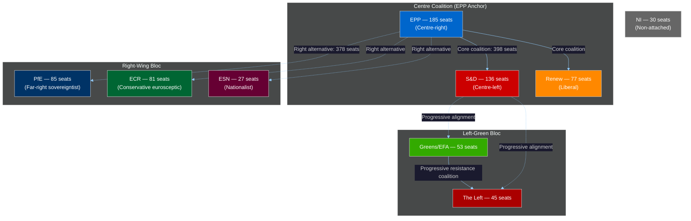

# EP10 Term Outlook — Actor Mapping
**Date:** 2026-05-08 | **Article Type:** term-outlook | **Confidence:** MEDIUM-HIGH

---

## 🔍 Reader Briefing — What This Means for Citizens

**For European citizens:** The actors mapped here are the people and institutions who will determine which laws the EU passes in the next three years. Understanding who has power — and over what — helps citizens engage meaningfully with their MEPs and hold them accountable. The EPP's control of the agenda means that citizens who want strong climate policy, robust social rights, or binding rule-of-law enforcement need to engage with EPP MEPs specifically — not just their own national party's MEPs.

**Plain language summary:** The European Parliament has nine political groups. The EPP (centre-right) is the biggest and controls the agenda. Nothing passes without the EPP's agreement. But the EPP needs at least two other groups to get legislation through. This means deals and compromises happen constantly. Far-right groups (PfE, ECR, ESN) are bigger than ever and are now negotiating partners on migration and defence. Progressive groups (S&D, Renew, Greens, The Left) must work together and win EPP support to protect social and climate standards.

---

## 1. Primary Actors — Political Groups

---

## 2. Key Individual Actors

### 2.1 EP Institutional Leadership

**Roberta Metsola (EPP — Malta) — EP President**
- **Power:** Sets plenary agenda; represents EP in inter-institutional negotiations; decisive in speeding or slowing legislative procedures.
- **Significance:** CRITICAL — most influential MEP in EP10 by institutional authority.
- **Posture:** Pro-EU federalist within EPP; more hawkish on rule of law than average EPP; pro-Ukraine consensus builder.
- **Vulnerability:** EPP's rightward drift (PfE/ECR accommodation) creates tension with her stated democratic values commitments.

**Conference of Presidents**
- **Composition:** EP President + group leaders. Decides plenary schedule, committee work distribution.
- **Power:** Controls what EP debates and when. Critical bottleneck for opposition-led legislation.
- **Assessment:** EPP group leader has effectively majority influence given EPP anchor position.

### 2.2 Key Committee Leadership

**ITRE Committee (Industry, Research, Energy):** Dominates Clean Industrial Deal, AI Act, Critical Raw Materials, hydrogen, energy.
**LIBE Committee (Civil Liberties):** Controls AI Act fundamental rights dimensions, migration, rule of law.
**AFET Committee (Foreign Affairs):** Ukraine, strategic autonomy, sanctions.
**ECON Committee (Economic and Monetary Affairs):** Financial stability, ECB oversight, banking union.
**ENVI Committee (Environment):** Green Deal, Taxonomy, CBAM, Nature Restoration — contested committee, reflecting Green Deal battles.

### 2.3 External Key Actors

**Ursula von der Leyen (Commission President — EPP)**
- **Significance:** CRITICAL. Commission legislative agenda determines EP's workload. EPP affiliation means EP-Commission alignment on most EPP priorities.
- **Power:** Can accelerate or delay legislative proposals; controls legislative initiation monopoly.

**EU Council Rotating Presidencies (2026–2029):**
- **2026:** Polish (Jan–Jun), Danish (Jul–Dec)
- **2027:** Cypriot (Jan–Jun), Irish (Jul–Dec)
- **2028:** Lithuanian (Jan–Jun), Greek (Jul–Dec)
- **2029:** Italian (Jan–Jun) — NB: Italian government aligned with ECR/Fratelli d'Italia

---

## 3. Actor Influence Assessment

| Actor | Influence Sphere | Power Score (1–10) | EP10 Trajectory |
|-------|-----------------|-------------------|-----------------|
| EPP group | Legislative agenda | 9 | Stable |
| Metsola (EP President) | Procedural/institutional | 9 | Stable |
| Von der Leyen (Commission) | Legislative initiation | 8 | Declining (end of term) |
| S&D group | Progressive floor | 7 | Declining (coalition dependency) |
| PfE group | Right-wing agenda | 7 | Rising |
| ECR group | Migration/defence | 6 | Stable-rising |
| Renew group | Digital/EU reform | 6 | Stable-declining (French pressure) |
| Greens/EFA | Climate defence | 5 | Declining |
| ECR government leaders (Italy, Poland-PiS faction) | National policy linkage | 5 | Stable |
| The Left | Labour rights | 4 | Stable-declining |

---

## 4. Actor Tension Map — Key Dyadic Relationships

| Actor Pair | Relationship Type | Current Tension | Direction |
|-----------|------------------|-----------------|-----------|
| EPP ↔ S&D | Coalition partners (core) | MEDIUM — climate, social rights | → Stable |
| EPP ↔ ECR | Tactical allies (migration/defence) | LOW — converging on policy | ↑ Strengthening |
| EPP ↔ PfE | Normalising relationship | MEDIUM — EPP credibility vs. PfE leverage | ↑ Strengthening |
| S&D ↔ Greens | Progressive coalition | LOW-MEDIUM — speed and ambition | → Stable |
| Renew ↔ Greens | Centrist-Green gap | MEDIUM — deregulation vs. environment | → Stable |
| ECR ↔ PfE | Right-wing bloc coordination | LOW — tactical convergence | ↑ Strengthening |
| EPP ↔ Von der Leyen Commission | Institutional partnership | LOW — EPP-Commission alignment | → Stable |
| EP ↔ EU Council | Inter-institutional | MEDIUM — MFF revision contested | → Monitoring |

---
*Sources: EP Open Data Portal (group composition, MEP records May 2026); EP political landscape analysis; EP adopted texts record.*
*Admiralty Grade B2: Composition data verified; influence assessments are analytical judgements.*
