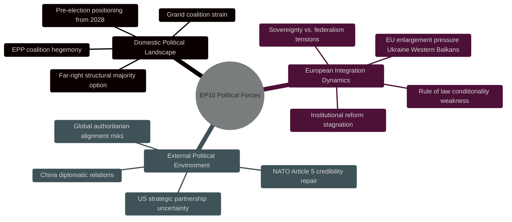

# EP10 Term Outlook — Forces Analysis (PESTLE + Five Forces)
**Date:** 2026-05-08 | **Article Type:** term-outlook | **Confidence:** MEDIUM

---

## 🔍 Reader Briefing — What These Forces Mean for Citizens

**For European citizens:** The forces shaping EP10 are not just parliamentary politics — they include wars, economic pressures, technology revolutions, and demographic changes that affect every EU citizen's daily life. This analysis explains which external forces are pushing the European Parliament toward or away from the policies that matter to you. Understanding these forces helps citizens predict where EU law is headed and where to direct their advocacy efforts.

**Plain language summary:** Europe is under simultaneous pressure from: (1) Russia's war in Ukraine pushing defence spending up; (2) Chinese industrial competition squeezing European manufacturers; (3) US tariff threats disrupting trade; (4) climate urgency competing with competitiveness concerns; (5) AI technology transforming the economy faster than regulation can keep up. The EP is trying to navigate all five at once. The result is a parliament that is doing a lot, but not necessarily in the directions progressives expected after the Green Deal era.

---

## 1. Political Forces

**Political force assessment (driving EP10 agenda):**
- **STRONGEST:** Rightward shift in parliamentary composition (structural — cannot change mid-term)
- **STRONG:** EPP coalition discipline maintenance
- **MODERATE:** Progressive bloc capacity to set defensive floor
- **WEAK:** Greens/EFA influence on legislative outcomes (structural minority + declining trajectory)

---

## 2. Economic Forces

**GDP Divergence (major EU economies):**

| Economy | 2024 Growth | Assessment | EP Implication |
|---------|------------|------------|----------------|
| Germany | −0.5% | Contracting | Drives Clean Industrial Deal urgency |
| France | +1.2% | Weak | Fiscal consolidation pressure on EU budget |
| Italy | +0.7% | Stagnant | MFF flexibility demands |
| Spain | +3.5% | Strong | Cohesion beneficiary; supports EU transfers |
| Poland | +3.0% | Strong | Defence spending + EU transfers beneficiary |

**Financial stability stress:**
- German real estate sector: elevated NPL risk in 2026 (Solvency II delegated act review — TA-10-2026-0001 directly relevant)
- ECB supervisory board transition (TA-10-2026-0033) in context of banking stability concerns
- Nextgen EU disbursements accelerating through 2026; fiscal cliff risk when they close (2028)

**Economic forces on EP agenda (2026–2029):**
- Germany's deindustrialisation is the single most powerful economic driver of the Clean Industrial Deal
- Spain's success demonstrates cohesion policy value — counterargument to northern fiscal conservatism
- Energy costs remain elevated (post-2022 baseline) — drives energy security legislation priority

---

## 3. Social Forces

**Social cohesion pressures:**
- Youth unemployment heterogeneity: Spain ~27% youth unemployment vs. Germany ~5.5% (2024 data). Creates divergent MEP pressures on just transition and labour standards.
- Migration — 2 million+ irregular arrivals in EU 2022–2024. Public opinion hardening across member states. Drives migration legislative hardening (TA-10-2026-0025/0026).
- Demographic aging: EU working-age population declining. Social security sustainability under pressure. Pension reform debates relevant to EP social policy.
- Digital divide: Rural-urban divide on digital services access affects digital single market legislation's social dimension.

**Social force direction on EP (2026–2029):**
- Migration continues as TOP social pressure driver — high probability this remains primary legislative priority through 2027.
- Demographic aging pressure creates long-term social security reform urgency but rarely drives immediate legislative action.
- Youth climate activism (post-2018 Fridays for Future) has structurally declined in political mobilisation; less pressure on EP than in EP9 era.

---

## 4. Technological Forces

**AI transformation:**
- AI Act implementation is EP10's largest technological governance challenge. 47+ delegated/implementing acts across sectors (healthcare, transport, critical infrastructure, law enforcement, general purpose AI).
- Generative AI has transformed EP's own work — MEP offices use AI tools for constituent communication, translation, draft legislation analysis.
- Big Tech regulatory compliance: GAFA (Google, Apple, Meta, Amazon) compliance with DSA/DMA is actively monitored by EP IMCO committee.

**Defence technology:**
- European Defence Technology and Industrial Base (EDTIB) modernisation: drones, cyber, directed energy. EP AFET and ITRE committees engaged.
- AI in defence: EP10 must navigate the intersection of AI Act (non-military focus) and defence AI procurement. Legal grey area.

**Digital sovereignty:**
- European cloud infrastructure (GAIA-X successor initiatives)
- Semiconductor resilience (EU Chips Act implementation — ITRE committee primary)
- Quantum computing — EP STOA assessments informing legislative preparedness

---

## 5. Legal and Institutional Forces

**Treaty framework constraints:**
- The Lisbon Treaty (2009) defines EP's co-decision legislative role. No treaty revision is anticipated before 2029.
- Article 7 procedure weakness — demonstrated by Hungary case (2018–ongoing) — is a structural legal constraint on EP rule-of-law enforcement.
- Qualified Majority Voting in Council (80%+ of legislative areas post-Lisbon) means EP can legislate broadly but Council unanimity requirements remain in taxation, foreign policy, treaty revision.

**Judicial forces:**
- Court of Justice of the EU (CJEU) is increasingly active in:
  - AI Act scope interpretation
  - GDPR enforcement harmonisation
  - Migration law boundary-setting
  - EP requested CJEU opinion on EU Loan for Ukraine compatibility (TA-10-2026-0008)

---

## 6. Environmental Forces

**Climate trajectory:**
- Global temperatures continue rising (IPCC AR7 projection: 1.5°C breach likely by late 2020s)
- European extreme weather events in 2026 (floods in northern Europe; drought in southern) are creating political momentum for resilience legislation
- EP's Climate change committee (CLIM) — EP10 has a standing committee on this topic — generates political pressure even when legislation is constrained

**Resource constraints:**
- Critical raw materials scarcity (lithium, cobalt, rare earths) drives Critical Raw Materials Act and battery value chain legislation — directly EP10 legislative agenda
- Energy security (gas supply alternatives, LNG infrastructure, renewable energy) — major EP10 priority

---

## 7. Forces Summary — Five-Factor Power Assessment

| Force Category | Direction of Pressure | EP Agenda Impact | Stability |
|----------------|----------------------|-----------------|-----------|
| Political (rightward shift) | → Stable-rightward | DOMINANT | Stable through 2029 |
| Economic (competitiveness crisis) | ↑ Intensifying | HIGH (Clean Industrial Deal driver) | Rising |
| Social (migration pressure) | ↑ Intensifying | HIGH (migration hardening) | Rising |
| Technological (AI/digital) | ↑ Accelerating | HIGH (AI Act cascade) | Rising |
| Legal (treaty constraints) | → Stable | MEDIUM (constraining) | Stable |
| Environmental (climate) | ↑ Intensifying | MEDIUM (contested) | Rising |

---
*Sources: EP Open Data Portal; World Bank economic data 2024; EP adopted texts TA-10-2026; EP Climate Committee output; ICD 203 standards.*
*Confidence: MEDIUM — forces analysis combines verified data with interpretive judgements. Environmental and social trend projections carry moderate uncertainty.*
