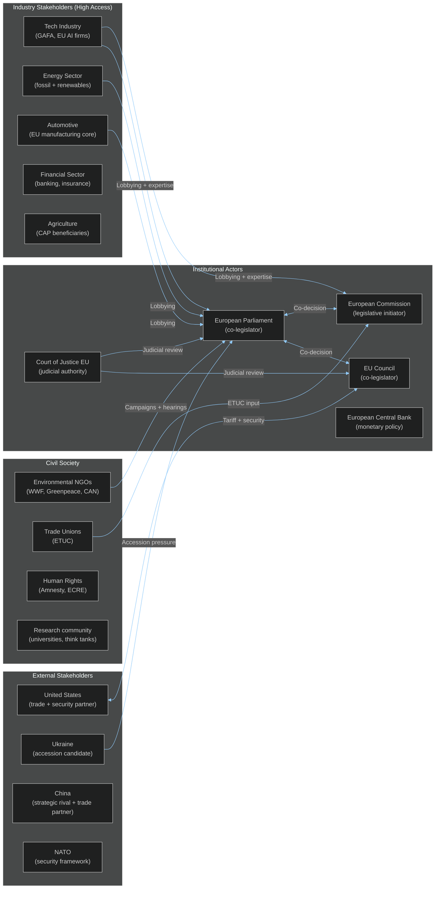

# EP10 Term Outlook — Stakeholder Map
**Date:** 2026-05-08 | **Article Type:** term-outlook | **Confidence:** MEDIUM-HIGH

---

## 🔍 Reader Briefing

**For citizens:** Who actually shapes EU law? Not just MEPs — a complex web of stakeholders including national governments, industry lobbies, civil society, courts, and external partners all have real influence on what the European Parliament decides. This map identifies all the key players and their actual leverage points, helping citizens understand where to engage if they want to influence EU policy.

**Plain language summary:** EU lawmaking is not just Parliament + Commission + Council. It involves hundreds of stakeholders with money, expertise, votes, and media access. The biggest industries (tech, auto, energy, finance, agri) have the most continuous access. Civil society has episodic influence through major campaigns. Courts (CJEU) have structural power that even member state governments cannot override. Citizens have the least direct influence — which is why knowing the stakeholder map is the first step to changing it.

---

## 1. Stakeholder Power Grid

---

## 2. Industry Stakeholder Profiles

### 2.1 Technology Industry (GAFA + EU AI sector)

**Power:** VERY HIGH
**Access mechanisms:** Expert hearings (ITRE/IMCO committees); Code of Practice; informal MEP network; well-resourced Brussels offices (100+ tech lobbyists registered)
**EP10 agenda:** AI Act implementation (Article 51 GPAI Code of Practice); DSA/DMA enforcement; EU Chips Act; EU AI Liability Directive

**Key positions:**
- GAFA: lobby for narrow prohibited AI definitions; oppose strong GPAI obligations; support interoperability (benefits Big Tech vs. EU rivals)
- EU AI startups: lobby for proportionate SME compliance; support EU AI strategic investment
- Semiconductor industry (TSMC, STMicroelectronics, Intel): support EU Chips Act but resist stringent export controls

**Effectiveness assessment:** VERY HIGH on AI Act implementation details (where technical complexity favours industry expertise). MEDIUM on high-salience provisions that EP members have strong political positions on (e.g., biometric surveillance bans).

---

### 2.2 Automotive Industry

**Power:** HIGH
**Access mechanisms:** ITRE committee hearings; GEAR 2030 platform; direct member state government lobbying feeding into Council positions
**EP10 agenda:** Clean Industrial Deal vehicle provisions; 2035 ICE ban review; charging infrastructure; battery value chain

**Key positions:**
- VW/Stellantis/BMW: delay or soften 2035 ICE ban; support public charging infrastructure investment; oppose CBAM extension to automotive components
- EV battery sector: support Critical Raw Materials Act; want EU content requirements in CID
- Automotive workers (via ETUC): support just transition; oppose rapid deindustrialisation

**Effectiveness assessment:** HIGH — automotive employment is a key constituency for EPP and S&D MEPs in Germany, France, and Italy. Industry access is structural.

---

### 2.3 Agricultural Sector

**Power:** HIGH (disproportionate to economic size)
**Access mechanisms:** COPA-COGECA (EU farmers' lobby); AGRI committee; CAP implementation national governments
**EP10 agenda:** CAP simplification (ongoing); pesticide regulations; biodiversity/nature restoration; food security

**Key positions:**
- Large farming interests: oppose pesticide reduction targets; support CAP subsidy maintenance; resist land-use change obligations
- Organic/smaller farmers: support transition payments; support EU food quality standards
- Food processing industry: support weak environmental regulation; oppose import standards reform

**Effectiveness assessment:** VERY HIGH — farmers demonstrated in 2024 (tractor protests) ability to create political pressure that shifted EP and Commission positions rapidly.

---

## 3. Civil Society Stakeholder Profiles

### 3.1 Environmental NGOs

**Power:** MEDIUM (episodic, campaign-dependent)
**Access mechanisms:** EP Environment Committee hearings; media campaigns; litigation (CJEU climate cases); public mobilisation

**EP10 effectiveness:**
- Lost ground in EP10 due to Green Deal retreat and EP composition shift
- Retain agenda-setting power on climate crisis framing
- CJEU litigation is increasingly important as legislative path narrows

**Key organisations:** Climate Action Network Europe (CAN); WWF European Policy Office; Greenpeace EU Unit; ClientEarth (litigation specialist)

---

### 3.2 Trade Unions (ETUC)

**Power:** MEDIUM-HIGH
**Access mechanisms:** Social dialogue (formal EU institutional mechanism); S&D group relationship; EESC (European Economic and Social Committee); collective action threats

**EP10 agenda:** AI in the workplace transparency; minimum wage framework implementation; just transition in Clean Industrial Deal; platform workers' rights

**Effectiveness assessment:** MEDIUM-HIGH on employment provisions within major legislation. ETUC cannot dictate legislative outcomes but has structural access that environmental NGOs lack — social dialogue is a formal EU treaty mechanism.

---

## 4. Key Stakeholder Tensions

| Tension | Actors | Likely EP10 Resolution |
|---------|--------|----------------------|
| AI Act scope vs. industry competitiveness | LIBE rights advocates ↔ IMCO industry interests | Partial — proportionality compromise in implementation |
| 2035 ICE ban vs. automotive jobs | Greens ↔ automotive industry + EPP | Partial rollback — some derogations added |
| Farm subsidies vs. environmental conditions | Agricultural lobby ↔ environmental NGOs | Agricultural lobby wins most skirmishes |
| Migration solidarity vs. sovereignty | Civil society (ECRE) ↔ ECR/PfE/ECR national governments | National sovereignty wins in EP10 |
| Defence spending vs. social investment | Peace movement ↔ EPP-led defence coalition | Defence wins (geopolitical context) |

---
*Sources: EP Open Data Portal; EU transparency register data; EP adopted texts (TA-10-2026 series); ETUC publications; environmental NGO positions.*
*Admiralty Grade B2: Stakeholder identification and access mechanisms are well-established; influence assessments are analytical judgements.*
