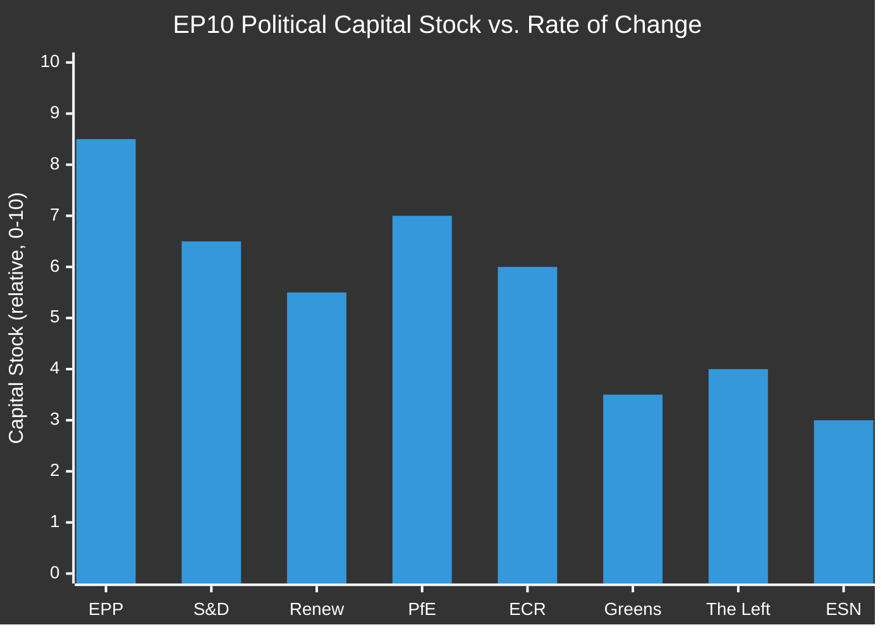

# EP10 Term Outlook — Political Capital Risk
**Date:** 2026-05-08 | **Article Type:** term-outlook | **Confidence:** MEDIUM

---

## 🔍 Reader Briefing

**For citizens:** Political capital is the reservoir of authority, trust, and goodwill that political actors spend to push through controversial decisions. When political capital is high, leaders can afford to take risks. When it runs low, they retreat to safe ground. This analysis tracks where political capital is being spent in EP10, who is accumulating it, and what happens when it runs out.

**Plain language summary:** The EPP has the most political capital but is spending it fast on deals with the far-right. S&D has declining capital as it gets squeezed between EPP accommodation and progressive demands. The Greens are in a capital crisis after losing 17 seats. PfE is accumulating capital by setting the agenda on migration without paying the costs of governing.

---

## 1. Political Capital by Actor

| Actor | Capital Stock | Rate of Change | Primary Source | Primary Drain |
|-------|--------------|----------------|----------------|---------------|
| EPP | 8.5 (HIGH) | → Stable | Coalition anchor; agenda control | Far-right accommodation backlash |
| S&D | 6.5 (MEDIUM-HIGH) | ↓ Declining | Electoral legitimacy; institutional presence | Squeezed by EPP rightward drift |
| Renew | 5.5 (MEDIUM) | ↓ Declining | Digital/AI expertise; EU federalism | French domestic pressure; seat loss |
| PfE | 7.0 (MEDIUM-HIGH) | ↑ Rising | Migration agenda-setting; opposition energy | Lack of governing responsibility |
| ECR | 6.0 (MEDIUM) | → Stable | Migration; defence; eastern EU governments | Pro-EU taboo in some circles |
| Greens/EFA | 3.5 (LOW) | ↓ Declining | Climate expertise; environmental mandate | Seat loss; Green Deal retreat |
| The Left | 4.0 (LOW-MEDIUM) | → Stable | Labour rights; anti-austerity | Niche electorate; limited coalition value |
| ESN | 3.0 (LOW) | → Stable | Far-right protest vote | Extreme positions limit coalition value |

---

## 2. Capital Expenditure Analysis — Where Capital Is Being Spent

### EPP Capital Expenditure

**High-cost items (spending capital fast):**
- Normalising ECR/PfE as legislative partners — EPP's own moderate wing (CDU/CSU, Belgian EPP) pays a reputation cost
- Weakening Green Deal provisions — alienating EPP voters who care about environment (17% of EPP 2024 vote based on Eurobarometer preferences)
- Rule-of-law accommodation: sustained erosion of EPP's democratic credibility

**Capital accumulation:**
- Successfully passing Clean Industrial Deal framing as EPP achievement
- Maintaining EP President Metsola's credibility as a pro-democratic voice
- Driving AI Act implementation as EU global leadership achievement

**Capital assessment:** EPP can sustain current expenditure rate through 2028 but faces a credibility reckoning if far-right normalisation becomes undeniable.

---

### S&D Capital Expenditure

**High-cost items:**
- Supporting EPP-led legislation that compromises climate or social standards = losing progressive credentials
- Opposing EPP-led legislation = losing coalition partner status and legislative effectiveness

**Capital accumulation:**
- Protecting minimum wage EU framework
- Defending workers' rights in AI Act
- Ukraine solidarity — cross-party kudos

**Capital risk:** S&D is caught in the classic coalition dilemma: cooperate and lose identity, or oppose and lose relevance. S&D's capital is declining because neither path preserves it.

---

### PfE Capital Accumulation

**PfE's capital paradox:** PfE is accumulating political capital precisely by NOT governing. It sets the migration agenda from outside the coalition, forcing EPP to adopt its positions to prevent PfE from becoming the default opposition choice for right-leaning voters. This is the opposition party's advantage: no responsibility costs.

**Risk to PfE capital:** If PfE enters government-like arrangements (committee leadership, coalition agreements) and is held responsible for outcomes, capital will be spent on delivery. This is the Catch-22 of opposition parties that win agenda-setting power.

---

## 3. Capital Depletion Scenarios

### Scenario P1 — EPP Capital Collapse (Probability: 20%, Timeline: 2027–2028)

**Trigger:** A major legislative scandal involving EPP accommodation of ECR/PfE demands that is visibly costly to EU democratic values (e.g., MFF conditionality elimination that benefits Hungary's Orbán government).

**Cascade:**
1. EPP moderate wing publicly disavows EPP group leadership position
2. German CDU/CSU national government creates distance from EP EPP group
3. Metsola faces EP presidential credibility challenge
4. Coalition becomes more difficult to hold; S&D explores alternatives

**Probability driver:** LOW because EPP leadership is sophisticated enough to manage visible accommodation vs. real accommodation. They rarely let the optics get away from them.

---

### Scenario P2 — Progressive Bloc Fragmentation (Probability: 40%, Timeline: 2027)

**Trigger:** A major Green Deal rollback vote where EPP + ECR + PfE wins with some S&D abstentions.

**Cascade:**
1. Greens/EFA exits cooperative arrangements with S&D (blaming S&D for inadequate resistance)
2. The Left becomes isolated from any coalition deal
3. Progressive counter-narrative collapses; EP10 defined by EPP-right dominance

**Probability driver:** MODERATE because S&D is already facing pressure to choose between coalition effectiveness and progressive identity. A major Green Deal vote could force this choice.

---

### Scenario P3 — PfE Capital Realisation (Probability: 30%, Timeline: 2028)

**Trigger:** EPP explicitly offers PfE a formal co-governance arrangement (committee chairs, formal coalition document) in preparation for EP11.

**Cascade:**
1. PfE moves from opposition energy to governing responsibility
2. PfE must defend concrete outcomes — loses opposition protest energy
3. EPP gains legislative reliability from PfE votes
4. EP10 ends as the parliament that formally normalised far-right as EU governing partner

**Probability driver:** MODERATE because EPP needs PfE more in 2028 (pre-election positioning) than in 2026 (early term).

---
*Sources: EP seat composition; EP Open Data Portal; analytical capital assessment per ai-driven-analysis-guide.md.*
*Confidence: MEDIUM — political capital is inherently unobservable; assessments are evidence-informed analytical judgements.*
