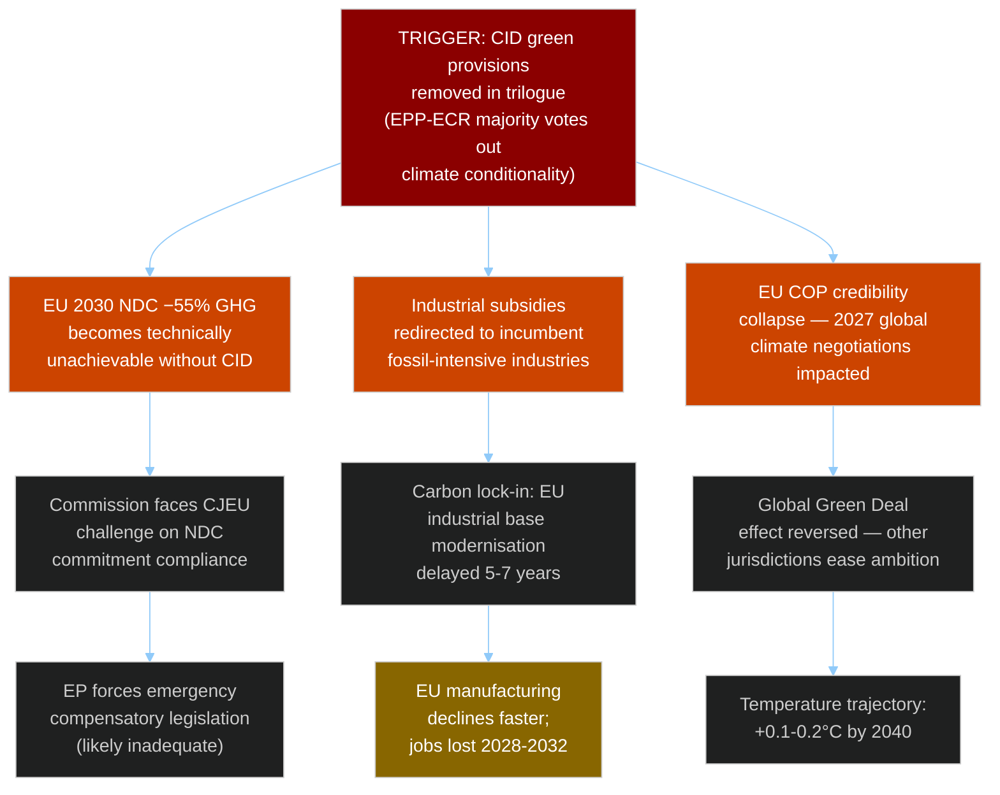
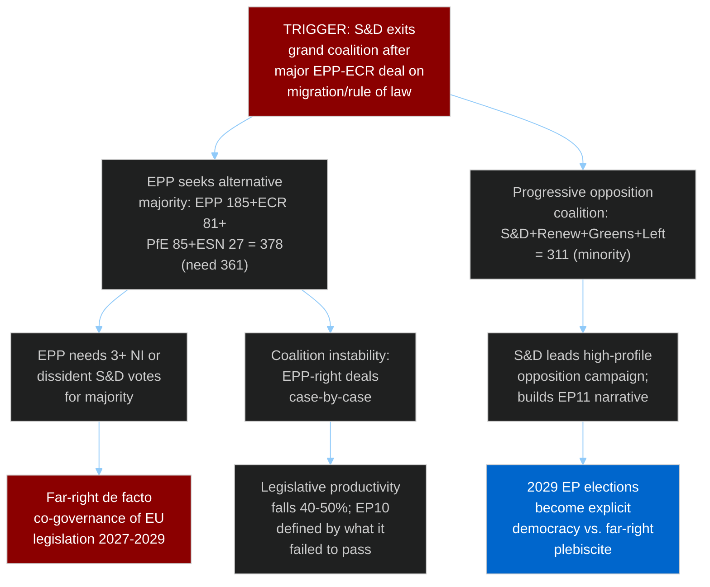
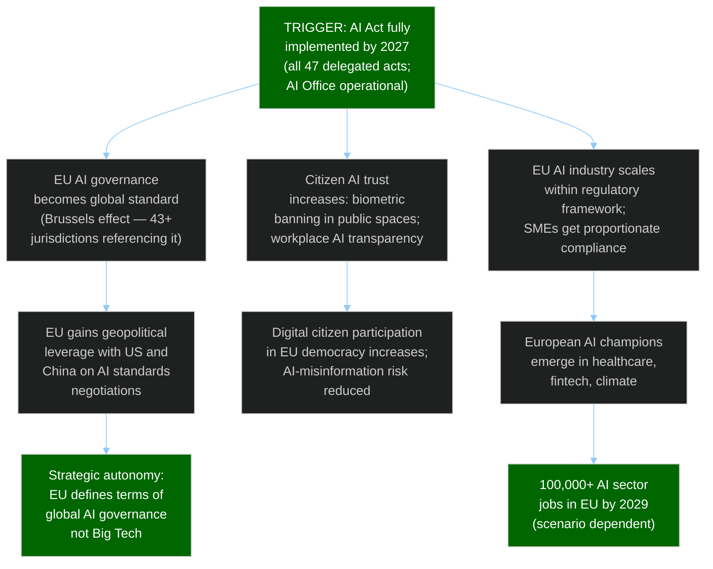

# EP10 Term Outlook — Consequence Trees
**Date:** 2026-05-08 | **Article Type:** term-outlook | **Confidence:** MEDIUM

---

## 🔍 Reader Briefing

**For citizens:** Consequence trees trace what happens AFTER a key legislative or political event. When EP10 makes a major decision — or fails to — this tool maps the cascading effects across European politics, economy, and governance. This helps citizens understand the stakes of seemingly abstract parliamentary votes.

---

## 1. Consequence Tree 1 — Clean Industrial Deal Failure/Dilution

**Assessment:** This consequence tree describes the LIKELY outcome (WEP B3 — 60% probability that CID green provisions are partially diluted). The terminal nodes are 10-year consequences. The JOBS outcome is the most politically visible and the most likely to create backlash — but by the time it's visible (2028–2032), the EP10 legislators who made the decision will have moved on.

---

## 2. Consequence Tree 2 — Coalition Collapse

**Assessment:** Probability 30% (WEP C2). The terminal node ELECTION (if coalition collapses) could actually be POSITIVE for EU democracy — a clear democratic choice in 2029 is healthier than a murky centre-right accommodation. But the FAR_RIGHT_GOVERNANCE path (2027–2029) is the near-term negative consequence.

---

## 3. Consequence Tree 3 — AI Act Implementation Success

**Assessment:** Probability 45% (WEP C2 for FULL success; partial success more likely at 65%). This positive consequence tree shows the upside of the AI Act — and why implementation quality matters enormously. A botched implementation where key provisions are de facto unenforceable would NOT produce these consequences.

---

## 4. Summary Consequence Assessment

| Event | Probability | Key Consequence | Reversibility |
|-------|------------|-----------------|---------------|
| CID dilution | 60% (WEP B3) | Carbon lock-in 5-7 years | LOW — industrial investment cycles are 10+ years |
| Coalition collapse | 30% (WEP C2) | Far-right co-governance 2027-2029 | MEDIUM — 2029 elections provide correction path |
| AI Act success | 45% (WEP C2) | EU AI governance standard | HIGH — global standards can be iterated |
| Ukraine policy reversal | 25% (WEP D2) | Existential EU credibility crisis | LOW — trust once broken is hard to rebuild |

---
*Sources: EP legislative pipeline; EP adopted texts analysis; consequence tree methodology per ai-driven-analysis-guide.md.*
*WEP grades applied: A=Almost Certainly / B=Likely / C=Possible / D=Unlikely / E=Remote.*
*Confidence: MEDIUM — consequence mapping is inherently speculative beyond immediate first-order effects.*
