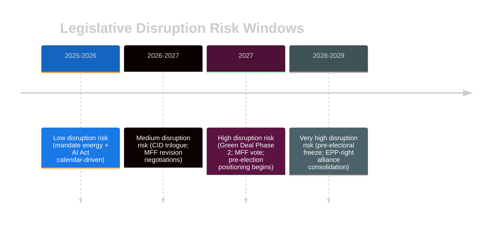

# EP10 Term Outlook — Legislative Disruption Analysis
**Date:** 2026-05-08 | **Article Type:** term-outlook | **Confidence:** MEDIUM-HIGH

---

## 🔍 Reader Briefing

**For citizens:** Legislative disruption doesn't mean political chaos — it means specific legislative priorities being blocked, delayed, or fundamentally reshaped by political dynamics. This analysis identifies which EU laws are most at risk of being disrupted in EP10, how disruption happens, and what the alternatives are if disruption succeeds.

---

## 1. Disruption Mechanism Taxonomy

**Four primary disruption mechanisms in EP10:**

| Mechanism | How It Works | Key Actors | Effectiveness |
|-----------|-------------|-----------|---------------|
| **Majority substitution** | EPP drops progressive coalition partners; uses ECR+PfE instead | EPP + ECR + PfE | HIGH — enables any majority |
| **Trilogue capture** | During EP-Council-Commission negotiations, key provisions quietly removed | Council + Commission negotiators + EPP rapporteur | HIGH — trilogues are opaque |
| **Committee blockage** | File assigned to hostile committee chair; report delayed or gutted | Committee chairs (EPP/ECR) | MEDIUM — slow but effective |
| **Budget conditionality removal** | MFF/annual budgets passed without rule-of-law or climate conditions | EPP + ECR + PfE + Council veto | HIGH on MFF; MEDIUM on annual |

---

## 2. High-Risk Legislative Files

### D-1 — Green Deal Phase 2: Nature and Biodiversity (DISRUPTION RISK: VERY HIGH)

**Context:** Nature Restoration Law passed EP9 by 336–300 (narrow). EP10 composition has shifted ~33 seats rightward. Any EP10 biodiversity/nature legislation would face:
- ENVI committee composition challenge (EPP + ECR potentially majority)
- PfE systematic opposition to binding nature targets
- Agricultural lobby access to EPP through EVP farming network

**Disruption pathway:** Commission proposes; EPP rapporteur weakens targets in committee; ECR/PfE amendments in plenary eliminate binding provisions; adopted as voluntary framework only.

**Alternative if disrupted:** CJEU-driven enforcement of existing Habitats Directive; member state court actions; citizen science pressure.

---

### D-2 — MFF 2028 Revision / NextGen EU Successor (DISRUPTION RISK: HIGH)

**Context:** NextGen EU closes 2026. No successor mechanism exists. MFF revision requires Council unanimity. Hungary has demonstrated willingness to veto for concessions.

**Disruption pathway:** Hungary (+ potentially Italy) blocks MFF revision unless:
1. Rule-of-law conditionality is eliminated
2. Hungary's frozen cohesion funds are unblocked without reform conditions
3. Special budget provisions for migration enforcement infrastructure are added

**EP countermeasure:** EP has consent power on MFF. EP could withhold consent from an MFF revision that fully capitulates to Hungarian demands — creating a standoff. Historical precedent: EP has used MFF consent power as leverage.

**Assessment:** Partial disruption most likely. Some rule-of-law conditions weakened; some Hungarian demands met; MFF revision passed with both sides claiming victory. Full NextGen successor: LOW probability before 2028.

---

### D-3 — AI Act Prohibited Practices Scope (DISRUPTION RISK: MEDIUM)

**Context:** Article 5 AI Act (prohibited AI practices) prohibits: real-time biometric surveillance in public spaces; predictive policing; social scoring; emotion recognition. Commission implementing acts define technical scope of each prohibition.

**Disruption pathway:** Commission implementing acts narrow the definitions of prohibited practices under industry lobbying:
- "Real-time" biometric surveillance narrowly defined (AI that stores then searches = not real-time)
- Predictive policing carve-out for "national security" broadened
- EP oversight committee lacks capacity to scrutinise all 47 delegated/implementing acts in depth

**EP countermeasure:** EP's AI Act objection powers under Article 96 AI Act. LIBE committee scrutiny. But EP must object within 2-month window for each delegated act — capacity constraint is real.

---

### D-4 — CBAM Carbon Border Adjustment Mechanism (DISRUPTION RISK: MEDIUM-LOW)

**Context:** CBAM is already law; full operation from 2026. Disruption risk is in the review/expansion provisions.

**Disruption pathway:** US or Chinese trade retaliation threats lead Commission to propose CBAM revision; EPP + ECR support weaker enforcement or delayed expansion to new sectors; S&D/Greens cannot block.

**Assessment:** CBAM as currently structured is stable. Expansion risks are MEDIUM. The geopolitical trade tension makes this a live risk, not hypothetical.

---

## 3. Disruption Calendar (Timeline Risk)

---

## 4. Disruption Mitigation Options

| Disruption Risk | EP Mitigation Tool | Commission Role | Effectiveness |
|----------------|-------------------|-----------------|---------------|
| Green Deal rollback | Plenary amendments; ENVI committee defence | Commission must maintain proposal | MEDIUM — depends on Commission solidarity |
| MFF disruption | EP consent withholding | Commission mediation | HIGH — EP has real leverage |
| AI Act scope narrowing | Delegated act objections | Commission's own AI Office | MEDIUM — capacity constrained |
| CBAM weakening | Co-decision amendments | Commission proposal defence | MEDIUM |

---
*Sources: EP adopted texts; EU legislative procedure analysis; EP committee composition data; historical EP disruption pattern analysis.*
*Confidence: MEDIUM-HIGH for mechanism identification; MEDIUM for probability assessments.*
