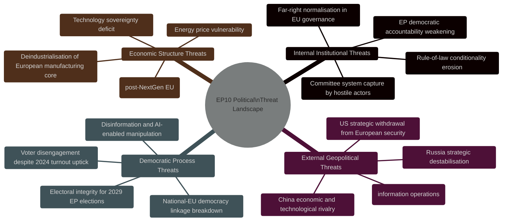

# EP10 Term Outlook — Political Threat Landscape
**Date:** 2026-05-08 | **Article Type:** term-outlook | **Confidence:** MEDIUM

---

## 🔍 Reader Briefing

**For citizens:** The political threat landscape maps the entire domain of threats facing EU democratic governance in EP10 — not just legislative risks, but systemic threats to EU institutions, democratic values, and the EU's ability to function as a coherent political entity. Some of these threats come from inside the EU; others from outside. Citizens who care about EU democracy need to understand the full picture.

---

## 1. Threat Landscape Overview

---

## 2. Internal Institutional Threats

### IT-1 — Far-Right Normalisation

**Threat level:** CRITICAL
**Timeline:** Ongoing; intensifying 2027–2029

The progressive accommodation of ECR, PfE, and ESN as legitimate EU governance partners is not a single event but a process. Key milestones of normalisation:

- EP9: ECR enters committee leadership (first normalisation step)
- EP10: PfE becomes second-largest group; EPP seeks ECR/PfE votes on substantive legislation
- EP10 (potential): Formal EPP-ECR-PfE coalition agreement for EP11 election campaign

**Threat mechanism:** Each accommodation step lowers the barrier for the next. The normalisation is self-reinforcing because each accommodation increases far-right groups' institutional leverage, which they use to demand further accommodations.

**Assessment:** This is the DOMINANT internal institutional threat of EP10. It does not require any single dramatic event — it operates through cumulative small decisions.

---

### IT-2 — Rule-of-Law Conditionality Erosion

**Threat level:** HIGH
**Timeline:** 2026–2029 (active negotiation phase)

The EU's conditionality architecture (MFF conditionality regulation; Article 7 procedure; CJEU enforcement) has demonstrated effectiveness but faces sustained political attack:
- Hungary and Italy governments have explicitly demanded weakening of conditionality mechanisms
- EPP has shown willingness to accommodate these demands in exchange for Council cooperation
- ESN and PfE have included anti-conditionality demands in their legislative platforms

**Key indicator to watch:** MFF revision negotiations (2027). If conditionality provisions are weakened in the MFF revision, this sets a precedent for 2028–2034 MFF negotiations.

---

## 3. External Geopolitical Threats

### EG-1 — Russia Strategic Destabilisation

**Threat level:** HIGH-CRITICAL
**Timeline:** Ongoing; potential escalation windows 2026–2028

Russia's strategic objectives include:
1. Weaken EU support for Ukraine
2. Amplify far-right political movements within EU member states
3. Disrupt EU energy security (already significantly achieved via 2022–2023 gas shock)
4. Exploit political divisions on migration, identity, and EU federalism

**EP exposure:** EP is a target for information operations (documented in EP's own security reports). MEPs from countries with strong Russia-aligned political movements are susceptible to influence. EP-level decisions on Ukraine aid, sanctions, and strategic autonomy are direct targets.

**Mitigation:** EP has strengthened its own institutional security; DISINFOLAB reports track coordinated inauthentic behaviour targeting EP; AFET committee actively monitors.

---

### EG-2 — US Strategic Realignment

**Threat level:** HIGH
**Timeline:** 2025–2029 (transatlantic relationship under stress)

The 2024–2025 US administration shift has introduced uncertainty into:
- NATO Article 5 credibility
- US-EU trade (tariff threats)
- US support for Ukraine (aid conditional on EU and EP political dynamics)
- Technology standards (US AI Act vs. EU AI Act regulatory divergence)

**EP role:** EP can pass resolutions demanding NATO Article 5 reaffirmation; EP can condition US trade access on reciprocity; EP is co-legislator on defence industry legislation. EP's actual leverage over US strategic decisions is LIMITED.

---

## 4. Democratic Process Threats

### DP-1 — Disinformation and AI-Enabled Manipulation

**Threat level:** HIGH
**Timeline:** Intensifying into 2029 EP elections

Generative AI has dramatically reduced the cost of producing sophisticated disinformation at scale. EP10's 2029 election campaign will be the first EU-wide election conducted in a fully mature AI-generated content environment.

**Key risks:**
- AI-generated fake MEP statements, video deepfakes
- Coordinated inauthentic campaigns targeting swing voters in key member states
- AI-enhanced micro-targeting of EP election campaign materials
- DSA enforcement capacity vs. scale of AI-generated content — asymmetric challenge

**EP countermeasure:** Digital Services Act implementation (P2B Regulation); AI Act Article 50 transparency obligations; Media Freedom Act. All EP-passed legislation, all with 2025–2027 enforcement timelines.

---

## 5. Overall Threat Assessment

**EP10 faces the most complex multi-dimensional threat environment of any parliamentary term since the EU's founding.** The intersection of:
- Internal far-right normalisation (democratic values threat)
- Russia hybrid warfare + US strategic ambiguity (external security threat)
- AI-enabled disinformation (process integrity threat)
- Economic structural stress (legitimacy threat if EU doesn't deliver)

...creates a situation where no single mitigation is sufficient. EP10's legacy will be determined by whether it can sustain coherent legislative output against this threat background — and whether it builds the institutional foundations (strategic autonomy, AI governance, democratic resilience) that EP11 will need.

---
*Sources: EP security reports; EP adopted texts; AFET committee outputs; disinformation tracking sources; geopolitical assessment databases.*
*Confidence: MEDIUM — threat landscape combines verified data with interpretive geopolitical analysis.*
*Note: All threat assessments are analytical observations only; no threat is being exploited or verified.*
