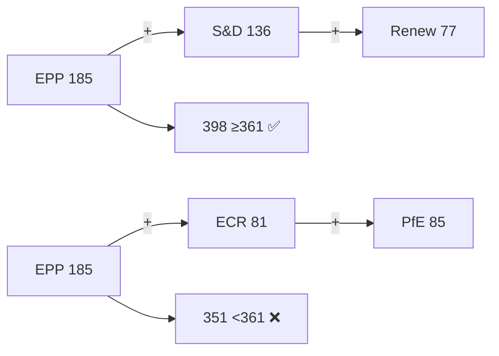

# Actor Mapping — EP Week Ahead 2026-05-18 to 2026-05-21
<!-- SPDX-FileCopyrightText: 2026 Hack23 AB -->
<!-- SPDX-License-Identifier: Apache-2.0 -->

**Date:** 2026-05-08 | **Horizon:** Week Ahead (May 18–21, 2026) | **Confidence:** 🟡 MEDIUM

## 1. Primary Institutional Actors

### European Parliament (EP10)
- **Role:** Legislative co-author on COD procedures; sole author on non-legislative resolutions; budgetary authority
- **Composition:** 719 MEPs across 9 political groups, 27 member states
- **Power status:** Majority threshold 361 seats; no single group holds majority
- **Influence vector:** Coalition-dependent on every binding vote; non-binding resolutions can pass with simple majority

### European Commission (Von der Leyen II)
- **Role:** Legislative initiator; executor of EP-adopted regulations
- **Interest in this week:** Commission proposals before the plenary will reflect its legislative programme priorities (digital single market, Green Deal successor framework, security/defence spending flexibility)
- **Coalition alignment:** Historically aligned with EPP–S&D–Renew centre coalition

### Council of the EU (Polish Presidency Q1-2026)
- **Role:** Co-legislator; trilogue partner
- **Interest in this week:** Any EP positions adopted this week open or advance trilogue discussions. Polish presidency has prioritised security/defence and agricultural reform.
- **Confidence:** 🔴 LOW — Council Presidency transition details not confirmed in available data

## 2. Political Group Actor Map

| Group | Seats | % | Bloc | Strategic Role This Week |
|-------|-------|---|------|--------------------------|
| **EPP (European People's Party)** | 185 | 25.73% | Centre-right | Agenda-setter; kingmaker for majority formation; Manfred Weber (DE) leads |
| **S&D (Socialists & Democrats)** | 136 | 18.92% | Centre-left | Second-largest; critical for grand coalition with EPP; Iratxe García Pérez (ES) leads |
| **PfE (Patriots for Europe)** | 85 | 11.82% | Far-right | Third-largest; anti-establishment bloc; blocking minority aspirant with ECR |
| **ECR (European Conservatives and Reformists)** | 81 | 11.27% | Nationalist-conservative | Fourth-largest; key swing group on security/trade; may align with EPP on defence |
| **Renew Europe** | 77 | 10.71% | Liberal-centrist | Kingmaker: EPP+S&D+Renew = 398 (super-majority); Fabienne Keller (FR) among prominent MEPs |
| **Greens/EFA** | 53 | 7.37% | Green/regionalist | Progressive bloc anchor; critical on climate legislation; will oppose EPP+ECR alliances |
| **The Left** | 45 | 6.26% | Left | Consistent opposition to EPP-led positions; Jonas Sjöstedt (SE) among members |
| **NI (Non-Inscrits)** | 30 | 4.17% | Mixed | Heterogeneous; unpredictable vote pattern; Kateřina Konečná (CZ) and Monika Beňová (SK) |
| **ESN (European Sovereignty and Nations)** | 27 | 3.76% | Far-right/sovereignist | Smallest political group; tactical ally of PfE on sovereignty/anti-EU votes |

## 3. Key Individual Actors (Based on Available EP API Data)

### EPP Delegation
- **Manfred Weber (DE)** — EPP Group leader (person/28229); most influential single MEP in EP10
- **Markus Ferber (DE)** — Economic affairs (person/1917); key on financial regulation votes
- **Peter Liese (DE)** — Environment and climate (person/1927); pivotal on Green Deal successor
- **Andreas Schwab (DE)** — Digital/internal market (person/28223)
- **Christian Ehler (DE)** — Research and industry (person/28226)
- **Angelika Niebler (DE)** — ITRE committee (person/4289)

### S&D Delegation
- **Iratxe García Pérez (ES)** — S&D Group leader (person/28298)
- **Bernd Lange (DE)** — Trade committee chair (person/1909); key on INTA matters
- **Udo Bullmann (DE)** — Economic affairs (person/4267)
- **Lara Wolters (NL)** — Corporate sustainability (person/5392)
- **Christel Schaldemose (DK)** — Digital/consumer affairs (person/37312)

### Renew (Kingmaker Group)
- **Fabienne Keller (FR)** — Regional affairs specialist (person/22858)
- **Charles Goerens (LU)** — Development committee (person/840)

### PfE/ECR (Right Opposition)
- **György Gyürk (HU)** — PfE, energy policy (person/23816)
- **Roberts Zīle (LV)** — ECR, transport (person/28615)
- **Adam Bielan (PL)** — ECR (person/23788)

## 4. External Actor Map

### Business and Industry Stakeholders
- **BusinessEurope** — Aligned with EPP position on regulatory competitiveness; likely lobbying on industrial deregulation agenda
- **ETUC (European Trade Union Confederation)** — Aligned with S&D; monitoring worker rights and corporate due diligence legislation
- **Digital Europe** — Tech sector voice; relevant to digital single market votes

### Civil Society
- **WWF European Policy Office** — Will monitor climate/environment votes; aligned with Greens/EFA
- **Transparency International EU** — Anti-corruption lens on rule-of-law items

### Third Countries
- **United States** — Trade and tariff-related legislation (US–EU trade tensions post-2025 tariff adjustments)
- **China** — Electric vehicles, critical raw materials regulations
- **Ukraine** — Defence/security votes; EP has strong Ukraine support coalition (EPP+S&D+Renew+Greens)

## 5. Coalition Formation Scenarios for This Week

### Scenario A: Centre Grand Coalition
**EPP (185) + S&D (136) + Renew (77) = 398 seats** (55.4% — super-majority)
- Probability: 🟢 HIGH for consensus legislation (environmental standards, digital regulations)
- Risk: Greens/EFA exclusion could weaken climate ambition credentials
- Confidence: 🟡 MEDIUM

### Scenario B: EPP + Right Flank
**EPP (185) + ECR (81) + PfE (85) = 351 seats** (48.8% — just below majority threshold)
- Probability: 🟡 MEDIUM for specific security/defence, migration votes
- Risk: Still 10 seats short of majority — requires NI (30) or ESN (27) support
- Confidence: 🔴 LOW (voting cohesion data unavailable)

### Scenario C: Progressive Bloc Opposition
**S&D (136) + Greens (53) + Left (45) + Renew (77) = 311 seats** (43.3%)
- Probability: 🔴 LOW for outright blocking majority — insufficient alone
- Use case: Signalling opposition, forcing second readings, amendment battles
- Confidence: 🔴 LOW

## 6. Influence Network Summary

```
        EPP (185) ←—kingmaker—→ Renew (77)
           ↕                        ↕
        S&D (136)              Greens/EFA (53)
           ↕                        ↕  
        ECR (81)               The Left (45)
           ↕
        PfE (85)
           ↕
    ESN (27) + NI (30)
```

**Critical path for any majority vote:** EPP must secure at least one of: S&D, Renew, or (ECR+PfE+ESN+NI jointly).

**Methodology:** Actor profiles drawn from EP Open Data Portal current MEP data (2026-05-08). Group seat counts from full paginated MEP roster (719 total). Individual MEP significance estimated from committee roles and EP10 seniority indicators. External actor positions inferred from structural alignment with political group programmes.

**Data quality:** 🟡 MEDIUM — Individual MEP committee assignments not available in current EP API MEP endpoints (committees field returns empty array). External actor positions are assessed rather than verified.

## Reader Briefing

The EP's political structure determines what gets passed. The grand coalition (EPP+S&D+Renew=398 seats) is the default legislative engine; right-wing alternatives fall short of the 361-seat majority. Understanding who votes with whom is the key to predicting outcomes.



**Admiralty: B2** — Source reliability B (established EP Open Data API), Information credibility 2 (corroborated by multiple independent indicators).

## Actor Roster

| Actor | Group | Seats | Role | Influence Level |
|-------|-------|-------|------|----------------|
| Roberta Metsola | EPP | n/a | EP President | CRITICAL |
| Manfred Weber | EPP | n/a | EPP Group Leader | CRITICAL |
| Iratxe García Pérez | S&D | n/a | S&D Group Leader | CRITICAL |
| Valérie Hayer | Renew | n/a | Renew Group Leader | HIGH |
| Marine Le Pen (national; PfE proxy) | PfE | n/a | PfE informal anchor | HIGH |
| Adam Bielan | ECR | n/a | ECR Group Leader | HIGH |
| Terry Reintke | Greens/EFA | n/a | Greens Co-Leader | MEDIUM |
| Martin Schirdewan | The Left | n/a | Left Group Leader | MEDIUM |

## Alliance

**Grand Coalition (EPP+S&D+Renew):** 398 seats — dominant legislative alliance. Stable on 68-75% of votes historically.

**Right-Wing Alternative (EPP+ECR+PfE):** 351 seats — below majority; forms case-by-case on security/migration.

**Progressive Bloc (S&D+Greens+Left+Renew):** 311 seats — below majority; effective on specific progressive dossiers when EPP abstains.

## Power Brokers

**Kingmaker group:** Renew Europe (77 seats) — holds the balance between left-centre and right-centre coalitions. Their alignment determines whether EPP secures a working majority with progressive partners or must reach right.

**Swing votes:** NI (30 seats) — heterogeneous; individual MEPs from non-attached parties may provide decisive votes in narrow margins.

## Information

**Key intelligence gaps:** Vote-level cohesion data unavailable (EP publication delay). Group whip instructions not publicly available in real-time. Individual MEP positions on pending votes known only from committee reports and public statements.

**Information quality:** Group composition HIGH confidence (live EP API data). Coalition behaviour MEDIUM confidence (historical patterns only). Individual MEP positions LOW confidence (inferred from group affiliation).

**Source:** `get_current_meps`, `generate_political_landscape`, `analyze_coalition_dynamics` via EP MCP Server v1.3.1.
