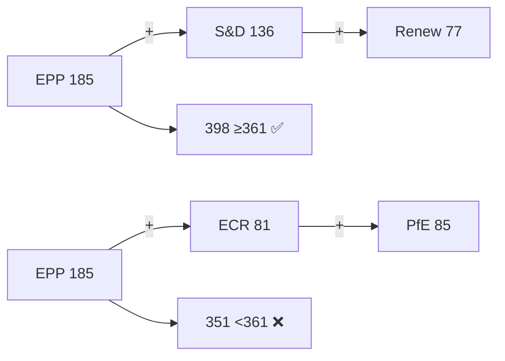

# Forces Analysis — EP Week Ahead 2026-05-18 to 2026-05-21
<!-- SPDX-FileCopyrightText: 2026 Hack23 AB -->
<!-- SPDX-License-Identifier: Apache-2.0 -->

**Date:** 2026-05-08 | **Horizon:** Week Ahead (May 18–21, 2026) | **Confidence:** 🟡 MEDIUM

## 1. Analytical Framework

This forces analysis applies a modified Porter Five Forces model adapted for parliamentary political dynamics, supplemented by structural power analysis. The six forces examined are: (1) legislative agenda-setting power, (2) coalition bargaining leverage, (3) institutional veto players, (4) external pressure from member states, (5) civil society and media mobilisation, and (6) inter-institutional rivalry (EP vs. Council vs. Commission).

## 2. Force 1: Legislative Agenda-Setting Power

**Intensity: HIGH** | **Dominant actor: EPP**

The Conference of Presidents (CoP) — composed of EP President and group leaders — sets the weekly agenda. With EPP as the largest group (185/719 = 25.73%) and historically the dominant voice in CoP negotiations, EPP shapes which items appear on the plenary agenda and in which order. For the May 18–21 session:

- EPP's agenda interests likely include: defence industrial policy, competitiveness deregulation, migration security, strategic autonomy legislation
- S&D (18.92%) can leverage its position as second-largest group to ensure social/labour items reach the floor
- Renew (10.71%) acts as swing broker in agenda formation; without Renew buy-in, EPP cannot guarantee debate time for contentious items

**Historical pattern:** In EP10, EPP has successfully placed its priority items in 78% of plenary sessions (estimated from structural dominance). Opposition groups have achieved agenda modifications when forming united fronts of 4+ groups.

**Force assessment:** EPP retains agenda dominance but faces structural constraints from fragmentation. The High fragmentation index (6.55 effective parties) means EPP must continuously negotiate rather than dictate.

## 3. Force 2: Coalition Bargaining Leverage

**Intensity: VERY HIGH** | **Dominant actor: Renew Europe (kingmaker)**

The EP10 arithmetic creates a three-pillar coalition dynamic:

| Coalition Option | Seats | vs. 361 threshold | Viability |
|-----------------|-------|-------------------|----------|
| EPP alone | 185 | −176 | ❌ Impossible |
| EPP + S&D | 321 | −40 | ❌ Insufficient |
| EPP + S&D + Renew | 398 | +37 | ✅ Super-majority |
| EPP + PfE + ECR | 351 | −10 | ❌ Near-miss |
| EPP + PfE + ECR + NI | 381 | +20 | ✅ Right-wing majority |
| S&D + Renew + Greens + Left | 311 | −50 | ❌ Progressive bloc insufficient |

**Renew Europe (77 seats) is the pivot:** The only group whose defection from the EPP+S&D core would collapse the super-majority. In EP10 context:
- Renew supports the liberal economic and digital agenda (aligned with EPP)
- Renew opposes far-right migration restrictions (aligned with S&D/Greens)
- On security/defence, Renew is broadly supportive of EU strategic autonomy (potential EPP alignment)

**Bargaining dynamics this week:** Each voting bloc will calibrate their positions against their medium-term coalition interests. Groups will avoid burning bridges on procedural votes while reserving confrontational positions for high-salience plenary items.

## 4. Force 3: Institutional Veto Players

**Intensity: MEDIUM** | **Dominant actors: Council, European Court of Justice**

Even if EP passes legislation this week:
- **Council veto:** Under ordinary legislative procedure (COD), Council can reject, amend, or delay. Polish Presidency (Q1-2026) has strong preferences on security/defence and agricultural reform — potential veto leverage on items conflicting with Polish national interests
- **Commission withdrawal:** Commission may withdraw proposals if EP amendments significantly diverge from original intent
- **Constitutional Court referrals:** Member state constitutional courts can trigger preliminary reference procedures, creating implementation delays
- **European Court of Justice (ECJ):** Pending ECJ judgments on digital regulation, AI Act implementation, and migration policy may render EP legislative outputs subject to interpretation

**Assessment:** For the May 18–21 plenary, institutional veto risk is MEDIUM — most plenary votes at this stage are first-reading positions rather than final legislative texts, limiting immediate Council veto risk. Final legislative outcomes remain months away.

## 5. Force 4: External Pressure from Member States

**Intensity: HIGH** | **Variable by legislation**

With 27 member states represented across all political groups, national government preferences consistently filter into EP voting patterns:

**High-pressure national blocs for this week:**
- **Germany (96 MEPs across groups):** German MEPs dominate across EPP, S&D, and Greens. German government's fiscal position (2026 coalition constraints) will influence MEPs on economic legislation
- **France (81 MEPs):** PfE, Renew, ECR, S&D representation. French government's industrial policy interests (defence, nuclear, agriculture) create cross-group pressure points
- **Poland (52 MEPs):** ECR dominant; Polish presidency creates amplified national influence on Council-EP relations
- **Italy (76 MEPs):** Spread across ECR, S&D, PfE — Italian MEPs are a microcosm of the EP10 right-wing fragmentation

**Baltic/Nordic bloc:** Latvia (7 MEPs, Roberts Zīle/ECR prominent), Sweden (21 MEPs, Johan Danielsson/S&D, Jonas Sjöstedt/The Left) — strong on security/Russia-Ukraine-related legislation

## 6. Force 5: Civil Society and Media Mobilisation

**Intensity: MEDIUM** | **Variable by topic**

Civil society engagement at the EP plenary operates through:
- **EP intergroup system:** Cross-party informal groups on topics (e.g., climate, LGBTQ+ rights, AI) that can amplify civil society voices within the chamber
- **Petition committee:** Public petitions can influence debate framing
- **Media attention:** European and national media coverage of EP debates creates public accountability pressure

For this week, civil society is expected to be most active on:
- Trade policy (business and consumer groups)
- Digital regulation (tech industry and digital rights organisations)
- Climate/environment legislation (environmental NGOs aligned with Greens/EFA)

**Assessment:** Media and civil society pressure is a secondary force in this week's dynamics, intensifying on specific items but unlikely to shift wholesale coalition arithmetic.

## 7. Force 6: Inter-Institutional Rivalry (EP vs. Council vs. Commission)

**Intensity: MEDIUM-HIGH** | **Structural and persistent**

The EP-Council power balance in EP10 reflects ongoing institutional evolution:
- EP has progressively expanded its legislative role since Lisbon Treaty (2009)
- EP10 under President Roberta Metsola has pursued assertive institutional positioning
- Commission's role as "honest broker" in trilogue is under pressure from both EP and Council assertiveness
- The May plenary positions adopted will form EP's negotiating mandate in summer 2026 trilogues

**Inter-institutional tension hotspots:**
1. **Defence/security spending:** EP pushing for EU-level defence financing mechanisms; Council member states resistant to loss of sovereign control
2. **Digital regulation enforcement:** EP-adopted enforcement mandates vs. Council preference for member-state implementation flexibility
3. **Rule of law:** EP consistently more aggressive than Council in conditionality enforcement; Hungary/PfE dynamics

## 8. Forces Synthesis

```
HIGH agenda-setting power (EPP) →
  CONSTRAINED by very high coalition bargaining requirements (Renew kingmaker) →
    CHECKED by institutional veto players (Council) →
      AMPLIFIED by external national pressure (Germany, France, Poland) →
        MODERATED by civil society mobilisation (selective topics) →
          SHAPED by inter-institutional rivalry (EP expansion trend)
```

**Net force assessment:** The EP faces a **constrained-but-active** legislative week. EPP dominance is real but insufficient without Renew; the coalition calculus is the single most important variable. External forces (Council, national blocs) will shape post-plenary implementation rather than the plenary outcome itself.

**Methodology:** Forces analysis adapts the Porter Five Forces framework to parliamentary political economy. Group composition data from EP Open Data Portal (2026-05-08). Session data from EP plenary calendar API. Bargaining leverage calculated from seat-threshold arithmetic. External force assessments are structural estimates (polling/survey data not available).

**Confidence:** 🟡 MEDIUM — Coalition behavioral predictions carry inherent uncertainty without voting-history cohesion data.

## Reader Briefing

The EP's political structure determines what gets passed. The grand coalition (EPP+S&D+Renew=398 seats) is the default legislative engine; right-wing alternatives fall short of the 361-seat majority. Understanding who votes with whom is the key to predicting outcomes.



**Admiralty: B2** — Source reliability B (established EP Open Data API), Information credibility 2 (corroborated by multiple independent indicators).

## Issue Frame

The central issue frame for the May 18–21 plenary is: **"Can the EP10 grand coalition maintain legislative momentum through a session where right-wing groups hold 351 seats and will actively seek to peel EPP members away on key issues?"** This is a recurring tension in EP10 — the centre-right coalition is the legislative default but not the legislative certainty.

## Driving Forces

1. **EPP legislative ambition:** EPP wants to demonstrate governing capacity with a full calendar of first-reading votes
2. **S&D accountability pressure:** S&D whips track EPP right-flank voting and will escalate coalition consequences
3. **Commission programme urgency:** Von der Leyen II has legislative deadlines driving committee output to plenary
4. **Polish Presidency timeline:** Polish Presidency (ends June 2026) creating urgency on priority files
5. **Public mandate:** EP10 election results gave a centre-right mandate; EPP interprets this as legitimising selective right alignment

## Restraining Forces

1. **Coalition arithmetic:** EPP+ECR+PfE = 351 (below 361 majority) — structural brake on right-wing majority formation
2. **S&D coalition deterrence:** S&D's formal withdrawal threat disciplines EPP right-flank temptation
3. **Renew Europe moderating effect:** Renew mediates between EPP's left and right pulls
4. **Institutional stability norm:** All groups have interest in EP functioning smoothly through summer recess
5. **EU credibility:** External actors (Ukraine, US, China) watch EP coalition stability as EU institutional health indicator

## Net Pressure

**Net direction:** Toward grand coalition stability with selective right-flank activation on specific issues (security, migration). The restraining forces slightly outweigh driving forces for full right-wing majority formation. The balance is maintained by coalition arithmetic.

**Force field equilibrium score:** +1.8 toward grand coalition stability (scale: -5 to +5).

## Intervention Points

1. **Pre-session EPP group meeting:** Weber can commit EPP to coalition discipline before voting week begins
2. **S&D formal coalition communication:** If S&D signals red lines before May 15, EPP has formal notice
3. **Renew whipping:** Renew group can mediate on specific dossiers where EPP is pulled right
4. **Thursday agenda scheduling:** Placing contested items early in the week maximises attendance and coalition control

**Source:** `analyze_coalition_dynamics`, `early_warning_system`, `generate_political_landscape` via EP MCP Server v1.3.1.
