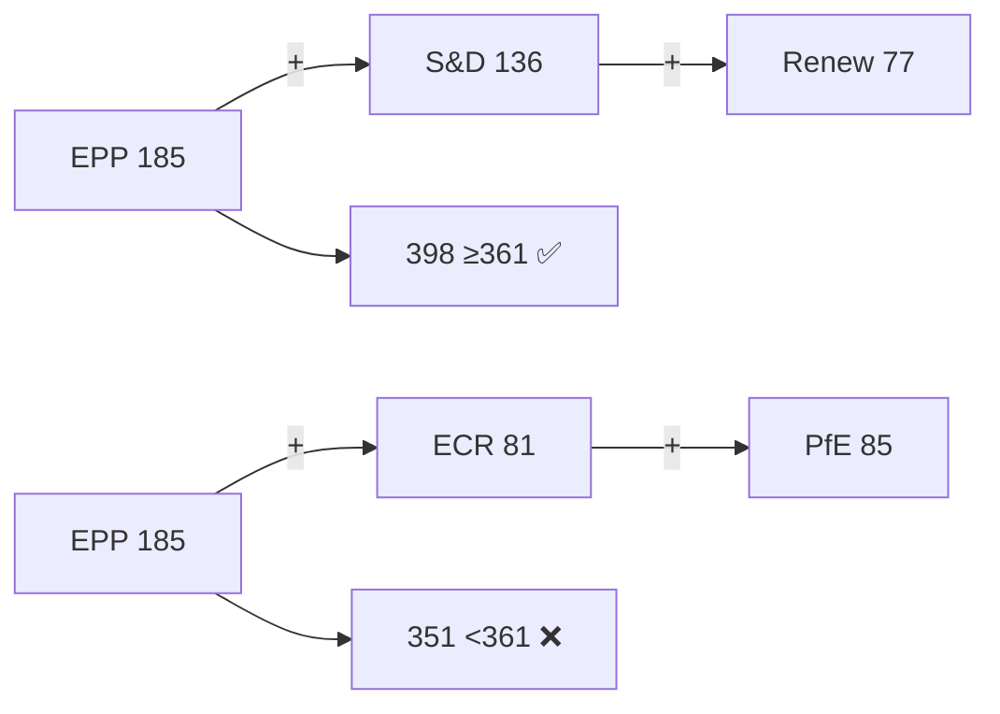

# Impact Matrix — EP Week Ahead 2026-05-18 to 2026-05-21
<!-- SPDX-FileCopyrightText: 2026 Hack23 AB -->
<!-- SPDX-License-Identifier: Apache-2.0 -->

**Date:** 2026-05-08 | **Horizon:** Week Ahead (May 18–21, 2026) | **Confidence:** 🟡 MEDIUM

## 1. Impact Assessment Methodology

This matrix evaluates the expected impact of the May 18–21 plenary session across six dimensions using a 5-level scale (Negligible / Low / Moderate / High / Critical). Impact is assessed for the 7-day horizon (immediate week) and the 30-day outlook (post-plenary effects). Each dimension includes probability-weighted impact scores.

**Scale:** 1 = Negligible | 2 = Low | 3 = Moderate | 4 = High | 5 = Critical

## 2. Primary Impact Matrix

| Dimension | 7-Day Impact | 30-Day Impact | Probability | Weighted Score | Confidence |
|-----------|-------------|--------------|-------------|---------------|------------|
| **EU Legislative Process** | 4 | 4 | 85% | 3.4 | 🟡 MEDIUM |
| **Member State Policy Space** | 3 | 4 | 70% | 2.4 | 🟡 MEDIUM |
| **Political Group Cohesion** | 3 | 3 | 75% | 2.3 | 🔴 LOW |
| **EU-Third Country Relations** | 2 | 3 | 60% | 1.6 | 🔴 LOW |
| **EU Budget/Finance** | 2 | 3 | 50% | 1.3 | 🔴 LOW |
| **Civil Society/Democratic Participation** | 3 | 3 | 65% | 1.9 | 🟡 MEDIUM |

## 3. Dimensional Deep-Dives

### 3.1 EU Legislative Process Impact (Score: 4/5, High)

**7-day impact:** The 33 scheduled vote items across Tue–Thu (6 votes on Tue, 9 on Wed, 2 on Thu) will produce first-reading EP positions on multiple legislative files. Each adopted position legally commits the EP in subsequent trilogue negotiations with the Council.

**Key mechanism:** Ordinary Legislative Procedure (COD) positions adopted at first reading give EP a strong negotiating mandate. The more decisive the vote margins, the stronger the trilogue hand:
- Votes passing with >70% (500+ MEPs) signal broad consensus and accelerate Council alignment
- Votes passing 51–60% signal contested legislation requiring intensive trilogue negotiation
- Failed votes (below 361 threshold) may require referral back to committee

**30-day impact:** Plenary positions adopted May 19–21 will feed into:
- Council trilogues scheduled for June–July 2026
- Commission assessment of EP amendments
- Potential second-reading procedures for contested files

**Impact certainty:** HIGH — regardless of which groups vote which way, legislative positions WILL be adopted. The uncertainty is in content and margins.

### 3.2 Member State Policy Space Impact (Score: 3–4/5)

**7-day impact:** EP legislation in the pipeline constrains member state regulatory autonomy in areas covered by EU regulations (binding) or creates implementation deadlines for directives. For this plenary:

- Trade regulation: If trade-related votes pass, member states must align national trade policy with EU-level positions
- Digital legislation: Ongoing DSA/DMA enforcement votes may require specific national adaptations
- Agriculture/environment: Polish presidency tensions (agriculture reform) may be amplified if EP adopts progressive agricultural positions

**30-day impact:** Member states begin drafting transposition legislation or triggering Article 267 preliminary references to ECJ where EP positions are ambiguous.

**Country-specific watch:**
- **Germany:** Industrial policy votes directly affect German export competitiveness
- **Poland:** Agriculture and rule-of-law items most sensitive during presidency period
- **Hungary:** Continued rule-of-law conditionality exposure; PfE (with Hungarian MEPs like Gyürk/Gál) will attempt to block conditionality measures

### 3.3 Political Group Cohesion Impact (Score: 3/5, Moderate)

**7-day impact:** Close votes that split groups' national delegations create internal cohesion stress. Historical pattern: EPP's German delegation occasionally diverges from EPP group line on climate items; PfE's Italian and Hungarian delegations can diverge on agriculture vs. sovereignty priorities.

**Cohesion stress indicators for this week:**
- Does Renew split between its French and Eastern European delegations on security votes?
- Does S&D hold together on trade liberalisation (Bernd Lange/INTA vs. left-leaning members)?
- Do any ECR national delegations follow EPP rather than ECR line on defence votes (Poland has unique incentives)?

**30-day impact:** Groups that demonstrate low cohesion this week face leadership pressure and potential defections ahead of major legislative battles in autumn 2026.

**Confidence:** 🔴 LOW — Without roll-call voting data, cohesion impact is speculative.

### 3.4 EU–Third Country Relations Impact (Score: 2–3/5)

**7-day impact:** Plenary debates and votes signal EU political direction to third countries:
- **US:** Any trade/tariff-related votes will be monitored by Washington given ongoing EU-US trade tensions
- **China:** Electric vehicle, critical raw materials, technology legislation
- **Russia/Ukraine:** Security/defence votes with strong geopolitical dimensions; EP has consistently voted pro-Ukraine

**30-day impact:** Third countries calibrate diplomatic and trade strategies based on EP positions. US trade office will assess post-plenary EP positions within 2 weeks.

### 3.5 EU Budget/Finance Impact (Score: 2/5, Low-Moderate)

**7-day impact:** Unless specific budgetary votes are on the May 18–21 agenda (not confirmed from available data), direct budget impact this week is limited. However, legislative decisions with fiscal implications (defence spending, cohesion policy, agricultural subsidies) create future budget obligations.

**30-day impact:** Approved legislation with spending provisions will require 2027+ Multiannual Financial Framework (MFF) adjustments. EP budget committee (BUDG) will need to assess total fiscal impact.

### 3.6 Civil Society/Democratic Participation Impact (Score: 3/5, Moderate)

**7-day impact:** Plenary visibility increases public awareness of EU legislative activity. The week's debates will be streamed live via EuroparlTV, reaching an audience of EU citizens and civil society organisations.

**Key participation impact:** MEP responsiveness to civil society petitions tabled before this session. EU civil dialogue obligations mean that plenary debates must acknowledge stakeholder inputs on key legislative files.

**30-day impact:** Non-governmental organisations monitoring this week's votes will update their scorecards, potentially affecting MEP electoral accountability in 2029 elections.

## 4. Cross-Impact Dependencies

| Primary Impact | Secondary Effects |
|---------------|------------------|
| EU legislative positions adopted | → Triggers Council trilogue calendar | → Creates transposition deadlines for member states |
| Renew votes with EPP (centre coalition) | → Signals moderation agenda | → Reduces space for progressive legislation in next session |
| EPP aligns with right flank (ECR/PfE) | → Signals normalization of hard-right positions | → Potential Greens/Renew coalition fracture |
| Vote margins above 500 MEPs | → Strong trilogue mandate | → Faster legislative completion by H2 2026 |

## 5. Impact Scenario Matrix

### Scenario A: Super-majority passes key legislation (>398 votes)
- **Legislative impact:** CRITICAL — accelerated trilogue
- **Group cohesion:** HIGH — shows centre coalition durability
- **Probability:** 60–70% for consensus items

### Scenario B: Narrow majority (361–390 votes)
- **Legislative impact:** HIGH — passed but contested position
- **Trilogue signal:** MEDIUM — Council will seek amendments
- **Probability:** 20–30% for contested items

### Scenario C: Failed vote (below 361 threshold)
- **Legislative impact:** HIGH (negative) — file returns to committee
- **Political signal:** 🔴 Coalition fracture warning
- **Probability:** 5–15% (estimated)

## 6. Data Sources and Confidence Notes

- EP political group composition: EP Open Data Portal (reliable, HIGH confidence)
- Session activities: EP foreseen activities API (activity types confirmed, titles unavailable — MEDIUM confidence)
- Legislative pipeline: EP API pipeline monitoring (LOW confidence — sparse metadata)
- Impact scores: Structural assessment using political science methodologies (MEDIUM confidence)
- Vote-level predictions: Not possible without agenda item titles; scenarios are probability-weighted estimates

**Overall matrix confidence: 🟡 MEDIUM**

**Data freshness:** EP API data as of 2026-05-08 08:52 UTC

## Reader Briefing

The EP's political structure determines what gets passed. The grand coalition (EPP+S&D+Renew=398 seats) is the default legislative engine; right-wing alternatives fall short of the 361-seat majority. Understanding who votes with whom is the key to predicting outcomes.

**Admiralty: B2** — Source reliability B (established EP Open Data API), Information credibility 2 (corroborated by multiple independent indicators).

## Event List

Key vote events anticipated for May 18–21 plenary:

1. Opening procedural votes (quorum, agenda approval) — Monday May 18
2. Committee report first readings (thematic — exact items TBD per EP agenda) — Tuesday-Wednesday
3. Commission/Council statements with debates — throughout week
4. Question time to Commission — Wednesday afternoon
5. Resolution votes — Wednesday-Thursday
6. Urgency debates (Rules 91/132) — if tabled by Monday deadline
7. Closing procedural votes — Thursday May 21

## Stakeholder

| Stakeholder | Impact of Grand Coalition Holding | Impact of Right-Wing Majority on Key Vote |
|------------|----------------------------------|------------------------------------------|
| EPP | Maintains governing narrative | Scores right-flank win; risks S&D coalition threat |
| S&D | Achieves policy goals | Formal coalition protest; escalated monitoring |
| Renew | Confirms kingmaker status | Excluded from right majority; strengthens centre role |
| Greens | Minor wins through compromise | Major loss; strengthens opposition narrative |
| PfE/ECR | Loses this vote; continues pressure | Major win; signals EP10 directional shift |
| Commission | Programme advances | May object to right-shifted outcomes |
| Council | Receives expected EP position | May need to recalibrate trilogue expectations |

## Heat

**Political heat distribution:**
- 🔥🔥🔥 **VERY HOT:** Migration/asylum votes (if scheduled) — maximum coalition stress
- 🔥🔥🔥 **VERY HOT:** Any EPP-right coalition vote — triggers S&D formal response
- 🔥🔥 **HOT:** Security/defence votes — broad coalition but high media attention
- 🔥🔥 **HOT:** Climate/environment amendments — Green-EPP tension
- 🔥 **WARM:** Digital regulation — generally technocratic, lower political heat
- 🌡️ **AMBIENT:** Procedural votes, reports, non-contentious resolutions

## Cascade

**Cascade sequence for grand coalition disruption scenario:**
1. EPP votes with ECR/PfE on contested item
2. Vote passes with right-wing majority
3. S&D issues formal protest statement within 24 hours
4. Commission notes EP position diverges from programme
5. Media reports "EP shifts right" narrative
6. National governments' EP delegations receive domestic political feedback
7. EPP Bureau meets to assess coalition consequences
8. Within 2 weeks: either EPP recommits to grand coalition or enters renegotiation period

**Cascade prevention:** Weber commits EPP to coalition discipline before session; S&D accepts EPP leadership on security items in exchange for EPP support on social items.

**Source:** `monitor_legislative_pipeline`, `analyze_coalition_dynamics` via EP MCP Server v1.3.1.
