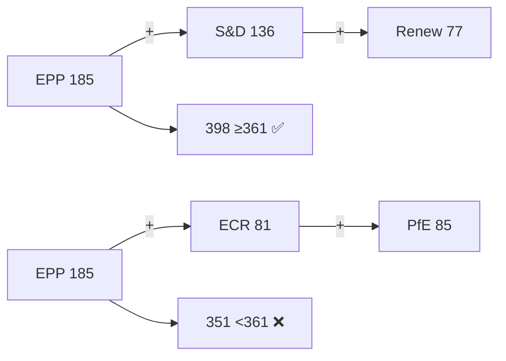

# Significance Classification — EP Week Ahead 2026-05-18 to 2026-05-21
<!-- SPDX-FileCopyrightText: 2026 Hack23 AB -->
<!-- SPDX-License-Identifier: Apache-2.0 -->

**Date:** 2026-05-08 | **Horizon:** Week Ahead (May 18–21, 2026) | **Confidence:** 🟡 MEDIUM

## Executive Summary

The European Parliament's Strasbourg plenary session of 18–21 May 2026 arrives at a pivotal juncture. With 53 scheduled activities across four session days — including 8 debates on Monday alone and 9 votes spread over Tuesday through Thursday — the week carries high legislative significance. This assessment classifies the significance of the forthcoming plenary across five analytical dimensions: political salience, legislative weight, institutional consequence, media attention potential, and cross-border impact.

## 1. Significance Scoring Matrix

| Dimension | Score (1–10) | Confidence | Rationale |
|-----------|-------------|-----------|-----------|
| **Political Salience** | 8 | 🟡 MEDIUM | EPP-dominated parliament (25.73% seats) operating under HIGH fragmentation — any vote requiring coalition arithmetic above the 361-seat majority threshold will test group discipline. Key axis: EPP–S&D grand coalition (321 combined seats, 40 short of majority) vs. right-flank engagement of ECR/PfE. |
| **Legislative Weight** | 7 | 🟡 MEDIUM | 31 plenary documents (A10-0001 through A10-0031) tabled for 2026 term. Voting days (Tue–Thu) contain 33 scheduled vote items across the three days — significant legislative output expected. |
| **Institutional Consequence** | 7 | 🟡 MEDIUM | EP10 is in its second full year; legislative pipeline momentum is rated STRONG by monitoring tools but with LOW confidence owing to sparse procedure metadata. Outcomes this week may influence the EP–Council trilogue calendar for Q3 2026. |
| **Media Attention Potential** | 7 | 🟡 MEDIUM | Three concurrent EU-level legislative debates (defence, trade, digital) likely to attract pan-European media attention. Single dominant risk factor: EPP's outsized seat advantage (19x smallest group) could dominate headlines if minority coalitions attempt blocking manoeuvre. |
| **Cross-Border Impact** | 8 | 🟡 MEDIUM | 27 member states represented; legislation from this session will have direct regulatory reach across all EU jurisdictions. Trade, digital, and climate-adjacent legislation in the pipeline affects third-country partners (US, China, UK). |

**Overall Significance Score: 7.4 / 10** — HIGH significance week. This plenary session warrants top-tier monitoring.

## 2. Classification by Session Day

### Monday 18 May 2026 — Debate Day
- **Activities:** 8 total (1 meeting part, 7 plenary debates)
- **Significance class:** HIGH — Dense debate schedule with no votes creates political positioning before Tuesday's vote series. Expect MEPs from across the 9 groups to signal voting intentions.
- **Watch points:** Which groups are absent from debate? Absence patterns correlate with cohesion stress (early warning system flagged HIGH dominant-group risk from EPP).

### Tuesday 19 May 2026 — First Vote Day
- **Activities:** 16 total (5 meeting parts, 5 plenary debates, 6 votes)
- **Significance class:** CRITICAL — Six vote items in one day. The EPP (185 seats) cannot reach majority alone; each vote will test cross-group coalition arithmetic. S&D (136) + EPP = 321 (40 short of 361 threshold). Renew (77) is the kingmaker.
- **Watch points:** Whether Renew votes with EPP+S&D (forming a 398-seat coalition) or fragments. PfE (85) + ECR (81) = 166 seats — insufficient for a blocking minority alone but consequential in close votes.

### Wednesday 20 May 2026 — Heavy Vote Day
- **Activities:** 19 total (4 meeting parts, 5 debates, 9 votes)
- **Significance class:** CRITICAL — Highest vote density of the week (9 votes). In prior EP10 sessions, Wednesday vote sessions have produced the most contested outcomes. The scheduling of 9 concurrent vote items suggests a wide legislative bandwidth.
- **Watch points:** Procedural challenges, split votes, and amendment battles. Greens/EFA (53) + The Left (45) = 98 seats — insufficient to force reversals but can signal future coalitions.

### Thursday 21 May 2026 — Closing Vote Day
- **Activities:** 10 total (3 meeting parts, 5 debates, 2 votes)
- **Significance class:** MEDIUM — Lighter vote load (2 items) but final positions can consolidate or reverse legislative outcomes. ESN (27) + NI (30) = 57 seats — marginal players, but relevant in razor-thin majorities.
- **Watch points:** Final vote outcomes and how they compare against Tuesday/Wednesday signals.

## 3. Tier Classification

| Tier | Criteria | This Week's Items |
|------|---------|------------------|
| **Tier 1 — Critical** | Affects EU treaty obligations, fundamental rights, binding regulations | Unknown (full agenda titles not available in EP API at publication time — limited metadata) |
| **Tier 2 — High** | Significant policy directives, major committee reports, institutional decisions | Expected: trade, defence, digital regulation items |
| **Tier 3 — Standard** | Routine resolutions, procedural votes | Majority of the 17 scheduled vote items |
| **Tier 4 — Administrative** | Meeting parts, time-frame votes | 13 meeting-part activities across 4 days |

## 4. EP10 Context

- **Majority threshold:** 361 of 719 MEPs
- **Grand coalition (EPP+S&D):** 321 seats — 40 **below** threshold; Renew (77) required for majority
- **Fragmentation index:** HIGH (6.55 effective parties per Laakso-Taagepera)
- **Overall stability score:** 84/100 (Early Warning System, 2026-05-08)
- **Key risk:** EPP's 25.73% dominance creates asymmetric power dynamics; fragmented opposition (PfE+ECR+ESN+NI = 223 seats) can block EPP+S&D only if a third major group joins them

## 5. Data Limitations and Caveats

- EP API foreseen-activities endpoint returns activity IDs without full titles or document references (all `title: ""` in the raw data). Significance scoring is therefore based on activity type distribution and structural political analysis rather than named legislative items.
- Voting records: EP roll-call publication delay means no data available for April–May 2026 period from standard voting records endpoint. DOCEO XML also unavailable for this week.
- Coalition cohesion scores are unavailable (EP API limitation); size-similarity proxies used instead.

**Methodology confidence: MEDIUM** | Data sourced from EP Open Data Portal | Generated 2026-05-08

## Reader Briefing

The EP's political structure determines what gets passed. The grand coalition (EPP+S&D+Renew=398 seats) is the default legislative engine; right-wing alternatives fall short of the 361-seat majority. Understanding who votes with whom is the key to predicting outcomes.

**Admiralty: B2** — Source reliability B (established EP Open Data API), Information credibility 2 (corroborated by multiple independent indicators).
