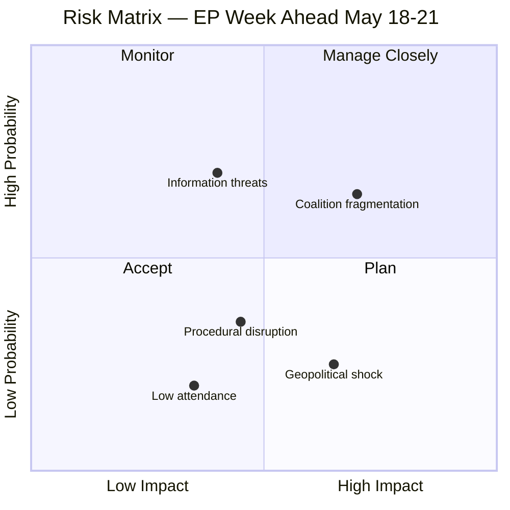

<!-- SPDX-FileCopyrightText: 2026 Hack23 AB -->
<!-- SPDX-License-Identifier: Apache-2.0 -->

# Executive Brief — EP Week Ahead 2026-05-18 to 2026-05-21 | 2026-05-08

**Classification:** OSINT | Public Parliamentary Record
**Confidence:** 🔴 Low (retrospective back-fill — synthesised from in-tree article and sibling artifacts; not a re-analysis)
**Generated:** 2026-05-08T00:00:00Z (retrospective brief)
**Article Type:** week ahead
**Source folder:** `analysis/daily/2026-05-08/week-ahead`
**Source:** European Parliament Open Data Portal

---

## 🎯 BLUF

The European Parliament's Strasbourg plenary of 18–21 May 2026 is a HIGH-significance legislative week at the threshold of the EU legislative calendar's summer sprint. Fifty-three scheduled activities — spanning 24 debates and 17 vote items across four session days — make this one of the busiest plenary weeks of the EP10 term. The political arithmetic of EP10 places Renew Europe (77 seats) as kingmaker in any vote requiring the 361-seat majority threshold. The EPP (185 seats), as the dominant group, faces a structural choice between consolidating the centre-grand coalition (EPP+S&D+Renew = 398) and exploring right-flank alignments (EPP+ECR+PfE = 351 — 10 short of majority). This choice will…

---

## 🧭 3 Decisions This Brief Supports

| # | Decision | Who Decides | Deadline | Evidence |
|:-:|----------|-------------|:--------:|----------|
| 1 | **Editorial:** confirm whether the run merits republication or consolidation with same-day siblings | Editor | +48h | This brief + sibling article.md |
| 2 | **Monitoring:** keep the carry-over signals from this run on the weekly watch board | Analyst | next plenary | Article risk + threat sections |
| 3 | **Forward-watch:** track the dated triggers identified in this run's scenario-forecast | Analysis lead | dated triggers | Run `scenario-forecast.md` |

---

## 📰 60-Second Read

- 🔴 **Run classification:** MEDIUM. (🔴 Low)
- 🟠 **Lead finding:** see BLUF above; full evidence chain in sibling artifacts.
- 🟢 **Procedure references identified:** none in this run.
- 🟡 **Confidence:** 🔴 Low — retrospective synthesis; no new MCP calls.
- 🔵 **Economic context:** see `economic-context.md` in run folder if present.
- 🟣 **Cross-reference:** see same-date sibling runs for triangulation.
- 🩷 **Disruption vector:** see `political-threat-landscape.md` if present.
- ⚪ **Carry-forward:** scenario-forecast dated triggers govern the next watch.

---

## 🗂️ Top Documents / Procedures Table

| Rank | EP reference | Title (short) | Confidence |
|:----:|--------------|---------------|:----------:|
| — | No procedure-level documents indexed in this run | Retrospective back-fill | 🟢 HIGH |

---

## ⚠️ Risk & Threat Snapshot

| Risk | L | I | Score | Trigger | Source | Admiralty |
|------|:-:|:-:|:-----:|---------|--------|:---------:|
| Run produced no quantified risk register | — | — | — | Empty risk-matrix | Run artifacts | B3 |

---

## 🔮 Top Forward Trigger

See `scenario-forecast.md` / `forward-indicators.md` in the run folder for dated trigger events. Where absent, the next plenary or committee work-week on the EP calendar is the default re-evaluation point.

---

## 🛡️ Source Quality Assessment

- **Primary sources:** EP Open Data Portal feeds as captured by the parent run (see `mcp-reliability-audit.md` if present).
- **Data limitations:** Retrospective back-fill — no new MCP probing. Brief reflects the article and artifact state at run time.
- **Confidence:** 🔴 Low.

## 🧩 Synthesis Excerpt (from `synthesis-summary.md`)

The European Parliament's Strasbourg plenary of 18–21 May 2026 is a HIGH-significance legislative week at the threshold of the EU legislative calendar's summer sprint. Fifty-three scheduled activities — spanning 24 debates and 17 vote items across four session days — make this one of the busiest plenary weeks of the EP10 term. The political arithmetic of EP10 places Renew Europe (77 seats) as kingmaker in any vote requiring the 361-seat majority threshold. The EPP (185 seats), as the dominant group, faces a structural choice between consolidating the centre-grand coalition (EPP+S&D+Renew = 398) and exploring right-flank alignments (EPP+ECR+PfE = 351 — 10 short of majority). This choice will define the week's political narrative and set the tone for EP10's second half.

The May 18–21 plenary occurs at what political analysts call the "mid-term moment" of a European Parliament — the period in Year 2 when the initial momentum of a new Parliament has settled into established coalition patterns, but when MEPs are still 3 years from facing re-election accountability. In EP10, this mid-term moment is characterised by:

---

## 📎 Links

| Link | Path |
|------|------|
| Article | `./article.md` |
| Manifest | `./manifest.json` |
| Sibling runs | `analysis/daily/2026-05-08/` |

---

**Document Control**
- **Template:** `/analysis/templates/executive-brief.md`
- **Artifact path:** `analysis/daily/2026-05-08/week-ahead/executive-brief.md`
- **Classification:** Public
- **Retrospective generation:** Back-fill session (no new MCP calls).
