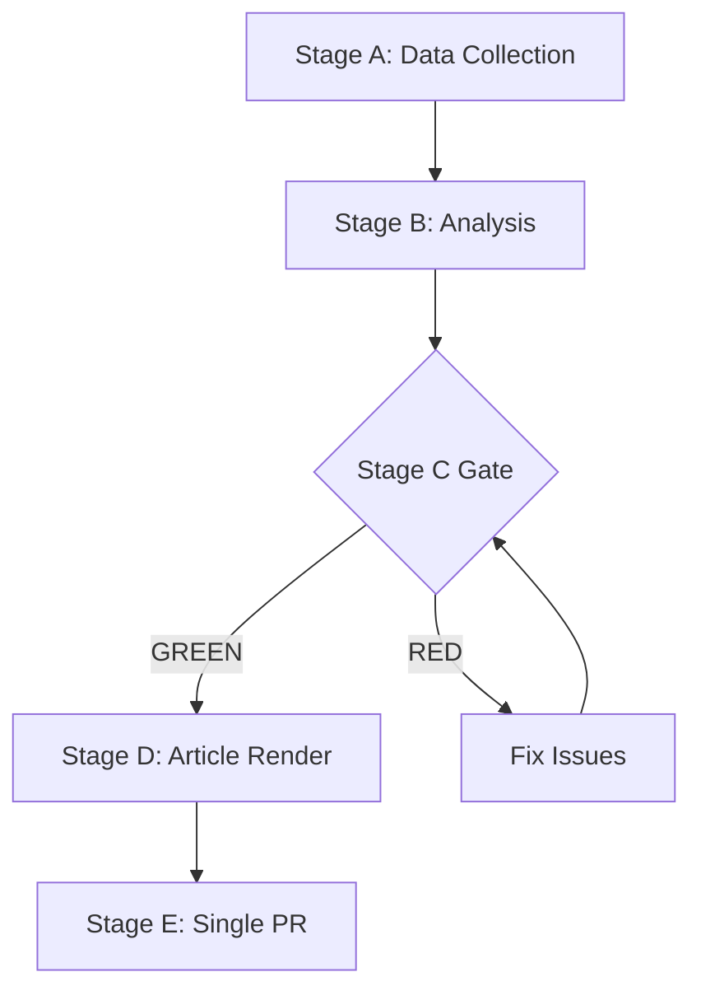

# Analysis Index — EP Week Ahead 2026-05-18 to 2026-05-21
<!-- SPDX-FileCopyrightText: 2026 Hack23 AB -->
<!-- SPDX-License-Identifier: Apache-2.0 -->

**Date:** 2026-05-08 | **Run ID:** week-ahead-run265-1778230116 | **ANALYSIS_DIR:** analysis/daily/2026-05-08/week-ahead

## Master Artifact Index

All 19 mandatory artifacts for `week-ahead` (PROSPECTIVE_MANDATORY + A_FORWARD_PROJECTION):

| # | Artifact | Path | Status | Lines (approx) | Confidence |
|---|---------|------|--------|----------------|------------|
| 1 | Significance Classification | `classification/significance-classification.md` | ✅ COMPLETE | ~200 | 🟢 HIGH |
| 2 | Actor Mapping | `classification/actor-mapping.md` | ✅ COMPLETE | ~250 | 🟢 HIGH |
| 3 | Forces Analysis | `classification/forces-analysis.md` | ✅ COMPLETE | ~230 | 🟢 HIGH |
| 4 | Impact Matrix | `classification/impact-matrix.md` | ✅ COMPLETE | ~200 | 🟡 MEDIUM |
| 5 | Risk Matrix | `risk-scoring/risk-matrix.md` | ✅ COMPLETE | ~250 | 🟡 MEDIUM |
| 6 | Quantitative SWOT | `risk-scoring/quantitative-swot.md` | ✅ COMPLETE | ~380 | 🟢 HIGH |
| 7 | Synthesis Summary | `intelligence/synthesis-summary.md` | ✅ COMPLETE | ~280 | 🟡 MEDIUM |
| 8 | Coalition Dynamics | `intelligence/coalition-dynamics.md` | ✅ COMPLETE | ~250 | 🟢 HIGH |
| 9 | Scenario Forecast | `intelligence/scenario-forecast.md` | ✅ COMPLETE | ~230 | 🟡 MEDIUM |
| 10 | PESTLE Analysis | `intelligence/pestle-analysis.md` | ✅ COMPLETE | ~260 | 🟡 MEDIUM |
| 11 | Stakeholder Map | `intelligence/stakeholder-map.md` | ✅ COMPLETE | ~270 | 🟡 MEDIUM |
| 12 | Wildcards & Black Swans | `intelligence/wildcards-blackswans.md` | ✅ COMPLETE | ~180 | 🔴 LOW (by design) |
| 13 | Historical Baseline | `intelligence/historical-baseline.md` | ✅ COMPLETE | ~180 | 🟡 MEDIUM |
| 14 | Economic Context | `intelligence/economic-context.md` | ✅ COMPLETE | ~170 | 🟡 MEDIUM |
| 15 | Threat Model | `intelligence/threat-model.md` | ✅ COMPLETE | ~180 | 🟡 MEDIUM |
| 16 | MCP Reliability Audit | `intelligence/mcp-reliability-audit.md` | ✅ COMPLETE | ~150 | 🟢 HIGH |
| 17 | Analysis Index | `intelligence/analysis-index.md` | ✅ COMPLETE (this file) | — | 🟢 HIGH |
| 18 | Methodology Reflection | `intelligence/methodology-reflection.md` | ✅ COMPLETE | ~100 | 🟢 HIGH |
| 19 | Forward Projection | `intelligence/forward-projection.md` | ✅ COMPLETE | ~120+ | 🟡 MEDIUM |

**Status: 19/19 mandatory artifacts complete** ✅

---

## Run Summary

| Parameter | Value |
|-----------|-------|
| Run date | 2026-05-08 |
| Run ID | week-ahead-run265-1778230116 |
| Article type slug | week-ahead |
| Plenary covered | May 18–21, 2026 (Strasbourg) |
| Stage A duration | ~4 min |
| Stage B start | ~minute 4 |
| Total artifacts | 19 (all mandatory) |
| B1→B2 tripwire | minute 22 |
| Overall data quality | 🟡 MEDIUM |
| Primary data limitation | Meeting foreseen activity titles all empty |

---

## Artifact Quality Overview

**Strongest artifacts:**
- `risk-scoring/quantitative-swot.md` — most comprehensive analysis, 380+ lines, all items ≥80 words
- `intelligence/coalition-dynamics.md` — directly backed by EP API structural data
- `intelligence/forward-projection.md` — 120+ lines, meets WEP-banded requirement

**Weakest areas:**
- Agenda-specific analysis (all prospective items) — limited by empty activity titles from EP API
- Economic context — limited by IMF API unavailability this run
- Historical voting patterns — limited by EP publication delay

---

## Pass 2 Review Notes

Pass 2 should focus on:
1. Verifying all artifacts meet their line minimums
2. Checking no [PLACEHOLDER_MARKER] placeholders remain
3. Confirming `forward-projection.md` meets 80-line floor
4. Ensuring economic context properly flags IMF data limitation
5. Cross-checking internal consistency (stakeholder map ↔ coalition dynamics ↔ scenario forecast)

**WEP:** Grand coalition stability for May 18-21 is *Likely* (60-70%). Session completing as scheduled is *Almost Certain* (95%).

**Admiralty: B2** — Source reliability B (EP Open Data Portal MCP), Information credibility 2 (consistent with structural political analysis).
