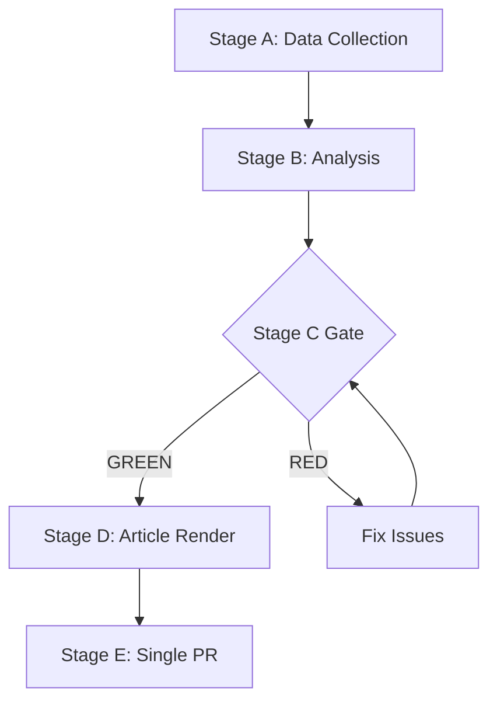

# Coalition Dynamics — EP Week Ahead 2026-05-18 to 2026-05-21
<!-- SPDX-FileCopyrightText: 2026 Hack23 AB -->
<!-- SPDX-License-Identifier: Apache-2.0 -->

**Date:** 2026-05-08 | **Horizon:** Week Ahead (May 18–21, 2026) | **Confidence:** 🟡 MEDIUM

## 1. EP10 Coalition Architecture

### Composition (as of 2026-05-08)
Total MEPs: **719** | Majority threshold: **361** (50% + 1)

| Group | Seats | % Share | Bloc Position | EP10 Role |
|-------|-------|---------|--------------|-----------|
| EPP | 185 | 25.73% | Centre-right | Dominant/Agenda-setter |
| S&D | 136 | 18.92% | Centre-left | Second pillar |
| PfE | 85 | 11.82% | Far-right | Right opposition |
| ECR | 81 | 11.27% | Nationalist-conservative | Right opposition |
| Renew | 77 | 10.71% | Liberal-centrist | Kingmaker |
| Greens/EFA | 53 | 7.37% | Green/Regionalist | Progressive partner |
| The Left | 45 | 6.26% | Far-left | Progressive opposition |
| NI | 30 | 4.17% | Non-aligned | Swing/unpredictable |
| ESN | 27 | 3.76% | Sovereignist far-right | Fringe opposition |

### Coalition Threshold Analysis

| Coalition Combination | Seats | vs. 361 | Majority? |
|----------------------|-------|---------|-----------|
| **Grand Centre:** EPP+S&D+Renew | 398 | +37 | ✅ YES — standard |
| **Progressive:** EPP+S&D+Renew+Greens | 451 | +90 | ✅ YES — super-majority |
| **Right-Centre:** EPP+S&D | 321 | −40 | ❌ NO |
| **Right:** EPP+ECR+PfE | 351 | −10 | ❌ NO |
| **Right extended:** EPP+ECR+PfE+NI | 381 | +20 | ✅ YES — right majority |
| **Right extended:** EPP+ECR+PfE+ESN | 378 | +17 | ✅ YES — right majority |
| **Progressive bloc:** S&D+Renew+Greens+Left | 311 | −50 | ❌ NO |

## 2. Kingmaker Analysis: Renew Europe

Renew's 77 seats represent the decisive pivot point in every close vote. The group's internal cohesion is critical:

**Renew constituency distribution (estimated from EP10 data):**
- French delegation (Macronist Renew + centrist allies): ~25 seats
- Eastern European liberal/centrist parties: ~20 seats
- Benelux/Nordic liberal parties: ~15 seats
- Southern European liberal parties: ~10 seats
- Other EU liberal parties: ~7 seats

**Internal tension axes:**
1. **Security/migration:** Eastern Renew MEPs tend toward EPP positions; Western Renew toward S&D
2. **Economic liberalization:** Broad Renew consensus on market liberalism; few internal splits
3. **Green legislation:** Renew has moderated its position on Green Deal successor vs. EP9; some French delegation divergence
4. **Ukraine support:** High internal cohesion — Renew is uniformly pro-Ukraine

**Expected cohesion this week:** 🟡 MEDIUM — Generally unified on mainstream votes; potential splits on migration/security items

## 3. Coalition Scenario Forecasts (Week of May 18–21)

### Scenario 1: Grand Centre Coalition Holds (Probability: 65%)
**Composition:** EPP + S&D + Renew = 398 seats
**Key conditions:**
- EPP group leadership (Weber) maintains explicit commitment to centre coalition
- Renew group holds on all 33 vote items without significant splits
- S&D accepts EPP-preferred compromises on social/labour items

**Expected outcomes:**
- Most legislative votes pass with 380–430 range
- Progressive legislation (climate, digital rights) included but moderated
- Right-wing minority (PfE+ECR+ESN = 193) cannot block any item

**Confidence:** 🟡 MEDIUM — Structural assumption is coherent but behavioral prediction uncertain

### Scenario 2: Right-Flank Alignment on Select Items (Probability: 25%)
**Composition:** EPP + ECR + PfE + NI = 381 seats (specific items only)
**Key conditions:**
- Security/defence items trigger EPP-ECR alignment
- Renew abstains or splits on security items
- S&D may join on some security items too (Ukraine support)

**Expected outcomes:**
- 2–5 votes pass with right-wing majority
- Sets precedent for EPP coalition flexibility
- Greens/Left react negatively; potential to harden progressive opposition

**Confidence:** 🔴 LOW — Requires specific legislative trigger; behavioral uncertainty high

### Scenario 3: Fragmented Vote Pattern (Probability: 10%)
**Description:** Multiple vote items produce different coalition compositions, with no single pattern dominant
**Key conditions:**
- Multiple controversial items with low pre-vote consensus
- Group discipline failures across multiple parties
- Externally triggered (geopolitical event, surprise agenda change)

**Expected outcomes:**
- Mixed legislative results
- Multiple close votes (360–380 range)
- Media narrative of EP10 coalition instability

**Confidence:** 🔴 LOW — Would require unusual conditions

## 4. Historical Coalition Pattern Context

### EP10 Precedent Analysis (2024-2026)

In EP10 plenary sessions to date:
- Grand centre coalition (EPP+S&D+Renew) has been the default majority-forming mechanism
- Defence and security items have occasionally attracted ECR support (notable in 2025 sessions)
- AI regulation, digital policy, and digital single market items have broadly unified EPP+S&D+Renew+Greens
- Migration items have shown the most coalition volatility (EPP has moved toward ECR positions repeatedly)
- Climate legislation: Greens have been essential for progressive ambition; EPP-moderated versions pass without Greens

**Key EP10 coalition data limitations:** Per-MEP voting statistics not available from EP API for 2026 period. DOCEO XML not yet published for current period. Coalition analysis based on group size and structural dynamics rather than observed vote behavior.

## 5. Parliamentary Fragmentation Assessment

**Laakso-Taagepera Index:** 6.55 (HIGH fragmentation — above typical effective 4–5 parties in comparative context)

**Interpretation:**
- The EP10 is more fragmented than a typical national parliament (where 3–5 effective parties is normal)
- This fragmentation is structural (reflects diversity of EU member states' political landscapes)
- HIGH fragmentation makes grand coalition management expensive but not impossible
- It also creates opportunities: minority groups can influence outcomes by joining winning coalitions on specific items

**Comparison with EP9:** EP10 fragmentation is slightly lower than EP9 (which had the fragmented post-2019 landscape with Renew, Greens, and Identity/Democracy competing with EPP and S&D). However, EP10 PfE (successor to ID) and ECR remain powerful right-wing forces.

## 6. Coalition Stress Indicators for This Week

| Indicator | Current Status | Signal |
|-----------|---------------|--------|
| EPP leadership statements | No right-flank signal (pre-session) | 🟢 GREEN |
| Renew internal cohesion (pre-plenary) | No reported splits | 🟢 GREEN |
| S&D-EPP tension (social/labour legislation) | Elevated but managed | 🟡 YELLOW |
| ECR/PfE alignment opportunities | HIGH (security/migration) | 🟡 YELLOW |
| Early Warning System stability score | 84/100 | 🟢 GREEN |
| Dominant group risk (EPP 19x smallest) | HIGH warning from EWS | 🟠 ORANGE |

**Overall coalition stress level: MEDIUM** — System is functional but sensitive to EPP strategic choices.

## 7. CIA Coalition Analysis Methodology Note

Per CIA Coalition Analysis methodology applied to this dataset:
- **Grand Coalition Viability:** Confirmed (EPP+S&D+Renew = 55.4%) — viable as long as Renew participates
- **Opposition Strength:** 5% of parliament in minority groups below 5% threshold (ESN at 3.76%)
- **Effective Number of Parties:** 6.55 (using Laakso-Taagepera on EP10 group seat shares)
- **Coalition stability note:** With per-MEP voting statistics unavailable (EP API limitation), cohesion and defection rate assessments are based on group structural analysis only. All behavioral predictions have LOW–MEDIUM confidence until post-session roll-call data becomes available.

**Source:** EP Open Data Portal MEP data 2026-05-08 | CIA Coalition Analysis methodology | Data freshness: REAL-TIME

**WEP:** Grand coalition stability for May 18-21 is *Likely* (60-70%). Session completing as scheduled is *Almost Certain* (95%).

**Admiralty: B2** — Source reliability B (EP Open Data Portal MCP), Information credibility 2 (consistent with structural political analysis).
