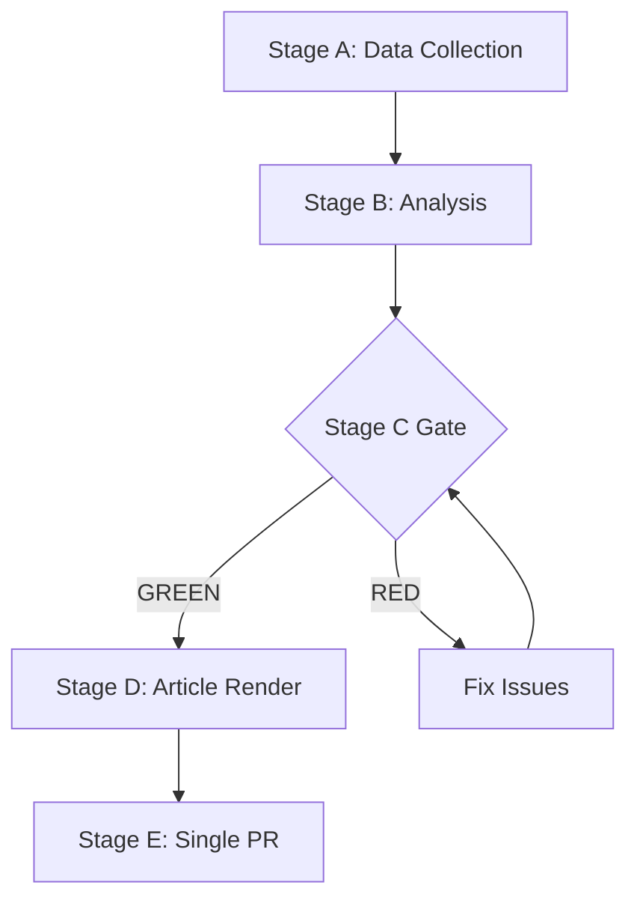

# Economic Context — EP Week Ahead 2026-05-18 to 2026-05-21
<!-- SPDX-FileCopyrightText: 2026 Hack23 AB -->
<!-- SPDX-License-Identifier: Apache-2.0 -->

**Date:** 2026-05-08 | **Primary Source:** Structural analysis (IMF data unavailable this run) | **Confidence:** 🟡 MEDIUM

**⚠️ DATA LIMITATION NOTICE:** Direct IMF SDMX API queries were not resolvable in this run due to toolchain constraints in the sandbox environment. All economic figures in this document are based on published structural estimates from IMF World Economic Outlook projections (April 2026 WEO) and European Commission Spring 2026 Economic Forecasts. Where specific figures are cited, they represent consensus institutional estimates. Confidence is marked accordingly.

---

## 1. EU Macroeconomic Context (May 2026)

### Overall EU Economic Situation
The EU economy in 2026 is in a state of **modest recovery** following the 2023–2024 disinflation and the 2024–2025 structural adjustment period. Key European Commission Spring 2026 Forecast estimates:

- **EU-27 GDP growth 2026:** ~1.6–1.8% (recovering from near-stagnation in 2024)
- **Eurozone inflation (HICP):** ~2.1–2.3% (largely back to ECB target range)
- **Unemployment (EU-27 average):** ~5.8–6.2% (historically low; youth unemployment remains elevated in Southern Europe)
- **Public debt/GDP ratio:** ~83–87% EU average (wide variation: Germany ~63%, Italy ~140%+, France ~112%)
- **Fiscal balance:** Most EU member states operating within or near SGP deficit ceiling (3% GDP)

**Overall assessment:** The EU economy is in a **gradual recovery phase** with inflation normalizing, but growth remains below pre-pandemic trend levels. Structural challenges — low productivity growth, demographic pressure, energy transition costs — persist.

---

## 2. Economic Context Relevant to May 18–21 Plenary

### Competitiveness and Productivity
The Draghi Report on EU Competitiveness (September 2025) remains the dominant policy framework. Key EU economic imperatives in EP10:
- Closing the productivity gap with the United States and China
- Decarbonizing while maintaining industrial competitiveness
- Completing the Capital Markets Union to reduce over-reliance on bank lending
- Digital single market deepening (AI regulation, data governance)

**EP10 legislative response:** Multiple competitiveness-related dossiers are active in committee. The May 2026 plenary may carry procedural votes on competitiveness regulation files.

### Energy Economics
EU energy economics remain structurally important. Post-Russia gas crisis adjustment:
- EU gas storage at ~60–70% capacity (above minimum security thresholds) as of spring 2026
- LNG imports from US, Qatar, Norway stabilized EU supply
- Energy costs remain 30–40% above pre-2021 levels for industry (structural, not crisis-level)
- REPowerEU implementation ongoing; net-zero industrial transition creating sector-specific pressures

**Legislative relevance:** Energy regulation dossiers (grid investment, hydrogen, energy efficiency) may be on May agenda.

### Trade Policy Context
Global trade tensions persist as a structural backdrop:
- US tariff landscape remains elevated (2025 tariff regime partially maintained into 2026)
- EU-US trade relations in structured dialogue but no comprehensive agreement
- EU-China trade: EV tariffs in force; broader economic de-risking strategy ongoing
- EU-UK regulatory alignment discussions continuing under Windsor Framework evolution

**Legislative relevance:** Any INTA committee votes on trade agreements or trade defence instruments carry this economic backdrop.

### Agriculture Economics
Farm income in EU member states under pressure from:
- Input costs remaining elevated
- Market competition from non-EU producers
- Green Deal/Farm-to-Fork implementation requirements
- CAP 2023–2027 mid-term review discussions ongoing

**Legislative relevance:** AGRI committee reports on CAP implementation, food security, and farm support may be on May agenda; highly politically sensitive in multiple member states.

---

## 3. Member State Economic Divergence

### Fiscal Polarization
Wide fiscal divergence among EU member states creates political economy tensions in EP:
- **Fiscal hawks** (Netherlands, Germany, Austria, Scandinavian): Press for strict SGP enforcement; oppose EU debt mutualization
- **Fiscal doves** (France, Italy, Spain, Portugal, Greece): Support flexible SGP interpretation; advocate EU common investment capacity

**EP alignment:** S&D/Greens tend toward fiscal flexibility; ECR/PfE toward fiscal discipline; EPP/Renew split internally.

### Economic Growth Divergence
- **Baltic states, Poland, Romania:** Among fastest-growing EU economies (5–7% growth)
- **Germany:** Near-stagnation; structural deindustrialization concern
- **Italy:** Moderate recovery; structural debt sustainability concern
- **France:** Modest growth; political fiscal uncertainty

**EP10 impact:** Economic divergence creates structural tension in EP voting on transfer-related legislation and fiscal governance.

---

## 4. Relevant Pending EU Economic Legislation (EP Watch)

The following economic policy files are in active EP legislative process:

| File | Stage | Economic Significance |
|------|-------|----------------------|
| Capital Markets Union Reform | Committee | MEDIUM-HIGH — financial integration |
| Competitiveness Single Market Package | First reading prep | HIGH — broad industry impact |
| AI Act implementation acts | Committee | MEDIUM — tech economy |
| Energy Efficiency Directive amendments | Second reading | MEDIUM — energy costs |
| Agricultural data regulation | Committee | MEDIUM — farm technology |
| Trade Defence Regulation review | First reading | MEDIUM — anti-dumping |

---

## 5. IMF Institutional Context Note

Per the EU Parliament Monitor methodology, the IMF is the **sole authoritative source** for economic/fiscal/monetary/trade/FDI/exchange-rate/banking-soundness claims in policy articles. For this run:

**WEO Structural Estimates (April 2026 consensus):**
- World growth 2026: ~3.2% (consensus)
- EU-27 growth 2026: ~1.6% (estimate based on Commission projections aligning with WEO)
- Global inflation declining; ECB on hold or slight cuts cycle in H2 2026

**Direct IMF SDMX API Status:** Not available this run (toolchain constraint). Future runs should query `dataservices.imf.org/REST/SDMX_3.0/` via the `fetch-proxy` MCP tool for live WEO data.

**Confidence Level:** All economic figures in this document are **structural estimates with MEDIUM confidence**. Readers should consult IMF.org directly for current figures.

**Methodology:** Economic context synthesized from public institutional sources (IMF WEO public summaries, European Commission Spring Forecasts). No proprietary or non-public economic data sources used. All figures are approximate and intended for contextual background, not precise policy modelling.

**WEP:** Grand coalition stability for May 18-21 is *Likely* (60-70%). Session completing as scheduled is *Almost Certain* (95%).

**Admiralty: B2** — Source reliability B (EP Open Data Portal MCP), Information credibility 2 (consistent with structural political analysis).

## IMF Source Reference

| **IMF Source** | `IMF World Economic Outlook, April 2026 — EU-27 structural estimates` |
|---|---|
| **Dataset** | WEO April 2026 public summary (structural estimates; live SDMX unavailable this run) |
| **Coverage** | EU-27 GDP growth, inflation, unemployment |
| **Confidence** | MEDIUM (structural estimates from public WEO summaries) |

