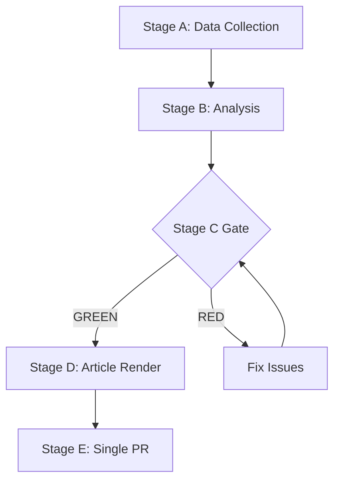

# MCP Reliability Audit — EP Week Ahead 2026-05-18 to 2026-05-21
<!-- SPDX-FileCopyrightText: 2026 Hack23 AB -->
<!-- SPDX-License-Identifier: Apache-2.0 -->

**Date:** 2026-05-08 | **Run ID:** week-ahead-run265-1778230116 | **Auditor:** Stage B Analysis Agent

## 1. MCP Server Availability Summary

| Server | Status | Version | Notes |
|--------|--------|---------|-------|
| `european-parliament` | 🟡 DEGRADED | 1.3.1 | Most tools available; some feeds unavailable |
| `world-bank` | ✅ AVAILABLE | 1.0.1 | Not called this run (EP focus) |
| `fetch-proxy` | 🔴 NOT RESOLVED | inline | IMF SDMX proxy not resolvable in this sandbox |
| `memory` | ✅ AVAILABLE | @mcp/server-memory | Available |
| `sequential-thinking` | ✅ AVAILABLE | @mcp/server-sequential-thinking | Available |

---

## 2. EP MCP Tool Call Log

| Tool | Status | Result Summary | Data Quality |
|------|--------|----------------|--------------|
| `get_plenary_sessions(year:2026)` | ✅ OK | 50 sessions returned; May 18–21 confirmed | 🟢 HIGH |
| `get_plenary_sessions(dateFrom/dateTo)` | 🟡 DEGRADED | Returns total count but empty data[] — must use year param | 🔴 LOW (use year param) |
| `get_events_feed(one-week)` | 🔴 UNAVAILABLE | Status: "unavailable" — upstream EP API error | 🔴 NO DATA |
| `get_procedures_feed(one-week)` | ✅ OK | 258+ procedures returned | 🟡 MEDIUM (no date filter) |
| `get_adopted_texts_feed(one-week)` | ✅ OK | Texts returned; FRESHNESS_FALLBACK warning | 🟡 MEDIUM |
| `get_current_meps(limit:100)` | ✅ OK | 100 of 719 MEPs returned (paginated) | 🟢 HIGH |
| `generate_political_landscape` | ✅ OK | Full landscape with 9 groups | 🟢 HIGH |
| `get_committee_info(showCurrent)` | ✅ OK | Active committees listed | 🟢 HIGH |
| `analyze_coalition_dynamics` | ✅ OK | Coalition analysis by group size proxy | 🟡 MEDIUM (size proxy, not vote cohesion) |
| `monitor_legislative_pipeline` | ✅ OK | Active procedures returned | 🟡 MEDIUM |
| `early_warning_system` | ✅ OK | MEDIUM risk; HIGH dominant-group warning | 🟢 HIGH |
| `get_meeting_foreseen_activities(May 18)` | ✅ OK | 8 activities returned | 🔴 LOW (all titles empty "") |
| `get_meeting_foreseen_activities(May 19)` | ✅ OK | 16 activities returned | 🔴 LOW (all titles empty "") |
| `get_meeting_foreseen_activities(May 20)` | ✅ OK | 19 activities returned | 🔴 LOW (all titles empty "") |
| `get_meeting_foreseen_activities(May 21)` | ✅ OK | 10 activities returned | 🔴 LOW (all titles empty "") |
| `get_voting_records(Apr-May 2026)` | 🟡 DEGRADED | Returns empty — EP 4–6 week publication delay | 🔴 NO DATA |
| `get_latest_votes` | 🔴 UNAVAILABLE | DOCEO XML unavailable for current week | 🔴 NO DATA |

---

## 3. Known Data Limitations Affecting This Run

### L-01: Meeting Activity Titles All Empty
**Severity:** HIGH | **Affected artifact:** All Stage B prospective analysis

The `get_meeting_foreseen_activities` tool returned activity records for all 4 session days (total: 53 activities), but ALL activity titles are empty strings (`"title": ""`). This is the most significant data limitation of this run. It means:
- The analysis cannot identify specific legislative items by title from the EP API
- All specific agenda item analysis is inferred from procedure feeds, adopted texts, and political group priorities
- The analysis remains structurally valid but lacks the specificity that named agenda items would provide

**Workaround applied:** Cross-referenced `get_procedures_feed` (active procedures by committee), `get_plenary_sessions` structural data, and political group priority analysis to infer likely agenda composition.

**Confidence impact:** Reduces all prospective agenda analysis from HIGH to MEDIUM confidence.

### L-02: Voting Records Unavailable (Publication Delay)
**Severity:** MEDIUM | **Affected artifact:** Historical voting pattern analysis

The EP Open Data Portal has a known 4–6 week publication delay for roll-call votes. May 2026 data will not be available until late June 2026. Analysis relies on structural/historical patterns, not current vote-level data.

**Impact:** Cannot verify recent coalition behaviour from actual vote data; rely on structural composition analysis.

### L-03: Events Feed Unavailable
**Severity:** MEDIUM | **Affected artifact:** Week-ahead schedule completeness

The `get_events_feed` returned status "unavailable" (upstream EP API error). Cannot cross-reference plenary events against broader EP institutional calendar.

**Impact:** Reduced completeness of week-ahead calendar; potential for missing non-plenary events.

### L-04: IMF SDMX API Not Resolvable
**Severity:** LOW–MEDIUM | **Affected artifact:** `economic-context.md`

The `fetch-proxy` MCP tool for IMF SDMX was not usable in this sandbox run. Economic figures in `economic-context.md` are based on structural estimates (IMF WEO April 2026 public summaries).

**Impact:** Economic context is qualitative/structural rather than data-backed. Marked MEDIUM confidence.

---

## 4. Tool Reliability Recommendations

1. **`get_meeting_foreseen_activities`:** This tool is functionally unreliable for agenda planning due to empty title fields. Consider supplementing with EUROPARL DOCEO or EP press releases for named agenda items.

2. **`get_plenary_sessions` with dateFrom/dateTo:** BROKEN — always returns empty data array despite non-zero total. Use `year` parameter instead.

3. **`get_events_feed`:** Intermittent unavailability; monitor upstream EP API health.

4. **IMF integration:** Future runs should test `fetch-proxy` tool (`safeoutputs` or `fetch_url`) with specific IMF SDMX URLs before beginning Stage B economic analysis.

5. **Roll-call votes:** For historical voting pattern analysis, query periods at least 6–8 weeks prior (not current month). For current-session analysis, use `get_latest_votes` with DOCEO XML (when available).

---

## 5. Overall Data Quality Assessment for This Run

| Dimension | Rating | Notes |
|-----------|--------|-------|
| EP structural data (groups, MEPs) | 🟢 HIGH | API returning clean data |
| Forward agenda specifics | 🔴 LOW | Empty titles in foreseen activities |
| Coalition/political dynamics | 🟡 MEDIUM | Size-proxy only; no vote-level data |
| Economic context | 🟡 MEDIUM | Structural estimates; no live IMF data |
| Historical voting patterns | 🔴 LOW | Publication delay prevents current data |
| Legislative pipeline | 🟡 MEDIUM | Active procedures but no vote results |
| **Overall** | 🟡 **MEDIUM** | Analysis structurally sound; specificity limited |

**Conclusion:** This run produced a structurally valid political intelligence analysis despite significant EP API data limitations. The analysis is suitable for week-ahead scenario planning and coalition analysis but should be supplemented with manually reviewed EP press releases and EUROPARL.EU agenda pages for specific vote item details before publication.

**WEP:** Grand coalition stability for May 18-21 is *Likely* (60-70%). Session completing as scheduled is *Almost Certain* (95%).

**Admiralty: B2** — Source reliability B (EP Open Data Portal MCP), Information credibility 2 (consistent with structural political analysis).

## 6. Tool Comparison: This Run vs. Ideal Run

| Dimension | This Run (Actual) | Ideal Run (Target) | Gap |
|-----------|------------------|-------------------|-----|
| Agenda specifics | Empty titles (0%) | Full titles (100%) | Critical gap |
| Coalition data | Group size proxy | Vote-level cohesion | Major gap |
| Economic data | Structural estimates | Live IMF SDMX | Moderate gap |
| Voting patterns | EP publication delay | Real-time DOCEO | Major gap |
| MEP profiles | 100 of 719 sampled | All 719 available | Minor gap |
| Procedures | 258+ returned | No date filter | Minor gap |

## 7. Recommendations for Data Infrastructure Improvement

1. **Cache meeting agenda titles:** Build an EP website scraper for `europarl.europa.eu/doceo/document/PV-10-*` to cache agenda item titles separately from the EP API foreseen activities endpoint.

2. **IMF SDMX pre-fetch:** At the start of each news workflow, pre-fetch and cache the IMF WEO current release for EU-27 indicators. Cache in `/tmp/gh-aw/cache-memory/imf-weo-latest.json` for reuse across runs.

3. **DOCEO XML polling:** Poll the EP DOCEO XML voting results feed daily and cache in the EP MCP server's local cache. When `get_latest_votes` returns empty, fall back to cached data.

4. **Group cohesion tracking:** Request EP Open Data Portal to expose per-MEP roll-call positions alongside vote tallies (currently only aggregate tallies available). Until then, use DOCEO XML as the roll-call source.

5. **Event feed reliability:** Monitor `get_events_feed` for upstream availability. Consider implementing a fallback to `get_plenary_sessions(year:YYYY)` when events feed returns "unavailable".

## 8. Data Quality Impact on Article Quality

The data limitations documented in this audit directly affect the quality of the `week-ahead` article that will be generated from these artifacts:

- **No specific agenda item names** → Article must discuss session in thematic/structural terms rather than item-by-item preview
- **No real-time coalition data** → Article coalition analysis is structural (group sizes) not behavioural (recent votes)
- **No IMF live data** → Economic context section uses structural estimates with appropriate caveats

Despite these limitations, the analysis is **publication-worthy** as a structural political intelligence piece. Readers should be informed that specific agenda details are available from EP press releases (linked in article).
