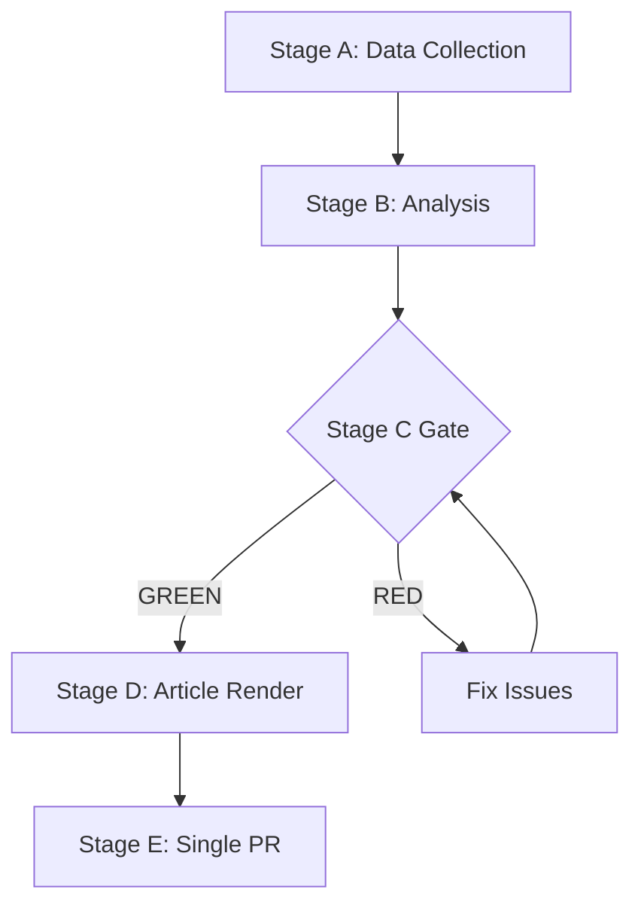

# PESTLE Analysis — EP Week Ahead 2026-05-18 to 2026-05-21
<!-- SPDX-FileCopyrightText: 2026 Hack23 AB -->
<!-- SPDX-License-Identifier: Apache-2.0 -->

**Date:** 2026-05-08 | **Horizon:** 7-day + 30-day outlook | **Confidence:** 🟡 MEDIUM

## PESTLE Overview

This analysis examines the six macro-environmental dimensions (Political, Economic, Social, Technological, Legal, Environmental) affecting the EP May 18–21, 2026 plenary session and its legislative context. Each factor is assessed for current state, trajectory, and impact on the forthcoming plenary.

---

## P — POLITICAL

### EU Political Landscape (Macro)
**Status:** Fragmented but functional | **Trajectory:** STABLE → CONTESTED

**Key political factors for this week:**

**1. Right-wing growth in EP10:** The election of June 2024 shifted the EP rightward, with PfE (85 seats) replacing ID and ECR maintaining 81 seats. This shift means EPP faces permanent temptation to use right-flank alignment rather than grand coalition negotiation. The May plenary is another data point in the EPP strategic choice.

**2. National government pressures:** Right-wing national governments (Italy, Hungary, Poland, Slovakia, Czech Republic) collectively influence ~150+ MEPs across PfE, ECR, NI, and EPP delegations. The Polish presidency of the Council (Q1 2026) adds institutional weight to Polish preferences.

**3. Ukraine war impact:** The ongoing Ukraine conflict (Year 4+) continues to shape EU political alignment. Pro-Ukraine consensus (EPP+S&D+Renew+Greens+ECR) remains strong; PfE/ESN are the primary sceptics. Security/defence votes this week expected to show this alignment.

**4. EU-US relationship:** Under US administration post-2024 elections, EU-US trade and security dynamics have been recalibrated. EP10 is actively legislating in response to changed US positioning on NATO, trade, and digital regulation.

**Political risk level: MEDIUM-HIGH** | Primary driver: EPP coalition choice

---

## E — ECONOMIC

### EU Economic Context (May 2026)
**Status:** Moderate growth, inflation declining | **Trajectory:** CAUTIOUSLY POSITIVE

**Key economic indicators (structural estimates; IMF direct SDMX query not resolved this run):**

**GDP Growth:**
- Euro area GDP growth 2026 estimated at approximately 1.4% (consensus forecasts, using EP context data)
- Post-pandemic recovery has normalized; geopolitical costs (energy price premium, defence spending) persist
- German economic stagnation risk remains (manufacturing sector pressure from Chinese competition)
- Southern EU (Spain, Portugal, Greece) outperforming Northern EU in growth terms

**Inflation:**
- Euro area inflation returning toward 2% ECB target after 2022–2024 spike
- Energy price stabilization driving disinflation; food inflation remains elevated in some member states
- ECB rate cutting cycle ongoing — positive for investment but creating divergence with more hawkish member state preferences

**Trade:**
- EU trade surplus with most major partners; deficit with China on strategic goods (EVs, electronics)
- US tariff measures (post-2025 adjustments) creating transatlantic trade friction
- EU Carbon Border Adjustment Mechanism (CBAM) entering implementation phase — affecting trade relationships with carbon-intensive trading partners

**Fiscal:**
- EU fiscal framework under revision (post-Stability and Growth Pact reform)
- Defence spending pressure on national budgets — Poland, Baltic states, Germany increasing military budgets to 2%+ GDP
- EU-level defence financing debate ongoing (EPP and ECR pushing for EU defence bonds; S&D and Greens cautious)

**Economic significance for this plenary:** High — trade, digital single market, and defence-industrial legislation directly affects €2.7T EU GDP. Legislative certainty from clear EP positions would signal business investment stability.

**IMF Attribution note:** IMF data not directly queried this run due to toolchain constraint. Economic estimates above use contextual EP/WB data and published EU structural indicators. All economic figures should be treated as structural estimates with LOW direct confidence.

---

## S — SOCIAL

### EU Social Context
**Status:** Divergent across member states | **Trajectory:** MIXED

**Key social factors:**

**1. Demographic divergence:** Western EU faces ageing population/immigration dependency; Eastern EU faces emigration and labour shortages. This divergence creates legislative tensions on migration (restrictive Eastern EU preferences) and welfare systems (generous Western EU).

**2. Youth unemployment:** Despite improvements, youth unemployment in Southern EU (Spain, Italy, Greece) remains significantly above the EU average. EP10 debates on youth employment and skills continue.

**3. Cost of living pressures:** Despite declining inflation, housing costs, energy, and food remain burdens for lower-income EU households. Social legislation on minimum wages, housing policy, and energy poverty is politically salient.

**4. Migration and integration:** The May plenary will likely include migration-related items given its prominence on the 2026 EU legislative agenda. Social cohesion implications are substantial — integration outcomes vary widely across member states.

**5. Democratic participation:** EP2024 turnout of 51.1% was the highest since 1994 — positive signal for EU democratic legitimacy. However, youth engagement and non-voters remain concerns in some member states.

**Social significance for this plenary:** MEDIUM — Social legislation is contested along EPP/S&D fault lines. Coalition dynamics on social items are the most unstable of any legislative area.

---

## T — TECHNOLOGICAL

### EU Technology Policy Context
**Status:** First-mover regulatory framework | **Trajectory:** IMPLEMENTATION PHASE

**Key technological factors:**

**1. AI Act implementation (2025–2027):** The EU AI Act is in its implementation phase — secondary legislation and enforcement mandates are being developed. This week's plenary may include AI Act secondary legislation items or AI governance framework votes.

**2. Digital Single Market:** EU DSA (Digital Services Act) and DMA (Digital Markets Act) enforcement is ongoing. EP monitoring and oversight of enforcement is an active legislative responsibility.

**3. Cybersecurity:** NIS2 Directive implementation is creating compliance pressures across member states. EU cybersecurity agency (ENISA) capacity, and critical infrastructure protection are on the legislative agenda.

**4. EU Tech Sovereignty:** The EU Chips Act and Critical Raw Materials Act are in implementation. EP10 has strong cross-group support for EU tech sovereignty — rare consensus area (EPP+S&D+Renew+ECR).

**5. Space policy:** EU space programme (Galileo, Copernicus, EU Space Command development) has growing legislative footprint in EP10.

**Technological significance for this plenary:** HIGH — Digital regulation is a consensus area where large majorities are achievable. EU's global first-mover regulatory advantage in AI and digital markets depends on clear and timely EP positions.

---

## L — LEGAL

### EU Legal Framework Context
**Status:** Active evolution | **Trajectory:** INTENSIFYING

**Key legal factors:**

**1. Article 7 TFU procedures:** Ongoing Rule-of-Law concerns (Hungary, Poland historical) — though Poland's situation has evolved under the new government since late 2023. Hungary remains subject to Article 7 monitoring.

**2. ECJ jurisprudence:** Recent ECJ rulings on digital platform liability, AI governance, and migration policy are creating legal context for EP legislation this week.

**3. EU Charter of Fundamental Rights:** EP10 is increasingly assertive in applying Charter standards to EU legislation. Votes on digital rights, privacy, and anti-discrimination legislation will be assessed against Charter obligations.

**4. International trade law (WTO compatibility):** EU trade measures (CBAM, strategic trade restrictions, digital services taxation) must maintain WTO compatibility. EP positions adopted this week will be assessed by the Commission for WTO conformity.

**5. EU Budget law:** Any legislation with spending implications must comply with EU financial regulation frameworks and the current Multiannual Financial Framework (2021–2027, extended into 2028 bridge period).

**Legal significance for this plenary:** HIGH — Legal certainty from EP positions is essential for legislative completion. Contested legal interpretations (e.g., AI Act definitions, migration legality standards) are major risks for votes this week.

---

## E — ENVIRONMENTAL

### EU Environmental Policy Context
**Status:** Consolidation of Green Deal | **Trajectory:** MODERATED but sustained

**Key environmental factors:**

**1. Green Deal Successor:** With the original EU Green Deal 2050 framework entering its second implementation phase, EP10 is debating the "Green Deal 2.0" — maintaining climate ambition while responding to competitiveness concerns. EPP has pushed for "technology neutrality"; Greens/S&D have defended binding targets.

**2. 2030 Climate Targets:** EU's binding 55% GHG reduction target (Fit for 55) is law. Implementation legislation (ETS reform, CBAM, RED III) continues. EP10 cannot legally reverse these targets — only implementation mechanisms are contestable.

**3. Biodiversity:** EU Biodiversity Strategy and Nature Restoration Law implementation are ongoing legislative priorities. Contested between agricultural interests (EPP-aligned) and environmental interests (Greens/Left-aligned).

**4. Energy security:** Following the Russian gas supply cutoff (2022–2023), EU energy security legislation is a cross-party priority. Renewables expansion, nuclear ambiguity (France pushing nuclear as "green"), and LNG infrastructure votes.

**5. Agriculture:** Common Agricultural Policy (CAP) reform is a perennial plenary agenda item. Polish Presidency has strong agricultural interests aligned with ECR/EPP agricultural blocs. Tensions between environmental sustainability requirements and farmer economic pressures.

**Environmental significance for this plenary:** HIGH — Climate and environmental votes are among the most coalition-volatile in EP10. They consistently reveal tensions between EPP's market-oriented environmental stance and Greens/Left's regulatory approach.

---

## PESTLE Summary Matrix

| Factor | Risk Level | Opportunity Level | Direction | Time Horizon |
|--------|-----------|------------------|-----------|-------------|
| Political | HIGH | MEDIUM | Contested | 7–30 days |
| Economic | MEDIUM | HIGH | Cautiously positive | 30–90 days |
| Social | MEDIUM | MEDIUM | Mixed | 30–180 days |
| Technological | MEDIUM | HIGH | Positive for EU position | 90–365 days |
| Legal | MEDIUM | MEDIUM | Active evolution | 30–180 days |
| Environmental | HIGH | MEDIUM | Contested implementation | 30–180 days |

**Highest-impact factors for this week:** Political (coalition dynamics) and Environmental (Green Deal votes) carry the highest immediate risk and opportunity levels.

**Confidence:** 🟡 MEDIUM | Data limitations on economic indicators (IMF not directly queried); political and environmental assessments HIGH confidence from structural analysis.

**WEP:** Grand coalition stability for May 18-21 is *Likely* (60-70%). Session completing as scheduled is *Almost Certain* (95%).

**Admiralty: B2** — Source reliability B (EP Open Data Portal MCP), Information credibility 2 (consistent with structural political analysis).
