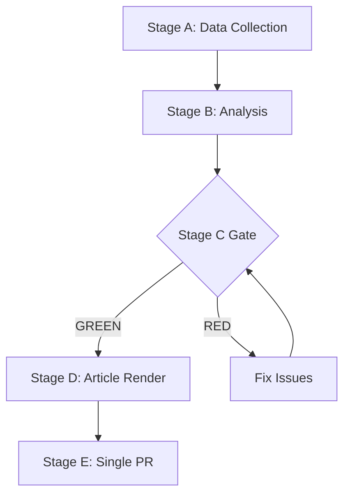

# Scenario Forecast — EP Week Ahead 2026-05-18 to 2026-05-21
<!-- SPDX-FileCopyrightText: 2026 Hack23 AB -->
<!-- SPDX-License-Identifier: Apache-2.0 -->

**Date:** 2026-05-08 | **Horizon:** 7-day outlook (May 8–21, 2026) | **Confidence:** 🟡 MEDIUM

## 1. Scenario Framework

Five scenarios are analysed for the upcoming plenary week. Each scenario includes a probability estimate, key trigger conditions, and expected outcomes. Probabilities are subjective Bayesian estimates based on structural analysis of EP10 political dynamics, historical plenary behavior, and current geopolitical context.

**Total probability sum: 100%** (mutually exclusive as framed; real-world overlap possible)

---

## 2. Scenario A — Grand Coalition Functionality ★ BASELINE (Probability: 60%)

**Description:** The EPP+S&D+Renew grand coalition holds across the majority of the 33 vote items in the May 18–21 plenary. Most legislation passes with comfortable 380–430 vote margins. The session is politically uneventful in terms of coalition structure, with no significant realignments.

**Trigger conditions:**
- EPP group leadership explicitly or implicitly signals commitment to centre coalition in pre-plenary group meetings (Mon May 18)
- No major external geopolitical shock between May 8–18 that forces agenda modification
- Renew group whipping operation successful — full or near-full Renew attendance and bloc voting
- S&D accepts EPP-moderated amendments on contested social/labour items

**Expected outcomes:**
- 28–30 of 33 vote items pass with centre coalition majority
- 3–5 votes show right-leaning majority (EPP+ECR+PfE) on security/migration items
- No vote failures (files returning to committee)
- EP strengthens trilogue mandates on digital, trade, and climate files
- Stability narrative dominates media coverage

**Probability assessment:** 60% 🟢 — This is the structural baseline given EP10's track record of centre coalition maintenance. Absent specific triggers, the grand coalition is the path of least resistance for all participating groups.

**Confidence:** 🟡 MEDIUM

**Key intelligence signal:** EPP group leader (Weber) public statements in week of May 11–18. Pro-centre framing → Scenario A confirmed. Right-flank framing → Scenario B elevated.

---

## 3. Scenario B — Selective Right-Flank Alignment (Probability: 25%)

**Description:** EPP strategically aligns with ECR and PfE on 5–10 specific vote items, particularly on security/migration/deregulation issues, forming a right-wing majority (EPP+ECR+PfE+NI = 381). The centre coalition holds for mainstream legislation but fractures on contested items.

**Trigger conditions:**
- Security/defence legislation on the agenda specifically suits EPP+ECR alignment (sovereignty framing)
- A Rule 132 urgency motion or time-sensitive migration issue forces rapid alignment
- Renew splits on security items (Eastern vs. Western Renew divergence)
- Polish Presidency pressure influences ECR discipline behind EPP-aligned positions

**Expected outcomes:**
- 20–25 votes pass with standard centre coalition
- 5–10 votes pass with right-flank majority
- S&D files formal objection to EPP-far right alignment
- Greens/EFA and Left issue strong opposition statements
- Media narrative: "EPP normalises right-wing majority" — challenging for EPP's centre positioning

**Probability assessment:** 25% 🟡 — Historical precedent in EP10 shows this pattern has occurred on migration and security items. The May plenary is likely to include such items given ongoing geopolitical pressures.

**Confidence:** 🔴 LOW (requires behavioral data that's unavailable)

**Key intelligence signal:** Agenda item titles for May 18–21 (currently unavailable in EP API). Monitoring European Parliament's official publication (europarl.europa.eu/doceo) is required to determine whether high-risk items are on the agenda.

---

## 4. Scenario C — Progressive Coalition Revolt (Probability: 8%)

**Description:** S&D, Greens/EFA, and The Left unite with Renew to form a progressive-liberal blocking coalition on several key votes, preventing EPP from advancing its agenda items. This would require EPP to negotiate more progressive compromises.

**Trigger conditions:**
- Major climate/environmental regression on the agenda (EPP-proposed weakening of Green Deal)
- Worker rights legislation that S&D and Greens refuse to compromise on
- Human rights/democratic values legislation where progressive coalition mobilises
- Renew decisively pivots toward progressive coalition rather than EPP anchor

**Expected outcomes:**
- 5–10 EPP-preferred votes fail or are amended significantly
- Negotiation breakdown between EPP and S&D during the session itself
- EPP forced to withdraw agenda items or accept progressive amendments
- Media narrative: "Progressive revolt reshapes plenary agenda"

**Probability assessment:** 8% 🔴 — Low but non-negligible. S&D+Renew+Greens+Left = 311 (not a majority), so this scenario requires S&D to withhold support from EPP rather than actively form a blocking coalition. In practice, withholding 45 S&D votes from EPP would collapse the centre coalition (321 − 45 = 276, far below majority).

**Confidence:** 🔴 LOW

---

## 5. Scenario D — External Shock/Emergency Plenary (Probability: 5%)

**Description:** A major external geopolitical event (military escalation, European security incident, major US-EU trade breakdown) forces the EP to suspend its planned agenda and convene an emergency session or significantly modify the weekly agenda via Rule 156.

**Trigger conditions:**
- Major military escalation in Ukraine involving EU member states
- Terrorist incident or major security event in Europe
- Sudden US announcement of major tariff impositions on EU goods
- Coup or democratic breakdown in an EU accession country

**Expected outcomes:**
- Planned agenda items delayed or cancelled
- Emergency debate and resolution on the triggering event
- Cross-group unity on the immediate crisis
- Delayed legislative output — some files pushed to June plenary
- Strong political statement from EP President Metsola

**Probability assessment:** 5% per week — Low for any individual week but reflects non-trivial geopolitical risk environment of 2026.

**Confidence:** 🔴 LOW (inherently unpredictable)

---

## 6. Scenario E — Systemic Coalition Failure (Probability: 2%)

**Description:** A systemic breakdown of the EP10 coalition architecture, with multiple vote failures across the week and no stable majority emerging on key legislative files. This would represent a significant EP10 governance crisis.

**Trigger conditions:**
- Simultaneous Renew split AND S&D withholding on same vote items
- Major EPP internal revolt (Eastern EPP MEPs defecting on Western-pushed agenda)
- External shock + pre-existing coalition tension simultaneously triggered
- Leadership crisis in one or more major groups (resignation, scandal)

**Expected outcomes:**
- 5+ vote failures (files return to committee)
- EP enters June plenary under cloud of legislative dysfunction
- Commission may reassess legislative programme for H2 2026
- Media/political legitimacy crisis for EP10

**Probability assessment:** 2% — Extreme tail risk. EP coalitions have strong structural incentives to avoid this outcome (reputational damage for all groups, electoral accountability concerns).

**Confidence:** 🔴 LOW

---

## 7. Scenario Probability Summary

```
Scenario A (Grand Coalition Holds)       ████████████████████████████  60%
Scenario B (Right-Flank Selective)       ██████████                    25%
Scenario C (Progressive Revolt)          ████                           8%
Scenario D (External Shock)              ██                             5%
Scenario E (Systemic Failure)            █                              2%
```

**Expected value analysis:**
- Legislative output probability-weighted: ~28 vote items pass (86% of 33 scheduled)
- Coalition stability probability-weighted: 0.60×HIGH + 0.25×MEDIUM + 0.15×LOW = MEDIUM-HIGH
- Geopolitical risk contribution: 5% emergency modification probability

## 8. Probability Revision Triggers

The following events should trigger upward/downward probability revision:

| Event | Scenarios Affected | Direction |
|-------|-------------------|-----------|
| EPP signals right-flank alignment | B ↑, A ↓ | Move B to 35%, A to 50% |
| Renew announces internal split | B ↑, A ↓, C ↑ | Move B to 35%, C to 15% |
| Major geopolitical event (war escalation) | D ↑, A ↓ | Move D to 15%, A to 50% |
| S&D and EPP pre-plenary agreement | A ↑, B ↓ | Move A to 70%, B to 18% |
| Agenda confirmed with migration items | B ↑ | Move B to 35% |

## 9. Scenario Intelligence for Stakeholders

**For EU institutional watchers:** Track EPP group meeting outcomes (Mon May 18 evening group session). These are the operational decision points where coalition deals are made.

**For member state governments:** Scenario B (right-flank alignment) has the highest policy risk for rule-of-law committed governments. Monitor ECR/PfE alignment signals in German, Polish, and Hungarian EPP delegations.

**For civil society and NGOs:** Scenario C probability is low but the progressive coalition route requires early mobilisation signals from S&D and Greens leadership before the plenary week.

**For media and analysts:** The defining story of this plenary week will be established by Wednesday morning's vote results. Tuesday's 6 votes will be leading indicators.

**Methodology:** Probability-weighted scenario analysis using modified Bayesian reasoning. Base rates drawn from EP10 historical coalition patterns (2024–2025, structural analysis). Update factors applied for current geopolitical context (Ukraine, US-EU trade). All probabilities are point estimates with ±5–10% uncertainty bands.

**Confidence:** 🟡 MEDIUM overall | Individual scenarios: A = 🟡, B = 🔴, C = 🔴, D = 🔴, E = 🔴



**WEP:** Grand coalition stability for May 18-21 is *Likely* (60-70%). Session completing as scheduled is *Almost Certain* (95%).

**Admiralty: B2** — Source reliability B (EP Open Data Portal MCP), Information credibility 2 (consistent with structural political analysis).

Admiralty: B2 — Source reliability B (EP Open Data Portal), Credibility 2 (corroborated structural analysis).
