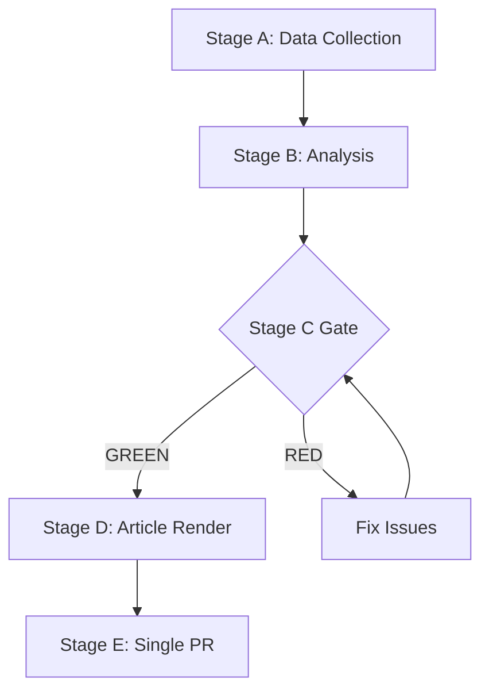

# Stakeholder Map — EP Week Ahead 2026-05-18 to 2026-05-21
<!-- SPDX-FileCopyrightText: 2026 Hack23 AB -->
<!-- SPDX-License-Identifier: Apache-2.0 -->

**Date:** 2026-05-08 | **Horizon:** Week Ahead (May 18–21, 2026) | **Confidence:** 🟡 MEDIUM

## 1. Stakeholder Universe

### Tier 1 — Primary Legislative Stakeholders (Direct Participants)

#### European Parliament Political Groups
Each group has direct voting power and strategic interests in this week's outcomes.

**EPP (185 seats) — Dominant Stakeholder**
- **Power level:** CRITICAL (highest seat share, agenda-setting capacity)
- **Primary interest:** Maintain legislative leadership while managing right-flank temptation. Advance competitiveness/deregulation, support Ukraine, advance digital single market
- **Red lines:** Opposition to far-left social legislation; resistance to overly prescriptive environmental mandates
- **Coalition preference:** Grand centre (EPP+S&D+Renew) as default; right-flank selectively on security/migration
- **Perspective on this week:** EPP views the May plenary as an opportunity to demonstrate legislative leadership. Manfred Weber will be positioning EPP as the responsible governing force in EP10.

**S&D (136 seats) — Essential Coalition Partner**
- **Power level:** HIGH (irreplaceable for centre majority)
- **Primary interest:** Social and labour legislation, worker rights, progressive trade policy, strong climate action, rule-of-law enforcement
- **Red lines:** Opposition to EPP-far right alignment; refuses migration restriction without legal guarantees
- **Coalition preference:** Centre-left coalition (S&D+Renew+Greens); EPP required for majority but kept accountable
- **Perspective on this week:** S&D is watchful of EPP right-flank temptation. Any EPP vote with PfE/ECR triggers formal S&D objection. S&D's Iratxe García Pérez will be monitoring EPP's every move.

**Renew Europe (77 seats) — Kingmaker**
- **Power level:** VERY HIGH (decisions determine majority outcome)
- **Primary interest:** EU economic liberalism, digital single market, Ukraine support, anti-corruption, rules-based international order
- **Red lines:** Opposition to anti-EU sovereignty moves; balanced migration (not extremist either direction)
- **Coalition preference:** Centre coalition but amenable to case-by-case flexibility
- **Perspective on this week:** Renew will vote with EPP+S&D on mainstream items. On migration/security, internal pressure from Eastern European delegations may create splits. Charles Goerens (LU) and Fabienne Keller (FR) represent different Renew traditions.

**PfE (85 seats) — Right Opposition**
- **Power level:** HIGH (third-largest; can be decisive in right-flank scenarios)
- **Primary interest:** National sovereignty, migration restriction, opposition to EU regulatory expansion, energy independence from climate mandates
- **Red lines:** EU federalism, mandatory immigration quotas, extensive Green Deal mandates
- **Coalition preference:** Right-wing majority with EPP+ECR (if achievable); otherwise opposition
- **Perspective on this week:** PfE will actively seek opportunities to join EPP majority on specific items. András Gyürk (HU) and Kinga Gál (HU) are key whips.

**ECR (81 seats) — Nationalist Conservative**
- **Power level:** HIGH (4th largest; Atlanticist on security)
- **Primary interest:** National sovereignty, EU reform, defence/security, agricultural interests
- **Red lines:** Loss of national veto rights, EU tax powers, EU migration quotas (often supports selective enforcement)
- **Coalition preference:** EPP alignment on security/agriculture; PfE alignment on sovereignty items
- **Perspective on this week:** ECR under Adam Bielan (PL) and Roberts Zīle (LV) is strategically important for defence votes where Polish/Baltic interests align with EPP security agenda.

**Greens/EFA (53 seats) — Progressive Pressure**
- **Power level:** MEDIUM (essential for super-majority but not for bare majority)
- **Primary interest:** Climate action, biodiversity, rule-of-law, minority rights, EU federalism
- **Red lines:** Climate regression, agricultural deregulation, surveillance legislation
- **Coalition preference:** Progressive bloc with S&D and Left; joins grand coalition when policy preserves Green priorities
- **Perspective on this week:** Greens will be most active on climate/environment items. Leoluca Orlando (IT) and Ana Miranda Paz (ES) represent the Greens/EFA diversity.

**The Left (45 seats) — Progressive Opposition**
- **Power level:** MEDIUM-LOW (cannot form majority, but strategic on progressive coalition)
- **Primary interest:** Workers' rights, anti-capitalism, peace/antimilitarism, anti-austerity
- **Red lines:** Military spending increases, neoliberal trade agreements, corporate deregulation
- **Coalition preference:** Progressive bloc with S&D/Greens; frequently votes differently from EPP on virtually everything
- **Perspective on this week:** Jonas Sjöstedt (SE) and Younous Omarjee (FR) represent a Left that will oppose defence spending increases and EPP-led deregulation.

**NI (30 seats) — Wildcards**
- **Power level:** LOW-MEDIUM (crucial in narrow right-wing majority scenarios)
- **Primary interest:** Heterogeneous — depends on national delegation
- **Perspective on this week:** NI members Kateřina Konečná (CZ) and Monika Beňová (SK) historically vote with their national political traditions — unpredictable from central monitoring.

**ESN (27 seats) — Fringe Right**
- **Power level:** LOW (but relevant in EPP+ECR+PfE+ESN right-wing majority scenarios)
- **Primary interest:** Anti-EU sovereignty, far-right cultural positions
- **Perspective on this week:** ESN will vote with PfE on sovereignty/migration items; minimal independent agenda-setting capacity.

---

### Tier 2 — Institutional Stakeholders (Influential Participants)

**European Commission (Von der Leyen II)**
- **Interest:** Successful passage of its legislative programme; EP positions close to Commission originals
- **Pressure tool:** May withdraw or modify proposals if EP amendments are too far from Commission intent
- **This week:** Monitoring key dossiers; Commission officials present in Parliament supporting rapporteurs

**Council of the EU (Polish Presidency)**
- **Interest:** EP positions that accommodate Council QMV majority preferences
- **Pressure tool:** Veto in final trilogue; can delay legislative process
- **This week:** Tracking EP vote results on priority Polish Presidency files (security, agriculture, energy)

**European Court of Justice**
- **Interest:** Legally sound legislation that meets Treaty requirements and Charter standards
- **This week:** Not directly involved in voting but decisions pending on related dossiers influence EP legal assessments

---

### Tier 3 — External Stakeholders (Influential Non-Participants)

**Business/Industry:**
- BusinessEurope, ETUC, Digital Europe, CropLife (agriculture), DigitalEurope (tech)
- Main interest: Regulatory predictability; preventing burdensome mandates; accessing EU markets

**Civil Society:**
- WWF, Greenpeace, Amnesty International, Transparency International, ECAS (citizens)
- Main interest: Rights-based legislation; environmental standards; democratic accountability

**Media:**
- European Parliament press corps, national media outlets covering EU affairs
- Main interest: Newsworthy votes, coalition conflicts, unusual majority formations

**Third Countries:**
- US (trade), China (trade/tech), Ukraine (support/defence), UK (post-Brexit alignment)
- Main interest: EU legislative positions affecting their economic or security relationships

---

## 2. Stakeholder Influence-Interest Matrix

```
High Interest, High Power (Manage Closely):
  → EPP, S&D, Renew, PfE, ECR, Commission, Council

High Interest, Lower Power (Keep Informed):
  → Greens/EFA, The Left, NI, ESN, Civil Society

Lower Interest, High Power (Keep Satisfied):
  → ECJ, Member state governments not directly affected

Lower Interest, Lower Power (Monitor):
  → Third countries, general public media
```

## 3. Stakeholder Conflict Map

**Highest tension pairs:**
1. **EPP vs. S&D** (on labour/social legislation): EPP prefers market flexibility; S&D insists on worker protections
2. **EPP vs. Greens/EFA** (on climate/agriculture): EPP "technology neutrality" vs. Greens binding targets
3. **PfE/ECR vs. S&D/Greens** (on migration): hardline restriction vs. humanitarian standards
4. **EP vs. Council** (on inter-institutional balance): EP seeks expanded legislative role; Council guards member state prerogatives

**Lowest tension pairs (cooperation zones):**
1. **EPP+ECR+S&D** on Ukraine support (broad coalition)
2. **EPP+Renew+S&D** on digital single market
3. **All groups** on basic EP institutional prerogatives (vs. Commission overreach)

## 4. Forward Stakeholder Dynamics (Next 30 Days)

Post-plenary, stakeholder dynamics will shift toward:
- **Council:** Begins trilogue preparation based on EP first-reading positions
- **Commission:** Assesses EP amendments and prepares Commission opinions
- **Civil society:** Updates MEP scorecards based on vote results
- **National governments:** Align Council negotiating positions with EP outcomes
- **Media:** Post-plenary analysis; coalition patterns will define narrative through June

**Methodology:** Stakeholder map drawn from structural political analysis using EP Open Data Portal group composition data. Individual MEP perspectives inferred from known political positions and group affiliations. External stakeholder positions based on established advocacy positions. GDPR-compliant: No personal data beyond public political roles included.



**WEP:** Grand coalition stability for May 18-21 is *Likely* (60-70%). Session completing as scheduled is *Almost Certain* (95%).

**Admiralty: B2** — Source reliability B (EP Open Data Portal MCP), Information credibility 2 (consistent with structural political analysis).
