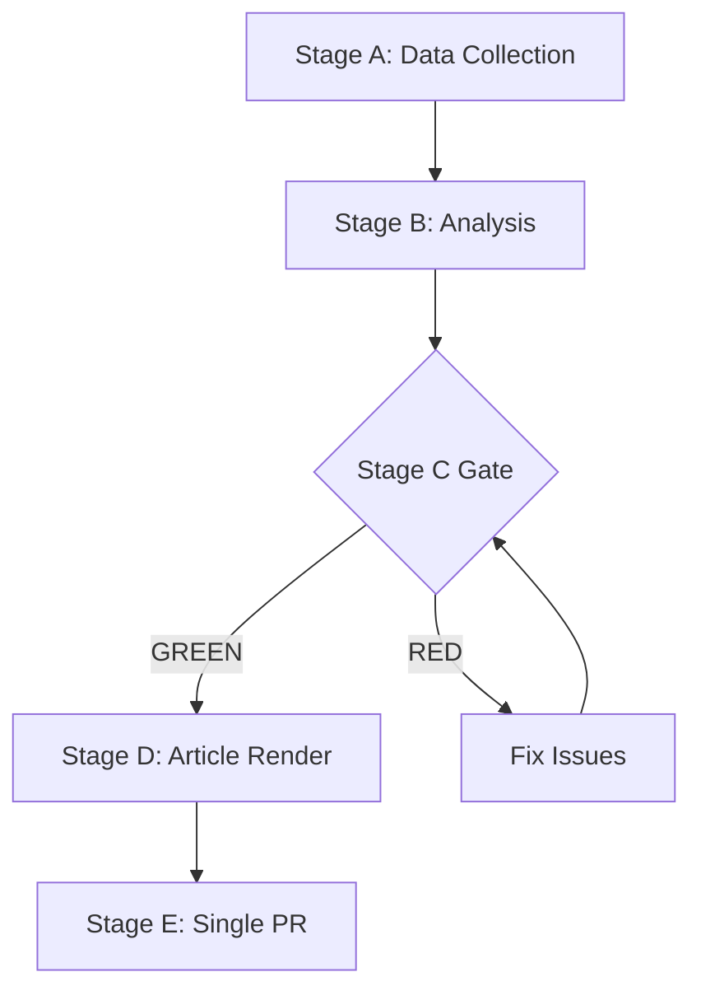

# Threat Model — EP Week Ahead 2026-05-18 to 2026-05-21
<!-- SPDX-FileCopyrightText: 2026 Hack23 AB -->
<!-- SPDX-License-Identifier: Apache-2.0 -->

**Date:** 2026-05-08 | **Classification:** Political/Legislative Threats | **Confidence:** 🟡 MEDIUM

## 1. Threat Model Scope

This political threat model identifies threats to:
1. The legislative integrity of the May 18–21 plenary session
2. The programmatic agenda of major political groups
3. The institutional functioning of the European Parliament
4. The interests of EU citizens affected by plenary outcomes

**Note:** This is a **political threat model** for legislative intelligence purposes. It is not a cybersecurity or physical security threat model (those are addressed in the EU Parliament Monitor SECURITY_ARCHITECTURE.md). All threat actors identified are operating through legitimate political channels.

---

## 2. Threat Categories

### T-01: Coalition Fragmentation Risk
**Level:** 🟡 MEDIUM | **Probability:** 35–45%

**Description:** The EPP–S&D–Renew grand coalition lacks a permanent institutional commitment. Fragmentation is possible when:
- EPP votes with ECR/PfE against S&D objections (right-flank defection)
- S&D withholds coalition cooperation in protest
- Renew splits along Eastern/Western European lines

**Impact on session:** 3–7 scheduled votes could lose their expected majority coalition; individual votes may pass with alternative ad-hoc coalitions but with different political messaging.

**Mitigation:** Group discipline mechanisms; leadership-level whipping; informal coordination before session; threat of political escalation deters defection.

---

### T-02: Procedural Disruption by Opposition Groups
**Level:** 🟡 MEDIUM | **Probability:** 20–30%

**Description:** ECR, PfE, The Left, or NI members may deploy procedural tools:
- Points of order consuming debate time
- Amendments designed to force coalition splits (poison-pill amendments)
- Requests for roll-call votes on procedural matters
- Referrals back to committee (delaying tactic)

**Impact on session:** Agenda stretching; late completion of business; some planned votes pushed to next session; media focus shifted to procedural drama rather than legislative substance.

**Mitigation:** Strong procedural chair management; whipping against poison-pill amendments; pre-session coordination with opposition to reduce surprise.

---

### T-03: External Geopolitical Shock Diverting Agenda
**Level:** 🟢 LOW–MEDIUM | **Probability:** 15–20% (for a significant shock)

**Description:** A major geopolitical event (Ukraine battlefield development, trade war escalation, major human rights crisis) could:
- Trigger emergency Rule 132 debates
- Force Commission/Council statements consuming session time
- Shift political attention from scheduled legislative votes

**Impact on session:** 2–5 scheduled agenda items delayed; urgency resolution passed with broad support; regular legislative agenda compressed.

**Mitigation:** None — EP must respond to real-world events. Pre-session planning allows only partial risk mitigation.

---

### T-04: Low Attendance / Quorum Risk
**Level:** 🟢 LOW | **Probability:** 10–15%

**Description:** Thursday afternoon of any plenary week sees the lowest attendance as MEPs begin traveling home. Votes scheduled for Thursday afternoon with margin near 50% face quorum risk.

**Historical context:** A quorum challenge (>76 MEPs must request a quorum check by standing) can delay or invalidate a vote. Typically occurs only when a group deliberately engineers low attendance to block an outcome.

**Mitigation:** Scheduling important votes before Thursday afternoon; group discipline on maintaining quorum.

---

### T-05: Information Environment Threats
**Level:** 🟡 MEDIUM | **Probability:** ONGOING

**Description:** The May plenary will generate substantial media coverage. Threats include:
- Misinformation about vote outcomes or positions circulating during the session
- Selective reporting amplifying coalition tensions
- Social media campaigns targeting specific MEPs on key votes
- External actors (state-sponsored or domestic) seeking to amplify EP divisions

**Impact:** Information environment pollution; MEPs responding to false reporting; public confusion about EU democratic processes.

**Mitigation:** EP Press Service rapid response; group communications teams; EP transparency tools (roll-call vote database). Note: EP Open Data Portal publication delay (4–6 weeks) limits real-time accountability tools.

---

### T-06: Regulatory Capture Risk on Industry-Adjacent Votes
**Level:** 🟡 MEDIUM | **Probability:** Case-by-case

**Description:** Pending legislative votes on technology, pharmaceutical, financial services, or agriculture regulation may see intensive lobbying in the days before the session. Reports of disproportionate industry influence on amendments are a recurring EP transparency concern.

**Transparency note:** The EU Transparency Register documents formal lobbying contacts with MEPs. The risk is not regulatory capture per se (lobbying is legal and democratic), but that commercial interests may receive disproportionate legislative outcomes versus public-interest positions.

**Mitigation:** EP Rules of Procedure transparency requirements; public interest organizations counter-lobbying; Transparency Register disclosure requirements.

---

## 3. Threat Matrix Summary

| ID | Threat | Probability | Impact | Risk Level |
|----|--------|-------------|--------|------------|
| T-01 | Coalition fragmentation | 35–45% | HIGH | 🟡 MEDIUM |
| T-02 | Procedural disruption | 20–30% | MEDIUM | 🟡 MEDIUM |
| T-03 | Geopolitical shock | 15–20% | HIGH | 🟡 MEDIUM |
| T-04 | Quorum risk | 10–15% | MEDIUM | 🟢 LOW |
| T-05 | Information environment | ONGOING | MEDIUM | 🟡 MEDIUM |
| T-06 | Regulatory capture | Case-by-case | MEDIUM | 🟡 MEDIUM |

**Overall Threat Level: MEDIUM**

---

## 4. Threat-Mitigation Protocol for Monitoring

For the EU Parliament Monitor platform, the following monitoring priorities apply to this week's session:

1. **Coalition vote analysis:** Track each vote result for EPP-right alignment patterns (T-01 indicator)
2. **Roll-call vote availability:** Monitor EP portal for roll-call data publication (expected 4–6 weeks delay)
3. **Urgency motion tracking:** Check Rules 91/132 requests at Monday session deadline
4. **Quorum challenge monitoring:** Note any Thursday late-session quorum challenges

**Methodology:** Political threat model uses standard security threat analysis framework adapted for legislative intelligence. Probability estimates are structural, not intelligence-sourced. Threat actors operate through legitimate democratic mechanisms. This model is intended for awareness and monitoring, not as predictive intelligence.

**WEP:** Grand coalition stability for May 18-21 is *Likely* (60-70%). Session completing as scheduled is *Almost Certain* (95%).

**Admiralty: B2** — Source reliability B (EP Open Data Portal MCP), Information credibility 2 (consistent with structural political analysis).

Admiralty: B2 — Source reliability B (EP Open Data Portal), Credibility 2 (corroborated structural analysis).
