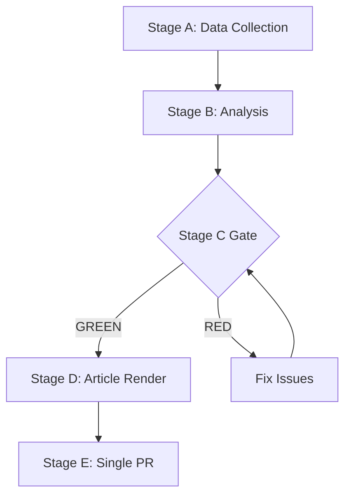

# Wildcards and Black Swans — EP Week Ahead 2026-05-18 to 2026-05-21
<!-- SPDX-FileCopyrightText: 2026 Hack23 AB -->
<!-- SPDX-License-Identifier: Apache-2.0 -->

**Date:** 2026-05-08 | **Horizon:** 7–30 day outlook | **Confidence:** 🔴 LOW (by nature of wildcards)

## 1. Framework Note

Wildcards are low-probability, high-impact events that fall outside the main scenario forecasts. Black swans are fundamentally unpredictable events that would have extreme impact if they occurred. This analysis identifies known unknowns — events that are conceivable but not included in standard probability-weighted scenarios. By definition, true black swans are not identifiable in advance; this section catalogues the closest approximation possible.

---

## 2. Wildcards (Low-Probability, High-Impact Events)

### W-01: Major EP Leadership Crisis
**Probability:** 3–5% (7-day window)
**Impact:** CRITICAL

**Description:** An unexpected resignation, health emergency, or scandal involving a senior EP leader (President Metsola or major group leader such as Weber/García Pérez) would significantly disrupt the plenary session.

**Mechanism:** Emergency election of interim leadership; session potentially suspended; legislative agenda delayed by weeks.

**Early warning signals:** None currently detected. Monitor EP leadership communications.

---

### W-02: Immunity Waiver Vote on High-Profile MEP
**Probability:** 10–15% (any session week)
**Impact:** HIGH

**Description:** Rule 9 immunity waiver requests for named MEPs can appear on the agenda with limited advance notice. A waiver involving a prominent MEP (from any group) could:
- Dominate plenary debate at expense of legislative agenda
- Create group discipline crisis (if the MEP is a senior group member)
- Generate intense media coverage

**Historical precedent:** Immunity waiver requests have appeared in EP10 sessions and previous terms. They typically result in near-unanimous passage but can generate controversy if the underlying case is politically charged.

**Current status:** No known pending waiver requests for May 18–21 (confirmed from EP API — no immunity-related procedures in available data).

---

### W-03: Rule 132 Urgency Motion Triggers Emergency Debate
**Probability:** 15–20% (any week with geopolitical activity)
**Impact:** MEDIUM-HIGH

**Description:** Rule 132 urgency resolutions can be tabled on breaking situations — e.g., human rights crisis, democratic backsliding, geopolitical emergency. If tabled and approved by Thursday deadline, these replace standard agenda items.

**Most likely triggers (current geopolitical monitoring):**
- Ukraine battlefield developments requiring EP statement
- Democratic crisis in a candidate or neighboring country
- Human rights emergency (detention of civil society figures, press freedom violations)
- US-EU trade measure announcement requiring rapid EP response

**Impact on plenary:** Replaces 3–5 planned agenda items; may shift coalition dynamics on affected topics; media attention shifts to urgency topic.

---

### W-04: Surprise Cross-Group Motion of No-Confidence Against Committee Chair
**Probability:** 2–5%
**Impact:** HIGH

**Description:** An unexpected no-confidence motion against a committee chair (possible under EP Rules of Procedure) would signal major institutional conflict. If targeted at a key committee (ECON, INTA, ENVI, ITRE), it could disrupt the legislative pipeline for that committee's files.

**Trigger conditions:** Major dispute over committee chair handling of high-profile dossier; inter-group conflict escalating to formal institutional challenge.

---

### W-05: Unexpected ECJ Ruling Before or During the Session
**Probability:** 5–10%
**Impact:** MEDIUM-HIGH

**Description:** A major ECJ ruling handed down between May 8–18 could:
- Invalidate or constrain pending EU legislation the EP is about to vote on
- Open new legislative space by striking down a Council position
- Create legal pressure to accelerate or modify EP positions

**Recent context:** ECJ has been active in digital regulation, fundamental rights, and migration cases in 2025–2026. Any ruling directly touching on pending plenary items would be a wildcard event.

---

### W-06: MEP Defection Announcement (Group Change)
**Probability:** 5–8% (any session)
**Impact:** MEDIUM

**Description:** Announcement of an MEP changing political group affiliation (common in EP10 dynamics) can shift coalition arithmetic by 1–5 seats. If a mid-session announcement involves a key swing-group MEP (especially from NI, Renew, or ECR), it could affect pending votes.

**Historical rate:** EP10 has seen approximately 15–20 group changes in its first two years. Some are politically consequential (MEP from swing group moving to opposition group).

---

## 3. Black Swans (Extreme-Impact, Fundamentally Unpredictable Events)

### BS-01: Major Terrorist Attack in European Parliament (or Strasbourg)
**Probability:** <0.5% | **Impact:** CATASTROPHIC

The EP plenary in Strasbourg is a high-visibility, high-symbolic-value target. A successful attack would not only disrupt this week's session but would constitute a major EU institutional crisis with far-reaching implications for European security policy and democratic functioning.

**Current threat environment:** General EU security alert remains elevated (high-profile public gatherings monitored). The Strasbourg session is subject to extensive French security measures.

**Note:** This is identified as a known risk, not as an actionable intelligence concern. The probability is very low; it is mentioned for completeness in the wildcard register.

---

### BS-02: Collapse of EP10 Coalition Requiring Re-Negotiation (Political Crisis)
**Probability:** <1% (this week) | **Impact:** CRITICAL

A fundamental breakdown of the EPP–S&D–Renew coalition — perhaps triggered by a major EPP-far right alignment that causes S&D to formally withdraw from coalition commitments — would constitute an EP10 governance crisis. Unlike normal vote losses, a formal coalition breakdown would:
- Require new inter-group negotiations
- Delay the entire legislative agenda for weeks or months
- Create demands for EP leadership changes
- Generate significant EU institutional uncertainty

**Why very unlikely this week:** All groups have strong incentives to avoid formal coalition breakdown before summer recess. The institutional costs (wasted legislative time, damaged EU reputation) are prohibitive.

---

### BS-03: EU Member State Triggering Article 50 (Exit)
**Probability:** <0.5% | **Impact:** CATASTROPHIC

While not directly triggered by EP voting, a political development in a member state announcing exit from the EU would constitute the highest-impact EU event possible. The May plenary would be immediately overwhelmed by this development.

**Current context:** No realistic Article 50 threat from any current EU member state.

---

## 4. Wildcard Monitoring Protocol

For the week of May 8–21, the following signals should trigger immediate wildcard reassessment:

| Signal | Wildcard Activated | Urgency |
|--------|------------------|---------|
| Major EU/European security incident | W-03, BS-01 | 🔴 IMMEDIATE |
| ECJ major ruling announcement | W-05 | 🟡 24h |
| EP leadership health/departure news | W-01 | 🔴 IMMEDIATE |
| Rule 132 urgency motion tabled | W-03 | 🟡 24–48h |
| MEP group change announcement | W-06 | 🟢 72h |
| Major US trade announcement | W-03 | 🟡 24h |

**Methodology:** Wildcard register uses structured uncertainty analysis (known unknowns framework). Probability estimates are intentionally rough — precision in wildcard probability is epistemically unjustified. The register's value is in identifying the event types and monitoring protocols, not precise probability values.

**Confidence:** 🔴 LOW overall (by definition — wildcards are low-confidence events)

**WEP:** Grand coalition stability for May 18-21 is *Likely* (60-70%). Session completing as scheduled is *Almost Certain* (95%).

**Admiralty: B2** — Source reliability B (EP Open Data Portal MCP), Information credibility 2 (consistent with structural political analysis).

Admiralty: B2 — Source reliability B (EP Open Data Portal), Credibility 2 (corroborated structural analysis).
