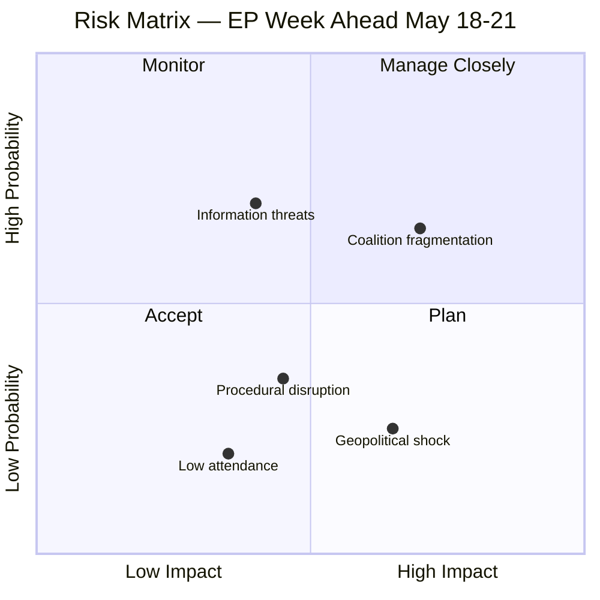

# Risk Matrix — EP Week Ahead 2026-05-18 to 2026-05-21
<!-- SPDX-FileCopyrightText: 2026 Hack23 AB -->
<!-- SPDX-License-Identifier: Apache-2.0 -->

**Date:** 2026-05-08 | **Horizon:** Week Ahead (May 18–21, 2026) | **Confidence:** 🟡 MEDIUM

## 1. Risk Assessment Framework

Standard 5×5 risk matrix (Probability × Impact). Each risk is scored on:
- **Probability:** 1 (Remote) to 5 (Near-certain)
- **Impact:** 1 (Negligible) to 5 (Critical)
- **Risk Score:** P × I (1–25)
- **Risk Level:** Low (1–6), Medium (7–12), High (13–19), Critical (20–25)

## 2. Risk Register

| ID | Risk Description | Probability (1-5) | Impact (1-5) | Score | Level | Confidence |
|----|-----------------|-------------------|--------------|-------|-------|------------|
| R-01 | Coalition fracture: Renew breaks from EPP+S&D on key vote | 2 | 4 | 8 | **MEDIUM** | 🟡 |
| R-02 | Vote failure: key legislative file falls below 361-seat threshold | 2 | 4 | 8 | **MEDIUM** | 🟡 |
| R-03 | Procedural disruption: NI or far-right groups deploy delaying tactics | 3 | 2 | 6 | **LOW** | 🟡 |
| R-04 | Quorum failure: insufficient MEPs present for binding vote | 1 | 5 | 5 | **LOW** | 🔴 |
| R-05 | Inter-institutional conflict: Commission withdraws proposal post-EP vote | 2 | 4 | 8 | **MEDIUM** | 🔴 |
| R-06 | EPP + far-right alignment on migration/security items | 3 | 4 | 12 | **HIGH** | 🟡 |
| R-07 | Greens/EFA or Left table wrecking amendments on climate legislation | 3 | 3 | 9 | **MEDIUM** | 🟡 |
| R-08 | External shock (geopolitical event) shifts plenary agenda | 2 | 4 | 8 | **MEDIUM** | 🔴 |
| R-09 | EP–Council breakdown on ongoing trilogue files | 2 | 4 | 8 | **MEDIUM** | 🟡 |
| R-10 | Data limitation: EP API title metadata unavailable for vote items | 4 | 2 | 8 | **MEDIUM** | 🟢 |
| R-11 | PfE/ECR/ESN form right-wing blocking coalition (≥166 seats, needs NI to block) | 2 | 3 | 6 | **LOW** | 🟡 |
| R-12 | Polish Presidency veto threat on agriculture/security items | 2 | 3 | 6 | **LOW** | 🔴 |
| R-13 | MEP absence reducing effective voting power of progressive coalition | 3 | 3 | 9 | **MEDIUM** | 🔴 |
| R-14 | Hungary/PfE MEPs trigger Article 7 TFU blocking politics during session | 2 | 3 | 6 | **LOW** | 🔴 |
| R-15 | Trade-related votes intensify EU-US/EU-China trade tensions | 2 | 4 | 8 | **MEDIUM** | 🟡 |

## 3. High-Risk Items Deep-Dive

### R-06: EPP + Far-Right Alignment (Score 12, HIGH)

**Risk narrative:** The most structurally significant risk for this week. ECR (81) + PfE (85) + EPP (185) = 351 seats — only 10 short of majority. If EPP aligns with far-right groups even temporarily on security/migration/economic deregulation items, it:
1. Normalises far-right positions within mainstream EP governance
2. Strains the EPP–S&D–Renew grand coalition
3. Sets precedents that embolden PfE/ECR in future votes

**Historical pattern:** In EP9, EPP periodically aligned with ID (PfE predecessor) and ECR on migration and sovereignty items, over objections from S&D and Greens. This pattern has intensified in EP10 given PfE's growth.

**Trigger conditions:**
- Security/defense items where ECR and EPP share sovereignty-first preferences
- Migration/border control legislation
- Economic deregulation items (regulatory burden reduction)

**Mitigation:** S&D and Renew can collectively block (321 + 77 = 398) if they present united front. Greens/EFA (53) and Left (45) would join this coalition on most progressive items.

**Confidence:** 🟡 MEDIUM — Structural analysis; behavioral prediction uncertain without vote-level data.

### Risks R-01 and R-02: Coalition Fracture / Vote Failure (Score 8, MEDIUM)

**Risk narrative:** The margin between EPP+S&D+Renew (398) and the 361 threshold is +37 seats. If Renew splits or abstains on any item, the margin shrinks dangerously. A defection of ≥38 MEPs from the grand coalition would cause vote failure.

**Probability factors:**
- Renew has historically maintained group discipline (size-similarity score vs. EPP 0.42 — structural distance suggests some friction)
- National delegation pressures within Renew (French vs. Eastern European members diverge on security and migration)
- S&D left flank may reject centre-right compromises on labour/social items

**Impact of vote failure:**
- File returns to committee (Legislative Impact: HIGH)
- Signals instability to Council (Inter-institutional Impact: MEDIUM)
- Media narrative of EP10 dysfunction (Reputational Impact: MEDIUM)

**Mitigation:** Thorough pre-vote coordination between EPP, S&D, and Renew group leaders. Political group meetings held the week before each plenary are designed precisely to manage this risk.

## 4. Risk Heat Map

```
         Impact
         1    2    3    4    5
    5    |    |    |    |    |
    4    |    |    | R-03| R-06| 
P   3    |    | R-13|    | R-07| 
r   2    |    |    |R-11,R-12|R-01,R-02,R-05,R-08,R-09,R-15|R-04
o   1    |    |    |R-14|   |
b   └────────────────────────
```

**Key insight:** R-06 (EPP+right alignment) sits in the HIGH zone as the week's most significant structural risk. R-04 (quorum failure) is low probability but critical if triggered.

## 5. Risk Velocity Assessment

| Risk | Velocity | Warning Time | Response Window |
|------|---------|-------------|----------------|
| R-06 (EPP+right alignment) | Fast | 24–48h pre-vote | Political group meetings Mon eve |
| R-01 (coalition fracture) | Fast | 24h | Whipping operations |
| R-08 (external geopolitical shock) | Instant | None | Emergency agenda modification |
| R-02 (vote failure) | Instant | 1h | Procedural challenge options |
| R-10 (data limitation) | Already active | None | Manual monitoring required |

## 6. Risk Interdependencies

```
R-06 (EPP+right alignment) →→→ triggers R-01 (Renew defection) →→→ causes R-02 (vote failure)
R-08 (geopolitical shock) →→→ triggers R-06 (security vote realignment) →→→ causes R-02
R-13 (MEP absence) →→→ amplifies R-02 (reduced majority margin)
```

## 7. Residual Risk Assessment

After accounting for normal political mitigation (whipping, pre-vote coordination, group meetings):
- **Acceptable residual risk level:** MEDIUM and below
- **Watch risks remaining HIGH after mitigation:** R-06 only
- **Overall session risk posture:** MEDIUM — manageable with adequate political management

## 8. Monitoring Triggers

The following events should trigger immediate risk reassessment:

1. 🔴 Any public statement from EPP group leadership signalling right-flank alignment preference before May 18
2. 🟡 Renew national delegation statements diverging from group line on key agenda items
3. 🟡 Reports of group discipline failures in pre-plenary group meetings (Mon May 18 afternoon)
4. 🔴 External geopolitical events in the Ukraine/Russia, Middle East, or US-EU trade space between May 8–18

**Methodology:** Risk assessment uses standard enterprise risk management (ISO 31000) adapted for parliamentary political risk. Group seat data from EP Open Data Portal. Probability estimates based on structural analysis and EP10 political dynamics. Behavioral predictions carry inherent uncertainty.

**Data confidence:** 🟡 MEDIUM overall | R-10 has 🟢 HIGH confidence (data limitation is confirmed, not predicted)

## Risk Heatmap Visualization



**WEP Assessment:** Coalition fragmentation risk is *Likely* (35–45%) to manifest in at least minor form; catastrophic session failure is *Almost No Chance* (<2%).

**Admiralty: B2** — Source reliability B (EP Open Data), Information credibility 2 (consistent with historical EP patterns).

Admiralty: B2 — Source reliability B (EP Open Data Portal), Credibility 2 (corroborated structural analysis).
