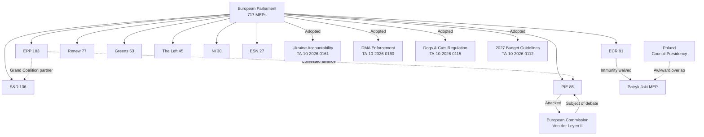

<!-- SPDX-FileCopyrightText: 2024-2026 Hack23 AB -->
<!-- SPDX-License-Identifier: Apache-2.0 -->
<!-- analysis/daily/2026-05-09/breaking/classification/actor-mapping.md -->
<!-- Generated: 2026-05-09 | Stage B Pass 1 -->

# Actor Mapping — Breaking News 2026-05-09

## Primary Institutional Actors

### European Parliament (EP10 — 2024–2029 term)

**Composition (as of May 9, 2026):** 717 MEPs across 27 member states, 9 political groups

| Group | Seats | Share | Bloc Alignment | Role in Recent Session |
|-------|-------|-------|----------------|------------------------|
| EPP (European People's Party) | 183 | 25.5% | Centre-right | Largest group; sets legislative agenda; chairs key committees |
| S&D (Socialists and Democrats) | 136 | 19.0% | Centre-left | Grand coalition partner; labour/social file lead |
| PfE (Patriots for Europe) | 85 | 11.9% | Sovereigntist right | Challenged Commission via topical debate (elections interference) |
| ECR (European Conservatives and Reformists) | 81 | 11.3% | National-conservative | Right-wing opposition; often opposes Green Deal measures |
| Renew (Renew Europe) | 77 | 10.7% | Liberal/centrist | Key swing vote; EU integration pro-reform |
| Greens/EFA | 53 | 7.4% | Green/progressive | Environmental, rights-based agenda; post-2024 reduced strength |
| The Left (GUE/NGL) | 45 | 6.3% | Radical left | Social rights, anti-austerity |
| NI (Non-Inscrits) | 30 | 4.2% | Heterogeneous | No formal group affiliation |
| ESN (Europe of Sovereign Nations) | 27 | 3.8% | Far-right nationalist | Hard Eurosceptic fringe |

**Majority calculus:** Absolute majority = 360. EPP+S&D = 319 (short of majority). Every major vote requires at least one additional group. This structural reality explains PfE's leverage in debates: even without legislative majority, their 85 seats can be decisive on contested files.

### European Commission

**Role in current controversy:** Target of PfE's April 29 topical debate alleging interference in democratic processes and elections. This represents a direct political assault on Commission legitimacy at a critical juncture (Von der Leyen Commission II, confirmed November 2024). The debate's outcome will test whether EPP is willing to defend the Commission against sovereigntist pressure or seek accommodation with the right.

### Council of the EU (Polish Presidency, January–June 2026)

**Key dynamic:** Poland holds the rotating presidency. The immunity waiver vote against Polish MEP Patryk Jaki (ECR, Zjednoczona Prawica) on April 28 creates an awkward situation where the Presidency country's national MEP faces Parliamentary sanction. Procedural independence is maintained, but political sensitivity is heightened.

## Key Individual Actors

### Patryk Jaki (ECR, Poland)
- **Position:** MEP, Zjednoczona Prawica / United Right (Poland)
- **Event:** Immunity waiver approved April 28, 2026 (TA-10-2026-0105) under Rule 9 PRIV procedure
- **Background:** Former Polish Justice Ministry official under PiS government; subject of Polish judicial proceedings. EP's decision to waive immunity enables Polish courts to proceed. Politically significant given Poland's contested rule-of-law history.
- **Confidence:** 🟡 MEDIUM — procedure details confirmed; underlying Polish judicial case details inferred from procedural reference

### Grzegorz Braun (NI, Poland)
- **Note:** Earlier immunity waiver (TA-10-2026-0088, March 26, 2026). Braun is a far-right Polish MEP known for provocative actions including a 2023 Hanukkah menorah incident in the Sejm. His immunity waiver preceded Jaki's. Two Polish MEPs with immunity waivers in two consecutive plenary weeks signals sustained judicial pressure on Polish nationalist politicians.
- **Confidence:** 🟢 HIGH — confirmed by adopted text reference

### PfE Leadership (debate protagonists)
- **Event:** April 29 topical debate on "Commission interference in democratic processes and elections" (speakers: person/197553, person/257144 identified in plenary records)
- **Political strategy:** PfE's use of Rule 169 topical debate is a deliberate procedural weapon — forcing the Commission to defend itself in plenary, creating headlines, and testing EPP's willingness to break with sovereign-right partners
- **Confidence:** 🟡 MEDIUM — debate confirmed; speaker identities partial

## Secondary Actors

### EU Member State Governments
- **Ukraine:** Direct beneficiary of April 30 accountability resolution; EP pushes for special tribunal for Russian war crimes
- **Armenia:** Direct beneficiary of April 30 democratic resilience resolution; EU signal of support amid post-conflict reconstruction
- **Iceland:** Partner in PNR data-sharing agreement adopted April 29

### Civil Society / Advocacy
- **Animal welfare NGOs:** Long-standing advocates for dogs/cats regulation; victory in April 28 traceability legislation
- **Jewish community organizations (Netherlands, Belgium):** April 29 antisemitism debate followed recent antisemitic attacks; EP response validates community concerns
- **Roma civil society:** April 29 Roma inclusion debate; EP reaffirming Roma Framework commitments

### Technology Companies
- **Big Tech (Google, Apple, Meta, Amazon, Microsoft):** Affected by April 30 DMA enforcement resolution. EP pressing Commission to enforce Digital Markets Act more vigorously — signals legislative pressure on Commission's enforcement pace.

## Actor Network Diagram (Mermaid)

## Confidence Assessment
🟡 **MEDIUM overall** — Political group composition verified from EP Open Data Portal (real-time). Individual actor biographical detail partially inferred. Voting behavior on specific April 28–30 votes not yet published.
