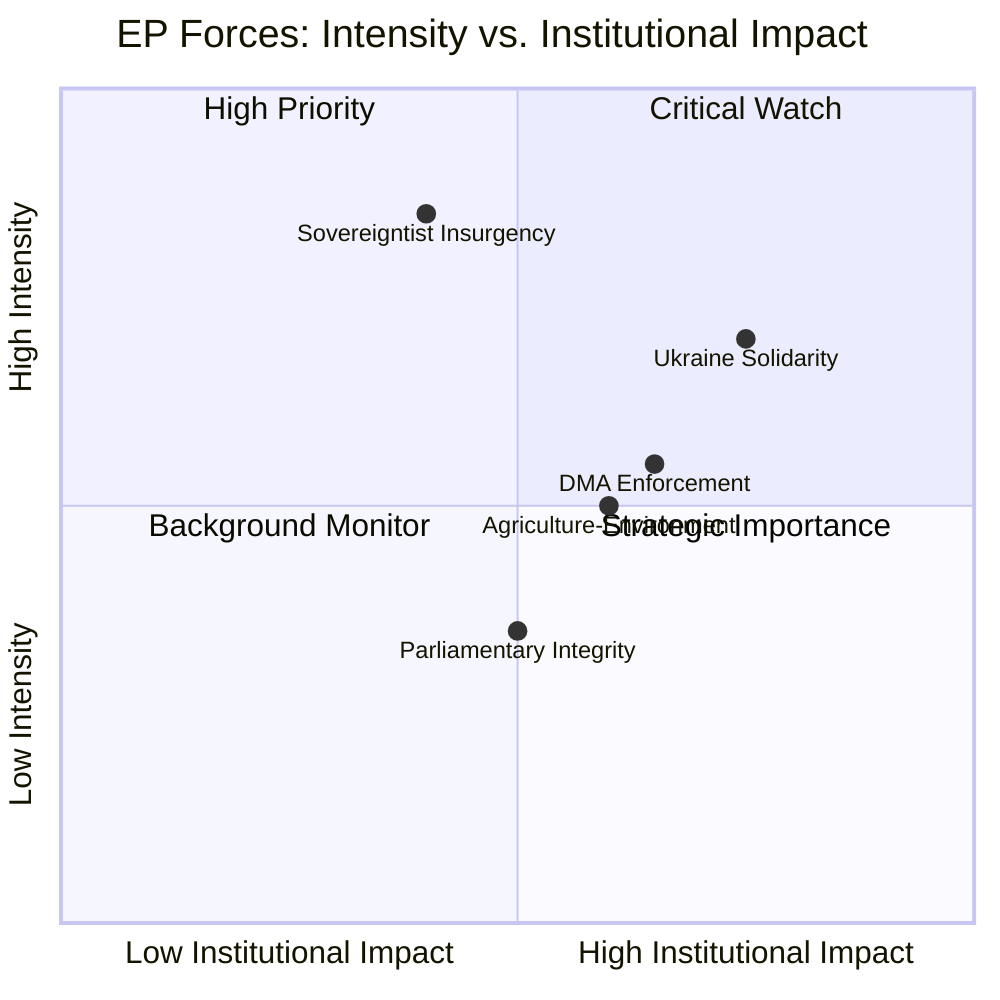

<!-- SPDX-FileCopyrightText: 2024-2026 Hack23 AB -->
<!-- SPDX-License-Identifier: Apache-2.0 -->
<!-- analysis/daily/2026-05-09/breaking/classification/forces-analysis.md -->
<!-- Generated: 2026-05-09 | Stage B Pass 1 -->

# Forces Analysis — Breaking News 2026-05-09

## Overview: The Five Force Fields Shaping the April 28–30 Plenary

The EP10's April 28–30, 2026 Strasbourg session can be understood through five interconnected political force fields that simultaneously produced legislative outputs and revealed institutional tensions.

---

## Force 1: Sovereigntist Insurgency vs. Institutional Mainstream

**Nature:** Structural political contestation
**Intensity:** 🔴 HIGH

The PfE group's decision to invoke Rule 169 (topical debate on any subject of major importance) for a debate titled "Commission interference in democratic processes and elections" represents the most direct institutional challenge mounted by the sovereigntist right in the EP10 term. This is not a legislative instrument — topical debates produce no binding output — but they serve as political staging grounds.

**Mechanism:** PfE (85 seats) cannot defeat legislation on its own, but it can:
1. Force Commission representatives onto the defensive in plenary, televised proceedings
2. Build a narrative coalition with ECR (81 seats) — together 166 seats, enough to be a credible blocking minority on contested votes where Renew or minor groups defect
3. Put EPP in an uncomfortable position: defend the Commission (its de facto coalition partner) or signal tactical sympathy with sovereigntist grievances to maintain PfE outreach

**Historical parallel:** The PfE's use of the topical debate mechanism mirrors ECR's strategy in EP9 of using Rule 132 urgent resolutions and topical debates to challenge Commission positions on migration and rule-of-law, creating pressure without legislative leverage.

**Assessment:** The Commission interference debate is more about *political theater setting* than *substantive policy change*. Its real significance is that it signals PfE's intent to systematically challenge Commission legitimacy ahead of what will be a defining 2026–2027 legislative cycle (Multiannual Financial Framework negotiations, defense industrial base legislation, AI Act secondary legislation).

---

## Force 2: The Ukraine Solidarity Consensus Under Stress

**Nature:** Geopolitical cohesion maintenance
**Intensity:** 🟡 MEDIUM-HIGH

The April 30 adoption of TA-10-2026-0161 (Russia accountability resolution) confirms that the EP's core pro-Ukraine coalition — EPP + S&D + Renew + Greens + The Left — remains intact for symbolic resolutions. However, several dynamics signal stress:

1. **PfE ambivalence:** PfE's constituent national parties (Hungary's Fidesz, France's RN, Italy's Lega) have historically maintained closer ties with Moscow. PfE MEPs' positions on Ukraine accountability resolutions are unknown (voting records not yet published), but their presence creates a defection risk.

2. **Accountability vs. amnesty cleavage:** The resolution's call for "accountability and justice" encompasses pressure on EU member states to enforce arrest warrants and support the International Criminal Court. This creates tension with member states (Hungary, Slovakia) whose governments have signaled ICJ/ICC skepticism.

3. **Russia's information warfare:** EP plenary debates on Ukraine are systematically targeted by Russian disinformation operations. The PfE's elections-interference debate creates a narrative opportunity for Russian state media to conflate EU institutional concerns with Russian talking points.

**Force assessment:** Ukraine solidarity holds at the resolution level. The force will be tested more seriously on financial commitments (upcoming MFF negotiations, defense fund contributions) where voting patterns will be economically costly, not just symbolically costly.

---

## Force 3: Digital Regulatory Enforcement Pressure

**Nature:** Regulatory-political force field
**Intensity:** 🟡 MEDIUM

The April 30 DMA enforcement resolution (TA-10-2026-0160) reflects the EP's growing frustration with the Commission's pace of Digital Markets Act enforcement against designated gatekeepers. The DMA entered into force in May 2023 and the first gatekeeper designations were confirmed in September 2023, but formal proceedings have moved slowly. The resolution represents:

1. **Legislative-executive friction:** EP asserting its treaty right to scrutinize Commission enforcement priorities
2. **Big Tech lobbying pressure:** Industry has invested heavily in compliance narratives; EP counters with enforcement-gap narratives
3. **Geopolitical dimension:** With US tech companies as primary DMA targets, enforcement pace intersects with EU-US trade negotiations in the post-tariff environment; Commission may be cautious to avoid tech trade war

**Force assessment:** The EP's enforcement-pressure force is real but limited — EP cannot compel Commission action on DMA enforcement, only apply political pressure. The resolution's significance lies in setting the political expectations framework ahead of any Commission enforcement decisions in H2 2026.

---

## Force 4: Agricultural-Environmental Tension

**Nature:** Policy value contestation
**Intensity:** 🟡 MEDIUM

The April 30 adoption of TA-10-2026-0157 (EU livestock sector sustainability) reflects an ongoing unresolved tension between the European Green Deal's environmental commitments and the agricultural sector's demand for economic viability. Several forces intersect:

1. **Farmer protest legacy (2024–2025):** Mass agricultural protests across France, Germany, Poland, and Belgium in 2024 forced the Commission to pause several Green Deal measures. The livestock resolution acknowledges "food security, farmers' resilience" — language that signals political accommodation of farmer demands
2. **Climate commitment tension:** EU methane reduction targets and nature restoration requirements bear directly on livestock farming. The resolution must balance both imperatives without reconciling them
3. **CAP reform debates:** The livestock resolution feeds into broader Common Agricultural Policy reform discussions where EPP and ECR push for deregulation while Greens and S&D left flanks advocate environmental conditionality

**Force assessment:** The livestock resolution is a politically engineered compromise that satisfies no stakeholder fully but avoids another round of street-level protest. The underlying tension remains structurally unresolved and will resurface in MFF agriculture pillar negotiations.

---

## Force 5: Parliamentary Integrity / Rule-of-Law Mechanism

**Nature:** Institutional self-governance force
**Intensity:** 🟢 MEDIUM-LOW (but symbolically significant)

Two immunity waivers in consecutive plenary weeks (Braun: March 26; Jaki: April 28) signal that the EP's PRIV committee is actively processing a backlog of Rule 9 immunity cases involving Polish MEPs from the former PiS-aligned political ecosystem. This is not coincidental — it reflects:

1. **Polish judicial reform reversal:** The Tusk government's efforts to restore judicial independence have produced new cases against former PiS officials/allies; some of these are now MEPs seeking immunity protection
2. **EP procedural independence:** The PRIV committee operates under strict judicial neutrality rules; immunity decisions are based on *fumus persecutionis* (political persecution) tests, not political sympathy
3. **Polish Presidency awkwardness:** Poland holds the Council Presidency through June 2026. Having Polish MEPs' immunities waived during Poland's presidency creates symbolic friction, though procedurally irrelevant

**Force assessment:** The integrity force is real but contained. The PRIV process follows established jurisprudence. The political significance is in the signaling: EP is not protecting MEPs from legitimate judicial proceedings, regardless of national political sensitivities.

---

## Net Force Vector

**Summary:** The sovereigntist insurgency scores highest on political intensity but lower on institutional impact (no binding output). Ukraine solidarity and DMA enforcement score high on both dimensions. Agricultural tension is structurally important but currently managed. Parliamentary integrity represents incremental rule-of-law consolidation.
