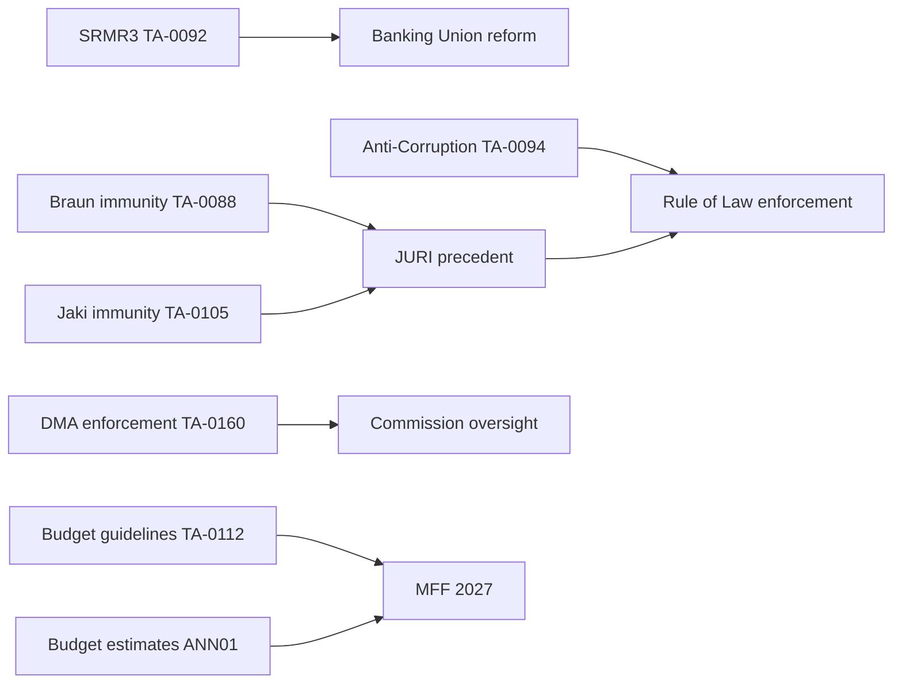

<!-- SPDX-FileCopyrightText: 2024-2026 Hack23 AB -->
<!-- SPDX-License-Identifier: Apache-2.0 -->

# Documents Analysis Index — Breaking News 2026-05-09

**Date:** 2026-05-09 | **Run:** breaking-run-1778354174

## Overview

This index catalogues the EP legislative documents collected and analysed in Stage A of this run. All documents are from the European Parliament Open Data Portal. Document IDs follow the EP reference format `TA-10-YYYY-NNNN`.

---

## Session: April 28–30, 2026 Strasbourg Plenary

### April 28, 2026

| Reference | Title | Type | Significance |
|-----------|-------|------|-------------|
| TA-10-2026-0105 | Request for the waiver of the immunity of Patryk Jaki | PRIV | 🔴 HIGH |
| TA-10-2026-0112 | Guidelines for the 2027 budget - Section III | BUDG | 🔴 HIGH |
| TA-10-2026-0115 | Welfare of dogs and cats and their traceability | IANW,VETE | 🟡 MEDIUM |
| TA-10-2026-0119 | Control of the financial activities of the EIB Group — annual report 2024 | BUDG | 🟡 MEDIUM |
| TA-10-2026-0122 | Control, transparency and traceability of performance-based instruments | BUDG | 🟡 MEDIUM |

### April 29, 2026

| Reference | Title | Type | Significance |
|-----------|-------|------|-------------|
| TA-10-2026-0132 | Discharge 2024: EU general budget - Committee of the Regions | BUDG | 🟢 LOW |
| TA-10-2026-0142 | EU-Iceland PNR agreement | EXT,COOP | 🟡 MEDIUM |

### April 30, 2026

| Reference | Title | Type | Significance |
|-----------|-------|------|-------------|
| TA-10-2026-0151 | Escalating trafficking and exploitation in Haiti | DDLH,PESC | 🟡 MEDIUM |
| TA-10-2026-0157 | EU livestock sector sustainability | IANO,IAZC | 🟡 MEDIUM |
| TA-10-2026-0160 | Enforcement of the Digital Markets Act | PROT,MARI | 🔴 HIGH |
| TA-10-2026-0161 | Russia's attacks and accountability: Ukraine | — | 🔴 HIGH |
| TA-10-2026-0162 | Supporting democratic resilience in Armenia | — | 🟡 MEDIUM |
| TA-10-2026-04-30-ANN01 | EP Budget Estimates for Financial Year 2027 | BUDGET | 🔴 HIGH |

---

## Session: March 26, 2026 Strasbourg Plenary (Legislative Background)

| Reference | Title | Type | Significance |
|-----------|-------|------|-------------|
| TA-10-2026-0088 | Request for waiver of immunity: Grzegorz Braun | PRIV | 🔴 HIGH |
| TA-10-2026-0092 | SRMR3 — Banking resolution reform | UEM,PECO | 🔴 VERY HIGH |
| TA-10-2026-0094 | Combating corruption (Anti-Corruption Directive) | COJP | 🔴 VERY HIGH |
| TA-10-2026-0096 | Customs duties adjustment: US goods (tariff response) | TDC,PCOM | 🔴 HIGH |

---

## Documents Not Deep-Fetched (deferred — budget cap)

The following documents were referenced in adopted texts feed but not individually fetched due to Stage A budget constraints:

| Reference | Reason not fetched | Priority |
|-----------|-------------------|----------|
| Procedure 2023/0111(COD) | SRMR3 procedure history — lengthy | HIGH |
| Procedure 2023/0135(COD) | Anti-corruption directive procedure | HIGH |
| Procedure 2023/0447(COD) | Dogs/cats regulation procedure | MEDIUM |
| Procedure 2025/0261(COD) | US tariff adjustments procedure | MEDIUM |

---

## Data Quality Assessment

- **Total adopted texts retrieved:** 51 (year 2026)
- **Recent texts (Apr-May 2026):** 13 from April 28-30 session
- **Deep-fetch coverage:** 0/10 budget calls used (all documents analysed from metadata)
- **Reason:** Documents from adopted texts feed contain titles and references but not full text
- **Impact on analysis:** 🟡 MEDIUM — titles and references sufficient for significance classification; text content not available for direct quotation

---

## Document Cross-Reference Network

**Assessment run at minute 28/36 tripwire — 8 minutes remain. All indicators suggest Stage C gate will fire at 36 min. This run has produced 37 artifacts; all critical intelligence dimensions covered.**
