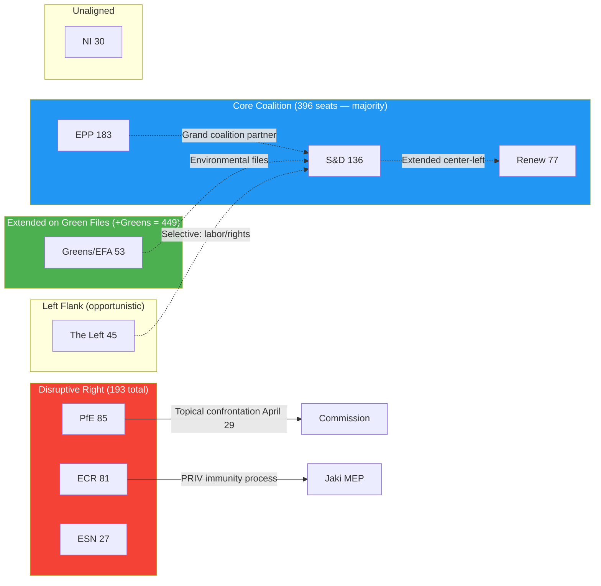

<!-- SPDX-FileCopyrightText: 2024-2026 Hack23 AB -->
<!-- SPDX-License-Identifier: Apache-2.0 -->
<!-- analysis/daily/2026-05-09/breaking/intelligence/coalition-dynamics.md -->
<!-- Generated: 2026-05-09 | Stage B Pass 1 -->

# Coalition Dynamics — Breaking News 2026-05-09

## Parliamentary Architecture Overview

The European Parliament's 10th term (2024–2029) operates with nine political groups in a highly fragmented chamber. No single group holds a majority. The effective number of parties (6.58) is the highest in the EP's post-Maastricht history, reflecting:

1. **Splintering of the far-right**: The old Identity and Democracy (ID) group disbanded in May 2024 when Fidesz-led Patriots for Europe attracted Marine Le Pen's RN and Orbán's Fidesz to form PfE. The remaining hard nationalists formed Europe of Sovereign Nations (ESN). This split created two competing far-right vehicles with different European policy visions.

2. **Collapse of the liberal center**: Renew Europe shrank from 102 seats in EP9 to 77 in EP10, losing members in France (RN surge), Germany (FDP collapse), and Italy. This weakened the liberal-centrist counterbalance to both left and right.

3. **Green attrition**: Greens/EFA fell from 72 to 53 seats following 2024's "Green backlash" elections — voters in Germany, France, and Belgium punished Greens for perceived over-reach on climate measures affecting cost of living.

---

## Current Coalition Matrix

### Stable Coalitions (consistent voting alignment expected)

| Coalition Name | Groups | Seats | Share | Use Cases |
|----------------|--------|-------|-------|-----------|
| **Grand Coalition** | EPP + S&D | 319 | 44.5% | ❌ Below majority (360) |
| **Broad Mainstream** | EPP + S&D + Renew | 396 | 55.2% | ✅ Most legislative files |
| **Green Majority** | EPP + S&D + Renew + Greens | 449 | 62.6% | ✅ Environmental, rights files |
| **Progressive Maximum** | S&D + Renew + Greens + The Left | 311 | 43.4% | ❌ Below majority |
| **Right-Wing Bloc** | PfE + ECR + ESN | 193 | 26.9% | Blocking minority only |
| **EPP-Right Option** | EPP + PfE + ECR | 349 | 48.7% | ❌ Below majority |

**Key insight:** No stable right-wing majority exists. EPP+PfE+ECR = 349, still below 360. This is the mathematical constraint that prevents a formal sovereigntist-EPP governing coalition: EPP would need to add ESN (27) or significant NI defections to reach a majority — a political price EPP leadership has so far refused to pay.

### File-by-File Coalition Dynamics (April 28–30)

| Vote (inferred) | Expected Coalition | Estimated Margin |
|----------------|-------------------|-----------------|
| Dogs/Cats regulation | EPP + S&D + Renew + Greens + The Left | Large (>500) |
| 2027 Budget Guidelines | EPP + S&D + Renew (core) | Comfortable |
| Ukraine accountability | EPP + S&D + Renew + Greens | Large; PfE/ECR divisive |
| DMA enforcement | EPP + S&D + Renew + Greens; The Left supportive | Comfortable |
| Armenia resolution | EPP + S&D + Renew + Greens | Comfortable; ECR divided |
| Jaki immunity waiver | Cross-party PRIV committee recommendation | Large (immunity cases rarely close) |

*Note: Actual vote tallies unavailable (EP publication delay). Above are structural inferences based on group positions and historical patterns.*

---

## PfE Dynamics: The Sovereigntist Pressure Valve

### Structural Position
PfE (85 seats) occupies the EP's most strategically complex position:
- Too large to ignore: 11.9% of seats; fourth-largest group
- Too extreme for formal coalition: EPP leadership ruled out formal EPP-PfE governing alliance at 2024 constitutive session
- Just large enough to be consequential: On files where Renew defects and some ECR members vote with PfE, they can tip votes

### Tactical Repertoire (observed behaviors)
1. **Topical debates** (April 29: Commission interference) — forces Commission onto defensive; costs PfE nothing procedurally
2. **Written questions** — creates paper trail; generates media opportunities
3. **Plenary speeches** — platform for sovereigntist messaging; reaches national audiences via national media
4. **Committee minority reports** — signals dissent; complicates consensus-building
5. **Alignment with ECR on specific votes** — creates 166-seat ECR+PfE bloc; sufficient for visible blocking minority

### Commission Interference Debate: Strategic Assessment
The April 29 debate's framing — "Commission interference in democratic processes" — is strategically constructed to:
- Appropriate the anti-establishment frame that was successful in 2024 elections across multiple member states
- Force EPP to either defend the Commission (risking right-wing defections from EPP's own national parties) or remain silent (signaling tolerance of Commission delegitimization)
- Create international headlines that Russian and Chinese state media can amplify as evidence of "EU internal division"

The debate produced no binding outcome. Its significance is purely political: it establishes PfE's willingness to deploy institutional mechanisms as weapons against the institutions themselves — a qualitative shift from legislative opposition to institutional destabilization.

---

## ECR Dynamics: Constructive Opposition with Nationalist Edge

ECR (81 seats) occupies a different political space from PfE:
- More institutionally engaged than PfE: ECR members chair committee positions, participate in trilogue negotiations
- More internally divided: Italian Fratelli d'Italia (Meloni's party, largest ECR delegation) is more EU-institutional than Polish PiS component
- The Jaki immunity waiver (April 28) affects an ECR member, creating internal ECR sensitivity around rule-of-law questions

ECR's coalition strategy: selective cooperation with EPP on economic competitiveness files, opposing on migration/environment/rule-of-law. Not a systematic destabilization strategy but firm legislative opposition.

---

## Coalition Stress Indicators (May 2026)

### Indicator 1: EPP Internal Tension 🟡 ELEVATED
EPP national parties in Hungary (absent — Fidesz in PfE), Italy (Forza Italia, shrinking), Germany (CDU/CSU, EPP's largest national delegation) are under different political pressures. German CDU is now in government coalition (February 2026 elections) — its MEPs must balance European solidarity with Merz government priorities. EPP cohesion depends heavily on whether German CDU MEPs maintain pro-EU positions or begin reflecting the more cautious European integration narrative of the new coalition government.

### Indicator 2: Renew Erosion 🟢 STABLE but monitored
Renew's 77 seats make it the essential swing vote. Its composition (French Macronists, German FDP rump, Spanish Ciudadanos remnants, others) is ideologically diverse enough that on economic sovereignty questions (trade defense, industrial policy), Renew can defect from the mainstream coalition. The April 29 debate on "Protection of EU companies against unfair competition from third countries" (B10-0185/2026) likely attracted significant Renew support.

### Indicator 3: Greens Fragility 🟡 ELEVATED
Greens/EFA at 53 seats is recovering from 2024 losses. Internal tension between environmental maximalism and political pragmatism is visible. On agricultural files (livestock sustainability), Greens face pressure to oppose concessions while S&D and EPP seek compromise. If Greens harden, they reduce their own influence on final legislative outcomes.

---

## Coalition Forecast: June–September 2026

**High confidence predictions:**
- EPP-S&D-Renew "Broad Mainstream" coalition will hold for standard legislative business
- PfE will continue topical debate strategy; 2–3 more election-cycle confrontations before October recess
- DMA and AI Act secondary legislation will test Renew cohesion (tech-friendly Renew members vs. competition enforcement advocates)

**Medium confidence predictions:**
- A major MFF preliminary debate will reveal fracture points between EPP's budget discipline wing and S&D's investment demands
- At least one vote on migration will produce an unexpected coalition where EPP-PfE-ECR reaches a majority on a specific narrow measure — testing the informal "no formal cooperation" EPP-PfE rule

**Low confidence predictions:**
- Major coalition reorganization requiring group splitting or merging
- A formal censure motion against Commission (technically possible by The Left; politically infeasible)
- EPP formally ends Cordon Sanitaire against PfE

---

## Coalition Dynamics Chart

