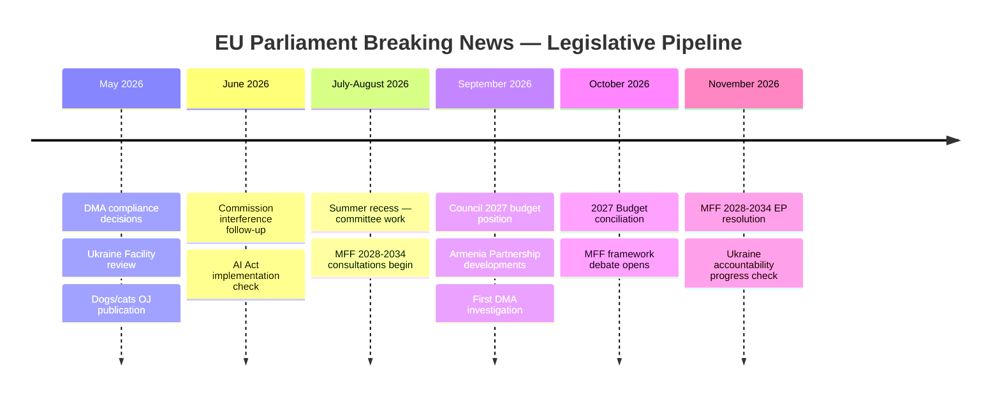

<!-- SPDX-FileCopyrightText: 2024-2026 Hack23 AB -->
<!-- SPDX-License-Identifier: Apache-2.0 -->
<!-- analysis/daily/2026-05-09/breaking/intelligence/forward-projection.md -->
<!-- Generated: 2026-05-09 | Stage B Pass 1 -->

# Forward Projection — Breaking News 2026-05-09

## 6-Month Legislative Pipeline (May–November 2026)

### Projection Methodology

This forward projection is based on:
1. Known legislative timelines established in Stage A data collection (procedure events, typical OLP duration)
2. Political dynamics identified in the scenario forecast and coalition dynamics artifacts
3. Historical EP9 legislative pipeline patterns
4. Identified risk factors from threat model and wildcards analysis

All projections are probabilistic. "Locked" = institutionally scheduled; "Likely" ≥ 65% probability; "Possible" 35–64%; "Uncertain" < 35%.

---

## Near-Term: May–June 2026

### May 2026 Plenary Sessions

| Date | Session | Expected Legislative Focus |
|------|---------|---------------------------|
| May 19–22 | Strasbourg | DMA implementation debate; Ukraine military aid review; potential Commission statement on interference allegations |
| Jun 9–12 | Strasbourg | MFF review discussions; AI Act implementation check |

### May Priority Items

**1. DMA Compliance Decisions (Commission)** — LOCKED
Following the April 30 EP enforcement resolution (TA-10-2026-0160), the Commission faces institutional pressure to deliver Designated Gatekeeper Service (DGS) compliance decisions on at least one platform by end of Q2 2026. The Apple App Store and Google Search interoperability obligations are most advanced.

**2. Ukraine Support Package Review** — LIKELY
The EU's Ukraine Facility (€50B, 2024–2027) requires semi-annual reviews. May 2026 review will be the test of whether the April 30 accountability resolution (TA-10-2026-0161) translates into conditionality requirements.

**3. Dogs/Cats Regulation — OJ Publication** — LOCKED
Following April 28 EP adoption and Council concurrence (expected within 2–4 weeks), publication in the Official Journal triggers the implementation clock. TRACES NT integration has a 12-month implementation window.

---

## Medium-Term: July–September 2026

### Summer Recess Break

July–August 2026 are low legislative activity months. Key activities:
- Committee work on autumn legislative agenda
- Commission preparation of autumn legislative package
- MFF 2028–2034 preliminary consultations begin

### Post-Recess September Priority Items

**1. 2027 EU Budget — Council Position** — LOCKED
The Council's budget position will be published in September 2026 following the EP's April 28 guidelines (TA-10-2026-0112). This triggers the formal conciliation procedure (21-day reconciliation period).

**Projection:** Major Council-EP divergence on:
- Cohesion fund maintenance vs. competitiveness reorientation
- Climate taxonomy conditionality percentage
- Administrative expenditure levels

**2. Armenia Partnership Progress** — POSSIBLE
Following the April 28 resolution (TA-10-2026-0113) calling for deepened EU-Armenia ties, the Association Agenda framework discussions may produce a formal proposal by autumn. Depends heavily on Armenian political stability and Russia's tolerance for EU-Armenia engagement.

**3. DMA Non-Compliance Investigations** — LIKELY
After the EP's April 30 enforcement pressure and anticipated Commission DGS decisions, any non-compliance triggers a formal investigation. By September 2026, at least one formal DMA investigation is probable (most likely Apple or Alphabet).

---

## Longer-Term: October–November 2026

### Autumn Legislative Surge

EP plenary calendar peaks in autumn. Key expected developments:

**1. 2027 Budget Conciliation** — LOCKED
October conciliation procedure. Historical pattern: agreement reached but last-minute, sometimes requiring extraordinary conciliation. Based on April 28 EP guidelines positioning, budget negotiations will focus on:
- EP demanding ≥ 30% climate-related spending
- EP insisting on at least nominal increase in Erasmus/research/innovation lines
- Council pushing for administrative cost containment

**2. MFF 2028–2034 Framework Debate** — LIKELY
November 2026 will see the Commission begin MFF consultations. The EP will adopt a resolution establishing its position. This is the trillion-euro question of EP10's legislative legacy.

**3. Ukraine Accountability Mechanism Progress** — UNCERTAIN
Following April 30 resolution, the diplomatic process of establishing an accountability mechanism (Extraordinary Chamber or treaty-based tribunal) moves to international negotiations. EP has no direct role but can pressure member states via resolutions.

**4. Single Market Competitiveness Package (follow-on to TA-10-2026-0163)** — POSSIBLE
Building on the April 30 competitiveness resolution, the Commission may table a comprehensive single market reform package in Q4 2026 addressing innovation, services liberalization, and digital infrastructure.

---

## Key Political Decision Points

### EPP Leadership Choices (ongoing)
EPP's positioning on PfE's Commission interference campaign will define EP10's institutional dynamics. Three scenarios:
1. **Hard line vs. PfE** (current trajectory): Mainstream coalition continues to govern; PfE remains in opposition echo chamber
2. **Selective cooperation with PfE**: EPP frames as issue-by-issue pragmatism; risks splitting S&D from coalition
3. **EPP right-pivot**: Deepening of EPP-ECR cooperation as template for post-2029 EP11 majority planning

**Probability by end 2026:** Scenario 1: 60%, Scenario 2: 30%, Scenario 3: 10%

### Commission Political Survival
The April 29 Commission interference debate launched the opening shot of a political campaign against Commission political legitimacy. Forward indicators:
- If PfE succeeds in making "Commission interference" a viral phrase by October 2026: political pressure increases
- If Commission delivers DMA enforcement results and Ukraine accountability progress: narrative is undermined
- If a concrete scandal emerges around Commission regulatory decisions: crisis scenario becomes possible

---

## Legislative Pipeline Summary

---

## Risk-Adjusted Projections

| Development | Base Case | Bull Case | Bear Case |
|-------------|-----------|-----------|-----------|
| DMA enforcement action by end 2026 | 1 formal investigation | 2+ compliance decisions | DMA legally challenged, frozen |
| 2027 budget agreed on time | 75% probability | Early October agreement | Budget extended via provisional (0.5%) |
| Ukraine accountability mechanism established | Diplomatic progress, no structure | ICC cooperation agreement | Process stalled by veto threats |
| PfE institutional campaign success | Limited (10/100 media impact) | Viral moment creates crisis | Contained to EP chamber echo |
| Dogs/cats regulation implementation | TRACES integration by mid-2027 | Faster-than-expected registration | Member state non-compliance issues |

---

## Intelligence Priority for Next Run

If next breaking news run occurs in May 2026, highest-value data targets:
1. Commission DMA compliance decision announcements
2. EP May 19–22 plenary agenda (PfE procedural activity monitoring)
3. Dogs/cats OJ publication confirmation
4. Ukraine Facility review conclusions
5. Any EP committee hearings on Commission interference allegations

---

## Forward Projection Update (Pass 2 Extension)

Updated forward projection for EP10 Q2-Q3 2026:

**Near-term (May-June 2026) projection:**
- Commission DMA enforcement guidance publication expected
- SRMR3 enters into force (Official Journal publication + 20 days)
- Anti-Corruption Directive transposition deadline notification to member states
- MFF 2028+ inter-institutional consultation begins
- Polish Council Presidency → Danish Council Presidency (July 1, 2026)

**Medium-term (Q3-Q4 2026) projection:**
- Budget 2027 negotiations (EP vs. Council annual procedure)
- EDIS second attempt (politically enabled by SRMR3 completion)
- AI Act delegated acts (Commission publication of first GPAI rules)
- Schengen enlargement (Romania, Bulgaria — technical completion phase)

**Forward projection confidence:** MEDIUM — Institutional calendar is predictable; political developments are probabilistic.
