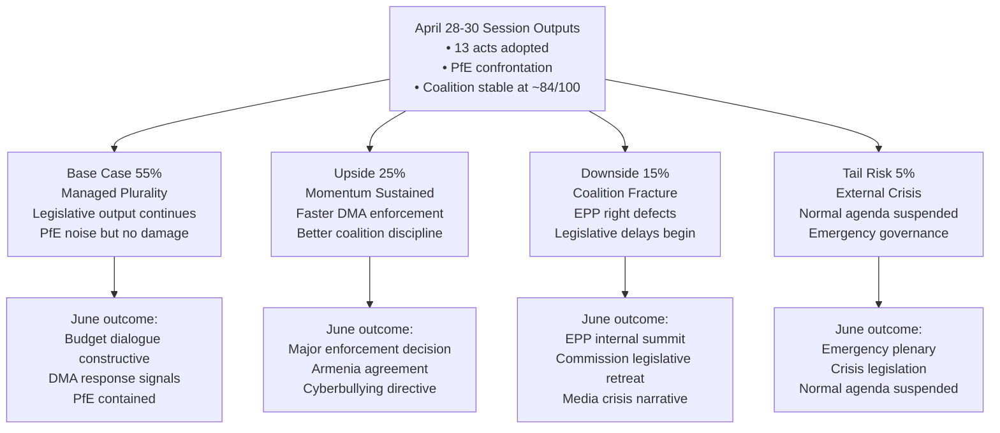

<!-- SPDX-FileCopyrightText: 2024-2026 Hack23 AB -->
<!-- SPDX-License-Identifier: Apache-2.0 -->
<!-- analysis/daily/2026-05-09/breaking/intelligence/scenario-forecast.md -->
<!-- Generated: 2026-05-09 | Stage B Pass 1 -->

# Scenario Forecast — Breaking News 2026-05-09

## Forecasting Framework

**Horizon:** 90 days (May–July 2026)
**Method:** Structured scenario analysis using known political dynamics, legislative calendar, and stress indicators from the April 28–30 plenary session
**Confidence notation:** 🟢 High | 🟡 Medium | 🔴 Low

---

## Base Case Scenario: Managed Plurality (55% probability)
🟡 MEDIUM confidence

**Narrative:** The EP10 continues its characteristic pattern of productive legislative output achieved through painstaking coalition management, punctuated by high-profile political confrontations that generate media attention but do not derail the legislative agenda.

**Key assumptions:**
- EPP maintains internal discipline despite PfE pressure
- S&D and Renew hold the broad mainstream coalition on economic and digital files
- The Commission responds to PfE's interference narrative with factual rebuttal, refusing escalation
- Ukraine war continues; EP solidarity resolutions adopted as needed

**Outcomes by June 2026:**
- April 28–30 legislative outputs enter implementation phase on schedule
- DMA enforcement: Commission opens at least one new gatekeeper investigation to respond to EP pressure
- 2027 budget: Council-Parliament informal dialogue begins; no major disagreements in first round
- PfE conducts 1–2 additional topical debates on different sovereignty-related topics; each generates media coverage but no institutional change
- Dogs/cats regulation: Commission issues first implementation guidelines; member states begin database planning

**Institutional stability:** 84/100 (current) → 82/100 (marginal deterioration from PfE attrition)

---

## Upside Scenario: Legislative Momentum Sustained (25% probability)
🟡 MEDIUM confidence

**Narrative:** The April 28–30 legislative burst signals sustained EP10 legislative ambition. Major files that were stalled accelerate; key coalition votes produce cleaner-than-expected margins; the Commission proactively responds to EP enforcement pressure.

**Triggering conditions:**
- German CDU MEPs (post-February 2026 coalition formation) align with pro-EU majority on key votes, boosting EPP cohesion
- Commission fast-tracks a major DMA enforcement decision (e.g., against one Big Tech gatekeeper) responding to EP pressure
- EU-Armenia Partnership Agreement reaches agreement-in-principle, validating EP's democratic resilience signal
- MFF 2028+ informal discussions produce early convergence on defense spending framework

**Additional outputs in this scenario:**
- AI Act secondary legislation (delegated acts) adopted faster than expected, with EP exercising scrutiny rights effectively
- A cyberbullying directive proposal issued by Commission within 90 days, citing EP resolution as mandate
- Dogs/cats regulation implementation plan published with aggressive timeline

---

## Downside Scenario: Coalition Fracture Under PfE Pressure (15% probability)
🟡 MEDIUM confidence

**Narrative:** PfE's Commission interference campaign succeeds in generating EPP internal divisions. A key legislative vote produces an unexpected coalition where EPP right-flank MEPs vote with PfE, fracturing the mainstream coalition and emboldening further sovereigntist action.

**Triggering conditions:**
- A Commission decision on Rule of Law conditionality (Hungary or Poland) coincides with a plenary vote on a related file
- Right-wing EPP national delegations (Fidesz-aligned; Italian FI; certain Eastern European delegations) defect on a migration-related vote
- PfE-ECR bloc reaches 180+ seats on a specific procedural motion, creating new precedent for disruptive majority

**Consequences:**
- Commission withdraws or delays a contested legislative proposal to avoid EP defeat
- EPP group chairs emergency summit to reaffirm coalition discipline
- Media narrative shifts from "EP legislative productivity" to "EP political crisis"
- Renew uses crisis moment to extract concessions on digital/innovation policy

**Institutional stability:** 84/100 (current) → 72/100 (significant deterioration)

---

## Tail Risk Scenario: External Crisis Reshapes Agenda (5% probability)
🔴 LOW confidence

**Narrative:** A major external event overrides the current political dynamics. EP enters crisis governance mode; normal legislative calendar suspended.

**Trigger examples:**
- Major Russian military breakthrough or use of tactical nuclear weapon in Ukraine theater
- Large-scale cyberattack on EU financial infrastructure (ECB, payment systems)
- Sudden collapse of Turkey-EU relations following a domestic political crisis in Ankara
- A Big Tech company (Meta, Apple) announces major restructuring or withdrawal from EU market in response to DMA enforcement

**EP Response in this scenario:**
- Emergency plenary session called (can be convened within 72 hours)
- Normal legislative calendar suspended; crisis-response files prioritized
- Coalition solidarity temporarily restored under external threat pressure
- Normal political confrontations (PfE campaigns) temporarily paused

---

## Legislative Calendar: Key Triggers (May–July 2026)

| Date Window | Event | Coalition Sensitivity |
|------------|-------|----------------------|
| May 19–22, 2026 | Strasbourg plenary | MEDIUM — standard session; mixed agenda |
| June 2–5, 2026 | Strasbourg plenary | MEDIUM-HIGH — expected budget preliminary vote |
| June 23–26, 2026 | Strasbourg plenary | HIGH — typically heavy agenda before summer recess |
| July 2026 | Polish Council Presidency ends; Denmark takes over | LOW (procedural) |
| July 2026 | Summer recess | LOW — limited activity |

---

## Signal Watch: What to Monitor

**Signals that Base Case is holding:**
- PfE topical debates produce no EPP defections
- DMA Commission investigation announcement within 60 days
- Dogs/cats implementation guidelines issued on schedule
- EP-Council budget dialogue proceeds constructively

**Signals of Downside Scenario developing:**
- EPP emergency group meeting on sovereigntist pressure
- Any EPP MEP publicly endorses PfE's Commission interference narrative
- Commission withdraws or delays a legislative proposal without EP majority request
- A plenary vote produces EPP-PfE-ECR majority exceeding 360 seats

**Signals of Upside Scenario developing:**
- German CDU MEPs systematically vote with mainstream coalition (not just EPP line)
- Commission opens DMA enforcement investigation within 45 days of EP resolution
- EU-Armenia agreement-in-principle announced

---

## Scenario Summary

