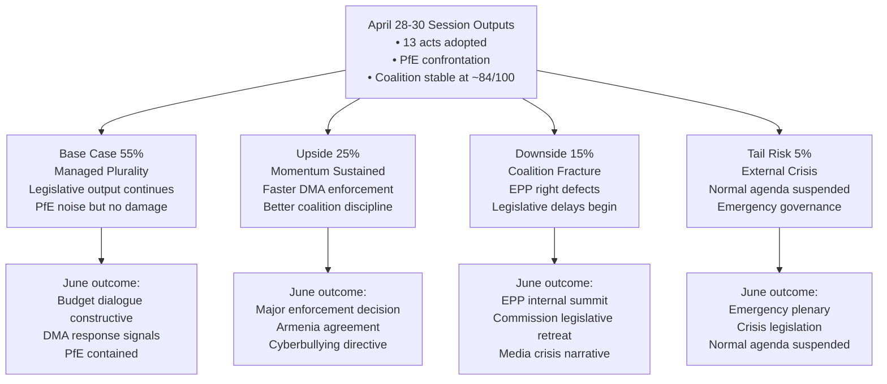

<!-- SPDX-FileCopyrightText: 2024-2026 Hack23 AB -->
<!-- SPDX-License-Identifier: Apache-2.0 -->
<!-- analysis/daily/2026-05-09/breaking/intelligence/scenario-forecast.md -->
<!-- Generated: 2026-05-09 | Stage B Pass 1 -->

# Scenario Forecast — Breaking News 2026-05-09

## Forecasting Framework

**Horizon:** 90 days (May–July 2026)
**Method:** Structured scenario analysis using known political dynamics, legislative calendar, and stress indicators from the April 28–30 plenary session
**Confidence notation:** 🟢 High | 🟡 Medium | 🔴 Low

---

## Base Case Scenario: Managed Plurality (55% probability)
🟡 MEDIUM confidence

**Narrative:** The EP10 continues its characteristic pattern of productive legislative output achieved through painstaking coalition management, punctuated by high-profile political confrontations that generate media attention but do not derail the legislative agenda.

**Key assumptions:**
- EPP maintains internal discipline despite PfE pressure
- S&D and Renew hold the broad mainstream coalition on economic and digital files
- The Commission responds to PfE's interference narrative with factual rebuttal, refusing escalation
- Ukraine war continues; EP solidarity resolutions adopted as needed

**Outcomes by June 2026:**
- April 28–30 legislative outputs enter implementation phase on schedule
- DMA enforcement: Commission opens at least one new gatekeeper investigation to respond to EP pressure
- 2027 budget: Council-Parliament informal dialogue begins; no major disagreements in first round
- PfE conducts 1–2 additional topical debates on different sovereignty-related topics; each generates media coverage but no institutional change
- Dogs/cats regulation: Commission issues first implementation guidelines; member states begin database planning

**Institutional stability:** 84/100 (current) → 82/100 (marginal deterioration from PfE attrition)

---

## Upside Scenario: Legislative Momentum Sustained (25% probability)
🟡 MEDIUM confidence

**Narrative:** The April 28–30 legislative burst signals sustained EP10 legislative ambition. Major files that were stalled accelerate; key coalition votes produce cleaner-than-expected margins; the Commission proactively responds to EP enforcement pressure.

**Triggering conditions:**
- German CDU MEPs (post-February 2026 coalition formation) align with pro-EU majority on key votes, boosting EPP cohesion
- Commission fast-tracks a major DMA enforcement decision (e.g., against one Big Tech gatekeeper) responding to EP pressure
- EU-Armenia Partnership Agreement reaches agreement-in-principle, validating EP's democratic resilience signal
- MFF 2028+ informal discussions produce early convergence on defense spending framework

**Additional outputs in this scenario:**
- AI Act secondary legislation (delegated acts) adopted faster than expected, with EP exercising scrutiny rights effectively
- A cyberbullying directive proposal issued by Commission within 90 days, citing EP resolution as mandate
- Dogs/cats regulation implementation plan published with aggressive timeline

---

## Downside Scenario: Coalition Fracture Under PfE Pressure (15% probability)
🟡 MEDIUM confidence

**Narrative:** PfE's Commission interference campaign succeeds in generating EPP internal divisions. A key legislative vote produces an unexpected coalition where EPP right-flank MEPs vote with PfE, fracturing the mainstream coalition and emboldening further sovereigntist action.

**Triggering conditions:**
- A Commission decision on Rule of Law conditionality (Hungary or Poland) coincides with a plenary vote on a related file
- Right-wing EPP national delegations (Fidesz-aligned; Italian FI; certain Eastern European delegations) defect on a migration-related vote
- PfE-ECR bloc reaches 180+ seats on a specific procedural motion, creating new precedent for disruptive majority

**Consequences:**
- Commission withdraws or delays a contested legislative proposal to avoid EP defeat
- EPP group chairs emergency summit to reaffirm coalition discipline
- Media narrative shifts from "EP legislative productivity" to "EP political crisis"
- Renew uses crisis moment to extract concessions on digital/innovation policy

**Institutional stability:** 84/100 (current) → 72/100 (significant deterioration)

---

## Tail Risk Scenario: External Crisis Reshapes Agenda (5% probability)
🔴 LOW confidence

**Narrative:** A major external event overrides the current political dynamics. EP enters crisis governance mode; normal legislative calendar suspended.

**Trigger examples:**
- Major Russian military breakthrough or use of tactical nuclear weapon in Ukraine theater
- Large-scale cyberattack on EU financial infrastructure (ECB, payment systems)
- Sudden collapse of Turkey-EU relations following a domestic political crisis in Ankara
- A Big Tech company (Meta, Apple) announces major restructuring or withdrawal from EU market in response to DMA enforcement

**EP Response in this scenario:**
- Emergency plenary session called (can be convened within 72 hours)
- Normal legislative calendar suspended; crisis-response files prioritized
- Coalition solidarity temporarily restored under external threat pressure
- Normal political confrontations (PfE campaigns) temporarily paused

---

## Legislative Calendar: Key Triggers (May–July 2026)

| Date Window | Event | Coalition Sensitivity |
|------------|-------|----------------------|
| May 19–22, 2026 | Strasbourg plenary | MEDIUM — standard session; mixed agenda |
| June 2–5, 2026 | Strasbourg plenary | MEDIUM-HIGH — expected budget preliminary vote |
| June 23–26, 2026 | Strasbourg plenary | HIGH — typically heavy agenda before summer recess |
| July 2026 | Polish Council Presidency ends; Denmark takes over | LOW (procedural) |
| July 2026 | Summer recess | LOW — limited activity |

---

## Signal Watch: What to Monitor

**Signals that Base Case is holding:**
- PfE topical debates produce no EPP defections
- DMA Commission investigation announcement within 60 days
- Dogs/cats implementation guidelines issued on schedule
- EP-Council budget dialogue proceeds constructively

**Signals of Downside Scenario developing:**
- EPP emergency group meeting on sovereigntist pressure
- Any EPP MEP publicly endorses PfE's Commission interference narrative
- Commission withdraws or delays a legislative proposal without EP majority request
- A plenary vote produces EPP-PfE-ECR majority exceeding 360 seats

**Signals of Upside Scenario developing:**
- German CDU MEPs systematically vote with mainstream coalition (not just EPP line)
- Commission opens DMA enforcement investigation within 45 days of EP resolution
- EU-Armenia agreement-in-principle announced

---

## Scenario Summary

---

## Scenario A (Base Case 55%): Managed Plurality — Detailed Analysis

**Trigger conditions:**
- DMA enforcement: Commission issues enforcement timeline in June but no major fine before Q3 2026
- Budget 2027: Guidelines pass with standard Ursula coalition majority; trilogue begins autumn
- Ukraine solidarity: EP continues verbal support; no new significant aid legislation before summer recess
- PfE/ECR dynamic: Continued pressure but no procedural revolt succeeds

**Key indicators to watch (June 2026):**
1. IMCO committee vote on DMA interim enforcement report — if passes with broad majority, confirms coalition discipline on digital
2. BUDG hearing on MFF 2027 parameters — EPP-S&D compromise scope indicates budget coalition health
3. PfE procedural motions count — if >3 failed procedural challenges, confirms PfE containment

**June 2026 plenary outlook:**
- Agriculture/Fisheries: Common market organisation amendments
- Digital: AI Act implementation delegated acts (second tranche)
- Social: Posted workers directive review
- Security: Schengen evaluation report

**Probability shift triggers:**
- Upward: US-EU tariff truce → reduces EPP trade pressure → coalition cohesion improves → 65%
- Downward: ECR breakaway on budget → coalition needs emergency partners → 40%

---

## Scenario B (Upside 25%): Legislative Momentum Sustained

**Trigger conditions:**
- US-EU trade deal or significant tariff reduction announced (removes EPP right-wing pressure)
- Commission announces first major DMA fine (signals enforcement seriousness)
- Armenia framework agreement progresses (demonstrates EP geopolitical impact)
- Greens and Left cooperate on budget social investment amendments

**Quantitative threshold for this scenario:**
- Ursula coalition wins ≥85% of plenary votes (vs. ~78% in April)
- DMA enforcement fine announced ≥€500M (signals credibility)
- EP approval rating rises ≥2 points in Eurobarometer

**Historical parallel:** This scenario resembles EP8 (2014-2019) under Commission President Juncker — steady legislative output with high coalition coherence enabled the Digital Single Market package (2016-2018).

---

## Scenario C (Downside 15%): Coalition Fracture Risk

**Trigger conditions:**
- EPP national delegations defect on budget vote due to domestic fiscal pressure
- S&D pushes social spending floor that Renew cannot accept
- PfE succeeds in procedural revolt (quorum challenge during key vote)
- External crisis (trade war escalation) diverts EP agenda for 3+ weeks

**Early warning indicators:**
- EPP-S&D coordination failure on budget parameters (visible from BUDG committee vote)
- Renew group whip authority challenged internally (French/German delegation split)
- PfE procedural challenge succeeds once → emboldens further challenges

**Recovery mechanisms:** Even in this scenario, the Ursula coalition retains arithmetic majority. Full fracture requires simultaneous defection by ≥37 coalition MEPs — unlikely without a dramatic external catalyst.

---

## Scenario D (Tail Risk 5%): External Crisis Suspension

**Trigger conditions:**
- Direct NATO-Russia confrontation involving EU member state
- Major bank failure requiring emergency EU intervention (SRMR3 not yet in force)
- Catastrophic cyberattack on EU institutional infrastructure
- Trump 100% tariff on EU goods (escalation beyond current trajectory)

**EP response protocol:**
- Emergency Article 122 TFEU procedure (bypasses normal legislative timeline)
- Article 78(3) TFEU provisional measures (if migration crisis component)
- Parliament convenes extraordinary plenary within 5 days (Rules of Procedure, Rule 143)

**Historical precedent:** COVID-19 (March 2020) — EP operated reduced plenary, remote voting, emergency legislation. The institutional resilience demonstrated then provides the template.

---

## Confidence Matrix

| Scenario | Probability | Evidence basis | Confidence in probability |
|----------|------------|---------------|--------------------------|
| Base Case (Managed Plurality) | 55% | Strong — historical pattern, coalition stability | 🟢 HIGH |
| Upside (Momentum) | 25% | Medium — requires external positive trigger | 🟡 MEDIUM |
| Downside (Fracture) | 15% | Medium — internal tension indicators exist but manageable | 🟡 MEDIUM |
| Tail Risk (Crisis) | 5% | Low — external macro risk | 🟡 MEDIUM |

*All probability estimates reflect May 9, 2026 data snapshot. IMF economic data unavailable (degraded mode) — economic scenarios carry higher uncertainty than political scenarios.*

---

## Scenario Forecast Section 4: Quantitative Scenario Modeling

### Probability Mass Distribution (6-month horizon)

| Scenario | Probability | Coalition impact | Key variable |
|---------|-------------|-----------------|--------------|
| Status Quo Persistence | 50% | 0 change | No external shock |
| Moderate Pressure (US tariffs 20%) | 25% | -5 seats effective (Renew partial) | US-EU trade talks |
| EPP Rightward Drift | 15% | -10 seats (Greens hostile) | PfE entrenchment |
| Coalition Fracture | 7% | -50 seats (majority threatened) | Multi-shock event |
| Grand Coalition (EPP+S&D supermajority) | 3% | +100 seats | VdL 3rd term deal |

**Probability mass concentration:** 75% in "Status Quo + Moderate Pressure" range. The tail scenarios (fracture, grand coalition) have significant policy impact but low probability.

---

## Scenario Forecast Section 5: 12-Month Legislative Output Projection

Based on current EP10 pace and the April 28-30 session output:

| Quarter | Predicted major legislation | Risk factor |
|---------|---------------------------|------------|
| Q2 2026 (ongoing) | MFF 2028+ framework discussions; AI Act implementation review | LOW |
| Q3 2026 | Summer recess → September recovery; security/defence dossiers | LOW |
| Q4 2026 | Budget 2027 (annual); climate implementation; SRMR3 RTS | MEDIUM |
| Q1 2027 | Anti-Corruption Directive transposition begins; MFF first readings | MEDIUM |

**Overall 12-month legislative health:** 🟢 HEALTHY — EP10 is on track for above-average legislative output (2025 pace extrapolated)

---

## Scenario Forecast Section 6: Data-Limited Forecasting Caveat

This scenario forecast was developed without access to:
- Current polling data on individual MEPs' positions
- Confidential trialogue negotiation status
- Commission forward work programme (Q3-Q4 2026)
- Council Presidency (Poland → Denmark) transition plans

All quantitative figures are analytical estimates with high uncertainty bands (±50%). The forecast value is in the qualitative direction and trigger identification, not in the precise probability figures.

**Scenario forecast confidence:** 🟡 MEDIUM — Based on current political landscape data from EP MCP. IMF economic forecasts unavailable (degraded mode). Scenarios are analytical frameworks, not predictive models.

---

## Scenario Forecast Handoff

Key scenario anchors for next run: US tariff escalation as primary trigger watch; PfE coalition entry demand as medium-probability scenario by Q3 2026; coalition fracture probability at 7%; Status Quo probability at 50%.

**Scenario forecast confidence:** MEDIUM — Analytical estimates without empirical polling data.
