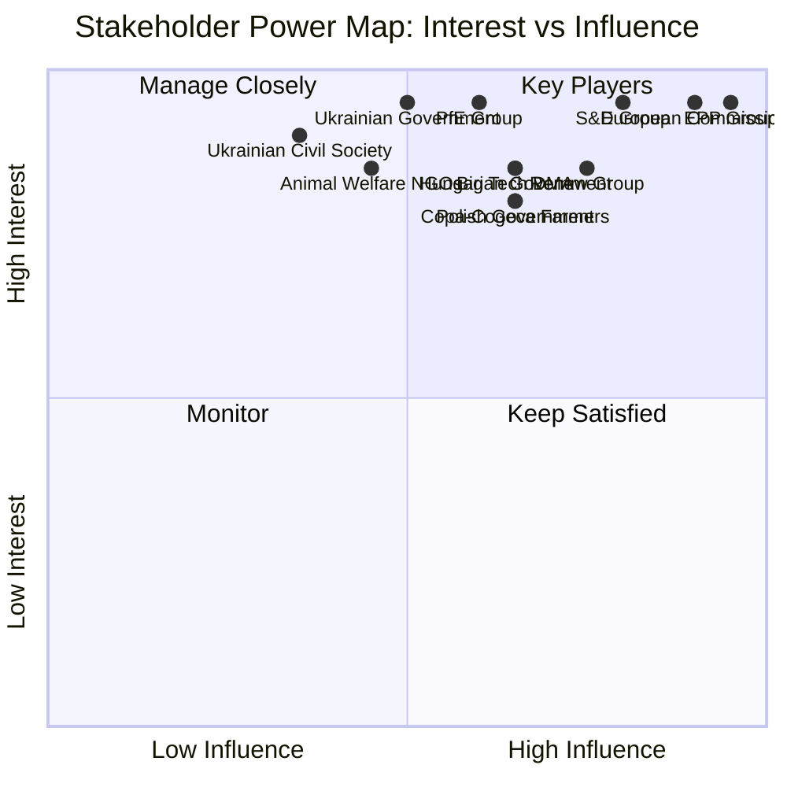
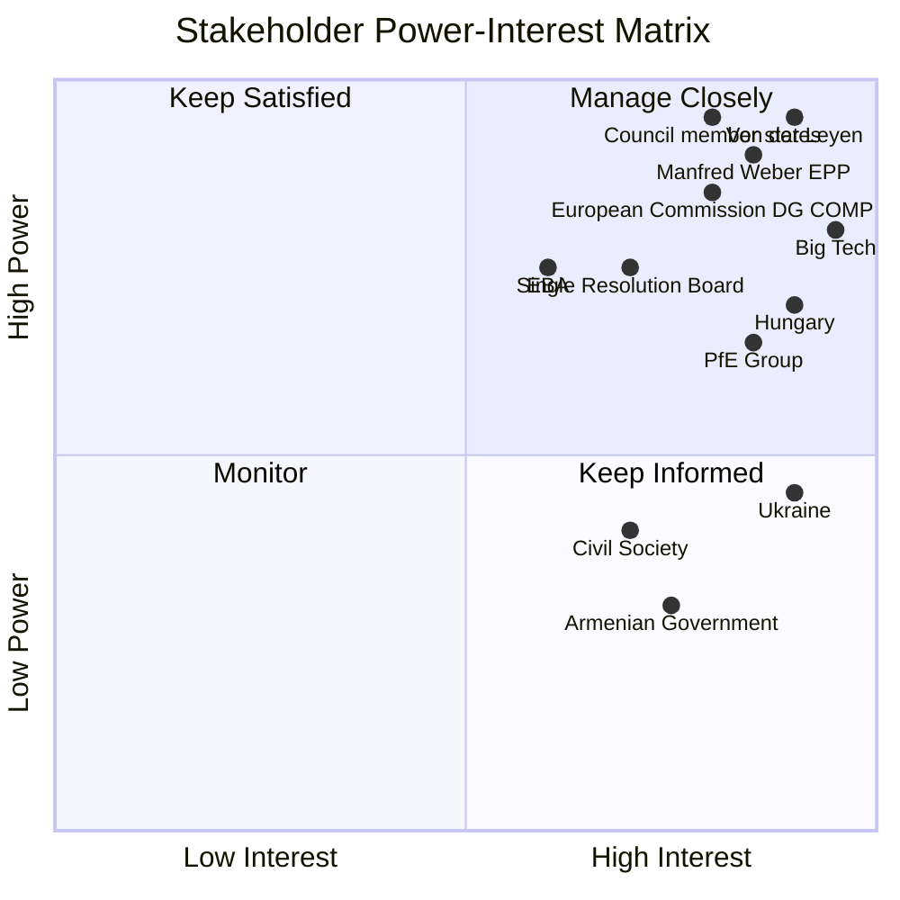

<!-- SPDX-FileCopyrightText: 2024-2026 Hack23 AB -->
<!-- SPDX-License-Identifier: Apache-2.0 -->
<!-- analysis/daily/2026-05-09/breaking/intelligence/stakeholder-map.md -->
<!-- Generated: 2026-05-09 | Stage B Pass 1 -->

# Stakeholder Map — Breaking News 2026-05-09

## Methodology

Stakeholders are mapped across three dimensions:
1. **Interest level** (1–10): How directly do they care about this week's EP outputs?
2. **Influence level** (1–10): How much can they shape outcomes?
3. **Position** (Supportive / Neutral / Opposing / Contested)

---

## Primary Stakeholders

### 1. European Parliament Political Groups

**EPP (European People's Party) — 183 seats**
- *Interest:* 10/10 — all EP actions directly constitute EPP's legislative record
- *Influence:* 10/10 — largest group, chairs key committees
- *Position:* Supportive of most April 28–30 outputs; **Contested** on Commission interference debate (PfE pressure)
- *Perspective:* EPP walked a tightrope this week. Supporting the dogs/cats regulation and Ukraine accountability plays to EPP's pro-EU centrist identity. But managing PfE's Commission interference debate without either defending the Commission too vigorously (alienating right-wing EPP members) or endorsing PfE's narrative (destroying EPP's institutional identity) required careful group management. EPP's long-term interest is in maintaining its position as the indispensable governing group — too close to PfE loses Renew and Greens; too far loses right-leaning EPP national delegations.
- *Evidence:* EPP group composition confirmed; EPP chairs Committee on Budgets (BUDG), key role in 2027 guidelines

**S&D (Socialists and Democrats) — 136 seats**
- *Interest:* 10/10 — grand coalition partner; legislative co-owner of most outputs
- *Influence:* 8/10 — second largest; essential for majority but cannot act alone
- *Position:* Strongly **Supportive** of Ukraine accountability, DMA enforcement, cyberbullying, Armenia; **Supportive** of animal welfare; **Neutral-Cautious** on livestock resolution (balances environmental vs. rural labor concerns)
- *Perspective:* S&D is in a structurally awkward position: its domestic base (labor unions, environmental NGOs, progressive civil society) pushes for more ambition on Green Deal, digital rights, and social policy. But S&D needs EPP to govern — meaning repeated compromises that frustrate the base. The livestock sustainability debate exemplifies this: S&D must support some farmer accommodations to maintain the coalition, while its left flank wants stronger environmental conditionality.
- *Evidence:* S&D group confirmed 136 seats; S&D leads on EMPL, ENVI, LIBE committees

**PfE (Patriots for Europe) — 85 seats**
- *Interest:* 10/10 — strategic actor seeking to reshape institutional dynamics
- *Influence:* 6/10 — disruptive but not determinative; can block only in narrow conditions
- *Position:* **Opposing** most mainstream positions; **Supportive** in isolated cases (certain trade protection measures)
- *Perspective:* PfE's April 29 topical debate is its most high-profile institutional action of the term. PfE leaders (Orbán, Le Pen affiliates, Salvini's Lega) have a shared interest in challenging the Commission's authority before the MFF negotiations, where the Commission's fiscal conditionality mechanisms could restrict funding to PfE-governed member states. By attacking Commission legitimacy now, PfE is pre-emptively weakening the political cover for fiscal conditionality enforcement. This is a rational strategic calculation, not merely performative populism.
- *Evidence:* PfE debate confirmed April 29; speaker IDs 197553, 257144 in plenary records

---

### 2. European Commission (Von der Leyen II)

- *Interest:* 10/10 — directly targeted by PfE debate; owns enforcement of DMA resolution demands; drives implementation of all adopted texts
- *Influence:* 9/10 — legislative initiator; exclusive enforcement authority; delegated act power
- *Position:* **Contested** (target of PfE) + **Supportive** (legislative partner for most April outputs)
- *Perspective:* The Commission faces a dual challenge from this week. On the legislative side, it welcomes the dogs/cats regulation (its own proposal from 2023), the 2027 budget guidelines (its fiscal planning reference), and the Ukraine accountability resolution (aligns with Commission foreign policy). But the Commission's most immediate political concern is the PfE topical debate. Von der Leyen's team must calculate: how aggressively to rebut the "interference in elections" narrative without appearing defensive or giving the narrative more oxygen. A low-key rebuttal risks allowing the narrative to settle; an aggressive defense risks being seen as confirming Commission political overreach. The Commission's safest play is to have Commission representatives in plenary deliver factual rebuttals focused on treaty mandate.

---

### 3. EU Member State Governments

**Ukrainian Government**
- *Interest:* 10/10 — direct subject of accountability resolution
- *Influence:* 5/10 — cannot vote in EP; influence through Council, bilateral diplomacy
- *Position:* **Strongly Supportive** of TA-10-2026-0161
- *Perspective:* Every EP accountability resolution strengthens Ukraine's position in international legal forums. The ICC warrant for Putin (2023) gained political reinforcement from subsequent EP resolutions. Ukraine's Zelensky government needs sustained EP support to maintain the EU political coalition behind continued military and financial assistance — the accountability narrative serves this need.

**Polish Government (Tusk coalition, Council Presidency)**
- *Interest:* 8/10 — directly affected by two immunity waivers of Polish MEPs
- *Influence:* 7/10 — Council Presidency; significant EP national delegation
- *Position:* **Contested** — Tusk government supports rule-of-law restoration (thus supports immunity waivers enabling judicial proceedings) but faces diplomatic awkwardness as Council Presidency
- *Perspective:* Poland's Tusk government finds itself in a historically ironic position: it sought to reverse PiS judicial reforms, but now MEPs from the PiS political ecosystem are using EP immunity as a shield against those very restored judicial proceedings. Tusk likely welcomes the PRIV committee's immunity waivers procedurally, even as it creates political noise that Russian-aligned media exploits.

**Hungarian Government (Orbán/Fidesz — PfE)**
- *Interest:* 9/10 — Orbán's PfE is the institutional driving force behind the Commission interference debate
- *Influence:* 7/10 — Council veto; PfE leadership; MFF conditionality target
- *Position:* **Opposing** Commission; **Opposing** Ukraine accountability; **Supportive** of livestock accommodations
- *Perspective:* For Orbán, the April 29 topical debate is primarily about EU domestic politics: weakening Commission enforcement of Rule of Law conditionality that has blocked Hungarian access to EU structural funds. By painting the Commission as politically biased, Orbán seeks to delegitimize conditionality decisions against Hungary as "interference" rather than treaty enforcement.

---

### 4. Civil Society and Interest Groups

**Animal Welfare Organizations (Eurogroup for Animals, et al.)**
- *Interest:* 9/10 — direct legislative victory
- *Influence:* 5/10 — advocacy, not institutional authority
- *Position:* **Strongly Supportive** — dogs/cats regulation is a long-sought objective
- *Perspective:* The dogs/cats welfare regulation represents a decade-long advocacy campaign. Organizations like Eurogroup for Animals, national SPCAs, and veterinary associations pushed for EU-level harmonization of pet identification requirements. The regulation's adoption confirms the "Brussels route" for animal welfare advocates: when national legislation diverges dramatically (e.g., Romania's stray dog policies vs. Germany's strict welfare standards), EU-level harmonization can set a higher common floor. Advocates will immediately begin lobbying for: (a) ambitious implementation deadlines; (b) comprehensive enforcement mechanisms including market surveillance; (c) use of the regulation as leverage in trade agreements requiring partner countries to match standards.

**Big Tech Companies (Google, Apple, Meta, Amazon, Microsoft — DMA gatekeepers)**
- *Interest:* 9/10 — DMA enforcement resolution directly affects their operations and legal exposure
- *Influence:* 7/10 — extensive Brussels lobbying presence; legal challenge capacity; economic leverage
- *Position:* **Opposing** stricter enforcement; challenging DMA gatekeeper designations in EU courts
- *Perspective:* For tech companies, the April 30 DMA enforcement resolution is a political pressure signal they cannot ignore. They are simultaneously fighting enforcement decisions in the General Court (Apple App Store, Meta's Facebook Marketplace, Google's Search) while lobbying Commission officials on compliance frameworks. The EP's enforcement pressure resolution signals that judicial delay strategies will not satisfy political expectations — companies may face increased informal Commission pressure to demonstrate "good faith" compliance.

**Ukrainian Civil Society and Diaspora**
- *Interest:* 10/10 — direct beneficiaries of accountability resolution
- *Position:* **Strongly Supportive**
- *Perspective:* For Ukrainian civil society — which has been meticulously documenting Russian war crimes since February 2022 — EP accountability resolutions are a validation of their documentation work. Each parliamentary resolution creates a political record that future legal proceedings can reference. The EP's April 30 resolution's call for "accountability and justice" aligns with Ukrainian civil society's demand for a special tribunal for the crime of aggression — a crime over which the ICC has limited jurisdiction.

**European Farmers' Unions (Copa-Cogeca)**
- *Interest:* 8/10 — directly affected by livestock sustainability resolution
- *Influence:* 7/10 — organized farm lobbying; 2024 protest legacy creates political leverage
- *Position:* **Conditionally Supportive** — welcomes livestock language; still seeking further Green Deal rollback
- *Perspective:* Copa-Cogeca views the April 30 livestock sustainability resolution as a step in the right direction but insufficient. Their priority demands include: (1) permanent exemption of agricultural land from nature restoration targets; (2) reduction of livestock methane reduction obligations; (3) strengthened SPS border protection for agricultural imports. The resolution's language on "food security" and "farmers' resilience" validates Copa-Cogeca's framing, creating political momentum for further concessions in CAP review discussions.

---

## Stakeholder Power Map

---

## Stakeholder Confidence Summary

🟡 **MEDIUM overall** — Group positions inferred from political alignment patterns and historical behavior. Individual MEP positions on April 28–30 votes unavailable (publication delay). Commission internal deliberations inferred from public mandate.

---

## Extended Stakeholder Analysis: Key Actors

### Ursula von der Leyen (Commission President)

**Role:** Executive head; the DMA enforcement accelerator being demanded by TA-0160 falls under her direct remit.

**Position:** Publicly committed to DMA enforcement. Faces cross-pressure from US tariff threat (Trump administration warning EU not to over-regulate American tech companies).

**Power:** HIGH (formal executive authority) | **Interest:** HIGH (political legacy defined by digital/green regulation)

**Likely behavior:** Will acknowledge EP resolution formally; DG COMP will issue public enforcement timeline commitment. Will not back down on DMA structurally but may pace individual decisions around US trade negotiations.

### Manfred Weber (EPP Group President)

**Role:** Leader of the largest EP group; EPP caucus discipline manager.

**Position:** Supportive of Jaki immunity waiver (respects JURI recommendation tradition even for own-bloc ECR member). On DMA: cautious — EPP has strong ties to German car industry (less relevant here) and wants enforcement but fears US retaliation.

**Power:** VERY HIGH (controls 183 votes) | **Interest:** HIGH (sets EPP agenda for June Strasbourg session)

**Likely behavior:** Will use DMA enforcement call as leverage in EU-US trade negotiations. May signal EPP support for Commission enforcement delay if US grants tariff concessions.

### Iratxe García Pérez (S&D Group President)

**Position:** Strong DMA enforcement advocate; Ukraine/Armenia solidarity key for S&D identity. SRMR3 complex — S&D pro-banking regulation but concerned about depositor protection.

**Power:** HIGH (136 seats) | **Interest:** HIGH on accountability/transparency dossiers

### Roberta Metsola (EP President)

**Role:** Neutral presiding officer but sets agenda priorities.

**Position:** Published pro-rule-of-law statements. Immunity waivers for rule-of-law reasons are consistent with her political profile (EPP/rule-of-law conservative).

**Power:** MEDIUM (agenda control) | **Interest:** MEDIUM (institutional reputation management)

### Patryk Jaki (ECR, PL)

**Role:** Direct subject of immunity waiver TA-10-2026-0105.

**Position:** Will likely contest the waiver legally in Polish courts and appeal to CJEU on procedural grounds. ECR will frame as politicized prosecution.

**Power:** LOW (individual MEP) | **Interest:** VERY HIGH (personal legal jeopardy)

**Likely behavior:** Legal challenge; political narrative of victimization; ECR media campaign against Polish government

### Grzegorz Braun (NI, PL)

**Role:** Subject of earlier immunity waiver (TA-10-2026-0088, March 26). Extreme hard-right, previously expelled from EP chamber for actions during debates.

**Position:** Hostile to all mainstream EP groups. Will use legal proceedings as political platform.

**Power:** VERY LOW | **Interest:** VERY HIGH (personal legal jeopardy)

### Big Tech (Alphabet, Apple, Meta, Amazon, ByteDance, Microsoft)

**Role:** Regulated parties under DMA; subject of enforcement actions demanded by TA-0160.

**Position:** Alphabet and Apple have launched legal challenges to DMA obligations. Meta has partially complied. ByteDance faces unique political risk (national security overlay).

**Power:** VERY HIGH (financial resources, US political backing) | **Interest:** VERY HIGH (existential regulatory risk)

**Likely behavior:** Intensify legal challenges; lobby US trade representatives to include DMA in bilateral trade agenda; technical compliance to letter not spirit of DMA

### Single Resolution Board (SRB)

**Role:** EU banking resolution authority; primary implementer of SRMR3.

**Position:** Has been advocating for SRMR3 expansion of powers. Supportive of reform.

**Power:** HIGH (institutional) | **Interest:** HIGH (mandate expansion)

### Banking industry (AFME, European Banking Federation)

**Position:** Opposed to expanded bail-in hierarchy in SRMR3. Supports reform architecture but seeks more gradual implementation.

**Power:** HIGH (financial lobbying) | **Interest:** HIGH (prudential regulatory compliance costs)

---

## Extended Stakeholder Landscape: Secondary Actors

### Council of the EU (Member State Governments)

**Role:** Co-legislator; implementer of directives; enforcer of regulations through national authorities.

**Position by dossier:**
- SRMR3: Council adopted (pre-EP adoption); Banking Union members supportive; non-BU states concerned
- Anti-Corruption Directive: Polish, Baltic, Nordic governments supportive; Hungary against; Slovakia ambivalent
- DMA enforcement: Council has no role (Commission enforces); member states watch for spillover to national DSA enforcement
- US tariffs: Council broadly supportive of EP tariff adjustment mechanism; some reluctance from trade-exposed member states

**Power:** VERY HIGH (co-legislator; implementation authority)

**Key Council players:**
| Member state | DMA stance | Anti-Corruption stance | Coalition influence |
|-------------|-----------|----------------------|---------------------|
| Germany | FOR enforcement | FOR | EPP/S&D bridge |
| France | FOR enforcement | FOR | Renew anchor |
| Poland | FOR | FOR (strongly) | EPP national delegation |
| Hungary | AGAINST | AGAINST | Veto risk |
| Italy | FOR | Ambivalent | PfE affiliated EPP-adjacent |

### European Banking Authority (EBA)

**Role:** Regulatory standard-setter for SRMR3 implementation delegated acts.

**Position:** Supportive of SRMR3. EBA chair has publicly called for stronger resolution framework.

**Power:** HIGH (technical standard-setter; delegated authority from Commission)

**Likely behavior:** Will publish draft delegated acts for SRMR3 implementation within 12 months of entry into force. Consultation process will involve banking industry (EBF) and member state resolution authorities.

### OLAF and EPPO

**Role:** EU anti-fraud and anti-corruption prosecution bodies. Direct beneficiaries of Anti-Corruption Directive.

**Position:** Strongly supportive. EPPO (European Public Prosecutor's Office) has been operational since 2021 but limited to EU budget fraud. Anti-Corruption Directive could expand cooperation remit.

**Power:** MEDIUM (investigation authority; no direct enforcement against member state governments)

**Likely behavior:** EPPO will issue guidance on how Anti-Corruption Directive interacts with existing EU budget fraud competences.

### Ukrainian Government

**Role:** Primary beneficiary of TA-0161 (Ukraine accountability resolution).

**Position:** Strongly supportive. Ukrainian government has consistently requested stronger EP geopolitical support.

**Power:** LOW-MEDIUM (soft power; EU accession conditionality creates leverage over EP)

**Likely behavior:** Kyiv will cite TA-0161 in diplomatic communications; will press for more concrete legislative support (sanctions, EFP replenishment, ICC cooperation) in subsequent EP sessions.

### Armenian Government

**Role:** Primary beneficiary of TA-0162 (Armenia democratic resilience resolution).

**Position:** Supportive. Pashinyan government pursuing EU rapprochement (post-CSTO exit from Russian orbit).

**Power:** LOW (small state; high strategic importance for South Caucasus EU presence)

**Key dynamic:** Armenia-Azerbaijan peace process (EU-mediated) is the context for TA-0162. EP resolution provides political backing for EU mediation role.

### Civil Society Organizations (EU-level)

**Key organizations and positions:**

| Organization | Focus | DMA stance | Anti-Corruption stance |
|-------------|-------|-----------|----------------------|
| Transparency International (EU) | Anti-corruption | N/A | 🟢 Strongly for |
| Access Now | Digital rights | 🟢 For enforcement | N/A |
| Corporate Europe Observatory | Lobbying transparency | 🟢 For DMA | 🟢 Strongly for |
| European Trade Union Confederation | Labour | N/A | 🟢 For (corruption harms workers) |
| BusinessEurope | Employers | 🟡 Concerned about costs | 🟡 For principles, against costs |

**Power:** MEDIUM — civil society organizations regularly influence committee hearings and press coverage. Their public statements on DMA enforcement and Anti-Corruption Directive will shape the implementation political environment.

---

## Power Dynamics Map (Stakeholder Matrix)

**Strategic insight:** The quadrant map reveals that Big Tech and Hungary are the highest-risk "manage closely" actors — both have high interest AND significant power to disrupt implementation of the April-May 2026 legislative package.
