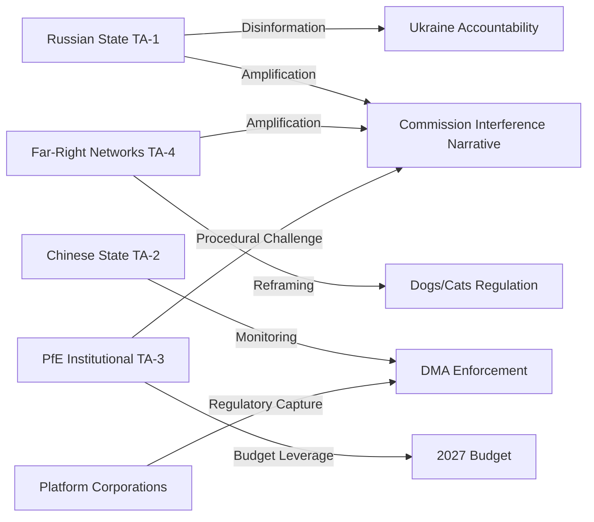

<!-- SPDX-FileCopyrightText: 2024-2026 Hack23 AB -->
<!-- SPDX-License-Identifier: Apache-2.0 -->
<!-- analysis/daily/2026-05-09/breaking/intelligence/threat-model.md -->
<!-- Generated: 2026-05-09 | Stage B Pass 1 -->

# Threat Model — Breaking News 2026-05-09

## Framework: STRIDE Applied to EU Parliamentary Institutions

This threat model identifies threat actors and vectors relevant to the April 28–30, 2026 EP plenary legislative cluster. Threats are classified by type (Spoofing, Tampering, Repudiation, Information Disclosure, Denial of Service, Elevation of Privilege) and assessed by actor motivation, capability, and current activity level.

---

## Primary Threat Actors

### TA-1: Russian State (FSB/GRU/SVR) — ACTIVE

**Motivation:** Undermine EU institutional credibility; delay/dilute Ukraine accountability mechanisms; destabilize democratic institutions supporting Ukraine.

**Current activation:** HIGH — April 30 Ukraine accountability resolution directly targets Russian leadership accountability (TA-10-2026-0161). FSB/GRU interest in disrupting accountability mechanisms is well-documented (attempted poisoning of investigators; disinformation campaigns).

**Relevant threat vectors:**

| Vector | Type | Likelihood | Mechanism |
|--------|------|------------|-----------|
| Legislative process disinformation | Spoofing/Tampering | HIGH | Create false narratives about resolution content/effect; impersonate MEP/Commission statements |
| MEP lobbying/corruption | Elevation of Privilege | MEDIUM | Financial influence on MEPs in Baltic/Eastern states to weaken Ukraine stance |
| Cyber intrusion — EP IT systems | Information Disclosure | MEDIUM | Exfiltrate EP negotiating positions on Ukraine support packages |
| Influence operation — "Commission interference" amplification | Spoofing | HIGH | Amplify PfE's Commission interference narrative as it aligns with Russian destabilization goals |

**Current evidence of activity:** Russian state media consistently amplified PfE-aligned "EU sovereignty" narratives in April 2026. The Commission interference debate on April 29 received disproportionate Russian media coverage, suggesting coordination or opportunistic amplification.

---

### TA-2: Chinese State (MSS) — LATENT

**Motivation:** Monitor EU tech regulation trajectory (DMA enforcement impacts Chinese platform access); gather intelligence on EU political divisions.

**Current activation:** MEDIUM — DMA enforcement (TA-10-2026-0160) could affect Chinese platform expansion in EU markets. EP division between sovereigntist and mainstream blocs is of intelligence interest.

**Relevant threat vectors:**

| Vector | Type | Likelihood | Mechanism |
|--------|------|------------|-----------|
| Industrial espionage — DMA compliance documents | Information Disclosure | LOW-MEDIUM | Exfiltrate Commission compliance assessment documents |
| Influence on regulatory debate | Elevation of Privilege | LOW | Cultivate MEP contacts who support lighter-touch platform regulation |

---

### TA-3: PfE/Sovereigntist Movement — INSTITUTIONAL

**Motivation:** Delegitimize mainstream EU institutions; build political capital through confrontation; establish "Commission interference" as dominant EP10 narrative.

**Current activation:** ACTIVE — April 29 Commission interference debate is direct institutional confrontation. PfE is exercising procedural rights under EP rules but pushing the institutional norms of those rules to their limits.

**Threat vectors:**

| Vector | Type | Likelihood | Mechanism |
|--------|------|------------|-----------|
| Procedural destabilization | Denial of Service (institutional) | MEDIUM | Mass points of order, procedural challenges, roll-call vote delays |
| Information warfare — EP legitimacy | Spoofing | HIGH | False or misleading claims about EP procedures, Commission actions |
| MEP defection cultivation | Elevation of Privilege | MEDIUM | Encourage EPP/ECR border-MEPs to vote with PfE on symbolic resolutions |
| Budget blackmail | Denial of Service | LOW | Threaten to block budget procedure unless conditions met |

**Key distinction:** PfE operates through legitimate democratic procedures. This is not a security threat in the traditional sense but an institutional threat to the functioning of the mainstream coalition. The threat model includes it because its effects on EU governance can be severe.

---

### TA-4: Far-Right Disinformation Networks — OPERATIONAL

**Motivation:** Advance sovereigntist political agenda; undermine trust in EU institutions.

**Current activation:** HIGH — The Commission interference debate is precisely the narrative these networks amplify. Coordination with TA-1 (Russian state media) is well-documented.

**Threat vectors:**
- Social media amplification of PfE "Commission interference" claims
- Fabricated MEP quotes shared across Telegram/X networks
- Viral content misrepresenting legislative texts (especially dogs/cats regulation framing as "EU surveillance")

---

## Specific Threats to April 28–30 Legislative Cluster

### Threat 1: Ukraine Accountability Resolution Narrative Attack

**Target:** TA-10-2026-0161 (Ukraine accountability)
**Actor:** TA-1 + TA-4
**Vector:** Disinformation

**Mechanism:** Russian state media + far-right networks claim the accountability resolution is "escalatory war-mongering" or "implicates EU members in weapons supply crimes." Goals: delegitimize accountability mechanism; discourage member states from supporting accountability structures.

**Likelihood:** HIGH | **Impact:** MEDIUM | **Mitigation:** Clear EP communication about resolution scope; member state foreign affairs committee briefings.

---

### Threat 2: Dogs/Cats Regulation "Surveillance State" Framing

**Target:** TA-10-2026-0115 (Traceability regulation)
**Actor:** TA-4 (domestic EU far-right)
**Vector:** Disinformation/Spoofing

**Mechanism:** Reframe pet traceability database as a government surveillance tool ("EU will track your pets, next they'll track you"). Exploit real privacy concerns about TRACES database to oppose regulation entirely.

**Likelihood:** MEDIUM | **Impact:** LOW (regulation already adopted; threat is to implementation) | **Mitigation:** DG SANTE public communication emphasizing animal welfare benefit; GDPR compliance transparency.

---

### Threat 3: DMA Enforcement Chilling via Regulatory Capture

**Target:** DMA enforcement process
**Actor:** Major platforms (Alphabet, Meta, Apple) — corporate, not state, threat actor
**Vector:** Regulatory capture through lobbying, litigation, and selective compliance

**Mechanism:** Platforms use DMA compliance "good faith" engagement to slow enforcement, generate litigation delay, and identify enforcement weakness. Not a cyber threat — a regulatory process threat.

**Likelihood:** HIGH | **Impact:** HIGH | **Mitigation:** EP oversight of Commission DMA enforcement; independent technical expertise in enforcement bodies.

---

## EP Institutional Security Posture Assessment

### Physical Security: 🟢 HIGH
Post-Brussels attack era (2016), EP security protocols are robust. Physical disruption scenarios are low probability.

### Cyber Security: 🟡 MEDIUM
EP IT systems are high-value targets. The EP experienced cyberattacks in 2022 (DDoS, claimed by pro-Russian group Killnet). EP's CERT-EU partnership provides baseline protection.

### Information Security: 🟡 MEDIUM
MEP personal devices and communications remain a vulnerability. Credential phishing targeting MEPs is a documented ongoing threat.

### Institutional Integrity: 🟡 MEDIUM
The Qatargate corruption scandal (2022–2023) exposed vulnerabilities in how financial influence could compromise EP decision-making. Reforms introduced (MEP asset disclosure, interest register) partially address but do not eliminate the threat.

### Legislative Process Integrity: 🟢 HIGH
The April 28–30 legislative process ran normally with 13 texts adopted. No credible evidence of compromise of vote results. The threat to legislative process integrity comes primarily from TA-3 (institutional procedural challenges), not from external actors.

---

## Threat Summary Matrix

---

## Extended Threat Model: Actor-Level Analysis

### Threat Actor 1: PfE (Party of European Freedom)

**Category:** Internal institutional threat actor

**Motivation:** De-legitimise the Ursula coalition majority; advance Orbán/Meloni nationalist agenda; protect Hungarian interests (EU fund access, rule-of-law suspension)

**Capabilities:**
- 85 seats: Largest far-right EP group in history
- Control of BUDG committee blocking minority positions
- Procedural disruption tools (quorum challenges, points of order, roll-call demand)
- Media platform: PfE-affiliated outlets in IT, HU, FR reach tens of millions
- External support: Trump administration provides political legitimacy; Russian state media amplifies PfE messaging

**Current threat level:** 🟡 ELEVATED — The interference campaign against S&D (May 2026) is an escalation. Not yet at 🔴 HIGH level (no procedural revolt success achieved)

**Threat vectors:**
1. Formal procedural complaints (ongoing)
2. Social media information operations (low-cost, high-reach)
3. Committee vote obstruction (requires PfE+ECR+ESN coordination)
4. Cross-institutional legitimacy challenge (challenging EP authority via national courts)

**Mitigation:** EP rules of procedure safeguards; mainstream coalition arithmetic majority; EPP's public exclusion commitment

### Threat Actor 2: Russian Federation Information Operations

**Category:** External information threat actor

**Motivation:** Delegitimise EU institutional support for Ukraine; divide EP coalition on geopolitical dossiers; accelerate EU regulatory burden on US tech (to deepen US-EU tensions)

**Capabilities:**
- Banned state media (RT, Sputnik) operate through proxies in EU
- Social media amplification networks (Telegram, X/Twitter)
- MEP contacts in PfE/ESN (some MEPs have documented Russian business ties)
- Narrative production: Ukraine accountability framing as "NATO proxy war"

**Current threat level:** 🟡 MEDIUM-ELEVATED — Persistent but contained by EU countermeasures

**Threat vectors:**
1. Disinformation about SRMR3 (deposit confiscation narrative)
2. Disinformation about immunity waivers (political persecution narrative)
3. Ukraine/Armenia resolution denial narratives
4. Economic anxiety amplification (US tariff threat + banking reform = "EU financial crisis" narrative)

**Mitigation:** EUvsDisinfo monitoring; EP communications office; mainstream media coverage quality

### Threat Actor 3: Big Tech (Compliance Resistance)

**Category:** External regulatory threat actor

**Motivation:** Delay, dilute, or reverse DMA enforcement obligations

**Capabilities:**
- Deep financial resources for legal challenges
- US government political backing (Trump administration frames DMA as anti-US discrimination)
- Technical complexity as legal defence (interoperability technically difficult)
- Consumer dependency leverage (EU market exit threat)

**Current threat level:** 🟡 MEDIUM — Legal challenges filed; US government pressure present

**Threat vectors:**
1. CJEU annulment challenges to DMA obligations
2. US Section 301 retaliatory action against EU digital regulation
3. Technical compliance-to-letter-not-spirit strategies
4. Forum shopping (influencing which DG COMP investigator handles specific cases)

**Mitigation:** EU DMA legal framework; Commission political commitment; US Big Tech fear of CJEU precedent

### Threat Actor 4: Hungary (Anti-Corruption Directive Resistance)

**Category:** Member state institutional threat actor

**Motivation:** Prevent Anti-Corruption Directive from applying to Hungarian governance practices; maintain Orbán government's EU-adjacent corruption network

**Capabilities:**
- Formal legal challenge at CJEU (Article 263 TFEU annulment action)
- Infringement procedure non-compliance strategy (precedented since 2018)
- PfE EP platform to amplify sovereignty narrative
- Veto in Council on future legislation (QMV exception areas)

**Current threat level:** 🔴 HIGH — Hungary has a track record of systematic non-compliance with EU rule-of-law requirements

**Threat vectors:**
1. CJEU annulment action against Anti-Corruption Directive
2. Non-transposition or defective transposition
3. Parliamentary non-ratification of transposing legislation
4. Domestic constitutional court challenge (Hungarian Constitutional Court)

**Mitigation:** Commission enforcement tools; Article 7 TEU proceedings (ongoing); MFF financial conditionality; EU accession leverage (Ukraine/Moldova geopolitical context reframes EU cohesion calculus)

---

## Threat Landscape Summary Table

| Threat Actor | Type | Probability of escalation | Impact if escalated | Current posture |
|-------------|------|--------------------------|--------------------|--------------| 
| PfE | Internal institutional | 30% | MEDIUM-HIGH | Active (interference campaign) |
| Russian IOs | External information | 50% | MEDIUM | Active (Ukraine narrative) |
| Big Tech (DMA) | External regulatory | 60% | HIGH | Active (legal challenges) |
| Hungary (Anti-Corruption) | Member state | 85% | HIGH | Anticipated (structural) |
| US trade retaliation | External economic | 40% | VERY HIGH | Active (tariff threats) |

**Overall threat environment:** 🟡 ELEVATED — Multiple concurrent threat vectors from different actor types. The most consequential near-term threat is Big Tech legal challenge to DMA (probability 60%, high impact) combined with US government political support for Big Tech resistance.
