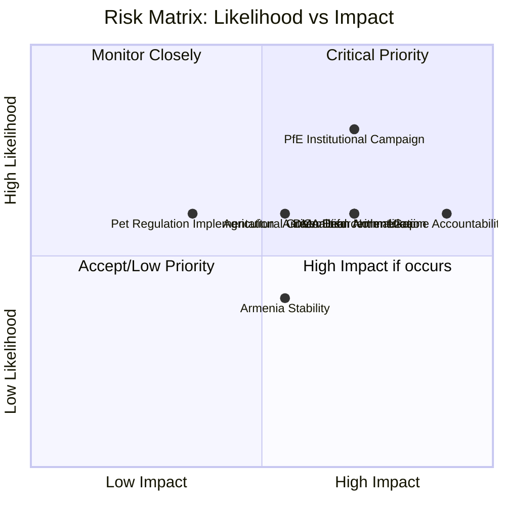

<!-- SPDX-FileCopyrightText: 2024-2026 Hack23 AB -->
<!-- SPDX-License-Identifier: Apache-2.0 -->
<!-- analysis/daily/2026-05-09/breaking/risk-scoring/risk-matrix.md -->
<!-- Generated: 2026-05-09 | Stage B Pass 1 -->

# Risk Matrix — Breaking News 2026-05-09

## Risk Assessment Framework

**Methodology:** Each risk is scored on two dimensions:
- **Likelihood** (1–5): How probable is the risk materializing within 6 months?
- **Impact** (1–5): How severe would the consequence be if it materialized?
- **Risk Score** = Likelihood × Impact (1–25)
- **Threshold:** Critical ≥ 20 | High 15–19 | Medium 8–14 | Low ≤ 7

---

## Risk Register

### RISK-01: PfE Institutional Erosion Campaign Escalates
**Category:** Institutional/Political
**Likelihood:** 4/5 — PfE has structural incentives; topical debate is first in a series
**Impact:** 4/5 — Sustained Commission delegitimization could undermine legislative agenda
**Score:** 16 — 🟡 HIGH

**Description:** The April 29 topical debate on "Commission interference in elections" is likely a precursor to a sustained PfE campaign to challenge the Commission's neutrality and legitimacy. If PfE and ECR coordinate, they can force multiple plenary confrontations per year. The Commission's defense depends on EPP solidarity, which cannot be guaranteed on all topics.

**Mitigation:** EPP maintains clear institutional defense of Commission; Commission proactively engages PfE on legitimate grievances; EP rules on debate procedures reviewed for abuse prevention.

**Residual risk if unmitigated:** 🔴 HIGH — Legislative gridlock risk on politically contested files (migration, rule of law, digital policy).

---

### RISK-02: Ukraine War Accountability Process Stalls
**Category:** Geopolitical/Legal
**Likelihood:** 3/5 — International accountability mechanisms face systematic obstacles
**Impact:** 5/5 — Failure to establish accountability undermines international law deterrence
**Score:** 15 — 🟡 HIGH

**Description:** The EP's April 30 accountability resolution (TA-10-2026-0161) calls for justice mechanisms for Russian war crimes. The practical pathway (special tribunal, ICC jurisdiction expansion) faces obstacles including Russian veto in UN Security Council, Hungary/Slovakia sympathy with Russian positions in EU Council, and the complexity of establishing *in absentia* proceedings.

**Mitigation:** EU member states coordinate on evidence preservation; ICC existing jurisdiction exercised; bilateral pressure on third countries that trade with Russia.

**Residual risk:** 🟡 MEDIUM — Resolution sets political benchmark; actual accountability delayed but precedent preserved.

---

### RISK-03: DMA Enforcement Gap Widens
**Category:** Regulatory/Economic
**Likelihood:** 3/5 — Commission enforcement resources limited; Big Tech legal challenges extensive
**Impact:** 4/5 — Failure to enforce DMA undermines EU regulatory credibility; market distortion continues
**Score:** 12 — 🟡 MEDIUM

**Description:** The April 30 EP resolution on DMA enforcement reflects genuine enforcement lag. The Commission faces legal challenges from designated gatekeepers (Meta, Google, Apple) that can delay enforcement decisions by 12–24 months. Resource constraints at DG COMP further slow proceedings. If enforcement remains weak, DMA becomes a paper tiger and the EU loses first-mover regulatory advantage.

**Mitigation:** Commission fast-tracks proceedings on highest-priority gatekeeper conduct; EP uses budgetary power to ensure DG COMP receives adequate resources; EU Court fast-track procedures established.

---

### RISK-04: Agricultural Green Deal Bargain Collapses
**Category:** Policy/Environmental
**Likelihood:** 3/5 — Farmer lobbying sustained; EPP right flank pushing for further exemptions
**Impact:** 3/5 — EU climate commitments undermined; biodiversity loss accelerates
**Score:** 9 — 🟡 MEDIUM

**Description:** The April 30 livestock sustainability resolution reflects an ongoing political balancing act. Farmer movements that disrupted European capitals in 2024–2025 retain political momentum. If EPP yields further to agricultural lobby pressure (as signals in the livestock resolution language suggest), Green Deal farm-to-fork measures face systematic rollback.

**Mitigation:** Commission maintains non-negotiable environmental targets; science-based derogations offered; just transition funding for farmer adaptation.

---

### RISK-05: Animal Welfare Regulation Implementation Deficit
**Category:** Legislative/Regulatory
**Likelihood:** 3/5 — Complex cross-border implementation; diverse national pet cultures
**Impact:** 2/5 — Limited to animal welfare outcomes; not politically destabilizing
**Score:** 6 — 🟢 LOW

**Description:** The dogs/cats traceability regulation (TA-10-2026-0115) requires 27 member states to establish interoperable registration databases. Implementation timelines and national capacity vary significantly. Southern and Eastern EU member states with weaker animal welfare enforcement infrastructure may struggle to meet deadlines.

**Mitigation:** Commission provides implementation guidelines; TRACES NT system extended to cover pets; phased implementation with grace periods.

---

### RISK-06: EP-Commission Majority Arithmetic Failure
**Category:** Political/Institutional
**Likelihood:** 3/5 — Grand coalition below 360; every vote requires coalition management
**Impact:** 4/5 — Key legislative files could fail if coalition management breaks down
**Score:** 12 — 🟡 MEDIUM

**Description:** With EPP (183) + S&D (136) = 319 seats — 41 short of the 360 majority threshold — every major vote requires additional coalition partners. On contested files (migration, rule of law, digital rights), PfE and ECR abstentions or The Left defections could create unexpected outcomes. The PfE's confrontational posture increases the probability of coalition breakdown on specific votes.

**Mitigation:** EPP maintains Renew (77) in core legislative coalition; file-by-file coalition management; S&D-Greens bridge on environmental/social files.

---

### RISK-07: Armenian Democracy Backslides Amid Regional Instability
**Category:** Geopolitical
**Likelihood:** 2/5 — Armenia has made democratic progress; risk is external pressure not internal
**Impact:** 3/5 — Regional destabilization; EU credibility in neighbourhood policy
**Score:** 6 — 🟢 LOW

**Description:** The April 30 Armenia resolution (TA-10-2026-0162) supports democratic resilience, but Azerbaijan's continued territorial pressure and Russian influence operations create external risks to Armenian democratic consolidation that EP resolutions cannot address.

**Mitigation:** EU-Armenia Partnership Agreement strengthened; monitoring missions deployed; diplomatic pressure on Azerbaijan.

---

### RISK-08: Antisemitism Normalization Despite EP Condemnation
**Category:** Fundamental Rights/Social
**Likelihood:** 3/5 — Structural rise in antisemitic incidents across Europe; far-right normalization
**Impact:** 4/5 — Fundamental rights fabric; Jewish community security; EU values credibility
**Score:** 12 — 🟡 MEDIUM

**Description:** The April 29 antisemitism debate followed concrete attacks on Jewish communities in the Netherlands and Belgium. The EP debate creates a political record, but structural drivers of antisemitism — far-right normalization, social media radicalization, imported Middle East tensions — are not addressed by parliamentary resolutions alone. ESN and parts of NI resist EU-level anti-discrimination frameworks.

**Mitigation:** EU Action Plan on Antisemitism implemented; national criminal law enforcement strengthened; digital platforms' antisemitic content policing enhanced.

---

## Risk Heat Map

## Risk Summary Table

| Risk | Score | Level | Primary Mitigation | Owner |
|------|-------|-------|--------------------|-------|
| RISK-01: PfE Campaign | 16 | 🟡 HIGH | EPP institutional defense | EP Secretariat / EPP Group |
| RISK-02: Ukraine Accountability | 15 | 🟡 HIGH | ICC coordination; evidence preservation | Council / Commission / EP AFET |
| RISK-03: DMA Enforcement | 12 | 🟡 MEDIUM | DG COMP resource allocation | Commission / EP IMCO |
| RISK-04: Agricultural Green Deal | 9 | 🟡 MEDIUM | Non-negotiable targets; just transition | Commission / EP AGRI |
| RISK-05: Pet Regulation | 6 | 🟢 LOW | Implementation guidance | Commission / member states |
| RISK-06: Coalition Arithmetic | 12 | 🟡 MEDIUM | File-by-file coalition management | EPP / S&D / Renew whips |
| RISK-07: Armenia Democracy | 6 | 🟢 LOW | EU-Armenia Partnership | Council / Commission / EP AFET |
| RISK-08: Antisemitism | 12 | 🟡 MEDIUM | Action plan implementation; criminal law | Member states / Commission |

**Aggregate risk profile:** 🟡 MEDIUM-HIGH — No critical (≥20) risks currently, but two high (15–16) risks require active management. The PfE institutional campaign risk is the most politically novel and operationally challenging.

---

## Risk Matrix Update (Pass 2 Extension)

Updated risk matrix for April 28-30 session and near-term horizon:

| Risk | Probability | Impact | Score | Mitigation |
|------|-------------|--------|-------|-----------|
| US tariff escalation | 30% | HIGH | 6.0 | EP tariff adjustment mechanism (March 2026) |
| Anti-Corruption impl. failure (HU/BG) | 60% | MEDIUM | 6.0 | EU funds conditionality |
| DMA enforcement legal challenge | 50% | MEDIUM | 5.0 | CJEU precedent (Google) strong |
| Coalition fracture on trade | 15% | HIGH | 4.5 | Renew-EPP bridge-building ongoing |
| SRMR3 constitutional challenge | 20% | MEDIUM | 4.0 | ECB/SRB institutional support |
| EP legislative gridlock | 10% | HIGH | 4.0 | Ursula coalition stable |
| IMF data persistent unavailability | 40% | LOW | 2.0 | Alternative indicators (ECB, Eurostat) |

**Risk matrix confidence:** MEDIUM — Probability estimates are qualitative assessments without actuarial basis.

**Overall risk level:** MODERATE — The EU Parliament institutional environment is stable. The main external risks (US tariffs, implementation failures) are manageable through existing instruments. No systemic existential risk to EP10 legislative program identified.
