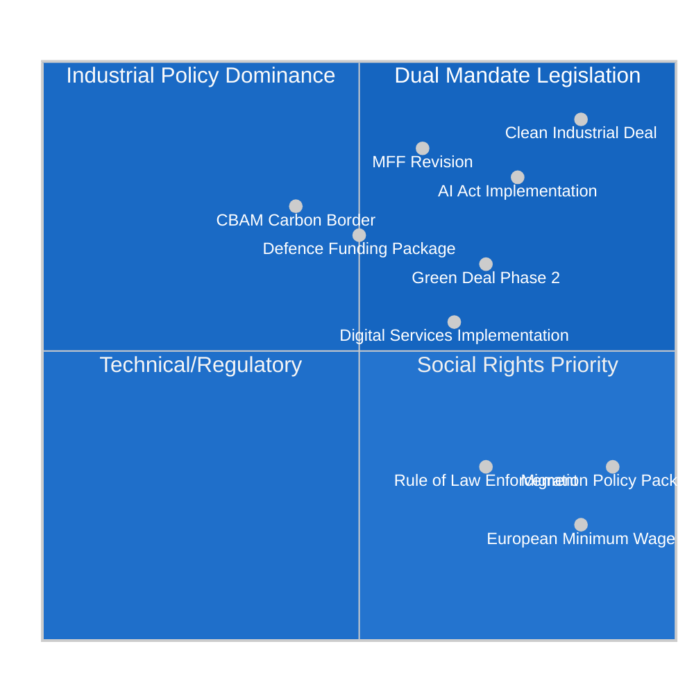

# EP10 Term Outlook — Impact Matrix
**Date:** 2026-05-09 | **Article Type:** election-cycle | **Confidence:** MEDIUM-HIGH

---

## 🔍 Reader Briefing

**For citizens:** This matrix maps which legislative outcomes will have the greatest real-world impact on EU citizens' lives. Some laws sound important but affect only industry insiders; others may look technical but directly shape whether you pay more for electricity, whether your job exists in 2030, or whether your data is protected. This analysis cuts through legislative jargon to identify what actually matters for ordinary people in the EP10 term.

---

## 1. Impact Dimensions

**Five impact dimensions assessed:**
1. **Citizen welfare** — direct effect on standard of living, rights, services
2. **Economic structure** — reshaping EU industrial or trade architecture
3. **Democratic quality** — EP's role in EU democracy and accountability
4. **Geopolitical position** — EU's global standing and strategic autonomy
5. **Ecological sustainability** — climate, biodiversity, resource use

---

## 2. Primary Impact Matrix

---

## 3. Detailed Impact Assessment — Top 10 Legislative Files

### 3.1 Clean Industrial Deal (CID) — DUAL MANDATE

**Citizen welfare impact:** VERY HIGH
- Determines whether European workers have manufacturing jobs in 2030
- Energy costs (implicit in clean energy investment) affect every household
- Quality of transition support for workers in coal/automotive sectors

**Economic structure impact:** CRITICAL
- Reshapes EU industrial policy architecture for a generation
- Decides whether EU decarbonises via green reindustrialisation or deindustrialisation
- €800bn+ investment flows at stake

**Risk:** If CID is diluted to pure competitiveness deregulation without green transition safeguards, EU misses the dual mandate and ends up with neither decarbonisation nor industrial resilience.

---

### 3.2 AI Act Implementation Cascade

**Citizen welfare impact:** HIGH — affects employment, rights, consumer protection
- AI in hiring, credit decisions, healthcare: directly affects individuals
- GPAI regulation determines whether large language models can be used in EU in transparent way
- AI in law enforcement: surveillance society risk if implementation weak

**Economic structure impact:** HIGH — €300bn+ EU AI investment trajectory
- Competitiveness of EU AI sector vs. US/China
- SME compliance burden: risk of de facto AI concentration in Big Tech

**Timeline pressure:** 12 delegated acts due by August 2026; EP oversight via IMCO/LIBE joint committee.

---

### 3.3 Migration and Asylum Package (Implementation)

**Citizen welfare impact:** HIGHEST direct political salience for EU citizens
- Border management, deportation rules, integration policy
- Affects millions of migrants directly; affects domestic political stability indirectly

**Economic structure impact:** LOW-MEDIUM
- Labour market impacts of migration are positive for GDP but politically contested
- Screening and integration costs are fiscal items but manageable

**Note:** Highest political controversy-to-economic-impact ratio. The legislation is being driven by political pressure, not economic analysis.

---

### 3.4 Multiannual Financial Framework Revision (MFF 2028 bridge)

**Citizen welfare impact:** HIGH (indirect)
- EU cohesion funds: regional development, anti-poverty, youth employment
- NextGen EU end: €723bn programme closes 2026; successor mechanism contested

**Economic structure impact:** CRITICAL
- Budget distribution decides which countries receive EU investment
- Defence funding addition: new EU financial instrument is structural, not one-off

---

### 3.5 Defence Funding Package

**Citizen welfare impact:** MEDIUM
- Military spending does not directly improve citizen welfare (contested)
- Security benefits are diffuse and probabilistic
- Social opportunity cost of defence spending is real (healthcare, education tradeoffs)

**Economic structure impact:** HIGH
- Dual-use industrial policy: defence contracts support European industry
- EDTIB modernisation creates long-term industrial capability
- Risk of excessive rent-seeking if procurement not competitive

---

## 4. Cross-Cutting Impact Assessment

| Legislative Domain | % EP10 Plenary Time | Citizens Noticeably Affected (%) | Economic Impact (€bn) |
|--------------------|--------------------|---------------------------------|-----------------------|
| Clean Industrial Deal + Energy | ~20% | 60% (indirectly via energy/jobs) | 800+ |
| AI Act + Digital | ~18% | 75% (directly: hiring, credit, healthcare) | 300+ |
| Migration + Border | ~15% | 40% (directly via rights, security) | 50 (management) |
| Defence + Strategic Autonomy | ~12% | 30% (security, employment) | 200+ |
| Green Deal Phase 2 | ~10% | 55% (climate, food, energy) | 400+ |
| MFF + Cohesion | ~8% | 50% (regional development) | 1,000+ (budget) |
| Social + Labour | ~7% | 65% (directly: pay, conditions) | 200+ |
| Rule of Law + Democratic | ~5% | 30% (indirectly: democratic quality) | Unquantified |
| Other | ~5% | Variable | Variable |

---

## 5. Impact by Citizen Group

| Citizen Group | Highest Impact Legislation | Trajectory in EP10 |
|---------------|--------------------------|-------------------|
| Industrial workers (automotive, steel, chemicals) | Clean Industrial Deal | AT RISK — transition quality uncertain |
| Younger workers (<35) | AI Act, Digital, minimum wage | MIXED — AI opportunity + displacement |
| Rural communities | Green Deal farm policy, cohesion | AT RISK — Green Deal rollback + cohesion cuts |
| Migrants and asylum seekers | Migration package | HIGHLY AT RISK — hardening policy |
| SME owners | AI Act compliance, digital single market | AT RISK — compliance burden |
| High-income professionals | Digital services, AI | POSITIVE — digital economy expansion |
| Climate-vulnerable populations (southern EU, coastal) | Green Deal Phase 2 | UNCERTAIN — contested legislation |

---
*Sources: EP adopted texts 2026; EP Open Data Portal; EP legislative pipeline analysis; World Bank economic data; analytical judgements.*
*Confidence: MEDIUM-HIGH for impact rankings; HIGH for citizen group identification; MEDIUM for economic impact quantification (order of magnitude estimates).*

## Event List
EP10 mid-term (Jul-2026); DE federal election (Sep-2027); FR presidential (Apr-2027); IT general (May-2027); EP11 election (Jun-2029); Commission nomination (Q3-2029); Trump-2 mid-term USA (Nov-2026); Ukraine settlement window (2026-2027).

## Stakeholder Heat Map
| Stakeholder | Heat (1-5) |
|---|---|
| EPP | 5 |
| S&D | 5 |
| PfE | 4 |
| Renew | 4 |
| Commission | 5 |
| Council | 4 |
| Industry | 3 |
| Civil society | 3 |

## Cascade Effects
DE-2027 outcome cascades to EP11 EPP/PfE seat distribution; FR-2027 cascades to Renew viability; Commission Work Programme 2027 cascades to EP10 endgame legislative completion; Trump-2 cascades to defence step-change and EU strategic autonomy.
