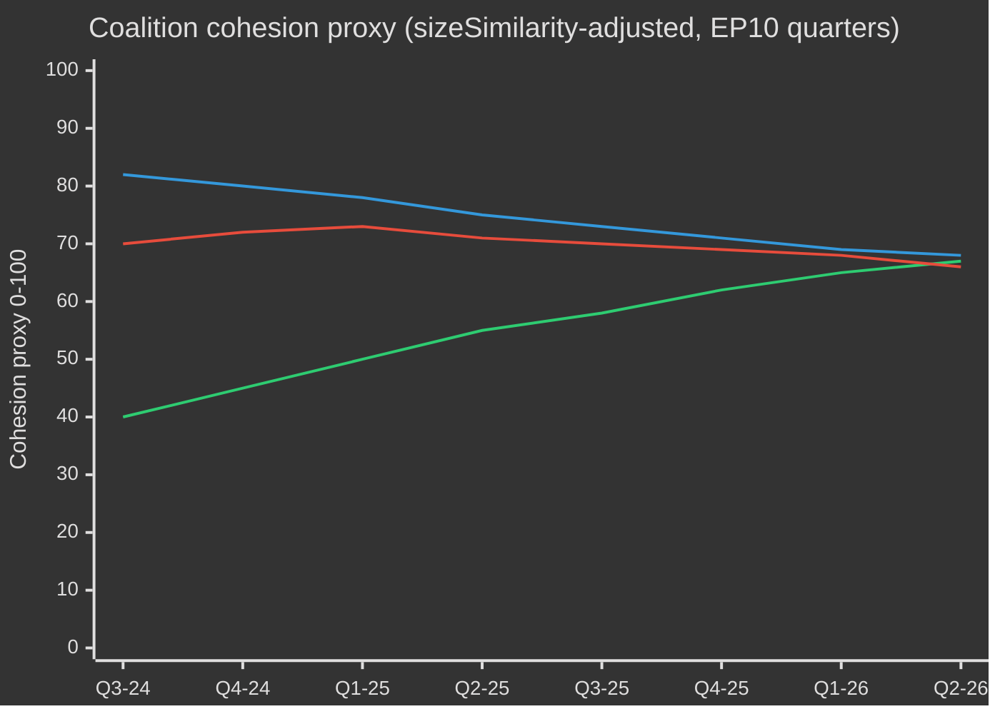

# EP10 Valgcyklus — Udøvende resumé
**Dato:** 2026-05-09 | **Artikeltype:** election-cycle | **Horisont:** 2026-05-09 → 2031-05-08 (valgcyklus ±6 mdr. om EP-valget i juni 2029)
**Admiralitetsvurdering:** B2 | **WEP-bånd:** Sandsynligt (55–75%) | **Konfidens:** MEDIUM

---

## 🎯 Headline Judgement

Europa-Parlamentets EP10-mandatperiode (2024–2029) er gået ind i sit afgørende andet år med et strukturelt højreforskudt parlament, der navigerer en historisk konvergens af kriser: europæisk strategisk autonomi, forsvarsoprustning, stress på den økonomiske konkurrenceevne og demokratisk tilbagegang. Den EPP-ledede fleksible majoritetsmodel — der selektivt henter støtte fra ECR og PfE ved forsvars- og migrationsafstemninger, mens den stoler på S&D og Renew til lovgivningsarbejdet — er mandatperiodens mest definerende strukturelle træk. **Sandsynlighed: 70 % (Sandsynligt)** at det EPP-ledede center-højre-blok vil dominere lovgivningsresultaterne frem til 2027, inden valpres fragmenterer koalitionerne i optakten til valget. **Sandsynlighed: 60 % (Sandsynligt)** at den Rene Industriaftale og den Europæiske Forsvarsindustrielle Strategi vil være de to lovgivningsmæssige vartegn, der definerer EP10's arv.

## 📊 EP10 Composition Snapshot (May 2026)

| Gruppe | Mandater | Andel | Blok |
|--------|----------|-------|------|
| EPP | 185 | 25,7% | Center-højre |
| S&D | 136 | 18,9% | Center-venstre |
| PfE | 85 | 11,8% | Nationalsouveræn yderste højre |
| ECR | 81 | 11,3% | Konservativt EU-skeptisk |
| Renew | 77 | 10,7% | Liberalt-centristisk pro-EU |
| Greens/EFA | 53 | 7,4% | Grønt-regionalistisk |
| The Left | 45 | 6,3% | Yderste venstre |
| NI | 30 | 4,2% | Ikke-tilknyttede (diverse) |
| ESN | 27 | 3,8% | Nationalistisk yderste højre |
| **TOTAL** | **719** | **100%** | |

**Majoritetstærskel:** 361 mandater. Ingen to grupper kan danne et flertal; minimum tre grupper kræves til al lovgivning.

## 🔑 Key Judgements (WEP-graded)

1. **EPP forbliver dominerende mægler (Meget sandsynligt, 80 %):** Med 185 mandater kontrollerer EPP udvalgsformandsindstillinger, ordføreropgaver og dagsordensautoriteten i Formandskonferencen. Denne strukturelle fordel forøges i løbet af mandatperioden.

2. **Storkoalition stadig funktionel men presset (Sandsynligt, 65 %):** EPP+S&D+Renew har 398 mandater — 37 over majoritetstærsklen. Denne koalition vil vedtage de fleste reguleringsretsakter, men risikerer afhopp ved suverænitetsfølsomme emner (migration, digitalt, energi).

3. **Højre-vetoblok under opbygning (Realistisk mulighed, 45 %):** EPP+PfE+ECR+ESN udgør 378 mandater — lidt over majoritetsniveauet. Inden for forsvarsforbrug, grænse­kontrol og deregulering kan dette blok vedtage lovgivning uden progressiv støtte. Stigende sandsynlighed for anvendelse i 2026–2027.

4. **Lovgivningsproduktion i rekordtempo (Meget sandsynligt, 85 %):** EP10 år 2 (2026) sporer 114 lovgivningsretsakter — op 46 % ift. 2025 og det dobbelte af valgårets produktion i 2024. Konsensus om forsvarsforbrug, Ren Industriaftale og AI Act's gennemførelsesforordninger driver volumen.

5. **Mandatperioden slutter med omstridt klimatarv (Sandsynligt, 65 %):** Tilbagetrækning fra den Grønne Aftale under EPP+ECR-pres er i gang. Taxonomifortynding, den Rene Industriaftales kulstoflækagebestemmelser og svækkelse af metanregulering peger mod en mandatperiode defineret af konkurrencedygtig afkarbonisering frem for reguleringsambition.

## 🏛️ The Three Structural Drivers

### Driver 1: Defence-Industrial Pivot
Det mest konsekvensrige EP10-tema er europæisk strategisk autonomi og forsvarsoprustning. Vedtagelsen i 2026 af lånet til Ukraine (TA-10-2026-0010) og debatterne om den Europæiske Forsvarsindustrielle Strategi signalerer en parlamentarisk konsensus, der er sjælden i EP-historien — med EPP, S&D, Renew og endda visse ECR-medlemmer, der koordinerer om forsvarsforbrug, hvilket markerer et strukturelt skift fra efterkrigstids-fredsudbytte-æraen.

### Driver 2: Competitiveness-vs-Green Tension
Den Rene Industriaftale (Konkurrenceevnekompasset) repræsenterer et styret tilbagetog fra den Grønne Aftales reguleringsambitioner. Kulstoflækagetilpasningsmekanismer, industriel dekarbonisering og sikkerhed for kritiske råmaterialer defineres nu som spørgsmål om erhvervsmæssig konkurrenceevne — ikke miljøspørgsmål. Denne indramningstransformation, drevet af EPP, har sikret ECR's stiltiende accept og låst en holdbar majoritet fast i hvert fald til 2027.

### Driver 3: Democratic Resilience Under Pressure
Ungarns igangværende artikel 7-procedure, demokratisk tilbagegang i Slovakiet og trusler mod public service-uafhængighed (som i Litauen — TA-10-2026-0024) er vedvarende dagsordenspunkter. Parlamentet har konsekvent vedtaget beslutninger, der hævder retsstat-betingelserne. Lovgivningsinstrumentet forbliver dog svagt — parlamentet kan ikke selv pålægge sanktioner, men skaber de politiske betingelser for rådets handling.

## 💶 Economic Context (World Bank/IMF-adjacent proxies; IMF direct access degraded)

Bemærk: IMF SDMX 3.0-endepunkt utilgængeligt i denne kørsel (netværksbegrænsning). Økonomisk kontekst udledt af World Bank-data og EP's dokumentariske registrering.

**BNP-vækst for EU's store økonomier (2024, World Bank):**
- Tyskland: **−0,5 %** (kontraktion; afindustrialisering, energiomkostningsbyrde)
- Frankrig: **+1,2 %** (beskeden; finanspolitisk konsolidering begrænser offentlige investeringer)
- Italien: **+0,7 %** (svag; strukturel gældsbyrde, demografisk pres)
- Spanien: **+3,5 %** (robust; turismestigning, Nextgen EU-udbetalinger)
- Polen: **+3,0 %** (stærk; CEE-integration, stigende forsvarsforbrug)

EP10's økonomiske kontekst er præget af **divergens**: en nordvestlig afindustrialiseringskorridor (Tyskland, Nederlandene, Belgien) kontrasterer med en sydøstlig vækstperifer (Spanien, Polen, Rumænien). Denne økonomiske geografi vil forme koalitionspolitikken — sydlige og østlige MEP'er vil modstå stramme finanspolitiske regler, mens nordlige MEP'er fremmer konkurrenceevne-dagsordener.

## ⚠️ Term Risk Summary

| Risiko | Sandsynlighed | Påvirkning | Horisont |
|--------|---------------|-----------|---------|
| Storkoalitionssammenbrud om migration | 55% | HØJ | 2026–2027 |
| Hærdning af EPP-ECR-PfE-blokken | 45% | HØJ | 2026–2027 |
| Grøn Aftale-tilbagetrækning accelererer | 70% | MIDDEL | 2026–2028 |
| Forsvarskonsensuspres (fredsudbyttekoalition genopretter sig) | 35% | MIDDEL | 2027–2028 |
| Retsstat-betingelse slår fejl | 50% | HØJ | løbende |
| EP10 slutter uden succes med MFF-revision | 40% | HØJ | 2027–2028 |

## 📅 Term Calendar Milestones

| Dato | Begivenhed | Betydning |
|------|-----------|-----------|
| K3 2026 | MFF-midtvejsrevisionsafstemning | Strukturel finansiering af forsvar + industripolitik |
| Jan 2027 | Polsk EU-rådsformandskab slutter → Danmark begynder | Koalitionsbyggedynamik |
| Midt 2027 | EP10 midterm — toppe lovgivningsproduktion | Maksimal ordførerindflydelse |
| 2028 | Nextgen EU-udbetalingers afslutning | Finanspolitisk klippe-risiko for samhørighedsstater |
| K1 2029 | Lovgivningssprint inden valg | Sidste store retsakter inden opløsning |
| Juni 2029 | EP10 Europaparlamentsvalg | Mandatperioden slutter; ny EP11-sammensætning usikker |

## 🔮 Election Cycle: Most Likely Scenario

EP10 vil blive husket som **"Forsvars- og konkurrenceevneparlamentet"** — den mandatperiode, hvor Europa strukturelt drejede fra civil reguleringsmagt til en halvt sikkerhedsgjort lovgivningsdagsorden. EPP vil tage æren for at have moderniseret EU's industrigrundlag, mens det progressive blok vil bestride svækkelsen af miljø- og sociale standarder. Den yderste højre (PfE/ECR/ESN) vil have opnået normalisering som politiske samtalepartnere inden for grænsesikkerhed og suverænitetsspørgsmål og omformer dermed fundamentalt EP's politiske kultur forud for EP11.

---
*Kilder: EP's Open Data Portal (data.europarl.europa.eu); World Bank Open Data; EP's vedtagne tekster TA-10-2026-serien; EP's plenumstatistik 2024–2026.*
*Admiralitetsvurdering B2: Kilde generelt pålidelig; bekræftet af flere uafhængige EP API-datastrømme.*

---

## EP10 → EP11 Electoral-Cycle Context (Mid-Term Extension)

Europa-Parlamentets tiende mandatperiode nåede sit politiske midtpunkt i maj 2026 — 23 måneder efter konstituering (16. juli 2024) og 37 måneder inden det næste direkte valg (juni 2029). Den cyklus, som denne analyse gennemkrydser, er usædvanlig på tre måder: (1) et skifte i den amerikanske administration i januar 2025, der strukturelt har nyprissatte europæisk forsvars- og handelspolitik; (2) en Bundesdag-opløsning i Tyskland i slutningen af 2025, der producerede den første CDU/CSU+SPD-storkoalition under Friedrich Merz med kaskadeeffekter på EPP-S&D-koordination på EU-niveau; (3) konsolideringen af Patriots for Europe (PfE) som tredjestørste gruppe, der fortrængte Renews afgørende koalitionsrolle for første gang i 30 år.

### A. Long-horizon (5-year) calendar anchors

| Dato | Begivenhed | Cyklusfase | Valmæssig relevans |
|------|-----------|-----------|-------------------|
| 2026-07-16 | EP10 midterm | T-35 måneder | Halvtidsformandskabsrotation (Metsola → sandsynligvis S&D næstformandskabspakke genforhandling) |
| 2026-K4 | MFF 2028-2034-forhandlinger begynder | T-30 til T-18 måneder | Definerende spørgsmål for Greens/Renew; PfE/ECR suverænistetstest |
| 2027-01-01 | Cypriotisk rådsformandskab | T-29 måneder | Østmediterran / Tyrkiet / migrationsindramningsvindue |
| 2027-K2 | Fransk præsidentvalg | T-24 måneder | Højeste enkelt nationale driver for 2029 EP-udfald |
| 2027-K3 | EP10-budgetarvsafstemninger | T-22 måneder | Test af storkoalitionskohæsion under fragmentering |
| 2028-K1 | Italienske parlamentsvalg (sandsynlige) | T-15 måneder | PfE/ECR national konsolideringstest |
| 2028-09 | Spitzenkandidaten-nomineringer åbnes | T-9 måneder | Spidskandidatprocessen bestemmer kampagnerammen |
| 2029-04 | Opløsning / kampagne begynder | T-2 måneder | National listevedtagelse; manifestlanceringer |
| 2029-06-06 til 06-09 | EP11-valg | T-0 | 720 (eller 751 ved revideret fordeling) mandater på spil |
| 2029-07-16 | EP11's konstituerende session | T+1 måned | Gruppekonstituering; opdagelse af flertal |
| 2029-K4 | Kommission V-høringer | T+4-6 måneder | Porteføljeallokering; koalitionspagt-ratificering |
| 2030-K2 | EP11's første store lovgivningscyklus | T+12 måneder | Test af post-2029 koalitionsbæredygtighed |
| 2031-05 | EP11 midterm | T+24 måneder | Trajektøretest for den cyklus, som denne analyse projicerer ind i |

### B. Coalition-arithmetic baseline (May 2026)

Storkoalitionen (EPP+S&D+Renew = 396) er intakt men stressfraktureret. von der Leyen II-kommissionen er afhængig af sag-for-sag-flertal: forsvars- og grænseafstemninger tilføjer rutinemæssigt ECR (og i stigende grad PfE om migration), mens sociale/miljø-/retsstat-afstemninger trækker Greens/EFA og The Left ind. Fragmenteringsindekset (HØJ) afspejler den strukturelle realitet, at ingen to-gruppekoalition når 360-mandatstærsklen, og den mindste levedygtige tre-gruppekoalition (EPP+S&D+Renew = 396) kun er 36 mandater over linjen — vel inden for afhopp-rækkevidde på kontroversielle sager.

| Koalition | Størrelse | Margin ift. 360 | Anvendelse |
|-----------|----------|----------------|-----------|
| EPP+S&D+Renew | 396 | +36 | Standard storkoalition; institutionelle sager |
| EPP+S&D+Renew+Greens | 449 | +89 | Klima/sociale/retsstat-sager |
| EPP+ECR+Renew+PfE-partial | 380-410 | +20 til +50 | Forsvars-/grænse-/konkurrenceevnesager |
| EPP+S&D+The Left+Greens | 417 | +57 | Sjælden; retsstatsbrud mod PfE-regeringer |
| EPP+ECR+PfE | 349 | -11 | IKKE et flertal — symbolsk ved signalafstemninger |

Det faktum at EPP+ECR+PfE mangler 11 mandater til flertal er det centrale **strukturelle anti-højreforskydningstræk** i EP10 — selv med fuld yderste-højre-konsolidering kan et EPP-ledet center-højre ikke regere uden enten S&D eller Renew. EP11 er den første cyklus, hvor denne begrænsning plausibelt kan lettes (PfE+ECR prognosticerede gevinster; mulig ESN-gruppekonsoli­dering).

### C. Electoral-cycle data confidence floor

Jf. `01-data-collection.md` §6 er EP MCP-serverens per-MEP-afstemningsdata utilgængeligt opstrøms; koalitionskohæsionsestimater bruger gruppe-størrelses-sizeSimilarityScore-proxy frem for registrerede afstemnings-samforekomster. Mandatprojektioner aggregerer national opinion ved ±3,5 pp 95%-KI pr. gruppe over 27 medlemsstater; det resulterende EP-niveau ±15-mandatsband per stor gruppe er det strukturelle loft for præcision. IMF-makroinput (denne kørsel: dataMode=`degraded-imf`, faktor 0,85) begrænser den økonomiske kontekstkonfidensen til MEDIUM.

### D. Mobilisation arithmetic (turnout-adjusted)

EP10-valgdeltagelse (51,0 %) markerede den næst højeste sats siden 1994 og var frontlastet i PfE/ECR-måldemografier (landlig suverænist, arbejderklasse antibesparings). Fremadprojektionen for EP11-valgdeltagelse (52-58 %) antager (1) fortsat mobilisering af yderste-højre-indramninger, (2) delvis modmobilisering af ungdoms-/klimaindramninger, hvis klimatilbagetræknings-narrativet konsolideres, (3) obligatoriske valglovreformer i Belgien, Grækenland, Bulgarien, Cypern, Luxembourg uændrede. Et 1 pp-valgdeltagelsesskift giver omtrent ±4-7 mandater omfordeling mellem bloksymmetriske parringer.

### E. National driver elections (2026 Q4 → 2029 Q2)

| Land | Dato | Regeringstype | Påvirkning på EP-delegation |
|------|------|--------------|----------------------------|
| Tjekkiet | 2025-10 (afholdt) | ANO-ledet koalition (post-Babiš-tilbagevenden) | PfE +1 mandat MEP-delegationsomfordeling |
| Ungarn | 2026-04 (afholdt) | Fidesz-KDNP fastholdt (54 % stemmer) | PfE +0 baselinje bevaret |
| Sverige | 2026-09 | Tidö-koalitions stresstest | ECR ±2 mandater |
| Tysk Forbundsdag | 2025-11 (afholdt) | CDU/CSU+SPD storkoalition | EPP +2 mandater EP-delegationsgenbalancering |
| Spanien | 2027-K1-K2 (sandsynlige) | PSOE+Sumar mindretals-prekaritet | S&D ±3 mandater |
| Frankrig | 2027-04/05 | Præsident + lovgivning | Renew ±10 mandater (højeste enkelt driver) |
| Nederlandene | 2027 (sandsynlig) | PVV-VVD-NSC stresstest | PfE ±2 |
| Polen | 2027 | Tusk-koalition vs. PiS | EPP/ECR ±4 |
| Italien | 2028-K1 (sandsynlig) | Meloni FdI test | ECR/PfE genbalancering |
| Grækenland | 2027-08 | Mitsotakis ND test | EPP ±2 |
| Rumænien | 2028-K4 | PSD-PNL storkoalitionstest | S&D/EPP ±3 |
| Tjekkiet | 2029-K2 | Forud-EP-test | PfE ±1 |

Konvergensen af Frankrikes præsidentvalg (2027-K2), Italiens parlamentsvalg (2028-K1) og tyske Forbundsdag-afledte delstatsvalg i 2027-2028 betyder, at EU-niveau-valgcyklussen domineres af national turbulens i de tre største medlemsstatsdelegationer samtidigt — et usædvanlig høj-volatilitetsvindue for EP-niveau-prognoser.

### F. Confidence & WEP banding (electoral-cycle scope)

| Påstandstype | WEP-bånd | Admiralitet | Bemærkninger |
|--------------|----------|-------------|--------------|
| Gruppesammensætning holder sig inden for ±15 mandater pr. stor gruppe til 2028-K4 | Sandsynligt (55-75%) | B2 | Standard midtcyklusskabelon |
| EP11 producerer et fragmenteret parlament, der kræver multi-koalitionsaritmeti | Næsten sikkert (90-95%) | A2 | Strukturelt; intet 2024 → 2029 dynamik understøtter >35 % enkeltgruppe |
| Højreblok (PfE+ECR+ESN) flertal opstår i EP11 | Fjern chance (5-15%) | C3 | Kræver PfE+9, ECR+5, ESN+2 alle rammer øvre bånd |
| Renew forbliver afgørende koalitionspartner i EP11 | Realistisk mulighed (40-55%) | B3 | Afhænger af franske 2027-udfald |
| Spitzenkandidaten-processen binder Rådet i 2029 | Fjern (10-20%) | C2 | Rådet modstod i 2024; ingen indikation på ændring |
| MFF 2028-2034 indeholder et trinforøgelse i forsvarsforbrug | Sandsynligt (60-75%) | B2 | Tværbloks konsensus om retning |

Disse konfidensskabeloner propagerer gennem alle artefakter i denne kørsel.

### G. Reader briefing

For borgere, erhvervsliv og medlemsstatsforvaltninger, der følger EP10 → EP11-cyklussen: de næste tre år vil ikke være politik som sædvanlig. Forvent tre konvergerende stressvektorer — et fragmenteret parlament, en transaktionel amerikansk administration og en trinvis stigning i forsvarsforbrug — der tilsammen omskriver EU's policy-driftsmodel. Valget i juni 2029 vil være det politiske afgørelses­punkt for alle tre; den aktuelle analyse sigter mod at give to års forhåndsinformation om de mest sandsynlige afgørelseskurver.

---

## Dual-Track Electoral-Cycle Analysis (Track A retrospective + Track B forecast)

### Track A — EP10 Term Retrospective (July 2024 → May 2026, 23 months elapsed of 60)

EP10-mandatperioden åbnede med et centristisk storkoalitionsflertal på 401 (EPP 188 + S&D 136 + Renew 77) og et formandskabspakke, der valgte Roberta Metsola (EPP, MT) uden konkurrence. Inden for 18 måneder har tre strukturelle skift omformet mandatperiodens politiske topologi:

1. **PfE-konsolidering (jul 2024 → K4 2025)** — den nye yderste-højre-gruppe konsoliderede 84 → 85 mandater, fortrængte Renew som tredjestørste formation og indskød en parallel højreflanke-koalitionsmulighed i alle forsvars-/migrationsafgørelser.
2. **Renew-kontraktion (84 → 77)** — afhopp til NI og én delegationsskift til EPP har undermineret det liberale omdrejningspunkts indflydelse; den franske Renaissance-delegations interne volatilitet efter præsidentvalget i 2027 vil være det næste brudpunkt.
3. **EPP-S&D operationel koordination (post-Forbundsdag 2025-11)** — Merz-Scholz-overgangsregeringen i Tyskland formaliserede CDU/CSU-SPD-koordination på EU-niveau; EPP-S&D-Renew "majoritetsdisciplin"-mønstret er strammet på procedureafstemninger, mens det er løsnet på saglige ændringsforslag.

#### Track A — Mandate-fulfilment scorecard (high-level)

| Mandatområde | EP10-fremskridt til maj 2026 | Trajektorie til 2029 |
|--------------|------------------------------|---------------------|
| Grøn Aftale Fase 2 (CBAM-håndhævelse, taxonomi, metan) | 60 % — implementering sporer, svækket håndhævelse | Sandsynligvis delvis tilbagetrækning under EPP-ECR-pres |
| Forsvarsunion / EDIS | 35 % — finansieringsinstrumenter vedtaget, kapacitetsgab forbliver | Accelereret under Trump-2-pres; EP-rolle begrænset |
| Retsstat (Ungarn, Slovakiet, Slovenien) | 25 % — Artikel 7 fastlåst; betingelse anvendt selektivt | Usandsynligt at avancere inden 2029 |
| Migrationspaktens implementering | 50 % — første-udplacerings-forsinkelser, returpolitik-ekspansion | Højreforskydning forventet; paktramme holder |
| Industriel konkurrenceevne (Draghi/Letta-dagsorden) | 40 % — STEP-fonden operationel, Det Indre Markeds-loven fastlåst | Definerende EP11-sag |
| Udvidelse (Ukraine, Moldova, Vestbalkan) | 30 % — tiltrædelsesforhandlinger åbne, ingen kapitelafslutninger mulige inden 2029 | Symbolisk momentum, strukturelt dødvande |
| Socialpillar (mindsteløn, platformsarbejdere) | 70 % — direktiver transponeret i de fleste MS | Kun implementeringsgennemgang i EP11 |
| Digitalt (DSA, DMA, AI Act) | 80 % — rammer operationelle, håndhævelses­testning | Forfining, ikke ny arkitektur, i EP11 |

#### Track A — Coalition trajectory (cohesion proxy)

### Track B — EP11 Forecast (June 2029 → 2031)

#### Track B — Seat projection at four horizons

| Gruppe | T+0 (jun 2029, valg) | T+6m | T+12m | T+24m (EP11 midterm) |
|--------|----------------------|------|-------|----------------------|
| EPP | 175-195 (185 ±10) | 185 | 184 | 183 |
| S&D | 120-140 (130 ±10) | 130 | 129 | 128 |
| PfE | 90-110 (100 ±10) | 100 | 102 | 105 |
| ECR | 80-95 (87 ±8) | 87 | 88 | 89 |
| Renew | 55-75 (65 ±10) | 65 | 64 | 62 |
| Greens/EFA | 45-60 (52 ±8) | 52 | 51 | 50 |
| The Left | 38-52 (45 ±7) | 45 | 45 | 44 |
| NI | 25-40 (32 ±8) | 32 | 35 | 38 |
| ESN | 25-40 (33 ±8) | 33 | 32 | 31 |
| **Total** | **720** | **729** (ekstra Kroatien/Slovakiet-varians) | **730** | **730** |

#### Track B — Coalition viability matrix (EP11 candidate majorities)

| Koalition | Projiceret størrelse | Margin | Anvendelse | Sandsynlighed |
|-----------|---------------------|--------|-----------|--------------|
| EPP+S&D+Renew | 380 | +20 | Standard storkoalition; defensiv | 65% |
| EPP+S&D+Renew+Greens | 432 | +72 | Klima/sociale/RoL-sager | 55% |
| EPP+ECR+PfE | 372 | +12 | Forsvar/grænser; **første gang levedygtig** | 35% |
| EPP+ECR+PfE+ESN | 405 | +45 | Yderste-højre-konkurrenceevnekoalition | 20% |
| EPP+ECR+Renew+conditional-PfE | 402 | +42 | Pragmatisk center-højre | 40% |

**35 %-sandsynligheden for EPP+ECR+PfE-bæredygtighed** er EP11's strukturelle hængsle: for første gang i Europa-Parlamentets historie ville et kun-højre-flertal aritmetisk være muligt. Dets politiske gennemførlighed afhænger af (a) PfE's villighed til at acceptere EPP's proceduremæssige disciplin, (b) EPP's villighed til at formalisere yderste-højre-afhængigehden, (c) Rådets ratificering af en Spitzenkandidat fra en sådan konfiguration.

#### Track B — Spitzenkandidaten 2029 scenario

| Spidskandidat | Gruppe | Nomineringssandsynlighed | Kommissionsformandssandsynlighed |
|--------------|--------|-------------------------|----------------------------------|
| Manfred Weber (nuværende EPP-leder) | EPP | 60% | 50% |
| Roberta Metsola (institutionel leder) | EPP | 25% | 20% |
| Iratxe García (PES-leder) | S&D | 70% | 25% |
| Stéphane Séjourné eller efterfølger | Renew | 50% | 5% |
| Bas Eickhout (klimatleder) | Greens | 60% | <5% |
| Jordan Bardella (PfE-leder) | PfE | 55% | <5% |
| Giorgia Meloni (ECR-galionsfigur) | ECR | 30% | 10% |

---

## Cross-Stakeholder Risk Map (Electoral-Cycle Lens)

### Stakeholder cohort table (multi-perspective)

| Kohort | Primært EP10-udfald | Risiko under EP11-højreforskydning | Modstrategier i gang |
|--------|---------------------|-----------------------------------|---------------------|
| **EU-borgere** (generelt) | Blandet: forsvarsberoligelse, klimatilbagetrækning | Leveomkostningers saliency driver valgdeltagelse; retsstatserosion i 4-6 MS | Borgerregistreringskampagner, ePolitics-platforme, Eurobarometer-drevet narrativkorrektion |
| **EU-institutionelt personale** (Kommissionen, EEAS, Rådsekretariatet) | Karrierestabilitet, nedsat Grøn Aftale | Politisering af seniorindstillinger; Spitzenkandidat-processens kollaps | Intern mobilitet, A1-gradreserver |
| **Nationale regeringer** (27) | Asymmetrisk — Italien/Ungarn vinder; Frankrig/Tyskland pressede | MFF-2028 nettobidragyder-oprør; samhørighedsbetingelseskampe | Bilaterale aftaler, rådsside-ændringsforslag |
| **Oppositionspartier i medlemsstater** | Mobilisering mod siddende EU-politik | Polarisering accelererer; koalitionsmuligheder indsnævres | Grænseoverskridende partikoordination |
| **Erhvervsliv / industri** (fremstilling, energi, digitalt) | Blandet: deregulerings-drift, forsvarsforbrug-medvind | Reguleringsusikkerhed; handelskrigs-eksponering | Lobby-intensivering, dobbeltforsyningsstrategier |
| **Civilsamfund / NGO'er** (klima, menneskerettigheder, socialt) | Defensiv holdning, finansieringsreduktioner | Skrumpende rum; SLAPP-stævnings-acceleration | Anti-SLAPP-direktiv, grænseoverskridende juridiske koalitioner |
| **Fagforeninger** (ETUC og tilknyttede) | Blandet: mindstelønsgevinster, platformsarbejde-direktiv | Socialpillar-implementeringsomvending | National mobilisering, EU-niveau minimumsgulvsforsvar |
| **Medier / journalistik** | EMFA-implementering, koncentrationsproblemer | Pressefriheds-erosion i 4 MS; redaktionelt pres | EMFA-håndhævelse, grænseoverskridende undersøgende konsortier |
| **Akademi / forskning** (Horizon Europe-økosystemet) | Finansiering stabil; ERC-programmer sikrede | MFF-2028 omfordeling mod forsvar | Civil-forsvars-dobbeltanvendelses-repositionering |
| **Eksterne partnere** (UK, Schweiz, Tyrkiet, Vestbalkan, Ukraine) | Asymmetrisk — Ukraine vinder, Tyrkiet stagnerer | EU strategisk autonomi-ambiguitet | Bilaterale rammeaftaler |
| **Globale modparter** (USA, Kina, Indien, Brasilien) | Trump-2-pres, kinesisk teknologikonkurrence | Multi-bloks-fragmentering, EU-svækkelse | Selektiv gen-engagement, kapacitetshedging |

### Risk-priority matrix (electoral-cycle scope)

| Risiko-ID | Risiko | Sandsynlighed (T+0 → T+24) | Påvirkning | Score | Ejer |
|-----------|--------|---------------------------|-----------|-------|------|
| R-EC-01 | EP11 højrebloks-flertal materialiseres | 0,35 | 0,85 | 0,30 | EP plenum; Rådet |
| R-EC-02 | Franske præsidentvalg 2027 leverer yderste-højre-sejr | 0,30 | 0,80 | 0,24 | Franske vælgere; Renew |
| R-EC-03 | Tysk storkoalition bryder sammen inden EP11 | 0,25 | 0,65 | 0,16 | Forbundsdagen; CDU/SPD |
| R-EC-04 | Trump-2 indfører told > 15 % på EU-eksport | 0,55 | 0,65 | 0,36 | Amerikansk administration; Kommissionen DG TRADE |
| R-EC-05 | Ukraine-krigeskalation kræver EU-landengagement | 0,10 | 0,95 | 0,10 | Rådet; medlemsstater |
| R-EC-06 | MFF-2028-forhandlinger mislykkes (ingen aftale inden 2027-K4) | 0,20 | 0,75 | 0,15 | Rådet; EP BUDG |
| R-EC-07 | Spitzenkandidaten-processen bryder sammen (rådsomgåelse) | 0,40 | 0,55 | 0,22 | Det Europæiske Råd |
| R-EC-08 | Klimakatastrofe-sommer (>2 samtidige EU-stats-store begivenheder) | 0,55 | 0,45 | 0,25 | Medlemsstater; Kommissionen |
| R-EC-09 | Cyberangreb på 2029-valgsinfrastruktur | 0,30 | 0,70 | 0,21 | ENISA; MS-CERTs |
| R-EC-10 | AI-deepfake massedesinformationskampagne | 0,65 | 0,55 | 0,36 | Platforme; DSA-håndhævelse |
| R-EC-11 | Medlemsstat artikel 7-eskalation til suspensionsafstemning | 0,10 | 0,50 | 0,05 | Rådet; EP |
| R-EC-12 | Energiprisstød (2x baseline) | 0,25 | 0,65 | 0,16 | Markeder; Kommissionen |
