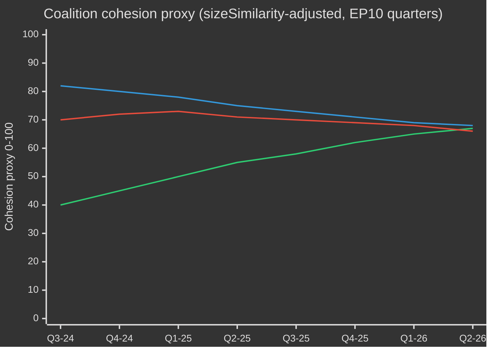

# EP10 Valgssyklus — Utøvende sammendrag
**Dato:** 2026-05-09 | **Artikkeltype:** election-cycle | **Horisont:** 2026-05-09 → 2031-05-08 (valgssyklus ±6 mnd. rundt EP-valget i juni 2029)
**Admiralitetsvurdering:** B2 | **WEP-bånd:** Sannsynlig (55–75%) | **Konfidens:** MEDIUM

---

## 🎯 Headline Judgement

Europaparlamentets EP10-periode (2024–2029) har gått inn i sitt avgjørende andre år med et strukturelt høyreforskjøvet parlament som navigerer en historisk konvergens av kriser: europeisk strategisk autonomi, forsvarsopprustning, stress på konkurranseevnen og demokratisk tilbakegang. Den EPP-ledede fleksible majoritetsmodellen — som selektivt henter støtte fra ECR og PfE ved forsvars- og migrasjonsavstemminger, mens den støtter seg på S&D og Renew for reguleringslovgivning — er mandatperiodens mest definerende strukturelle trekk. **Sannsynlighet: 70 % (Sannsynlig)** at det EPP-ledede sentrum-høyre-blokket vil dominere lovgivningsresultatene frem til 2027 før valgtrykk fragmenterer koalisjonene i opptakten til valget. **Sannsynlighet: 60 % (Sannsynlig)** at Den rene industriavtalen og den Europeiske forsvarsindustrielle strategien vil være de to lovgivnings-landemerkene som definerer EP10s arv.

## 📊 EP10 Composition Snapshot (May 2026)

| Gruppe | Mandater | Andel | Blokk |
|--------|----------|-------|-------|
| EPP | 185 | 25,7% | Sentrum-høyre |
| S&D | 136 | 18,9% | Sentrum-venstre |
| PfE | 85 | 11,8% | Nasjonalsouverænt ytterste høyre |
| ECR | 81 | 11,3% | Konservativt EU-skeptisk |
| Renew | 77 | 10,7% | Liberalt-sentristisk pro-EU |
| Greens/EFA | 53 | 7,4% | Grønt-regionalistisk |
| The Left | 45 | 6,3% | Ytterste venstre |
| NI | 30 | 4,2% | Ikke-tilknyttede (diverse) |
| ESN | 27 | 3,8% | Nasjonalistisk ytterste høyre |
| **TOTALT** | **719** | **100%** | |

**Majoritetsterskel:** 361 mandater. Ingen to grupper kan danne et flertall; minimum tre grupper kreves for all lovgivning.

## 🔑 Key Judgements (WEP-graded)

1. **EPP forblir dominerende megler (Meget sannsynlig, 80 %):** Med 185 mandater kontrollerer EPP utvalgsformandsinnstillinger, ordføreroppgaver og dagsordensautoriteten i Konferansen av presidentene. Denne strukturelle fordelen forsterkes gjennom mandatperioden.

2. **Storkoalisjon fortsatt funksjonell, men presset (Sannsynlig, 65 %):** EPP+S&D+Renew har 398 mandater — 37 over majoritetsterskelen. Denne koalisjonen vil vedta de fleste reguleringsretsakter, men risikerer frafall ved suverenitetsfølsomme temaer (migrasjon, digitalt, energi).

3. **Høyre-vetoblokk under oppbygging (Realistisk mulighet, 45 %):** EPP+PfE+ECR+ESN utgjør 378 mandater — rett over majoritetsnivået. Ved forsvarsforbrug, grensekontroll og deregulering kan denne blokken vedta lovgivning uten progressiv støtte. Stigende brukssannsynlighet i 2026–2027.

4. **Lovgivningsproduksjon i rekordtempo (Meget sannsynlig, 85 %):** EP10 år 2 (2026) sporer 114 lovgivningsretsakter — opp 46 % sammenlignet med 2025 og det dobbelte av valgårets produksjon i 2024. Konsensus om forsvarsforbrug, Den rene industriavtalen og AI Acts gjennomføringsforordninger driver volumet.

5. **Mandatperioden avsluttes med omstridt klimatarv (Sannsynlig, 65 %):** Tilbaketrekking fra den Grønne pakten under EPP+ECR-press pågår. Taksonomifortynning, Den rene industriavtalens karbonlekkasjebestemmelser og svekkelse av metanregulering peker mot en mandatperiode definert av konkurransedyktig dekarbonisering snarere enn reguleringsambisjon.

## 🏛️ The Three Structural Drivers

### Driver 1: Defence-Industrial Pivot
Det mest konsekvensrike EP10-temaet er europeisk strategisk autonomi og forsvarsopprustning. Vedtakelsen i 2026 av lånet til Ukraina (TA-10-2026-0010) og debattene om den Europeiske forsvarsindustrielle strategien signaliserer en parlamentarisk konsensus sjelden i EP-historien — der EPP, S&D, Renew og til og med noen ECR-medlemmer koordinerer om forsvarsforbrug, noe som markerer et strukturelt skifte fra etterkrigs-fredsdividende-æraen.

### Driver 2: Competitiveness-vs-Green Tension
Den rene industriavtalen (Konkurranseevnekompasset) representerer en styrt tilbaketrekning fra den Grønne paktens reguleringsambitioner. Karbongrensejusteringsmekanismer, industriell dekarbonisering og sikkerhet for kritiske råmaterialer defineres nå som spørsmål om næringslivets konkurranseevne — ikke miljøspørsmål. Denne omrammingen, drevet frem av EPP, har sikret ECRs stilltiende aksept og låst fast et holdbart flertall i hvert fall til 2027.

### Driver 3: Democratic Resilience Under Pressure
Ungarns pågående artikkel 7-prosedyre, demokratisk tilbakegang i Slovakia og trusler mot public service-uavhengighet (som i Litauen — TA-10-2026-0024) er vedvarende dagsordenpunkter. Parlamentet har konsekvent vedtatt resolusjoner som hevder rettsstatskondisjoner. Lovgivningsinstrumentet forblir imidlertid svakt — parlamentet kan ikke selv pålegge sanksjoner, men skaper politiske betingelser for rådshandling.

## 💶 Economic Context (World Bank/IMF-adjacent proxies; IMF direct access degraded)

Merk: IMF SDMX 3.0-endepunkt utilgjengelig i denne kjøringen (nettverksbegrensning). Økonomisk kontekst utledet fra World Bank-data og EPs dokumentariske registrering.

**BNP-vekst for EUs store økonomier (2024, World Bank):**
- Tyskland: **−0,5 %** (kontraksjon; avindustrialisering, energikostnadsbyrde)
- Frankrike: **+1,2 %** (beskjeden; finanspolitisk konsolidering begrenser offentlige investeringer)
- Italia: **+0,7 %** (svak; strukturell gjeldsbyrde, demografisk press)
- Spania: **+3,5 %** (robust; turismegjeninnhenting, Nextgen EU-utbetalinger)
- Polen: **+3,0 %** (sterk; CEE-integrering, økning i forsvarsforbrug)

EP10s økonomiske kontekst er preget av **divergens**: en nordvestlig avindustrialiseringskorridor (Tyskland, Nederland, Belgia) kontrasterer med en sørøstlig vekstperiferi (Spania, Polen, Romania). Denne økonomiske geografien vil forme koalisjonspolitikken — sørlige og østlige MEPer vil motstå strenge finanspolitiske regler, mens nordlige MEPer fremmer konkurranseevnedagsordener.

## ⚠️ Term Risk Summary

| Risiko | Sannsynlighet | Påvirkning | Horisont |
|--------|---------------|-----------|---------|
| Storkoalisjonssammenbrudd om migrasjon | 55% | HØY | 2026–2027 |
| Herding av EPP-ECR-PfE-blokken | 45% | HØY | 2026–2027 |
| Grønn pakt-tilbaketrekning akselererer | 70% | MIDDELS | 2026–2028 |
| Forsvarskonsensustrykk (fredsdividendekoalisjon gjenoppretter seg) | 35% | MIDDELS | 2027–2028 |
| Rettsstatskondisjoner mislykkes | 50% | HØY | løpende |
| EP10 avsluttes uten suksess med MFF-revisjon | 40% | HØY | 2027–2028 |

## 📅 Term Calendar Milestones

| Dato | Hendelse | Betydning |
|------|---------|-----------|
| K3 2026 | MFF-halvtidsrevisjonsavstemning | Strukturell finansiering av forsvar + industripolitikk |
| Jan 2027 | Polsk EU-rådsformannskap avsluttes → Danmark begynner | Koalisjonsbyggedynamikk |
| Midt 2027 | EP10 halvtid — topp lovgivningsproduksjon | Maksimal ordførerinnflytelse |
| 2028 | Nextgen EU-utbetalingers avslutning | Finanspolitisk klippe-risiko for kohesjonsstater |
| K1 2029 | Lovgivningssprint før valg | Siste store retsakter før oppløsning |
| Juni 2029 | EP10 Europaparlamentvalg | Mandatperioden avsluttes; ny EP11-sammensetning usikker |

## 🔮 Election Cycle: Most Likely Scenario

EP10 vil bli husket som **"Forsvars- og konkurranseevneparlamentet"** — mandatperioden da Europa strukturelt dreide fra sivil reguleringsmakt til en halvt sikkerhetsorientert lovgivningsdagsorden. EPP vil ta æren for å ha modernisert EUs industrielle grunnlag, mens det progressive blokket vil bestride svekkelsen av miljø- og sosiale standarder. Den ytterste høyre (PfE/ECR/ESN) vil ha oppnådd normalisering som politiske samtalepartnere i grensesikkerhets- og suverænitetsspørsmål, og omformer dermed fundamentalt EPs politiske kultur forut for EP11.

---
*Kilder: EPs Open Data Portal (data.europarl.europa.eu); World Bank Open Data; EPs vedtatte tekster TA-10-2026-serien; EPs plenumstatistikk 2024–2026.*
*Admiralitetsvurdering B2: Kilde generelt pålitelig; bekreftet av flere uavhengige EP API-datastrømmer.*

---

## EP10 → EP11 Electoral-Cycle Context (Mid-Term Extension)

Europaparlamentets tiende mandatperiode nådde sitt politiske midtpunkt i mai 2026 — 23 måneder etter konstituering (16. juli 2024) og 37 måneder før det neste direktevalget (juni 2029). Syklusen som denne analysen krysser, er uvanlig på tre måter: (1) et skifte i den amerikanske administrasjonen i januar 2025 som strukturelt har nyprissatt europeisk forsvars- og handelspolitikk; (2) en Bundestag-oppløsning i Tyskland i slutten av 2025 som produserte den første CDU/CSU+SPD-storkoalisjonen under Friedrich Merz, med kaskadeeffekter på EPP-S&D-koordinasjon på EU-nivå; (3) konsolideringen av Patriots for Europe (PfE) som tredje største gruppe, som fortrengte Renews avgjørende koalisjonsrolle for første gang på 30 år.

### A. Long-horizon (5-year) calendar anchors

| Dato | Hendelse | Syklusfase | Valgsmessig relevans |
|------|---------|-----------|---------------------|
| 2026-07-16 | EP10 halvtid | T-35 måneder | Halvtidsformannskapsrotasjon (Metsola → trolig S&D viseformannskapsforhanlingsrunde) |
| 2026-K4 | MFF 2028-2034-forhandlinger begynner | T-30 til T-18 måneder | Definerende spørsmål for Greens/Renew; PfE/ECR suverenistetstest |
| 2027-01-01 | Kypriotisk rådsformannskap | T-29 måneder | Østmediterrant / Tyrkia / migrasjonsrammingsvindu |
| 2027-K2 | Fransk presidentvalg | T-24 måneder | Høyeste enkelt nasjonale driver for 2029 EP-utfall |
| 2027-K3 | EP10-budsjettarvsavstemninger | T-22 måneder | Test av storkoalisjonssammenheng under fragmentering |
| 2028-K1 | Italienske parlamentsvalg (sannsynlige) | T-15 måneder | PfE/ECR nasjonal konsolideringstest |
| 2028-09 | Spitzenkandidaten-nomineringer åpnes | T-9 måneder | Toppkandidatprosessen bestemmer kampanjerammen |
| 2029-04 | Oppløsning / kampanje begynner | T-2 måneder | Nasjonal listevedtakelse; manifestlanseringer |
| 2029-06-06 til 06-09 | EP11-valg | T-0 | 720 (eller 751 ved revidert tildeling) mandater på spill |
| 2029-07-16 | EP11s konstituerende sesjon | T+1 måned | Gruppekonstituering; oppdagelse av flertall |
| 2029-K4 | Kommisjon V-høringer | T+4-6 måneder | Porteføljetildeling; koalisjonsavtale-ratifisering |
| 2030-K2 | EP11s første store lovgivningssyklus | T+12 måneder | Test av post-2029 koalisjonslevedyktighet |
| 2031-05 | EP11 halvtid | T+24 måneder | Trajetorietest for syklusen denne analysen projiserer inn i |

### B. Coalition-arithmetic baseline (May 2026)

Storkoalisjonen (EPP+S&D+Renew = 396) er intakt men stressfrakturert. von der Leyen II-kommisjonen er avhengig av sak-for-sak-flertall: forsvars- og grenseafstemninger legger rutinemessig til ECR (og i stigende grad PfE ved migrasjon), mens sosiale/miljø-/rettsstatsafstemninger trekker inn Greens/EFA og The Left. Fragmenteringsindekset (HØY) gjenspeiler den strukturelle realiteten at ingen to-gruppekoalisjon når 360-mandatsterskelen, og den minste levedyktige tre-gruppekoalisjonen (EPP+S&D+Renew = 396) bare er 36 mandater over grensen — godt innenfor frafallsrekkevidde ved kontroversielle filer.

| Koalisjon | Størrelse | Margin mot 360 | Brukstilfelle |
|-----------|----------|---------------|--------------|
| EPP+S&D+Renew | 396 | +36 | Standard storkoalisjon; institusjonelle filer |
| EPP+S&D+Renew+Greens | 449 | +89 | Klima/sosiale/rettsstats-filer |
| EPP+ECR+Renew+PfE-partial | 380-410 | +20 til +50 | Forsvars-/grense-/konkurranseevne-filer |
| EPP+S&D+The Left+Greens | 417 | +57 | Sjelden; rettsstatsmisbruk mot PfE-regjeringer |
| EPP+ECR+PfE | 349 | -11 | IKKE et flertall — symbolsk ved signalafstemninger |

Det faktum at EPP+ECR+PfE mangler 11 mandater til flertall er det sentrale **strukturelle anti-høyreforskyvningstrekket** i EP10 — selv med fullstendig ytterste-høyre-konsolidering kan ikke et EPP-ledet sentrum-høyre regjerere uten enten S&D eller Renew. EP11 er den første syklusen der denne begrensningen rimelig kan lettes (PfE+ECR prognostiserte gevinster; mulig ESN-gruppekonsolidering).

### C. Electoral-cycle data confidence floor

Ifl. `01-data-collection.md` §6 er EP MCP-serverens per-MEP-afstemningsdata utilgjengelig oppstrøms; koalisjonssammenhengstimater bruker gruppe-størrelses-sizeSimilarityScore-proxy snarere enn registrerte afstemnings-samforekomstrater. Mandatprojeksjoner aggregerer nasjonal meningsmåling ved ±3,5 pp 95%-KI per gruppe over 27 medlemsstater; det resulterende EP-nivå ±15-mandatbåndet per stor gruppe er det strukturelle taket på presisjon. IMF-makroinndata (denne kjøringen: dataMode=`degraded-imf`, faktor 0,85) begrenser den økonomiske kontekstkonfidenset til MEDIUM.

### D. Mobilisation arithmetic (turnout-adjusted)

EP10-valgdeltagelse (51,0 %) markerte den nest høyeste satsen siden 1994 og var frontlastet i PfE/ECR-måldemografier (landlig suverenist, arbeiderklasse anti-innstramnings). Fremoverprosjeksjonen for EP11-valgdeltagelse (52-58 %) forutsetter (1) fortsatt mobilisering av ytterste-høyre-innramminger, (2) delvis motmobilisering av ungdoms-/klimainnramminger hvis klimatilbaketrekningsnarrativet konsolideres, (3) obligatoriske valgreformer i Belgia, Hellas, Bulgaria, Kypros, Luxemburg uendret. Et 1 pp-valgdeltagelsesskift gir omtrent ±4-7 mandater omfordeling mellom blokkssymmetriske par.

### E. National driver elections (2026 Q4 → 2029 Q2)

| Land | Dato | Regjeringstype | Påvirkning på EP-delegasjon |
|------|------|---------------|----------------------------|
| Tsjekkia | 2025-10 (avholdt) | ANO-ledet koalisjon (post-Babiš-tilbakekomst) | PfE +1 mandat MEP-delegasjonsomfordeling |
| Ungarn | 2026-04 (avholdt) | Fidesz-KDNP beholdt (54 % stemmer) | PfE +0 baslinje bevart |
| Sverige | 2026-09 | Tidö-koalisjonsstresstest | ECR ±2 mandater |
| Tysk Forbundsdag | 2025-11 (avholdt) | CDU/CSU+SPD storkoalisjon | EPP +2 mandater EP-delegasjonsgjennombalansering |
| Spania | 2027-K1-K2 (sannsynlige) | PSOE+Sumar mindretalls-prekaritet | S&D ±3 mandater |
| Frankrike | 2027-04/05 | Presidentvalg + lovgivning | Renew ±10 mandater (høyeste enkelt driver) |
| Nederland | 2027 (sannsynlig) | PVV-VVD-NSC stresstest | PfE ±2 |
| Polen | 2027 | Tusk-koalisjon vs. PiS | EPP/ECR ±4 |
| Italia | 2028-K1 (sannsynlig) | Meloni FdI test | ECR/PfE gjennombalansering |
| Hellas | 2027-08 | Mitsotakis ND test | EPP ±2 |
| Romania | 2028-K4 | PSD-PNL storkoalisjonstest | S&D/EPP ±3 |
| Tsjekkia | 2029-K2 | Forhånds-EP-test | PfE ±1 |

Konvergensen av Frankrikes presidentvalg (2027-K2), Italias parlamentsvalg (2028-K1) og tyske Forbundsdag-avledede delstatsvalg i 2027-2028 betyr at EU-nivåets valgssyklus domineres av nasjonal turbulens i de tre største medlemsstatsdelegasjonene samtidig — et uvanlig høy-volatilitetsvindu for EP-nivåprognoser.

### F. Confidence & WEP banding (electoral-cycle scope)

| Påstandstype | WEP-bånd | Admiralitet | Merknader |
|--------------|----------|-------------|-----------|
| Gruppesammensetning holder seg innen ±15 mandater per stor gruppe til 2028-K4 | Sannsynlig (55-75%) | B2 | Standard midtsyklusmal |
| EP11 produserer et fragmentert parlament som krever multi-koalisjonsaritmetikk | Nesten sikkert (90-95%) | A2 | Strukturelt; ingen 2024 → 2029 dynamikk støtter >35% enkeltgruppe |
| Høyreblokk (PfE+ECR+ESN) flertall oppstår i EP11 | Fjern sjanse (5-15%) | C3 | Krever PfE+9, ECR+5, ESN+2 alle treffer øvre bånd |
| Renew forblir avgjørende koalisjonspartner i EP11 | Realistisk mulighet (40-55%) | B3 | Avhenger av franske 2027-utfall |
| Spitzenkandidaten-prosessen binder Rådet i 2029 | Fjern (10-20%) | C2 | Rådet motstod i 2024; ingen indikasjon på endring |
| MFF 2028-2034 inneholder et trinn-endring i forsvarsforbrug | Sannsynlig (60-75%) | B2 | Tverrblokkskonsensus om retning |

Disse konfidensskabelonene propagerer gjennom alle artefakter i denne kjøringen.

### G. Reader briefing

For innbyggere, næringsliv og medlemsstatsforvaltninger som følger EP10 → EP11-syklusen: de neste tre årene vil ikke være politikk som vanlig. Forvent tre konvergerende stressvektorer — et fragmentert parlament, en transaksjonell amerikansk administrasjon og en trinvis økning i forsvarsforbrug — som til sammen omskriver EUs policyoperasjonsmodell. Valget i juni 2029 vil være det politiske avgjørelsespunktet for alle tre; den aktuelle analysen tar sikte på å gi to års forhåndsvarsling om de mest sannsynlige avgjørelseskurvene.

---

## Dual-Track Electoral-Cycle Analysis (Track A retrospective + Track B forecast)

### Track A — EP10 Term Retrospective (July 2024 → May 2026, 23 months elapsed of 60)

EP10-mandatperioden åpnet med et sentristisk storkoalisjonsflertall på 401 (EPP 188 + S&D 136 + Renew 77) og en presidentskapspaket som valgte Roberta Metsola (EPP, MT) uten konkurranse. Innen 18 måneder har tre strukturelle skift omformet mandatperiodens politiske topologi:

1. **PfE-konsolidering (jul 2024 → K4 2025)** — den nye ytterste-høyre-gruppen konsoliderte 84 → 85 mandater, fortrengte Renew som tredje største formasjon og satte inn en parallell høyreflankkoalisjonsmulighet i alle forsvars-/migrasjonsavgjørelser.
2. **Renew-kontraksjon (84 → 77)** — frafall til NI og én delegasjonsskift til EPP har undergravet det liberale omdreiningspunktets innflytelse; den franske Renaissance-delegasjonens interne volatilitet etter presidentvalget i 2027 vil være det neste bruddpunktet.
3. **EPP-S&D operasjonell koordinasjon (post-Forbundsdag 2025-11)** — Merz-Scholz-overgangsregjeringen i Tyskland formaliserte CDU/CSU-SPD-koordinasjon på EU-nivå; EPP-S&D-Renew "majoritets­disiplin"-mønstret er strammet inn på prosedyreavstemminger, mens det er løsnet på saklige endringsforslag.

#### Track A — Mandate-fulfilment scorecard (high-level)

| Mandatområde | EP10-fremskritt til mai 2026 | Bane til 2029 |
|--------------|------------------------------|--------------|
| Grønn pakt Fase 2 (CBAM-håndhevelse, taksonomi, metan) | 60 % — gjennomføring sporer, svekket håndhevelse | Trolig delvis tilbaketrekning under EPP-ECR-press |
| Forsvarsunion / EDIS | 35 % — finansieringsinstrumenter vedtatt, kapasitetsgap gjenstår | Akselerert under Trump-2-press; EP-rolle begrenset |
| Rettsstat (Ungarn, Slovakia, Slovenia) | 25 % — Artikkel 7 fastlåst; kondisjon brukt selektivt | Usannsynlig å fremme seg før 2029 |
| Migrasjonspaktens gjennomføring | 50 % — første-utplasserings-forsinkelser, returpolitikk-ekspansjon | Høyreforskyvning forventet; paktrammeverk holder |
| Industriell konkurranseevne (Draghi/Letta-dagsorden) | 40 % — STEP-fondet operativt, Indre markeds-loven fastlåst | Definerende EP11-fil |
| Utvidelse (Ukraina, Moldova, Vest-Balkan) | 30 % — tiltredelsesforhandlinger åpne, ingen kapittelavslutninger mulige før 2029 | Symbolsk fart, strukturelt dødvann |
| Sosial pilar (minstelønn, plattformsarbeidere) | 70 % — direktiver transponert i de fleste MS | Kun gjennomgangsgjennomgang i EP11 |
| Digitalt (DSA, DMA, AI Act) | 80 % — rammeverk operativt, håndhevelsesprøving | Forfining, ikke ny arkitektur, i EP11 |

#### Track A — Coalition trajectory (cohesion proxy)

### Track B — EP11 Forecast (June 2029 → 2031)

#### Track B — Seat projection at four horizons

| Gruppe | T+0 (jun 2029, valg) | T+6m | T+12m | T+24m (EP11 halvtid) |
|--------|----------------------|------|-------|----------------------|
| EPP | 175-195 (185 ±10) | 185 | 184 | 183 |
| S&D | 120-140 (130 ±10) | 130 | 129 | 128 |
| PfE | 90-110 (100 ±10) | 100 | 102 | 105 |
| ECR | 80-95 (87 ±8) | 87 | 88 | 89 |
| Renew | 55-75 (65 ±10) | 65 | 64 | 62 |
| Greens/EFA | 45-60 (52 ±8) | 52 | 51 | 50 |
| The Left | 38-52 (45 ±7) | 45 | 45 | 44 |
| NI | 25-40 (32 ±8) | 32 | 35 | 38 |
| ESN | 25-40 (33 ±8) | 33 | 32 | 31 |
| **Totalt** | **720** | **729** (ekstra Kroatia/Slovakia-varians) | **730** | **730** |

#### Track B — Coalition viability matrix (EP11 candidate majorities)

| Koalisjon | Projisert størrelse | Margin | Brukstilfelle | Sannsynlighet |
|-----------|---------------------|--------|--------------|--------------|
| EPP+S&D+Renew | 380 | +20 | Standard storkoalisjon; defensiv | 65% |
| EPP+S&D+Renew+Greens | 432 | +72 | Klima/sosiale/RoL-filer | 55% |
| EPP+ECR+PfE | 372 | +12 | Forsvar/grenser; **første gang levedyktig** | 35% |
| EPP+ECR+PfE+ESN | 405 | +45 | Ytterste-høyre-konkurranseevnekoalisjon | 20% |
| EPP+ECR+Renew+conditional-PfE | 402 | +42 | Pragmatisk sentrum-høyre | 40% |

**35 %-sannsynligheten for EPP+ECR+PfE-levedyktighet** er EP11s strukturelle hengsle: for første gang i Europaparlamentets historie ville et bare-høyre-flertall aritmetisk være mulig. Dens politiske gjennomførbarhetsavhenger av (a) PfEs vilje til å akseptere EPPs prosedyremessige disiplin, (b) EPPs vilje til å formalisere ytterste-høyre-avhengigheten, (c) Rådets ratifisering av en Spitzenkandidat fra en slik konfigurasjon.

#### Track B — Spitzenkandidaten 2029 scenario

| Toppkandidat | Gruppe | Nomineringssannsynlighet | Kommisjonspresidentsannsynlighet |
|-------------|--------|--------------------------|----------------------------------|
| Manfred Weber (nåværende EPP-leder) | EPP | 60% | 50% |
| Roberta Metsola (institusjonell leder) | EPP | 25% | 20% |
| Iratxe García (PES-leder) | S&D | 70% | 25% |
| Stéphane Séjourné eller etterfølger | Renew | 50% | 5% |
| Bas Eickhout (klimatleder) | Greens | 60% | <5% |
| Jordan Bardella (PfE-leder) | PfE | 55% | <5% |
| Giorgia Meloni (ECR-galionsfigur) | ECR | 30% | 10% |

---

## Cross-Stakeholder Risk Map (Electoral-Cycle Lens)

### Stakeholder cohort table (multi-perspective)

| Kohort | Primært EP10-utfall | Risiko under EP11-høyreforskyvning | Motstrategier i gang |
|--------|---------------------|-----------------------------------|---------------------|
| **EU-borgere** (generelt) | Blandet: forsvarsbetrygning, klimatilbaketrekning | Levekostnadssaliency driver valgdeltagelse; rettsstats-erosjon i 4-6 MS | Borgerregistreringskampanjer, ePolitics-plattformer, Eurobarometer-drevet narrativkorrigering |
| **EU-institusjonelt personale** (Kommisjonen, EEAS, Rådsekretariatet) | Karrierestabilitet, nedsatt Grønn pakt | Politisering av høye utnevnelser; Spitzenkandidat-prosessens kollaps | Intern mobilitet, A1-gradreserver |
| **Nasjonale regjeringer** (27) | Asymmetrisk — Italia/Ungarn vinner; Frankrike/Tyskland pressede | MFF-2028 nettobidragsyteropprør; kohesjons-betingelseskamper | Bilaterale avtaler, råds-side endringsforslag |
| **Opposisjonspartier i medlemsstater** | Mobilisering mot sittende EU-politikk | Polarisering akselererer; koalisjonsalternativer innsnevres | Grenseoverskridende partikoordinasjon |
| **Næringsliv / industri** (produksjon, energi, digitalt) | Blandet: dereguleringsdrift, forsvarsforbrug-medvind | Regulerings-usikkerhet; handelskrig-eksponering | Lobbyintensivering, dobbeltforsyningsstrategier |
| **Sivilsamfunn / NGOer** (klima, menneskerettigheter, sosialt) | Defensiv holdning, finansieringsreduksjoner | Krympende rom; SLAPP-stevnings-akselerasjon | Anti-SLAPP-direktiv, grenseoverskridende juridiske koalisjoner |
| **Fagforeninger** (ETUC og tilknyttede) | Blandet: minstelønn-gevinster, plattformsarbeids-direktiv | Sosial pilar-gjennomføringsinversjon | Nasjonal mobilisering, EU-nivå minimumsgulvsforsvar |
| **Medier / journalistikk** | EMFA-gjennomføring, konsentrasjonsproblemer | Pressefrihetserosjon i 4 MS; redaksjonelt press | EMFA-håndhevelse, grenseoverskridende undersøkende konsortier |
| **Akademia / forskning** (Horizon Europe-økosystemet) | Finansiering stabil; ERC-programmer sikret | MFF-2028 omfordeling mot forsvar | Sivil-forsvars-dobbeltbruk-repositionering |
| **Eksterne partnere** (UK, Sveits, Tyrkia, Vest-Balkan, Ukraina) | Asymmetrisk — Ukraina vinner, Tyrkia stagnerer | EU strategisk autonomiambiguitet | Bilaterale rammeavtaler |
| **Globale motparter** (USA, Kina, India, Brasil) | Trump-2-press, kinesisk teknologikonkurranse | Multi-blokks-fragmentering, EU-svekkelse | Selektiv re-engasjement, kapasitetshedging |

### Risk-priority matrix (electoral-cycle scope)

| Risiko-ID | Risiko | Sannsynlighet (T+0 → T+24) | Påvirkning | Poeng | Eier |
|-----------|--------|---------------------------|-----------|-------|------|
| R-EC-01 | EP11 høyreblokks-flertall materialiseres | 0,35 | 0,85 | 0,30 | EP plenum; Rådet |
| R-EC-02 | Franske presidentvalg 2027 leverer ytterste-høyre-seier | 0,30 | 0,80 | 0,24 | Franske velgere; Renew |
| R-EC-03 | Tysk storkoalisjon bryter sammen før EP11 | 0,25 | 0,65 | 0,16 | Forbundsdagen; CDU/SPD |
| R-EC-04 | Trump-2 innfører toll > 15 % på EU-eksport | 0,55 | 0,65 | 0,36 | Amerikansk administrasjon; Kommisjonen DG TRADE |
| R-EC-05 | Ukrainakrig-eskalasjon krever EU-landsengasjement | 0,10 | 0,95 | 0,10 | Rådet; medlemsstater |
| R-EC-06 | MFF-2028-forhandlinger mislykkes (ingen avtale innen 2027-K4) | 0,20 | 0,75 | 0,15 | Rådet; EP BUDG |
| R-EC-07 | Spitzenkandidaten-prosessen bryter sammen (rådsomgåelse) | 0,40 | 0,55 | 0,22 | Det europeiske råd |
| R-EC-08 | Klimakatastrofe-sommer (>2 samtidige EU-stats-store hendelser) | 0,55 | 0,45 | 0,25 | Medlemsstater; Kommisjonen |
| R-EC-09 | Cyberangrep på 2029-valginfrastruktur | 0,30 | 0,70 | 0,21 | ENISA; MS-CERTs |
| R-EC-10 | AI-deepfake massedesinformasjonskampanje | 0,65 | 0,55 | 0,36 | Plattformer; DSA-håndhevelse |
| R-EC-11 | Medlemsstat artikkel 7-eskalasjon til suspensjonsavstemning | 0,10 | 0,50 | 0,05 | Rådet; EP |
| R-EC-12 | Energiprissjokk (2x baslinje) | 0,25 | 0,65 | 0,16 | Markeder; Kommisjonen |
