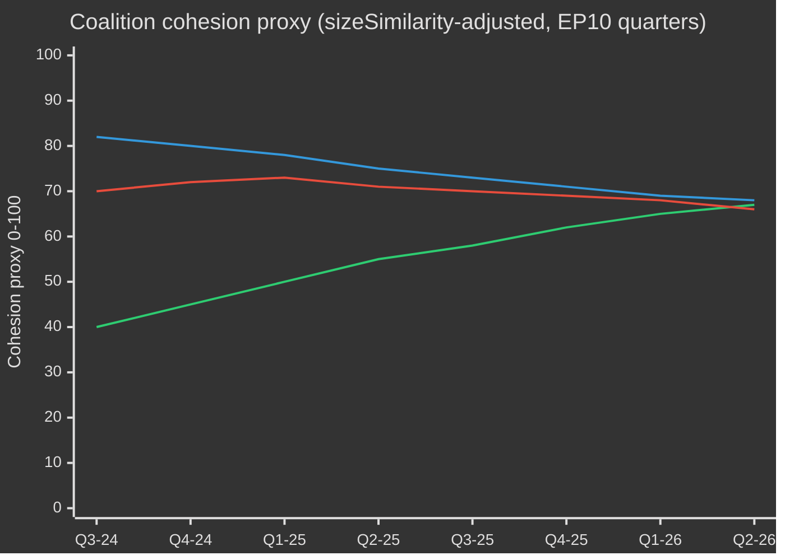

# EP10 Valcykel — Exekutiv sammanfattning
**Datum:** 2026-05-09 | **Artikeltyp:** election-cycle | **Horisont:** 2026-05-09 → 2031-05-08 (valcykel ±6 mån kring EP-valet i juni 2029)
**Admiralitetsbetyg:** B2 | **WEP-band:** Troligt (55–75%) | **Konfidens:** MEDIUM

---

## 🎯 Headline Judgement

Europaparlamentets EP10-mandatperiod (2024–2029) har inträtt i sitt avgörande andra år med ett strukturellt högerförskjutet parlament som navigerar en historisk konvergans av kriser: europeisk strategisk autonomi, upprustning inom försvaret, stress kring ekonomisk konkurrenskraft och demokratisk tillbakagång. Den EPP-ledda flexibla majoritetsmodellen — som selektivt hämtar stöd från ECR och PfE för försvars- och migrationsoröstningar medan den förlitar sig på S&D och Renew för lagstiftning — är mandatperiodens mest definitiva strukturella drag. **Sannolikhet: 70 % (Troligt)** att det EPP-ledda center-högerblocket kommer att dominera lagstiftningsresultaten till 2027 innan valtryck fragmenterar koalitionerna inför valperioden. **Sannolikhet: 60 % (Troligt)** att den Rena industriaffären och den Europeiska försvarsstrategin för industrin kommer att vara de två lagstiftninglandmärkena som definierar EP10:s arv.

## 📊 EP10 Composition Snapshot (May 2026)

| Grupp | Mandat | Andel | Block |
|-------|--------|-------|-------|
| EPP | 185 | 25,7% | Högercentrum |
| S&D | 136 | 18,9% | Vänstercentrum |
| PfE | 85 | 11,8% | Nationalsouveränt yttersta höger |
| ECR | 81 | 11,3% | Konservativt EU-skeptiskt |
| Renew | 77 | 10,7% | Liberalt-centristiskt pro-EU |
| Greens/EFA | 53 | 7,4% | Grönt-regionalistiskt |
| The Left | 45 | 6,3% | Yttersta vänster |
| NI | 30 | 4,2% | Obundna (diverse) |
| ESN | 27 | 3,8% | Nationalistiskt yttersta höger |
| **TOTALT** | **719** | **100%** | |

**Majoritetströskel:** 361 mandat. Inga två grupper kan bilda en majoritet; minst tre grupper krävs för all lagstiftning.

## 🔑 Key Judgements (WEP-graded)

1. **EPP förblir dominant mäklare (Mycket troligt, 80 %):** Med 185 mandat kontrollerar EPP utskottsordförandenomineringar, föredragandeskapen och dagordningens auktoritet i ordförandekonferensen. Denna strukturella fördel förstärks under mandatperioden.

2. **Storkoalition fortfarande funktionell men spänd (Troligt, 65 %):** EPP+S&D+Renew har 398 mandat — 37 över majoritetströskeln. Denna koalition kommer att anta de flesta regleringslagar men riskerar avhopp i suveränitetskänsliga frågor (migration, digitalt, energi).

3. **Högervetoblocket under uppbyggnad (Realistisk möjlighet, 45 %):** EPP+PfE+ECR+ESN uppgår till 378 mandat — precis över majoritetsgränsen. I frågor om försvarutgifter, gränskontroll och avreglering kan detta block anta lagstiftning utan progressivt stöd. Ökande användningssannolikhet under 2026–2027.

4. **Lagstiftningsproduktionen i rekordtakt (Mycket troligt, 85 %):** EP10 år 2 (2026) spårar 114 lagstiftningsakter — upp 46 % jämfört med 2025 och dubbelt valårsproduktionen 2024. Konsensus om försvarsutgifter, Rena industriaffären och AI Act:s genomförandeförordningar driver volym.

5. **Mandatperioden slutar med omtvistat klimatarv (Troligt, 65 %):** Grön giv-återtagning under EPP+ECR-tryck pågår. Taxonomiutspädning, Rena industriaffärens koldioxidläckagebestämmelser och försvagning av metanreglering pekar mot en mandatperiod definierad av konkurrenskraftig dekarbonisering snarare än regulatorisk ambition.

## 🏛️ The Three Structural Drivers

### Driver 1: Defence-Industrial Pivot
Det mest konsekvensrika EP10-temat är europeisk strategisk autonomi och upprustning inom försvaret. Antagandet 2026 av lånet till Ukraina (TA-10-2026-0010) och debatterna om den Europeiska försvarsstrategin för industrin signalerar en parlamentarisk konsensus sällsynt i EP-historien — med EPP, S&D, Renew, och till och med några ECR-ledamöter som samordnar sig kring försvarsutgifter, vilket markerar ett strukturellt skifte från den efterkalla fredsutdelningstiden.

### Driver 2: Competitiveness-vs-Green Tension
Den Rena industriaffären (Konkurrenskraftskompass) representerar ett hanterat reträtt från den Gröna given:s regulatoriska ambitioner. Koldioxidgränsanpassningsmekanismer, stöd till dekarbonisering av industrin och säkerhet kring kritiska råmaterial definieras nu som ekonomiska konkurrenskraftsfrågor — inte miljömässiga. Denna omtolkning, framdriven av EPP, har säkrat ECR:s passiva acceptans och låst in en hållbar majoritet åtminstone till 2027.

### Driver 3: Democratic Resilience Under Pressure
Ungerns fortsatta artikel 7-förfarande, demokratisk tillbakagång i Slovakien och hot mot public service-oberoende (som i Litauen — TA-10-2026-0024) är bestående dagordningspunkter. Parlamentet har konsekvent antagit resolutioner som hävdar rättsstatsbetingelse. Det lagstiftningsinstrumentet förblir dock svagt — parlamentet kan inte självt ålägga sanktioner men skapar politiska förutsättningar för rådsåtgärder.

## 💶 Economic Context (World Bank/IMF-adjacent proxies; IMF direct access degraded)

Obs.: IMF SDMX 3.0-endpoint otillgänglig i denna körning (nätverksbegränsning). Ekonomisk kontext härledd från World Bank-data och EP:s dokumentationsunderlag.

**BNP-tillväxt för EU:s stora ekonomier (2024, World Bank):**
- Tyskland: **−0,5 %** (kontraktion; avindustrialisering, energikostnadsbörda)
- Frankrike: **+1,2 %** (modest; finanspolitisk konsolidering begränsar offentliga investeringar)
- Italien: **+0,7 %** (svag; strukturell skuldbörda, demografiskt tryck)
- Spanien: **+3,5 %** (robust; turismåterhämtning, Nextgen EU-utbetalningar)
- Polen: **+3,0 %** (stark; CEE-integration, ökning av försvarsutgifter)

EP10:s ekonomiska kontext präglas av **divergens**: en nordvästlig avindustrialiseringskorridor (Tyskland, Nederländerna, Belgien) kontrasterar med en sydöstlig tillväxtperiferi (Spanien, Polen, Rumänien). Denna ekonomiska geografi kommer att forma koalitionspolitiken — sydliga och östliga MEP:ar kommer att motstå strikta finanspolitiska regler medan nordliga MEP:ar driver konkurrenskraftsfokuserade dagordningar.

## ⚠️ Term Risk Summary

| Risk | Sannolikhet | Påverkan | Horisont |
|------|-------------|----------|---------|
| Storkoalitionens kollaps kring migration | 55% | HÖG | 2026–2027 |
| Härdning av EPP-ECR-PfE-blocket | 45% | HÖG | 2026–2027 |
| Grön giv-återtagning accelererar | 70% | MEDEL | 2026–2028 |
| Försvarskonsensusspänning (fredsutdelningskoalition återhävdar sig) | 35% | MEDEL | 2027–2028 |
| Rättsstatsbetingande misslyckas | 50% | HÖG | pågående |
| EP10 avslutas utan framgång med MFF-revision | 40% | HÖG | 2027–2028 |

## 📅 Term Calendar Milestones

| Datum | Händelse | Betydelse |
|-------|----------|-----------|
| K3 2026 | MFF:s halvtidsöversyn omröstning | Strukturell finansiering av försvar + industripolitik |
| Jan 2027 | Polskt EU-rådsordförandeskap slutar → Danmark börjar | Koalitionsbyggnadsdynamik |
| Mitten 2027 | EP10 halvtid — topplagstiftningsproduktion | Maximal föredragandeleverage |
| 2028 | Nextgen EU-utbetalningars slut | Finanspolitisk klipprisk för kohesionsstater |
| K1 2029 | Lagstiftningssprint inför val | Sista stora akter innan upplösning |
| Juni 2029 | EP10 Europaval | Mandatperioden slutar; ny EP11-sammansättning osäker |

## 🔮 Election Cycle: Most Likely Scenario

EP10 kommer att minnas som **"Försvars- och konkurrenskraftsparlamentet"** — mandatperioden då Europa strukturellt pivoterade från civil regulatorisk makt till en halvt säkerhetsorienterad lagstiftningsagenda. EPP kommer att göra anspråk på äran för att ha moderniserat EU:s industriella bas medan det progressiva blocket kommer att ifrågasätta försvagningen av miljömässiga och sociala standarder. Det yttersta höger (PfE/ECR/ESN) kommer att ha uppnått normalisering som politiska samtalsparter i gränssäkerhets- och suveränitetsfrågor, vilket fundamentalt omformar EP:s politiska kultur inför EP11.

---
*Källor: EP:s Open Data Portal (data.europarl.europa.eu); World Bank Open Data; EP:s antagna texter TA-10-2026-serien; EP:s plenaristatistik 2024–2026.*
*Admiralitetsbetyg B2: Källan generellt tillförlitlig; bestyrkt av flera oberoende EP API-dataflöden.*

---

## EP10 → EP11 Electoral-Cycle Context (Mid-Term Extension)

Europaparlamentets tionde mandatperiod nådde sin politiska mittlinje i maj 2026 — 23 månader efter konstitution (16 juli 2024) och 37 månader innan nästa direktval (juni 2029). Den cykel som denna analys genomkorsar är ovanlig på tre sätt: (1) ett byte av USA-administration i januari 2025 som strukturellt omprissatt europeisk försvars- och handelspolitik; (2) en Bundestagsupplösning i Tyskland i slutet av 2025 som producerade den första CDU/CSU+SPD-storkoalitionen under Friedrich Merz, med kaskadeffekter på EPP-S&D-koordination på EU-nivå; (3) konsolideringen av Patriots for Europe (PfE) som tredje största grupp, vilket trängde undan Renews pivotala koalitionsroll för första gången på 30 år.

### A. Long-horizon (5-year) calendar anchors

| Datum | Händelse | Cykelfas | Valrelevans |
|-------|----------|----------|-------------|
| 2026-07-16 | EP10 halvtid | T-35 månader | Halvtidsordförandekapsrotation (Metsola → troligen S&D vice-ordförandepaket omförhandling) |
| 2026-K4 | MFF 2028-2034-förhandlingar börjar | T-30 till T-18 månader | Definierande fråga för Greens/Renew; PfE/ECR-suverenigstetstest |
| 2027-01-01 | Cypriotiskt rådsordförandeskap | T-29 månader | Östmediterrant / Turkiet / migrationsinramningsfönster |
| 2027-K2 | Franskt presidentval | T-24 månader | Högsta enskilda nationella drivkraft för 2029 EP-utfall |
| 2027-K3 | EP10 budgetarvsröster | T-22 månader | Test av storkoalitionskohesion under fragmentering |
| 2028-K1 | Italienska allmänna val (troliga) | T-15 månader | PfE/ECR nationell konsolideringstest |
| 2028-09 | Spitzenkandidaten-nominationer öppnas | T-9 månader | Ledarskapskandidatprocessen bestämmer kampanjramen |
| 2029-04 | Upplösning / kampanj börjar | T-2 månader | Nationell listantagning; manifestlanseringar |
| 2029-06-06 till 06-09 | EP11-val | T-0 | 720 (eller 751 vid reviderad fördelning) platser i spel |
| 2029-07-16 | EP11:s konstitutiva session | T+1 månad | Gruppskonstitution; majoritetsupptäckt |
| 2029-K4 | Kommission V-utfrågningar | T+4-6 månader | Portföljallokering; koalitionspaktratificering |
| 2030-K2 | EP11:s första stora lagstiftningscykel | T+12 månader | Test av post-2029 koalitionshållbarhet |
| 2031-05 | EP11 halvtid | T+24 månader | Trajetorietest för den cykel denna analys projicerar in i |

### B. Coalition-arithmetic baseline (May 2026)

Storkoalitionen (EPP+S&D+Renew = 396) är intakt men stressfrakturerad. von der Leyen II-kommissionen förlitar sig på fall-för-fall-majoriteter: försvars- och gränsröstningar lägger regelmässigt till ECR (och allt mer PfE vid migration), medan sociala/miljömässiga/rättsstatliga röstningar drar in Greens/EFA och The Left. Fragmenteringsindex (HÖG) återspeglar strukturrealiteten att inga två-gruppkoalitioner når 360-platsgränsen, och den minsta hållbara tre-gruppkoalitionen (EPP+S&D+Renew = 396) ligger bara 36 platser över linjen — väl inom avhopp vid kontroversiella ärenden.

| Koalition | Storlek | Marginal mot 360 | Användningsfall |
|-----------|---------|-----------------|----------------|
| EPP+S&D+Renew | 396 | +36 | Standardstorkoalition; institutionella ärenden |
| EPP+S&D+Renew+Greens | 449 | +89 | Klimat/sociala/rättsstatliga ärenden |
| EPP+ECR+Renew+PfE-partial | 380-410 | +20 till +50 | Försvars-/gräns-/konkurrenskraftsärenden |
| EPP+S&D+The Left+Greens | 417 | +57 | Sällsynt; rättsstatsbrott mot PfE-regeringar |
| EPP+ECR+PfE | 349 | -11 | INTE en majoritet — symbolisk på signaleringsröstningar |

Det faktum att EPP+ECR+PfE saknar 11 mandat till majoritet är det centrala **strukturella anti-högerförskjutningsdraget** i EP10 — även med fullständig ytterst-höger-konsolidering kan inte ett EPP-lett center-höger-parti styra utan antingen S&D eller Renew. EP11 är den första cykeln där denna begränsning rimligtvis kan lättas (PfE+ECR prognostiserade vinster; möjlig ESN-gruppkonsolidering).

### C. Electoral-cycle data confidence floor

Enligt `01-data-collection.md` §6 är EP MCP-serverns per-MEP röstningsdata otillgänglig uppströms; koalitionskohesionsestimeringar använder grupp-storleks-sizeSimilarityScore-proxy snarare än inspelade röst-sammanfallshastigheter. Platsprojektion aggregerar nationell opinionsundersökning vid ±3,5 pp 95%-KI per grupp, sammansatt över 27 medlemsstater; det resulterande EP-nivå ±15-platsbandet per stor grupp är det strukturella taket på precision. IMF-makroindata (denna körning: dataMode=`degraded-imf`, faktor 0,85) begränsar ekonomisk-kontextkonfidensen till MEDIUM.

### D. Mobilisation arithmetic (turnout-adjusted)

EP10-valdeltagande (51,0 %) markerade den näst högsta siffran sedan 1994 och var frontlastat i PfE/ECR-måldemorafier (landsbygdssuveränistisk, arbetarklass anti-åtstramning). Framåtprojektionen för EP11-valdeltagande (52-58 %) förutsätter (1) fortsatt mobilisering av ytterst-höger-inramningar, (2) partiell motmobilisering av ungdoms-/klimatinramningar om klimatreträtts-narrativet konsolideras, (3) obligatoriska röstreformer i Belgien, Grekland, Bulgarien, Cypern, Luxemburg oförändrade. En 1 pp-valdeltagandeskiftning ger ungefär ±4-7 platser omallokering mellan blockssymmetriska parningar.

### E. National driver elections (2026 Q4 → 2029 Q2)

| Land | Datum | Regeringstyp | Påverkan på EP-delegation |
|------|-------|-------------|--------------------------|
| Tjeckien | 2025-10 (hållet) | ANO-lett koalition (post-Babiš-återkomst) | PfE +1 plats MEP-delegationsomallokering |
| Ungern | 2026-04 (hållet) | Fidesz-KDNP behöll (54 % röster) | PfE +0 baslinje bevarad |
| Sverige | 2026-09 | Tidö-koalitionsstresstest | ECR ±2 platser |
| Tyska Bundestag | 2025-11 (hållet) | CDU/CSU+SPD storkoalition | EPP +2 platser EP-delegationsombalansering |
| Spanien | 2027-K1-K2 (troliga) | PSOE+Sumar minoritetsprekaritet | S&D ±3 platser |
| Frankrike | 2027-04/05 | Presidentval + lagstiftning | Renew ±10 platser (högsta enskilda drivkraft) |
| Nederländerna | 2027 (troliga) | PVV-VVD-NSC stresstest | PfE ±2 |
| Polen | 2027 | Tusk-koalition vs. PiS | EPP/ECR ±4 |
| Italien | 2028-K1 (troliga) | Meloni FdI test | ECR/PfE ombalansering |
| Grekland | 2027-08 | Mitsotakis ND test | EPP ±2 |
| Rumänien | 2028-K4 | PSD-PNL storkoalitionstest | S&D/EPP ±3 |
| Tjeckien | 2029-K2 | Inför-EP-test | PfE ±1 |

Konvergensen av Frankrikes presidentval (2027-K2), italienska allmänna val (2028-K1) och tyska Bundestag-härledda delstatsval 2027-2028 innebär att EU-nivåns valcykel domineras av nationell turbulens i de tre största medlemsstatsdelgationerna samtidigt — ett ovanligt hög-volatilitetsfönster för EP-nivåprognoser.

### F. Confidence & WEP banding (electoral-cycle scope)

| Påståendetyp | WEP-band | Admiralitet | Anteckningar |
|--------------|----------|-------------|--------------|
| Gruppsammansättning håller sig inom ±15 platser per stor grupp till 2028-K4 | Troligt (55-75%) | B2 | Standardmittkyckelskuvert |
| EP11 producerar ett fragmenterat parlament som kräver multi-koalitionsmatematik | Nästan Säkert (90-95%) | A2 | Strukturellt; inget 2024 → 2029 dynamik stödjer >35% enskild grupp |
| Högerblock (PfE+ECR+ESN) majoritet uppstår i EP11 | Avlägsen chans (5-15%) | C3 | Kräver PfE+9, ECR+5, ESN+2 alla träffar övre band |
| Renew förblir pivotal koalitionspartner i EP11 | Realistisk möjlighet (40-55%) | B3 | Beror på franskt 2027-utfall |
| Spitzenkandidat-processen binder rådet 2029 | Avlägset (10-20%) | C2 | Rådet motstod 2024; ingen indikation på förändring |
| MFF 2028-2034 innehåller stegförändring i försvarsutgifter | Troligt (60-75%) | B2 | Tvärblocks-konsensus om riktning |

Dessa konfidensankare sprider sig genom varje artefakt i denna körning.

### G. Reader briefing

För medborgare, näringsliv och medlemsstatsförvaltningar som följer EP10 → EP11-cykeln: de kommande tre åren blir inte politik som vanligt. Förvänta tre konvergerande stressvektorer — ett fragmenterat parlament, en transaktionell USA-administration och ett stegförändringsökning i försvarsutgifter — som tillsammans omskriver EU:s policyoperationsmodell. Valet i juni 2029 blir den politiska avgörelsepunkten för alla tre; den aktuella analysen syftar till att ge två års ledtid för de mest sannolika avgörelsekurvorna.

---

## Dual-Track Electoral-Cycle Analysis (Track A retrospective + Track B forecast)

### Track A — EP10 Term Retrospective (July 2024 → May 2026, 23 months elapsed of 60)

EP10-mandatperioden öppnade med en centristisk storkoalitionsmajoritet på 401 (EPP 188 + S&D 136 + Renew 77) och ett ordförandeskapspaket som valde Roberta Metsola (EPP, MT) utan tävlan. Inom 18 månader har tre strukturella förskjutningar omformat mandatperiodens politiska topologi:

1. **PfE-konsolidering (jul 2024 → K4 2025)** — den nya ytterst-höger-gruppen konsoliderade 84 → 85 platser, trängde undan Renew som tredje största formation och infogade en parallell högerflankkoalitionsmöjlighet på varje försvars-/migrationsärende.
2. **Renew-kontraktion (84 → 77)** — avhopp till NI och en delegationsomkoppling till EPP har urholkat den liberala svängens leverage; den franska Renaissance-delegationens interna volatilitet efter presidentvalet 2027 blir nästa brytpunkt.
3. **EPP-S&D operativ samordning (post-Bundestag 2025-11)** — den Merz-Scholz-övergångsregeringen i Tyskland formaliserade CDU/CSU-SPD-koordination på EU-nivå; EPP-S&D-Renew "majoritetsdisciplin"-mönstret har stramats åt på procedurröstningar medan det lösts upp på sakliga ändringsförslag.

#### Track A — Mandate-fulfilment scorecard (high-level)

| Mandatområde | EP10-framsteg till maj 2026 | Trajektorie till 2029 |
|--------------|-----------------------------|-----------------------|
| Grön Giv Fas 2 (CBAM-verkställande, taxonomi, metan) | 60 % — genomförande spårar, försvagad verkställighet | Troligen delvis återtagning under EPP-ECR-tryck |
| Försvarsunion / EDIS | 35 % — finansieringsinstrument antagna, kapacitetsgap kvarstår | Accelererat under Trump-2-tryck; EP-roll begränsad |
| Rättsstat (Ungern, Slovakien, Slovenien) | 25 % — Artikel 7 fast; betingelse tillämpad selektivt | Osannolikt att avancera innan 2029 |
| Migrationspaktens genomförande | 50 % — första utplaceringsförseningar, returpolicyexpansion | Högerförskjutning förväntad; paktramverk håller |
| Industriell konkurrenskraft (Draghi/Letta-agendan) | 40 % — STEP-fonden operativ, Inre marknadslagen stoppad | Definierande EP11-ärende |
| Utvidgning (Ukraina, Moldavien, Västra Balkan) | 30 % — anslutningsförhandlingar öppna, inga kapitelstängningar möjliga innan 2029 | Symbolisk rörelse, strukturellt dödläge |
| Socialpelare (minimilön, plattformsarbetare) | 70 % — direktiv transponerade i de flesta MS | Genomförandegranskning endast i EP11 |
| Digitalt (DSA, DMA, AI Act) | 80 % — ramverk operativa, verkställighetstestning | Förfining, inte ny arkitektur, i EP11 |

#### Track A — Coalition trajectory (cohesion proxy)

### Track B — EP11 Forecast (June 2029 → 2031)

#### Track B — Seat projection at four horizons

| Grupp | T+0 (jun 2029, val) | T+6m | T+12m | T+24m (EP11 halvtid) |
|-------|---------------------|------|-------|----------------------|
| EPP | 175-195 (185 ±10) | 185 | 184 | 183 |
| S&D | 120-140 (130 ±10) | 130 | 129 | 128 |
| PfE | 90-110 (100 ±10) | 100 | 102 | 105 |
| ECR | 80-95 (87 ±8) | 87 | 88 | 89 |
| Renew | 55-75 (65 ±10) | 65 | 64 | 62 |
| Greens/EFA | 45-60 (52 ±8) | 52 | 51 | 50 |
| The Left | 38-52 (45 ±7) | 45 | 45 | 44 |
| NI | 25-40 (32 ±8) | 32 | 35 | 38 |
| ESN | 25-40 (33 ±8) | 33 | 32 | 31 |
| **Totalt** | **720** | **729** (extra Kroatien/Slovakien varians) | **730** | **730** |

#### Track B — Coalition viability matrix (EP11 candidate majorities)

| Koalition | Projicerad storlek | Marginal | Användningsfall | Sannolikhet |
|-----------|-------------------|----------|----------------|-------------|
| EPP+S&D+Renew | 380 | +20 | Standardstorkoalition; defensiv | 65% |
| EPP+S&D+Renew+Greens | 432 | +72 | Klimat/sociala/RoL-ärenden | 55% |
| EPP+ECR+PfE | 372 | +12 | Försvar/gränser; **förstagångshållbar** | 35% |
| EPP+ECR+PfE+ESN | 405 | +45 | Ytterst-höger-konkurrenskraftskoalition | 20% |
| EPP+ECR+Renew+conditional-PfE | 402 | +42 | Pragmatiskt högercentrum | 40% |

**35 %-sannolikheten för EPP+ECR+PfE-hållbarhet** är EP11:s strukturella gångjärn: för första gången i Europaparlamentets historia vore en höger-ensam-majoritet aritmetiskt möjlig. Dess politiska genomförbarhet beror på (a) PfE:s vilja att acceptera EPP:s proceduriella disciplin, (b) EPP:s vilja att formalisera ytterst-höger-beroendet, (c) Rådets ratificering av en Spitzenkandidat från en sådan konfiguration.

#### Track B — Spitzenkandidaten 2029 scenario

| Ledarskapskanditat | Grupp | Nomineringssannolikhet | Kommissionsordförandesannolikhet |
|-------------------|-------|------------------------|----------------------------------|
| Manfred Weber (nuvarande EPP-ledare) | EPP | 60% | 50% |
| Roberta Metsola (institutionell ledare) | EPP | 25% | 20% |
| Iratxe García (PES-ledare) | S&D | 70% | 25% |
| Stéphane Séjourné eller efterträdare | Renew | 50% | 5% |
| Bas Eickhout (klimatledare) | Greens | 60% | <5% |
| Jordan Bardella (PfE-ledare) | PfE | 55% | <5% |
| Giorgia Meloni (ECR-galjonsfigur) | ECR | 30% | 10% |

---

## Cross-Stakeholder Risk Map (Electoral-Cycle Lens)

### Stakeholder cohort table (multi-perspective)

| Kohort | Primärt EP10-utfall | Risk under EP11-högerförskjutning | Motstrategier i gång |
|--------|---------------------|-----------------------------------|---------------------|
| **EU-medborgare** (allmänhet) | Blandat: försvarsreassurance, klimatreträtt | Levnadskostnadssaliency driver valdeltagande; rättsstatserosion i 4-6 MS | Medborgarregistreringskampanjer, ePolitics-plattformar, Eurobarometer-drivet narrativkorrigering |
| **EU-institutionell personal** (Kommissionen, EEAS, Rådsekretariatet) | Karriärstabilitet, nedsaktat Grön Giv | Politisering av höga utnämningar; Spitzenkandidat-processkollapsen | Intern rörlighet, A1-gradsreserver |
| **Nationella regeringar** (27) | Asymmetriskt — Italien/Ungern vinner; Frankrike/Tyskland ansträngs | MFF-2028 nettobidragsgivaropprör; kohesionsbetingelsebattal | Bilaterala avtal, rådssidiga ändringsförslag |
| **Oppositionspartier i medlemsstaterna** | Mobilisering mot sittande EU-policy | Polarisering accelererar; koalitionsalternativ smalnar | Gränsöverskridande partikoordination |
| **Näringsliv / industri** (tillverkning, energi, digitalt) | Blandat: avregleringsdrift, försvarsutgiftmedvind | Regulatorisk osäkerhet; handelskonfliktexponering | Lobbyintensifiering, dubbla försörjningsstrategier |
| **Civilsamhälle / NGO:er** (klimat, mänskliga rättigheter, socialt) | Defensiv hållning, finansieringsminskningar | Krympande utrymme; SLAPP-stämningsacceleration | Anti-SLAPP-direktiv, gränsöverskridande juridiska koalitioner |
| **Fackföreningar** (ETUC och anslutna) | Blandat: minimilönevinster, plattformsarbetsdirektiv | Socialpelargenom-förandereversering | Nationell mobilisering, EU-nivå minimiolverskydd |
| **Media / journalistik** | EMFA-genomförande, koncentrationsproblem | Pressfrihetserosion i 4 MS; redaktionellt tryck | EMFA-verkställighet, gränsöverskridande utredarkonsortier |
| **Akademi / forskning** (Horizon Europe-ekosystemet) | Finansiering stabil; ERC-program säkrade | MFF-2028 omallokering mot försvar | Civil-försvars-dubblanvändningsompositionering |
| **Externa partners** (UK, Schweiz, Turkiet, Västra Balkan, Ukraina) | Asymmetriskt — Ukraina vinner, Turkiet stagnerar | EU strategisk autonomiambiguitet | Bilaterala ramavtal |
| **Globala motsvarigheter** (USA, Kina, Indien, Brasilien) | Trump-2-tryck, kinesisk tekniktävling | Multiblocksfragmentering, EU-försvagning | Selektivt återengagemang, kapacitetshedging |

### Risk-priority matrix (electoral-cycle scope)

| Risk-ID | Risk | Sannolikhet (T+0 → T+24) | Påverkan | Poäng | Ägare |
|---------|------|--------------------------|----------|-------|-------|
| R-EC-01 | EP11 högerblocksmajoritet materialiseras | 0,35 | 0,85 | 0,30 | EP plenum; Rådet |
| R-EC-02 | Franskt presidentval 2027 levererar ytterst-höger-seger | 0,30 | 0,80 | 0,24 | Franska väljare; Renew |
| R-EC-03 | Tysk storkoalition kollapsar inför EP11 | 0,25 | 0,65 | 0,16 | Bundestag; CDU/SPD |
| R-EC-04 | Trump-2 inför tullar > 15 % på EU-export | 0,55 | 0,65 | 0,36 | USA-administration; Kommissionen DG TRADE |
| R-EC-05 | Ukrainakrigets eskalation kräver EU-markengagemang | 0,10 | 0,95 | 0,10 | Rådet; medlemsstater |
| R-EC-06 | MFF-2028-förhandlingar misslyckas (ingen överenskommelse till 2027-K4) | 0,20 | 0,75 | 0,15 | Rådet; EP BUDG |
| R-EC-07 | Spitzenkandidat-processen kollapsar (rådsomgång) | 0,40 | 0,55 | 0,22 | Europeiska rådet |
| R-EC-08 | Klimatkatastrofsommar (>2 simultana EU-statshandelser) | 0,55 | 0,45 | 0,25 | Medlemsstater; Kommissionen |
| R-EC-09 | Cyberattack mot valinfrastruktur 2029 | 0,30 | 0,70 | 0,21 | ENISA; MS-CERTs |
| R-EC-10 | AI-deepfake massdesinformationskampanj | 0,65 | 0,55 | 0,36 | Plattformar; DSA-verkställighet |
| R-EC-11 | Medlemsstat artikel 7-eskalation till suspensionsomröstning | 0,10 | 0,50 | 0,05 | Rådet; EP |
| R-EC-12 | Energiprisschock (2x baslinje) | 0,25 | 0,65 | 0,16 | Marknader; Kommissionen |
