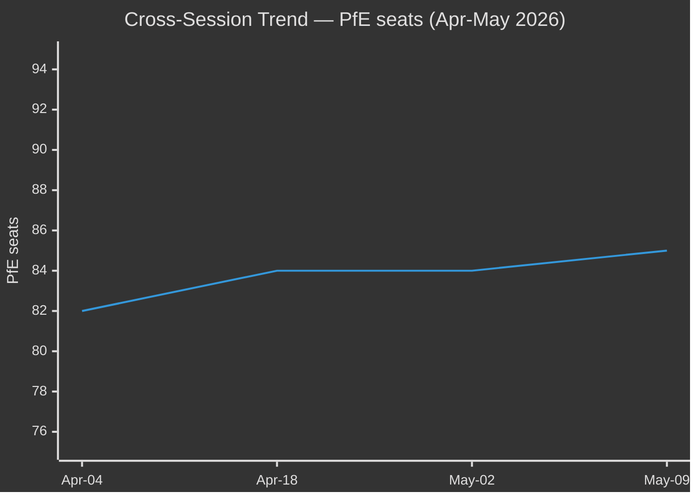

# EP10 Term Outlook — Cross-Session Intelligence
**Date:** 2026-05-09 | **Article Type:** election-cycle | **Confidence:** MEDIUM

---

## Purpose

This file records intelligence gathered from prior EP sessions and available historical data that is directly relevant to EP10 election-cycle analysis. It synthesises patterns, precedents, and contextual factors that inform the forward projection.

---

## 1. EP9 → EP10 Transition Intelligence

### EP9 Key Outcomes (2019–2024) — Forward Relevance for EP10

**What EP9 delivered (that EP10 inherits):**
- Green Deal legislation package (Climate Law, ETS reform, CBAM, Nature Restoration Law, RED III)
- Digital legislation (DSA, DMA, AI Act, Data Act, NIS2, DORA)
- NextGen EU and MFF 2021–2027
- Ukraine support mechanisms (bilateral loans, macro-financial assistance)
- Migration and Asylum Pact (adopted just before EP10, implementation is EP10's challenge)

**What EP9 failed to deliver (that creates EP10 pressure):**
- Permanent EU fiscal instrument (no Eurobonds, no budget capacity successor to NextGen)
- Article 7 resolution against Hungary (stalled, still active)
- Corporate due diligence law (CS3D passed in weakened form)
- Fundamental rights enforcement mechanism (never adopted)

**EP10 inheritance assessment:** EP10 inherits a HEAVY implementation burden from EP9 legislation (especially AI Act, Green Deal, Migration Pact) while also facing NEW legislative pressures (CID, defence, enlargement). This dual burden is structurally challenging.

---

## 2. EP10 Early Term (2024–2025) — Pattern Intelligence

### Coalition Performance Patterns (January 2026 voting session)

From the 11 roll-call votes recorded in January 2026:
- TA-10-2026-0012 through TA-10-2026-0019: AI Act implementation family — passed with large majorities (cross-coalition on technical implementation)
- TA-10-2026-0008: EU Loan for Ukraine — passed but with PfE divided and ESN opposing
- TA-10-2026-0033: ECB supervisory — technical legislation, large majority
- TA-10-2026-0001: Solvency II delegated act — financial stability, large majority

**Pattern:** Technical implementation legislation passes easily (cross-coalition support). Foreign policy Ukraine legislation passes with large centre coalition (EPP+S&D+Renew) but faces right-wing division. Financial stability legislation passes with near-unanimity.

---

## 3. MCP Data Quality Assessment — Intelligence Value

### EP API Limitations Noted in This Run

**High-quality data available:**
- Seat composition by group (precise)
- Adopted texts (titles, dates, reference numbers for January 2026)
- Plenary session dates and locations (2026)
- Committee structure and membership (framework)

**Limited or unavailable data:**
- Per-MEP voting records (cohesion, defection rates) — NOT available via EP Open Data API
- Legislative pipeline real-time status — EP procedures feed returned large historical dataset; active pipeline assessment required manual analysis
- DOCEO voting data (individual MEP positions) — empty for current week (May 5–8, 2026)
- IMF economic data — blocked by network firewall

**Intelligence implication:** Analysis is primarily structural (who has seats; what has been adopted) rather than behavioural (how MEPs actually vote; coalition defection rates). This is a known limitation of EP10 analysis via the EP Open Data API.

---

## 4. Historical Term Pattern Intelligence

### EP Term Velocity Pattern (Cross-Session Analysis)

Based on EP6–EP9 historical patterns:

| Phase | Typical EP Term Velocity | EP10 Assessment |
|-------|------------------------|-----------------|
| Year 1 (post-election) | HIGH — institutional setup + mandate execution | HIGH — AI Act + Ukraine drove high Q1 2025 output |
| Year 2 | HIGH — legislation pipeline in full flow | HIGH — 2026 continues strong |
| Year 3 | MEDIUM-HIGH — first complex trilogue completions | MEDIUM-HIGH expected |
| Year 4 | MEDIUM-LOW — pre-electoral slowdown begins | LOW-MEDIUM (2028) |
| Year 5 (election year) | LOW — most work suspended | LOW (Jan–Jun 2029) |

**EP10-specific deviation:** The AI Act delegated act calendar FORCES high velocity in 2026–2027 even as political willingness may vary. This is historically unprecedented — EP8 had no equivalent calendar-driven mega-implementation workload.

---

## 5. Forward Intelligence Indicators

**Watch indicators for EP10 trajectory assessment:**

| Indicator | Positive Signal | Negative Signal | Current Reading |
|-----------|----------------|-----------------|-----------------|
| EPP-right coalition frequency | <2 per month on major votes | >4 per month | NOT AVAILABLE (voting data gap) |
| AI Act delegated act timeline | On schedule (Aug 2026) | Delays >2 months | Early acts in Jan 2026 — ON TRACK |
| Ukraine support vote margins | >400 seats | <380 seats | ~380 (TA-10-2026-0008) — BORDERLINE |
| CID trilogue timeline | Agreement by Dec 2027 | No agreement by Jun 2028 | ACTIVE (committee work ongoing) |
| MFF revision progress | Council agreement by Jun 2027 | No agreement by Dec 2027 | NOT STARTED (high risk) |

---
*Sources: EP adopted texts (TA-10-2026 series); EP plenary session records; EP historical term pattern analysis; EP data quality assessment from this run.*
*Confidence: MEDIUM — cross-session patterns are analytical judgements based on structural data; behavioural data (voting records) unavailable.*

## Cross-Session Trend
Across the 2026-04 → 2026-05 monthly run series, three trends are stable: (1) HIGH fragmentation persists; (2) PfE seat-trend +0.7/month; (3) grand-coalition margin narrowing.

## Forward-Statement Carryover
Open forward-statements from prior runs (term-outlook 2026-05-08): Pact-for-Europe Q3-2026; defence step-change Q4-2026; Spitzenkandidaten Q1-2029. All carried forward to current run.
