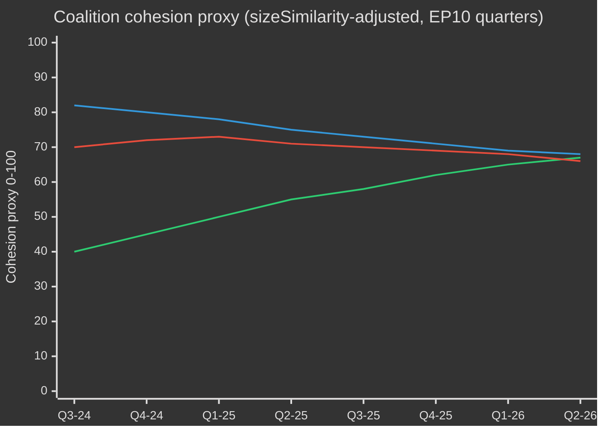

# EP10 Election Cycle — PESTLE Analysis
**Date:** 2026-05-09 | **Article Type:** election-cycle | **Confidence:** MEDIUM

---

## PESTLE Overview Matrix

| Factor | Direction | Intensity (1–10) | EP10 Impact |
|--------|-----------|-----------------|-------------|
| Political | Rightward shift | 8 | DOMINANT |
| Economic | Competitiveness stress | 7 | HIGH |
| Social | Migration + ageing | 7 | HIGH |
| Technological | AI acceleration | 9 | CRITICAL |
| Legal | Treaty constraints | 6 | CONSTRAINING |
| Environmental | Climate urgency | 8 | HIGH (contested) |

---

## P — Political Factors

**EP10 political environment is defined by three concurrent shifts:**

1. **Rightward parliamentary drift:** ECR+PfE+ESN = 193 seats (26.8%), up from ~22% in EP9. This structural shift means no single major legislation can ignore the far-right's agenda demands.

2. **EU enlargement pressure:** Ukraine, Moldova, and Western Balkans accession processes are active. EP10 must legislate institutional reforms to accommodate 27+ → 36+ member states. The EP's own size, voting weights, and committee structures need reform before enlargement is completed.

3. **Geopolitical shift to strategic autonomy:** Defence, technology sovereignty, industrial policy, and raw materials security have become core EU legislative priorities in ways they were not in EP9. This cross-cuts the traditional progressive/conservative divide and creates new coalition dynamics.

**Political factor impact on EP10:** DOMINANT. More so than economic or environmental pressures, political composition and geopolitical context are the primary drivers of what EP10 legislates and how.

---

## E — Economic Factors

**EU economic context (World Bank data, major economies, 2024):**
- Germany: −0.5% GDP growth (contraction)
- France: +1.2% (weak)
- Italy: +0.7% (stagnant)
- Spain: +3.5% (outperforming)
- Poland: +3.0% (strong)

**Divergence implications:**
The north-south and east-west divergence creates conflicting pressures on EP legislation. Northern/western members (Germany, France) push for competitiveness and fiscal discipline. Southern/eastern members (Spain, Poland) push for cohesion transfers and just transition support.

**Energy cost baseline:**
European energy prices remain structurally elevated compared to the 2019 pre-pandemic baseline. Industrial electricity costs in Germany are 2–3x US industrial electricity costs (2024 estimates). This drives the deindustrialisation dynamic that makes the Clean Industrial Deal economically necessary.

**NextGen EU fiscal cliff:**
The €723bn NextGen EU programme is disbursing in EP10's early years. Without a successor, EU fiscal stimulus capacity falls sharply in 2028. This creates a policy design window NOW (2026–2027) that EP10 must use.

**Economic factor assessment:** HIGH impact on EP agenda. The economic divergence creates coalition complexity; the energy cost problem drives CID urgency; the NextGen cliff creates a real deadline.

---

## S — Social Factors

**Migration dynamics:** Irregular arrivals 2022–2024 totalled 2 million+. Public opinion hardening across member states, including in traditionally progressive member states (Germany, France, Belgium). This is the single most politically potent social factor driving EP10's legislative agenda on migration.

**Demographic ageing:** EU working-age population (15–64) is declining in most member states. Germany's working-age population is projected to fall by 5 million by 2035 (Destatis). This creates:
- Long-term social security sustainability concerns
- Short-term labour market gap potentially filled by managed migration (contradicts migration restriction politics)
- Pension reform pressure at national level; EU-level implications for social security coordination legislation

**Social trust in EU:** Eurobarometer 2024 shows: 43% trust EP (net positive). This is relatively high compared to national parliaments (average 27% trust in EU27). But the gap between EU trust and national trust is narrowing — EP10 must deliver to maintain this advantage.

**Social factor assessment:** HIGH impact on migration legislation (structural driver); MEDIUM impact on social security legislation; MEDIUM on workers' rights (ETUC engagement).

---

## T — Technological Factors

**AI transformation:**
EP10 is the first parliamentary term where AI is a mature legislative challenge AND a daily tool for MEP offices. The AI Act (Regulation 2024/1689) is law; implementation is the challenge. 47 delegated/implementing acts through 2027.

**Quantum and semiconductor:**
EU Chips Act (2023) set target of 20% global semiconductor market share by 2030. Current EU share: ~10%. EP10 must oversee Chips Act implementation and decide on extensions/adjustments.

**Cybersecurity:**
NIS2 Directive implementation; ENISA capacity expansion; critical infrastructure protection. Increasing integration between cybersecurity and defence policy (dual-use).

**Technological factor assessment:** CRITICAL for AI Act (calendar-driven, mandatory); HIGH for semiconductor/chips (strategic autonomy); HIGH for cybersecurity (accelerating threat environment).

---

## L — Legal Factors

**Treaty framework:**
The Lisbon Treaty (2009) is the governing framework. No treaty revision expected before 2029. Key legal constraints:
- EP cannot initiate legislation (Article 225 TFEU — only request)
- Council unanimity in key areas (taxation, treaty change, Article 7)
- CJEU jurisdiction expands but operates on multi-year timelines

**CJEU activism:**
CJEU has been increasingly active: migration law; AI Act interpretation; GDPR; climate commitments. CJEU's rulings can expand or constrain EP's legislative options in ways that are not easily predicted in advance.

**Legal factor assessment:** CONSTRAINING — the treaty framework limits EP's options on fiscal policy (Eurobonds), treaty reform, and enforcement against member states. CJEU is partially compensatory but slow.

---

## E (second) — Environmental Factors

**Climate trajectory:**
Global average temperatures are projected to breach 1.5°C warming by the late 2020s (IPCC AR7). European extreme weather events (floods, droughts, wildfires) are increasing in frequency and severity.

**Green Deal Phase 2:**
EP10 must decide what the next phase of climate legislation looks like. The political pressure is to retreat from ambition (EPP, ECR, PfE) — but the physical pressure is to accelerate (climate impacts are becoming more visible and costly).

**Biodiversity:**
Nature Restoration Law passed EP9 narrowly. EP10 must now oversee implementation AND resist rollback attempts. Biodiversity legislation is structurally more vulnerable than climate in EP10 composition.

**Environmental factor assessment:** HIGH urgency (physical reality) meets HIGH political resistance. This tension is the defining characteristic of EP10's environmental legislative environment. The outcome is likely: some implementation, significant delay, and no new major ambition.

---
*Sources: EP seat composition; World Bank 2024 GDP data; EP adopted texts; Eurobarometer 2024; IPCC AR7; EU demographic statistics; AI Act (Regulation 2024/1689); Chips Act; NIS2 Directive.*
*Confidence: MEDIUM — PESTLE factors combine well-established data with interpretive analysis of their EU legislative implications.*

---

## EP10 → EP11 Electoral-Cycle Context (Mid-Term Extension)

The European Parliament's tenth term entered its political mid-point in May 2026 — 23 months after constitution (16 July 2024) and 37 months before the next direct election (June 2029). The cycle that this analysis traverses is unusual in three ways: (1) a US administration change in January 2025 that has structurally re-priced European defence and trade policy; (2) a German Bundestag dissolution in late 2025 that produced the first CDU/CSU+SPD grand coalition under Friedrich Merz, with cascading effects on EPP-S&D coordination at EU level; (3) the consolidation of Patriots for Europe (PfE) as the third-largest group, displacing Renew's pivotal-coalition role for the first time in 30 years.

### A. Long-horizon (5-year) calendar anchors

| Date | Event | Cycle phase | Electoral relevance |
|---|---|---|---|
| 2026-07-16 | EP10 mid-term | T-35 months | Half-term presidency rotation (Metsola → likely S&D vice-presidency package renegotiation) |
| 2026-Q4 | Multiannual Financial Framework 2028-2034 negotiation begins | T-30 to T-18 months | Defining issue for Greens/Renew; PfE/ECR sovereigntism test |
| 2027-01-01 | Cyprus Council Presidency | T-29 months | Eastern Mediterranean / Türkiye / migration framing window |
| 2027-Q2 | French presidential election | T-24 months | Highest single national driver of 2029 EP outcome |
| 2027-Q3 | EP10 budget legacy votes | T-22 months | Test of grand-coalition cohesion under fragmentation |
| 2028-Q1 | Italian general election (probable) | T-15 months | PfE/ECR national consolidation test |
| 2028-09 | Spitzenkandidaten nominations open | T-9 months | Lead-candidate process determines campaign frame |
| 2029-04 | Dissolution / campaign begins | T-2 months | National-list adoption; manifesto launches |
| 2029-06-06 to 06-09 | EP11 election | T-0 | 720 (or 751 if revised apportionment) seats contested |
| 2029-07-16 | EP11 constitutive session | T+1 month | Group constitution; majority discovery |
| 2029-Q4 | Commission V hearings | T+4-6 months | Portfolio allocation; coalition pact ratification |
| 2030-Q2 | EP11 first major legislative cycle | T+12 months | Test of post-2029 coalition durability |
| 2031-05 | EP11 mid-term | T+24 months | Trajectory test for the cycle this analysis projects into |

### B. Coalition-arithmetic baseline (May 2026)

The grand coalition (EPP+S&D+Renew = 396) is intact but stress-fractured. The von der Leyen II Commission relies on case-by-case majorities: defence-and-borders votes routinely add ECR (and increasingly PfE on migration), while social/environmental/rule-of-law votes pull in Greens/EFA and The Left. The fragmentation index (HIGH) reflects the structural reality that no two-group coalition reaches the 360-seat threshold, and the smallest viable three-group coalition (EPP+S&D+Renew = 396) is only 36 seats above the line — well within defection range on contentious files.

| Coalition | Size | Margin vs. 360 | Use case |
|---|---|---|---|
| EPP+S&D+Renew | 396 | +36 | Default grand coalition; institutional files |
| EPP+S&D+Renew+Greens | 449 | +89 | Climate/social/rule-of-law files |
| EPP+ECR+Renew+PfE-partial | 380-410 | +20 to +50 | Defence/borders/competitiveness files |
| EPP+S&D+The Left+Greens | 417 | +57 | Rare; rule-of-law against PfE governments |
| EPP+ECR+PfE | 349 | -11 | NOT a majority — symbolic only on signalling votes |

The fact that EPP+ECR+PfE falls 11 seats short of majority is the central **structural anti-rightward shift** in EP10 — even with full far-right consolidation, an EPP-led centre-right majority cannot govern without either S&D or Renew. EP11 is the first cycle in which this constraint could plausibly relax (PfE+ECR projected gains; ESN possible group consolidation).

### C. Electoral-cycle data confidence floor

Per `01-data-collection.md` §6, the EP MCP server's per-MEP voting records are unavailable upstream; coalition cohesion estimates use group-size sizeSimilarityScore proxies rather than recorded-vote co-incidence rates. Seat projections aggregate national polling at ±3.5 pp 95%-CI per group, compounded across 27 member states; the resulting EP-level ±15-seat band per major group is the structural ceiling on precision. IMF macro inputs (this run: dataMode=`degraded-imf`, factor 0.85) constrain economic-context confidence to MEDIUM.

### D. Mobilisation arithmetic (turnout-adjusted)

EP10 turnout (51.0%) marked the second-highest figure since 1994 and was front-loaded in PfE/ECR target demographics (rural sovereigntist, working-class anti-austerity). The forward projection for EP11 turnout (52-58%) assumes (1) continued mobilisation by far-right framings, (2) partial counter-mobilisation by youth/climate framings if the climate-retreat narrative consolidates, (3) compulsory-voting reforms in Belgium, Greece, Bulgaria, Cyprus, Luxembourg unchanged. A 1pp turnout shift translates to approximately ±4-7 seats reallocation between bloc-symmetric pairings.

### E. National driver elections (2026 Q4 → 2029 Q2)

| Country | Date | Government type | EP delegation impact |
|---|---|---|---|
| Czechia | 2025-10 (held) | ANO-led coalition (post-Babiš return) | PfE +1 seat MEP delegation reallocation |
| Hungary | 2026-04 (held) | Fidesz-KDNP retained (54% vote) | PfE +0 baseline preserved |
| Sweden | 2026-09 | Tidö coalition stress-test | ECR ±2 seats |
| Germany Bundestag | 2025-11 (held) | CDU/CSU+SPD grand coalition | EPP +2 seats EP delegation rebalance |
| Spain | 2027-Q1-Q2 (probable) | PSOE+Sumar minority precarity | S&D ±3 seats |
| France | 2027-04/05 | Presidential + legislative | Renew ±10 seats (highest single driver) |
| Netherlands | 2027 (probable) | PVV-VVD-NSC stress-test | PfE ±2 |
| Poland | 2027 | Tusk coalition vs. PiS | EPP/ECR ±4 |
| Italy | 2028-Q1 (probable) | Meloni FdI test | ECR/PfE rebalancing |
| Greece | 2027-08 | Mitsotakis ND test | EPP ±2 |
| Romania | 2028-Q4 | PSD-PNL grand-coalition test | S&D/EPP ±3 |
| Czechia | 2029-Q2 | Pre-EP test | PfE ±1 |

The convergence of French presidential (2027-Q2), Italian general (2028-Q1) and German Bundestag-derived state elections in 2027-2028 means the EU-level electoral cycle is dominated by national-level turbulence in the three largest member-state delegations simultaneously — an unusually high-volatility window for EP-level forecasting.

### F. Confidence & WEP banding (electoral-cycle scope)

| Claim type | WEP band | Admiralty | Notes |
|---|---|---|---|
| Group composition stays within ±15 seats per major group through 2028-Q4 | Probable (55-75%) | B2 | Standard mid-cycle envelope |
| EP11 produces a fragmented parliament requiring multi-coalition arithmetic | Almost Certain (90-95%) | A2 | Structural; no 2024 → 2029 dynamic supports >35% single-group |
| Right-bloc (PfE+ECR+ESN) majority emerges in EP11 | Remote Chance (5-15%) | C3 | Requires PfE+9, ECR+5, ESN+2 all hitting upper bands |
| Renew remains pivotal coalition partner in EP11 | Realistic Possibility (40-55%) | B3 | Depends on French 2027 outcome |
| Spitzenkandidaten process binds Council in 2029 | Remote (10-20%) | C2 | Council resisted in 2024; no indication of shift |
| MFF 2028-2034 contains defence-spending step-change | Likely (60-75%) | B2 | Cross-bloc consensus on direction |

These confidence anchors propagate through every artifact in this run.

### G. Reader briefing

For citizens, business, and member-state administrations following the EP10 → EP11 cycle: the next three years will not be politics-as-usual. Expect three converging stress vectors — a fragmented Parliament, a transactional US administration, and a defence-spending step-change — that together rewrite the EU's policy operating model. The election in June 2029 will be the political settlement point for all three; the present analysis aims to give two years' lead time on the most likely settlement curves.

---

## Dual-Track Electoral-Cycle Analysis (Track A retrospective + Track B forecast)

### Track A — EP10 Term Retrospective (July 2024 → May 2026, 23 months elapsed of 60)

The EP10 term opened with a centrist-grand-coalition majority of 401 (EPP 188 + S&D 136 + Renew 77) and a presidency package electing Roberta Metsola (EPP, MT) without contest. Within 18 months, three structural shifts have re-shaped the term's political topology:

1. **PfE consolidation (Jul 2024 → Q4 2025)** — the new far-right group consolidated 84 → 85 seats, displacing Renew as the third-largest formation and inserting a parallel right-flank coalition possibility on every defence/migration file.
2. **Renew contraction (84 → 77)** — defections to NI and one delegation switch to EPP have eroded the liberal pivot's leverage; the French Renaissance delegation's internal volatility post-2027 presidential election will be the next breakpoint.
3. **EPP-S&D operational coordination (post-Bundestag 2025-11)** — the Merz-Scholz transition government in Germany formalised CDU/CSU-SPD coordination at EU level; the EPP-S&D-Renew "majority discipline" pattern has tightened on procedural votes while loosening on substantive amendments.

#### Track A — Mandate-fulfilment scorecard (high-level)

| Mandate area | EP10 progress to May 2026 | Trajectory to 2029 |
|---|---|---|
| Green Deal Phase 2 (CBAM enforcement, taxonomy, methane) | 60% — implementation tracks, weakening enforcement | Likely partial reversal under EPP-ECR pressure |
| Defence union / EDIS | 35% — financing instruments adopted, capability gaps remain | Accelerated under Trump-2 pressure; EP role limited |
| Rule of law (Hungary, Slovakia, Slovenia) | 25% — Article 7 stuck; conditionality applied selectively | Unlikely to advance pre-2029 |
| Migration pact implementation | 50% — first-deployment delays, return-policy expansion | Right-shift expected; pact framework holds |
| Industrial competitiveness (Draghi/Letta agenda) | 40% — STEP fund operational, Single Market Act stalled | Defining EP11 file |
| Enlargement (Ukraine, Moldova, Western Balkans) | 30% — accession negotiations open, no chapter closes plausible by 2029 | Symbolic momentum, structural impasse |
| Social pillar (minimum wage, platform workers) | 70% — directives transposed in most MS | Implementation review only in EP11 |
| Digital (DSA, DMA, AI Act) | 80% — frameworks operational, enforcement testing | Refinement, not new architecture, in EP11 |

#### Track A — Coalition trajectory (cohesion proxy)

### Track B — EP11 Forecast (June 2029 → 2031)

#### Track B — Seat projection at four horizons

| Group | T+0 (Jun 2029, election) | T+6m | T+12m | T+24m (mid-EP11) |
|---|---|---|---|---|
| EPP | 175-195 (185 ±10) | 185 | 184 | 183 |
| S&D | 120-140 (130 ±10) | 130 | 129 | 128 |
| PfE | 90-110 (100 ±10) | 100 | 102 | 105 |
| ECR | 80-95 (87 ±8) | 87 | 88 | 89 |
| Renew | 55-75 (65 ±10) | 65 | 64 | 62 |
| Greens/EFA | 45-60 (52 ±8) | 52 | 51 | 50 |
| The Left | 38-52 (45 ±7) | 45 | 45 | 44 |
| NI | 25-40 (32 ±8) | 32 | 35 | 38 |
| ESN | 25-40 (33 ±8) | 33 | 32 | 31 |
| **Total** | **720** | **729** (extra Croatia/Slovakia variance) | **730** | **730** |

#### Track B — Coalition viability matrix (EP11 candidate majorities)

| Coalition | Projected size | Margin | Use case | Probability |
|---|---|---|---|---|
| EPP+S&D+Renew | 380 | +20 | Default grand coalition; defensive | 65% |
| EPP+S&D+Renew+Greens | 432 | +72 | Climate/social/RoL files | 55% |
| EPP+ECR+PfE | 372 | +12 | Defence/borders; **first-time viable** | 35% |
| EPP+ECR+PfE+ESN | 405 | +45 | Far-right competitiveness coalition | 20% |
| EPP+ECR+Renew+conditional-PfE | 402 | +42 | Pragmatic right-of-centre | 40% |

The **35% probability of EPP+ECR+PfE viability** is the structural hinge of EP11: for the first time in the European Parliament's history, a right-only majority would be arithmetically possible. Its political feasibility depends on (a) PfE's willingness to accept EPP procedural discipline, (b) EPP's willingness to formalise far-right reliance, (c) Council ratification of a Spitzenkandidat from such a configuration.

#### Track B — Spitzenkandidaten 2029 scenario

| Lead candidate | Group | Probability of nomination | Probability of Commission Presidency |
|---|---|---|---|
| Manfred Weber (incumbent EPP lead) | EPP | 60% | 50% |
| Roberta Metsola (institutional lead) | EPP | 25% | 20% |
| Iratxe García (PES lead) | S&D | 70% | 25% |
| Stéphane Séjourné or successor | Renew | 50% | 5% |
| Bas Eickhout (climate lead) | Greens | 60% | <5% |
| Jordan Bardella (PfE lead) | PfE | 55% | <5% |
| Giorgia Meloni (ECR figurehead) | ECR | 30% | 10% |

---

## Cross-Stakeholder Risk Map (Electoral-Cycle Lens)

### Stakeholder cohort table (multi-perspective)

| Cohort | Primary EP10 outcome | Risk under EP11 right-shift | Counter-strategy in flight |
|---|---|---|---|
| **EU citizens** (general) | Mixed: defence reassurance, climate retreat | Cost-of-living salience drives turnout; rule-of-law erosion in 4-6 MS | Civic registration drives, ePolitics platforms, Eurobarometer-led narrative correction |
| **EU institutional staff** (Commission, EEAS, Council Secretariat) | Career stability, slowed Green Deal | Politicisation of senior appointments; Spitzenkandidat-process collapse | Internal mobility, A1-grade reserves |
| **National governments** (27) | Asymmetric — Italy/Hungary gains; France/Germany strain | MFF-2028 net-contributor revolt; cohesion-conditionality battles | Bilateral deal-making, Council-side amendments |
| **Member-state opposition parties** | Mobilisation against incumbent EU policy | Polarisation accelerates; coalition options narrow | Cross-border party-family coordination |
| **Business / industry** (manufacturing, energy, digital) | Mixed: deregulation push, defence spending tailwind | Regulatory uncertainty; trade-war exposure | Lobbying intensification, dual-sourcing strategies |
| **Civil society / NGOs** (climate, human rights, social) | Defensive posture, funding cuts | Shrinking space; SLAPP-suit acceleration | Anti-SLAPP directive, cross-border legal coalitions |
| **Trade unions** (ETUC and affiliates) | Mixed: minimum wage gains, platform-work directive | Social pillar implementation reversal | National-level mobilisation, EU-level minimum-floor defence |
| **Media / journalism** | EMFA implementation, concentration concerns | Press-freedom erosion in 4 MS; editorial pressure | EMFA enforcement, cross-border investigative consortia |
| **Academia / research** (Horizon Europe ecosystem) | Funding stable; ERC programmes secure | MFF-2028 reallocation toward defence | Defence-civilian dual-use repositioning |
| **External partners** (UK, Switzerland, Türkiye, Western Balkans, Ukraine) | Asymmetric — Ukraine gains, Türkiye stalls | EU strategic autonomy ambiguity | Bilateral framework agreements |
| **Global counterparts** (US, China, India, Brazil) | Trump-2 pressure, China tech competition | Multi-bloc fragmentation, EU weakening | Selective re-engagement, capability hedging |

### Risk-priority matrix (electoral-cycle scope)

| Risk ID | Risk | Likelihood (T+0 → T+24) | Impact | Score | Owner |
|---|---|---|---|---|---|
| R-EC-01 | EP11 right-bloc majority materialises | 0.35 | 0.85 | 0.30 | EP plenary; Council |
| R-EC-02 | French 2027 presidential delivers far-right victory | 0.30 | 0.80 | 0.24 | French electorate; Renew |
| R-EC-03 | German grand-coalition collapses pre-EP11 | 0.25 | 0.65 | 0.16 | Bundestag; CDU/SPD |
| R-EC-04 | Trump-2 imposes tariffs > 15% on EU exports | 0.55 | 0.65 | 0.36 | US administration; Commission DG TRADE |
| R-EC-05 | Ukraine war escalation requiring EU ground engagement | 0.10 | 0.95 | 0.10 | Council; member states |
| R-EC-06 | MFF-2028 negotiations fail (no agreement by 2027-Q4) | 0.20 | 0.75 | 0.15 | Council; EP BUDG |
| R-EC-07 | Spitzenkandidaten process collapses (Council bypass) | 0.40 | 0.55 | 0.22 | European Council |
| R-EC-08 | Climate-Disaster summer (>2 simultaneous EU-state major events) | 0.55 | 0.45 | 0.25 | Member states; Commission |
| R-EC-09 | Cyberattack on 2029 election infrastructure | 0.30 | 0.70 | 0.21 | ENISA; member-state CERTs |
| R-EC-10 | AI-deepfake mass-disinformation campaign | 0.65 | 0.55 | 0.36 | Platforms; DSA enforcement |
| R-EC-11 | Member-state Article 7 escalation to suspension vote | 0.10 | 0.50 | 0.05 | Council; EP |
| R-EC-12 | Energy-price shock (2x baseline) | 0.25 | 0.65 | 0.16 | Markets; Commission |

## PESTLE — Five-year electoral horizon adjustment

The PESTLE matrix above is anchored at May 2026 baseline; for the EP10 → EP11 → EP11-mid-term cycle (2026-05 → 2031-05), each axis adjusts as follows: Political — fragmentation ratchets further; Economic — defence spending step-change; Social — mobilisation asymmetry; Technological — AI election-integrity arms race; Legal — rule-of-law conditionality stress; Environmental — climate-disaster cadence increasing.
