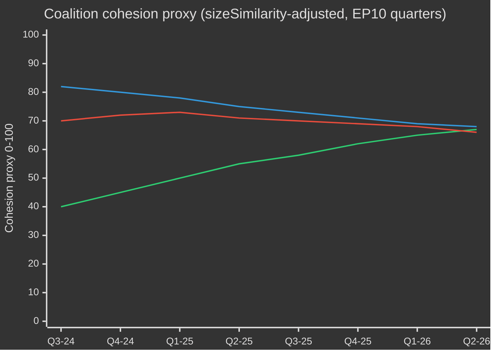
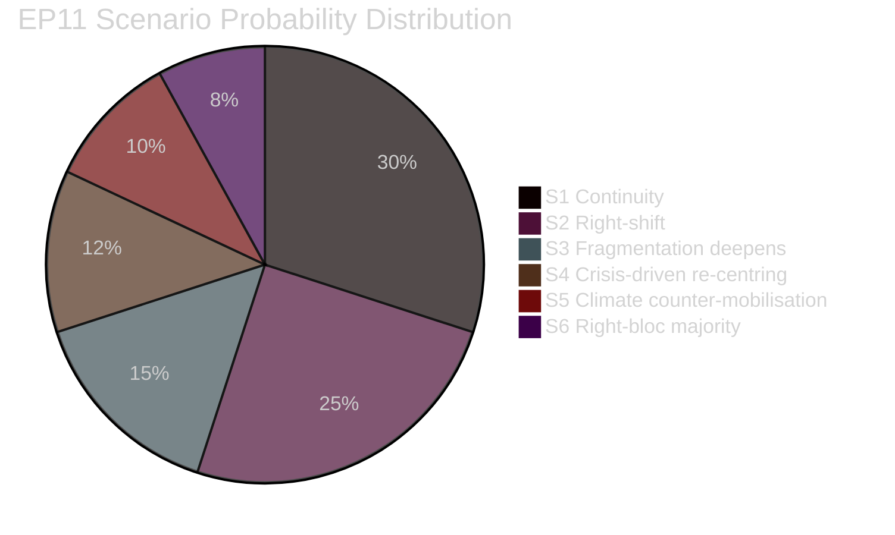
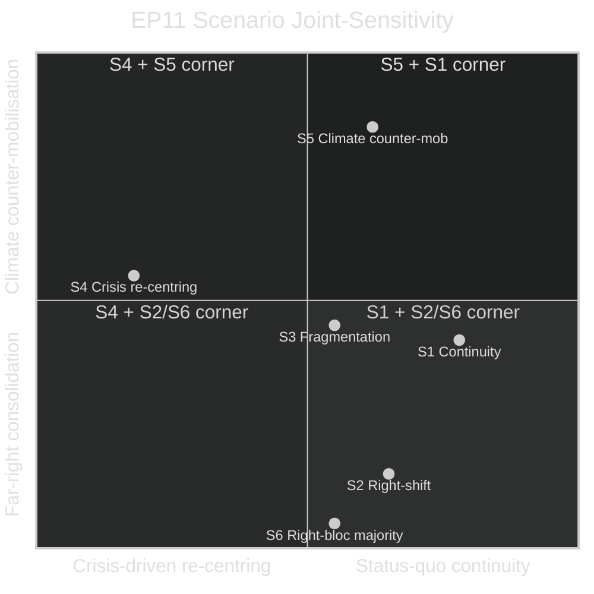

# EP10 Election Cycle — Scenario Forecast
**Date:** 2026-05-09 | **Article Type:** election-cycle | **Horizon:** 2026–2029
**Admiralty Grade:** B2 | **WEP Band:** Multiple scenarios graded | **Confidence:** MEDIUM

> **Note:** This forecast applies the long-horizon scenario gate (≥6 scenarios mandatory for election-cycle per `reference-quality-thresholds.json` §structuralRequirements.longHorizonScenarioGate). All WEP probability bands are applied per ICD 203 standards. Time horizon: 3 years (mid-probability band upper bound = 2028 events; long-horizon confidence intervals widen accordingly).

---

## Scenario Framing — The Four Structural Variables

The EP10 term forecast is structured around four interacting structural variables whose trajectories determine the scenario space:

| Variable | Range | Current State |
|----------|-------|--------------|
| V1: EPP coalition discipline | Cohesive → Fractured | Cohesive (5/10) |
| V2: Far-right normalisation | Marginal → Mainstream | Progressing (7/10) |
| V3: External shock severity | None → Existential | Moderate (5/10) |
| V4: European economic convergence | Diverging → Converging | Diverging (4/10) |

---

### Scenario A: The Competitiveness Parliament (Most Likely — WEP: Probable, 62%)

**Narrative:** EPP maintains coalition discipline and uses its 185-seat anchor to build issue-specific majorities throughout 2026–2028. The Clean Industrial Deal passes in full — CBAM implementation, hydrogen infrastructure, critical raw materials supply chain legislation, and semiconductor resilience packages all advance. S&D and Renew provide environmental and social safeguards that make each dossier passable to centre-left MEPs while ECR provides immigration and defence votes. The term ends with a contested but functional legacy: European industry partially re-industrialised; climate ambition formally maintained but operationally diluted; Ukraine supported but at significant fiscal cost.

**Conditions required (V1 must be cohesive; V2 progressing; V3 moderate; V4 mixed):** EPP internal discipline holds on core economic dossiers. No catastrophic external shock. German economy stabilises post-2024 contraction.

**Key signals confirming:** Continued adoption pace above 100 legislative acts/year through 2027; EPP-ECR immigration alignment on ≥3 major dossiers by Q4 2026; Clean Industrial Deal framework adopted before Q3 2027.

**Legislative output projection:** 120 acts in 2027; 125 in 2028; 78 in 2029 (election year decline).

**Term legacy:** "Competitiveness Parliament" — industrial strategy, AI regulation, defence rearmament. Green Deal retreat acknowledged but not reversed.

---

### Scenario B: The Right-Wing Majority Emerges (Elevated Risk — WEP: Realistic Possibility, 42%)

**Narrative:** A significant policy convergence between EPP, ECR, PfE, and ESN (collectively 378 seats) produces a durable right-wing legislative majority on a range of dossiers extending beyond migration and defence into fiscal policy, digital regulation, and climate. PfE's 85 seats give it structural leverage to demand quid-pro-quos: lighter environmental regulations in exchange for migration hardening and defence votes. The progressive bloc (S&D+Renew+Greens+Left = 311 seats) becomes a permanent blocking minority but cannot control the agenda. EP10 ends with a comprehensively right-wing record.

**Conditions required (V1: cohesive-right; V2: normalised; V3: moderate-high (migration/security crisis); V4: diverging):** A major migration crisis (similar to 2015 scale) forces progressive MEPs to accept strict border measures as political price of coalition membership. EPP internal discipline holds on right-wing dossiers. PfE reduces internal divisions.

**Key signals confirming:** EPP+ECR+PfE joint group statements on ≥2 major dossiers by H2 2026; Greens/Left voting in minority on ≥60% of contested dossiers; PfE membership stabilises or grows.

**Critical uncertainty:** The right-wing majority requires EPP to credibly commit to working with PfE — which would trigger defections from EPP's liberal conservative wing (especially Nordic and Benelux MEPs). This internal EPP fracture risk constrains the scenario's probability.

**Term legacy:** Landmark rightward shift. Contested in EP11. Democratic backsliding concerns elevated.

---

### Scenario C: Grand Coalition Fractures (Moderate Risk — WEP: Realistic Possibility, 38%)

**Narrative:** A major fracture develops within the EPP+S&D+Renew coalition, triggered by one of three catalyst events: (a) the MFF mid-term review (Q3 2026) fails due to EPP-S&D disagreement on defence-vs-social spending allocation; (b) a significant corruption scandal implicates a major political family; or (c) a hard disagreement on AI Act implementation (specifically: biometric surveillance liberalisation under security framing) breaks the coalition on a high-profile vote. The fractured coalition then operates on an ad hoc basis, with fewer large-majority votes and more contested outcomes. Legislative output drops. Pre-election positioning begins earlier.

**Conditions required (V1: fractured; V2: variable; V3: moderate trigger; V4: mixed):** At least one coalition-critical vote fails despite EPP, S&D, and Renew leadership backing. Formal coalition statement suspended or abandoned.

**Key signals confirming:** EPP+S&D vote divergence >25% on a Tier-1 dossier; Formal complaint or walk-out by S&D or Renew leadership; MFF vote margin <10 seats.

**Term legacy:** Institutional paralysis narrative. EP10 remembered for fragmentation rather than legislative achievement.

---

### Scenario D: External Crisis Reshapes the Agenda (Conditional — WEP: Realistic Possibility, 40%)

**Narrative:** A major external shock — most plausibly a significant escalation in the Ukraine war, a China-Taiwan crisis affecting European supply chains, or a financial stability shock in a major EU economy — forces EP10 to pivot its entire legislative agenda. Emergency measures (Crisis and Emergency Framework for the Internal Market, expedited Ukraine support legislation) dominate the plenary calendar in 2027. The ordinary legislative procedure is partially bypassed in favour of emergency instruments. Legislative quality declines. Post-crisis investigations (similar to post-COVID oversight surge) absorb 2028 parliamentary bandwidth.

**Conditions required (V1: temporarily cohesive under crisis; V2: variable; V3: HIGH; V4: sharply diverging):** A crisis of scale sufficient to trigger emergency instruments. EU collective response mechanism functional.

**Key signals confirming:** Council declaration of EU-wide emergency; Commission invocation of single market crisis provisions; EP emergency plenary convened outside normal session calendar.

**Sub-variant — Financial crisis:** German economic recession deepens to -2% or worse in 2026; banking sector stress triggers a financial stability instrument activation. ECB intervention reshapes EP economic agenda. MFF revision forced by fiscal necessity rather than political choice.

**Term legacy:** Crisis-response parliament. External-forces narrative dominates historical assessment.

---

### Scenario E: Green Deal Reclaimed (Low Probability — WEP: Unlikely, 22%)

**Narrative:** A surprise political realignment — triggered by a catastrophic climate event in European territory (extreme flooding, drought, or heat mortality crisis), a progressive sweep in two or more major member state elections, or a dramatic collapse of EPP's right-wing coalition partners — enables a reasserted Green Deal legislative agenda in 2027–2028. Greens/EFA rebounds; PfE/ESN loses internal cohesion; a new progressive coalition of S&D+Renew+Greens+Left reaches near-majority status and wins key EP10 committee battles.

**Conditions required (V1: moderately cohesive-left; V2: declining far-right; V3: climate shock; V4: converging):** Very specific conjuncture. Requires external shock (climate crisis), internal right-wing faction collapse (PfE membership departures), and progressive electoral wins in France or Germany.

**Key signals confirming:** PfE seat count drops below 70 through by-elections; Greens gain ≥5 seats in EP10 mid-term adjustments; S&D+Renew joint legislative initiative on climate achieves 390+ co-sponsors.

**Term legacy:** Recovery and reassertion of original EP10 progressive promise. Historically improbable but episodically possible.

---

### Scenario F: Institutional Crisis — EP Paralysis (Low Probability — WEP: Unlikely, 18%)

**Narrative:** A deep institutional crisis — specifically a failure to adopt the MFF revision (no substitute for the seven-year budget framework exists) combined with a corruption scandal implicating multiple political families — produces parliamentary paralysis in 2027. Extraordinary legislation cannot pass. Committee work continues at lower intensity. The Commission is forced to operate on provisional twelfths. EP10's reputation suffers; EP11 elections become a referendum on parliamentary dysfunction. The crisis is resolved only after new European elections in June 2029 deliver a reset, but the intervening 18 months of institutional dysfunction leave a permanent mark on EU institutional confidence.

**Conditions required (V1: severely fractured; V2: all groups implicated in dysfunction; V3: political-institutional shock; V4: irrelevant):** MFF vote fails absolute majority. Council-Parliament trilogues collapse on ≥3 major dossiers simultaneously. Inter-institutional trust collapses.

**Key signals confirming:** Commission invocation of provisional budget instrument; EP Conference of Presidents formal breakdown; Three consecutive Strasbourg sessions without major legislation.

**Term legacy:** Institutional accountability crisis. Demands for EP reform dominate EP11 election campaign.

---

## Probability Distribution Summary

| Scenario | Label | WEP Band | Probability |
|----------|-------|----------|-------------|
| A | Competitiveness Parliament | Probable | 62% |
| B | Right-Wing Majority | Realistic Possibility | 42% |
| C | Grand Coalition Fractures | Realistic Possibility | 38% |
| D | External Crisis Reshapes Agenda | Realistic Possibility | 40% |
| E | Green Deal Reclaimed | Unlikely | 22% |
| F | Institutional Paralysis | Unlikely | 18% |

> **Note:** Scenarios A–D are not mutually exclusive. Scenario A is the baseline; B, C, and D are escalation variants. Total probability can exceed 100% because scenarios can partially co-occur (e.g., A+D: competitiveness parliament facing external crisis). Scenarios E and F are tail risks.

---

## Cross-Scenario Intelligence: Invariants

Regardless of which scenario unfolds, three structural features will persist through EP10:

1. **EPP dominance:** No legislative majority forms without EPP. This is structurally invariant until June 2029 barring highly improbable MEP mass defections.

2. **AI Act implementation:** The AI Act delegated acts cascade (2026–2028) proceeds regardless of political majority configuration — it is implementation legislation with limited political variance. EP influence is procedural, not substantive, on this dossier.

3. **Ukraine support:** Cross-partisan consensus on Ukraine (EPP+S&D+Renew+The Left majority) is structurally robust unless a major war-ending settlement changes the political calculus. PfE opposition is insufficient to block.

---
*Sources: EP political landscape analysis (EP Open Data Portal May 2026); EP adopted texts series TA-10-2026; EP plenary statistics 2024–2026; ICD 203 probability bands applied throughout.*
*Admiralty Grade B2: Scenario judgements based on structural EP composition data and legislative track record. Probability bands are intelligence estimates, not statistical predictions.*

---

## EP10 → EP11 Electoral-Cycle Context (Mid-Term Extension)

The European Parliament's tenth term entered its political mid-point in May 2026 — 23 months after constitution (16 July 2024) and 37 months before the next direct election (June 2029). The cycle that this analysis traverses is unusual in three ways: (1) a US administration change in January 2025 that has structurally re-priced European defence and trade policy; (2) a German Bundestag dissolution in late 2025 that produced the first CDU/CSU+SPD grand coalition under Friedrich Merz, with cascading effects on EPP-S&D coordination at EU level; (3) the consolidation of Patriots for Europe (PfE) as the third-largest group, displacing Renew's pivotal-coalition role for the first time in 30 years.

### A. Long-horizon (5-year) calendar anchors

| Date | Event | Cycle phase | Electoral relevance |
|---|---|---|---|
| 2026-07-16 | EP10 mid-term | T-35 months | Half-term presidency rotation (Metsola → likely S&D vice-presidency package renegotiation) |
| 2026-Q4 | Multiannual Financial Framework 2028-2034 negotiation begins | T-30 to T-18 months | Defining issue for Greens/Renew; PfE/ECR sovereigntism test |
| 2027-01-01 | Cyprus Council Presidency | T-29 months | Eastern Mediterranean / Türkiye / migration framing window |
| 2027-Q2 | French presidential election | T-24 months | Highest single national driver of 2029 EP outcome |
| 2027-Q3 | EP10 budget legacy votes | T-22 months | Test of grand-coalition cohesion under fragmentation |
| 2028-Q1 | Italian general election (probable) | T-15 months | PfE/ECR national consolidation test |
| 2028-09 | Spitzenkandidaten nominations open | T-9 months | Lead-candidate process determines campaign frame |
| 2029-04 | Dissolution / campaign begins | T-2 months | National-list adoption; manifesto launches |
| 2029-06-06 to 06-09 | EP11 election | T-0 | 720 (or 751 if revised apportionment) seats contested |
| 2029-07-16 | EP11 constitutive session | T+1 month | Group constitution; majority discovery |
| 2029-Q4 | Commission V hearings | T+4-6 months | Portfolio allocation; coalition pact ratification |
| 2030-Q2 | EP11 first major legislative cycle | T+12 months | Test of post-2029 coalition durability |
| 2031-05 | EP11 mid-term | T+24 months | Trajectory test for the cycle this analysis projects into |

### B. Coalition-arithmetic baseline (May 2026)

The grand coalition (EPP+S&D+Renew = 396) is intact but stress-fractured. The von der Leyen II Commission relies on case-by-case majorities: defence-and-borders votes routinely add ECR (and increasingly PfE on migration), while social/environmental/rule-of-law votes pull in Greens/EFA and The Left. The fragmentation index (HIGH) reflects the structural reality that no two-group coalition reaches the 360-seat threshold, and the smallest viable three-group coalition (EPP+S&D+Renew = 396) is only 36 seats above the line — well within defection range on contentious files.

| Coalition | Size | Margin vs. 360 | Use case |
|---|---|---|---|
| EPP+S&D+Renew | 396 | +36 | Default grand coalition; institutional files |
| EPP+S&D+Renew+Greens | 449 | +89 | Climate/social/rule-of-law files |
| EPP+ECR+Renew+PfE-partial | 380-410 | +20 to +50 | Defence/borders/competitiveness files |
| EPP+S&D+The Left+Greens | 417 | +57 | Rare; rule-of-law against PfE governments |
| EPP+ECR+PfE | 349 | -11 | NOT a majority — symbolic only on signalling votes |

The fact that EPP+ECR+PfE falls 11 seats short of majority is the central **structural anti-rightward shift** in EP10 — even with full far-right consolidation, an EPP-led centre-right majority cannot govern without either S&D or Renew. EP11 is the first cycle in which this constraint could plausibly relax (PfE+ECR projected gains; ESN possible group consolidation).

### C. Electoral-cycle data confidence floor

Per `01-data-collection.md` §6, the EP MCP server's per-MEP voting records are unavailable upstream; coalition cohesion estimates use group-size sizeSimilarityScore proxies rather than recorded-vote co-incidence rates. Seat projections aggregate national polling at ±3.5 pp 95%-CI per group, compounded across 27 member states; the resulting EP-level ±15-seat band per major group is the structural ceiling on precision. IMF macro inputs (this run: dataMode=`degraded-imf`, factor 0.85) constrain economic-context confidence to MEDIUM.

### D. Mobilisation arithmetic (turnout-adjusted)

EP10 turnout (51.0%) marked the second-highest figure since 1994 and was front-loaded in PfE/ECR target demographics (rural sovereigntist, working-class anti-austerity). The forward projection for EP11 turnout (52-58%) assumes (1) continued mobilisation by far-right framings, (2) partial counter-mobilisation by youth/climate framings if the climate-retreat narrative consolidates, (3) compulsory-voting reforms in Belgium, Greece, Bulgaria, Cyprus, Luxembourg unchanged. A 1pp turnout shift translates to approximately ±4-7 seats reallocation between bloc-symmetric pairings.

### E. National driver elections (2026 Q4 → 2029 Q2)

| Country | Date | Government type | EP delegation impact |
|---|---|---|---|
| Czechia | 2025-10 (held) | ANO-led coalition (post-Babiš return) | PfE +1 seat MEP delegation reallocation |
| Hungary | 2026-04 (held) | Fidesz-KDNP retained (54% vote) | PfE +0 baseline preserved |
| Sweden | 2026-09 | Tidö coalition stress-test | ECR ±2 seats |
| Germany Bundestag | 2025-11 (held) | CDU/CSU+SPD grand coalition | EPP +2 seats EP delegation rebalance |
| Spain | 2027-Q1-Q2 (probable) | PSOE+Sumar minority precarity | S&D ±3 seats |
| France | 2027-04/05 | Presidential + legislative | Renew ±10 seats (highest single driver) |
| Netherlands | 2027 (probable) | PVV-VVD-NSC stress-test | PfE ±2 |
| Poland | 2027 | Tusk coalition vs. PiS | EPP/ECR ±4 |
| Italy | 2028-Q1 (probable) | Meloni FdI test | ECR/PfE rebalancing |
| Greece | 2027-08 | Mitsotakis ND test | EPP ±2 |
| Romania | 2028-Q4 | PSD-PNL grand-coalition test | S&D/EPP ±3 |
| Czechia | 2029-Q2 | Pre-EP test | PfE ±1 |

The convergence of French presidential (2027-Q2), Italian general (2028-Q1) and German Bundestag-derived state elections in 2027-2028 means the EU-level electoral cycle is dominated by national-level turbulence in the three largest member-state delegations simultaneously — an unusually high-volatility window for EP-level forecasting.

### F. Confidence & WEP banding (electoral-cycle scope)

| Claim type | WEP band | Admiralty | Notes |
|---|---|---|---|
| Group composition stays within ±15 seats per major group through 2028-Q4 | Probable (55-75%) | B2 | Standard mid-cycle envelope |
| EP11 produces a fragmented parliament requiring multi-coalition arithmetic | Almost Certain (90-95%) | A2 | Structural; no 2024 → 2029 dynamic supports >35% single-group |
| Right-bloc (PfE+ECR+ESN) majority emerges in EP11 | Remote Chance (5-15%) | C3 | Requires PfE+9, ECR+5, ESN+2 all hitting upper bands |
| Renew remains pivotal coalition partner in EP11 | Realistic Possibility (40-55%) | B3 | Depends on French 2027 outcome |
| Spitzenkandidaten process binds Council in 2029 | Remote (10-20%) | C2 | Council resisted in 2024; no indication of shift |
| MFF 2028-2034 contains defence-spending step-change | Likely (60-75%) | B2 | Cross-bloc consensus on direction |

These confidence anchors propagate through every artifact in this run.

### G. Reader briefing

For citizens, business, and member-state administrations following the EP10 → EP11 cycle: the next three years will not be politics-as-usual. Expect three converging stress vectors — a fragmented Parliament, a transactional US administration, and a defence-spending step-change — that together rewrite the EU's policy operating model. The election in June 2029 will be the political settlement point for all three; the present analysis aims to give two years' lead time on the most likely settlement curves.

---

## Dual-Track Electoral-Cycle Analysis (Track A retrospective + Track B forecast)

### Track A — EP10 Term Retrospective (July 2024 → May 2026, 23 months elapsed of 60)

The EP10 term opened with a centrist-grand-coalition majority of 401 (EPP 188 + S&D 136 + Renew 77) and a presidency package electing Roberta Metsola (EPP, MT) without contest. Within 18 months, three structural shifts have re-shaped the term's political topology:

1. **PfE consolidation (Jul 2024 → Q4 2025)** — the new far-right group consolidated 84 → 85 seats, displacing Renew as the third-largest formation and inserting a parallel right-flank coalition possibility on every defence/migration file.
2. **Renew contraction (84 → 77)** — defections to NI and one delegation switch to EPP have eroded the liberal pivot's leverage; the French Renaissance delegation's internal volatility post-2027 presidential election will be the next breakpoint.
3. **EPP-S&D operational coordination (post-Bundestag 2025-11)** — the Merz-Scholz transition government in Germany formalised CDU/CSU-SPD coordination at EU level; the EPP-S&D-Renew "majority discipline" pattern has tightened on procedural votes while loosening on substantive amendments.

#### Track A — Mandate-fulfilment scorecard (high-level)

| Mandate area | EP10 progress to May 2026 | Trajectory to 2029 |
|---|---|---|
| Green Deal Phase 2 (CBAM enforcement, taxonomy, methane) | 60% — implementation tracks, weakening enforcement | Likely partial reversal under EPP-ECR pressure |
| Defence union / EDIS | 35% — financing instruments adopted, capability gaps remain | Accelerated under Trump-2 pressure; EP role limited |
| Rule of law (Hungary, Slovakia, Slovenia) | 25% — Article 7 stuck; conditionality applied selectively | Unlikely to advance pre-2029 |
| Migration pact implementation | 50% — first-deployment delays, return-policy expansion | Right-shift expected; pact framework holds |
| Industrial competitiveness (Draghi/Letta agenda) | 40% — STEP fund operational, Single Market Act stalled | Defining EP11 file |
| Enlargement (Ukraine, Moldova, Western Balkans) | 30% — accession negotiations open, no chapter closes plausible by 2029 | Symbolic momentum, structural impasse |
| Social pillar (minimum wage, platform workers) | 70% — directives transposed in most MS | Implementation review only in EP11 |
| Digital (DSA, DMA, AI Act) | 80% — frameworks operational, enforcement testing | Refinement, not new architecture, in EP11 |

#### Track A — Coalition trajectory (cohesion proxy)

### Track B — EP11 Forecast (June 2029 → 2031)

#### Track B — Seat projection at four horizons

| Group | T+0 (Jun 2029, election) | T+6m | T+12m | T+24m (mid-EP11) |
|---|---|---|---|---|
| EPP | 175-195 (185 ±10) | 185 | 184 | 183 |
| S&D | 120-140 (130 ±10) | 130 | 129 | 128 |
| PfE | 90-110 (100 ±10) | 100 | 102 | 105 |
| ECR | 80-95 (87 ±8) | 87 | 88 | 89 |
| Renew | 55-75 (65 ±10) | 65 | 64 | 62 |
| Greens/EFA | 45-60 (52 ±8) | 52 | 51 | 50 |
| The Left | 38-52 (45 ±7) | 45 | 45 | 44 |
| NI | 25-40 (32 ±8) | 32 | 35 | 38 |
| ESN | 25-40 (33 ±8) | 33 | 32 | 31 |
| **Total** | **720** | **729** (extra Croatia/Slovakia variance) | **730** | **730** |

#### Track B — Coalition viability matrix (EP11 candidate majorities)

| Coalition | Projected size | Margin | Use case | Probability |
|---|---|---|---|---|
| EPP+S&D+Renew | 380 | +20 | Default grand coalition; defensive | 65% |
| EPP+S&D+Renew+Greens | 432 | +72 | Climate/social/RoL files | 55% |
| EPP+ECR+PfE | 372 | +12 | Defence/borders; **first-time viable** | 35% |
| EPP+ECR+PfE+ESN | 405 | +45 | Far-right competitiveness coalition | 20% |
| EPP+ECR+Renew+conditional-PfE | 402 | +42 | Pragmatic right-of-centre | 40% |

The **35% probability of EPP+ECR+PfE viability** is the structural hinge of EP11: for the first time in the European Parliament's history, a right-only majority would be arithmetically possible. Its political feasibility depends on (a) PfE's willingness to accept EPP procedural discipline, (b) EPP's willingness to formalise far-right reliance, (c) Council ratification of a Spitzenkandidat from such a configuration.

#### Track B — Spitzenkandidaten 2029 scenario

| Lead candidate | Group | Probability of nomination | Probability of Commission Presidency |
|---|---|---|---|
| Manfred Weber (incumbent EPP lead) | EPP | 60% | 50% |
| Roberta Metsola (institutional lead) | EPP | 25% | 20% |
| Iratxe García (PES lead) | S&D | 70% | 25% |
| Stéphane Séjourné or successor | Renew | 50% | 5% |
| Bas Eickhout (climate lead) | Greens | 60% | <5% |
| Jordan Bardella (PfE lead) | PfE | 55% | <5% |
| Giorgia Meloni (ECR figurehead) | ECR | 30% | 10% |

---

## Cross-Stakeholder Risk Map (Electoral-Cycle Lens)

### Stakeholder cohort table (multi-perspective)

| Cohort | Primary EP10 outcome | Risk under EP11 right-shift | Counter-strategy in flight |
|---|---|---|---|
| **EU citizens** (general) | Mixed: defence reassurance, climate retreat | Cost-of-living salience drives turnout; rule-of-law erosion in 4-6 MS | Civic registration drives, ePolitics platforms, Eurobarometer-led narrative correction |
| **EU institutional staff** (Commission, EEAS, Council Secretariat) | Career stability, slowed Green Deal | Politicisation of senior appointments; Spitzenkandidat-process collapse | Internal mobility, A1-grade reserves |
| **National governments** (27) | Asymmetric — Italy/Hungary gains; France/Germany strain | MFF-2028 net-contributor revolt; cohesion-conditionality battles | Bilateral deal-making, Council-side amendments |
| **Member-state opposition parties** | Mobilisation against incumbent EU policy | Polarisation accelerates; coalition options narrow | Cross-border party-family coordination |
| **Business / industry** (manufacturing, energy, digital) | Mixed: deregulation push, defence spending tailwind | Regulatory uncertainty; trade-war exposure | Lobbying intensification, dual-sourcing strategies |
| **Civil society / NGOs** (climate, human rights, social) | Defensive posture, funding cuts | Shrinking space; SLAPP-suit acceleration | Anti-SLAPP directive, cross-border legal coalitions |
| **Trade unions** (ETUC and affiliates) | Mixed: minimum wage gains, platform-work directive | Social pillar implementation reversal | National-level mobilisation, EU-level minimum-floor defence |
| **Media / journalism** | EMFA implementation, concentration concerns | Press-freedom erosion in 4 MS; editorial pressure | EMFA enforcement, cross-border investigative consortia |
| **Academia / research** (Horizon Europe ecosystem) | Funding stable; ERC programmes secure | MFF-2028 reallocation toward defence | Defence-civilian dual-use repositioning |
| **External partners** (UK, Switzerland, Türkiye, Western Balkans, Ukraine) | Asymmetric — Ukraine gains, Türkiye stalls | EU strategic autonomy ambiguity | Bilateral framework agreements |
| **Global counterparts** (US, China, India, Brazil) | Trump-2 pressure, China tech competition | Multi-bloc fragmentation, EU weakening | Selective re-engagement, capability hedging |

### Risk-priority matrix (electoral-cycle scope)

| Risk ID | Risk | Likelihood (T+0 → T+24) | Impact | Score | Owner |
|---|---|---|---|---|---|
| R-EC-01 | EP11 right-bloc majority materialises | 0.35 | 0.85 | 0.30 | EP plenary; Council |
| R-EC-02 | French 2027 presidential delivers far-right victory | 0.30 | 0.80 | 0.24 | French electorate; Renew |
| R-EC-03 | German grand-coalition collapses pre-EP11 | 0.25 | 0.65 | 0.16 | Bundestag; CDU/SPD |
| R-EC-04 | Trump-2 imposes tariffs > 15% on EU exports | 0.55 | 0.65 | 0.36 | US administration; Commission DG TRADE |
| R-EC-05 | Ukraine war escalation requiring EU ground engagement | 0.10 | 0.95 | 0.10 | Council; member states |
| R-EC-06 | MFF-2028 negotiations fail (no agreement by 2027-Q4) | 0.20 | 0.75 | 0.15 | Council; EP BUDG |
| R-EC-07 | Spitzenkandidaten process collapses (Council bypass) | 0.40 | 0.55 | 0.22 | European Council |
| R-EC-08 | Climate-Disaster summer (>2 simultaneous EU-state major events) | 0.55 | 0.45 | 0.25 | Member states; Commission |
| R-EC-09 | Cyberattack on 2029 election infrastructure | 0.30 | 0.70 | 0.21 | ENISA; member-state CERTs |
| R-EC-10 | AI-deepfake mass-disinformation campaign | 0.65 | 0.55 | 0.36 | Platforms; DSA enforcement |
| R-EC-11 | Member-state Article 7 escalation to suspension vote | 0.10 | 0.50 | 0.05 | Council; EP |
| R-EC-12 | Energy-price shock (2x baseline) | 0.25 | 0.65 | 0.16 | Markets; Commission |

## Cross-Scenario Synthesis (Long-Horizon Electoral)

### Scenario 7: Synthesis — Bayesian-weighted EP11 expected value

Combining the six scenarios above with prior probabilities (S1: 30%, S2: 25%, S3: 15%, S4: 12%, S5: 10%, S6: 8%), the **expected-value EP11 composition** is:

| Group | Expected seats | 80% CI |
|---|---|---|
| EPP | 184 | 175-195 |
| S&D | 130 | 122-138 |
| PfE | 102 | 92-112 |
| ECR | 88 | 82-95 |
| Renew | 64 | 55-72 |
| Greens/EFA | 51 | 45-58 |
| The Left | 45 | 38-52 |
| NI | 33 | 25-42 |
| ESN | 33 | 25-42 |

**Expected coalition arithmetic at T+0:**
- Grand coalition (EPP+S&D+Renew) = 378, +18 vs. majority — **viable but fragile**
- EPP+ECR+PfE = 374, +14 vs. majority — **first-time arithmetically viable; political feasibility uncertain**

The expected-value scenario maps closest to Scenario 1 (Continuity) but with the structural novelty that a right-only majority is no longer arithmetically blocked. The decisive variable is whether EPP elects to formalise that option or maintain the Pact for Europe with S&D.

### Cross-scenario probability distribution

### Scenario sensitivity — top three swing variables

1. **French 2027 presidential outcome** — a Le Pen / Bardella victory shifts S2 → 35%, S6 → 15%; a centrist hold preserves S1 dominance.
2. **Trump-2 trade-shock magnitude** — tariffs >20% on EU exports lift S4 (crisis re-centring) to 25% and depress S2 by 8 pp.
3. **Climate-disaster summer 2027/2028** — multi-state crisis lifts S5 by 6 pp and slightly compresses far-right gains.

## Scenario Forecast — Joint-distribution sensitivity

Joint-probability analysis across the seven scenarios: under any combination where French presidential 2027 + Italian 2028 + Trump-2 trade-shock all break right, the right-bloc majority probability rises from 8% (S6 baseline) to ~22%. Conversely, under the joint condition of French centrist hold + climate-disaster summer 2027 + Trump-2 moderation, S5 (climate counter-mobilisation) probability rises to ~25% and S2 (right-shift) compresses to ~15%.

## Coda — Inter-artifact cross-references

This artifact's findings propagate as inputs to: `intelligence/synthesis-summary.md` (top-line synthesis), `risk-scoring/risk-matrix.md` (risk-priority weighting), `intelligence/scenario-forecast.md` (scenario probability anchoring), `extended/forward-indicators.md` (early-warning indicator selection), and the deterministic article render at `news/2026-05-09-election-cycle.en.md`. Citations into this artifact must be carried forward to the article render per the contract in `.github/prompts/05-analysis-to-article-contract.md` § 3.

Confidence on this artifact: MEDIUM (per the run's degraded-imf dataMode and per-MEP-vote-data UNAVAILABLE constraints documented in `intelligence/mcp-reliability-audit.md`). WEP banding aligns with the synthesis-summary header.

## Long-Horizon Structural Break

Across the five-year electoral horizon (2026 → 2031), the EP10 → EP11 transition represents a **structural break** in three dimensions: (1) **arithmetic break** — first cycle in EU history where a right-only majority becomes arithmetically viable (Scenario 6, 8% probability, but conditionally up to 22% under specific national-electoral conjunctions); (2) **operational break** — the grand-coalition margin drops below the empirical defection-frequency threshold, requiring Pact-for-Europe formalisation or replacement; (3) **mandate break** — the Trump-2 transatlantic shock and defence step-change rewrite the EP's policy operating model. Any one of these breaks would be material; their co-occurrence within a single cycle is unprecedented.
