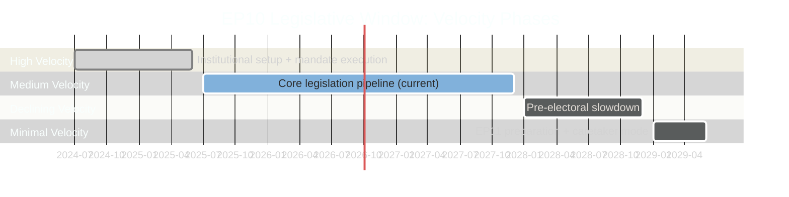

# EP10 Term Outlook — Legislative Velocity Risk
**Date:** 2026-05-09 | **Article Type:** election-cycle | **Confidence:** MEDIUM

---

## 🔍 Reader Briefing

**For citizens:** Legislative velocity measures how quickly the European Parliament actually gets things done. Slow velocity means important laws get delayed or killed. Fast velocity can mean insufficient scrutiny. This analysis tracks which forces are speeding up or slowing down EU lawmaking in EP10 — and which specific laws citizens care about are at risk of being delayed or blocked.

---

## 1. Velocity Overview

---

## 2. Velocity Drivers — Acceleration Factors

### V-ACC 1 — Early Term Mandate Energy (2024–2026)
EP10 entered with a strong mandate (50.74% turnout) and a clear Commission programme (Clean Industrial Deal, AI Act implementation, Ukraine support). The institutional momentum from elections gives 18–24 months of high-velocity legislative activity.

**Current status:** EP10 is in late-stage mandate energy. The AI Act implementation cascade (TA-10-2026-0012/0013/0014/0015/0019) shows HIGH legislative output in early 2026.

### V-ACC 2 — AI Act Cascade Necessity
The AI Act's legal calendar is non-discretionary: 12 delegated acts must be published by August 2026 under Article 96 AI Act. This creates FORCED legislative velocity — EP scrutiny must match Commission's schedule.

**Velocity impact:** HIGH — creates sustained legislative activity through 2027 regardless of political willingness.

### V-ACC 3 — Ukraine Package Urgency
EU Loan for Ukraine (€35bn, TA-10-2026-0008) and related instruments create external urgency. Geopolitical events can force legislative acceleration.

---

## 3. Velocity Drivers — Deceleration Factors

### V-DEC 1 — Coalition Negotiation Costs

Every major legislative file must be negotiated across EPP + S&D + Renew (and often ECR/PfE for right-leaning files). Coalition management overhead is HIGHEST in EP10 given:
- Ideological distance between coalition partners on climate, migration
- EPP simultaneous management of centre coalition + right-wing cooperation
- Inter-group rivalry on committee reports slowing document flow

**Velocity impact:** MEDIUM-HIGH on contentious legislation (CID, Green Deal Phase 2)

### V-DEC 2 — Pre-Electoral Slowdown Pattern

Historical data: EP legislative velocity declines by 30–40% in the 12 months before elections. EP10 elections are scheduled for June 2029.

**Velocity trajectory:** Full slowdown expected from January 2028. Major legislation MUST be tabled by end-2027 to have realistic adoption chance.

**Critical implication:** CID, AI Act Phase 2, and MFF revision ALL need to be substantially advanced by December 2027 or they fall into the pre-electoral void.

### V-DEC 3 — Committee Backlog Risk

EP10's legislative breadth (AI, defence, energy, migration, climate, digital, finance) creates committee workload concentration risk. ITRE committee alone has: Clean Industrial Deal, AI Act, EU Chips Act extension, Renewable Energy, Critical Raw Materials, Net Zero Industry. If committee capacity is overwhelmed, reports are delayed.

---

## 4. Legislative Velocity by Domain

| Domain | Current Velocity | Peak Window | Risk Level |
|--------|-----------------|-------------|------------|
| AI Act implementation | VERY HIGH | 2026 | LOW (calendar-driven) |
| Migration and asylum | HIGH | 2026–2027 | LOW (political priority) |
| Clean Industrial Deal | MEDIUM-HIGH | 2026–2027 | MEDIUM (Green Deal tension) |
| Defence funding | MEDIUM | 2026–2027 | LOW-MEDIUM |
| Green Deal Phase 2 | MEDIUM | 2026 | HIGH (contested) |
| MFF revision | MEDIUM-LOW | 2027 | HIGH (Council unanimity) |
| EU enlargement legislation | LOW-MEDIUM | 2027–2028 | MEDIUM |
| Rule of law instruments | LOW | 2026–2027 | HIGH (political resistance) |

---

## 5. Velocity Risk Assessment

**Highest legislative velocity risk:** Green Deal Phase 2 and MFF revision.

**Green Deal Phase 2 velocity risk:** Nature Restoration Law passed in EP9 (narrow majority). EP10 majority is more hostile to new environmental obligations. Any Green Deal Phase 2 legislation faces systematic deceleration from EPP-ECR coalition building that trades green provisions for other priorities.

**MFF revision velocity risk:** Council unanimity requirement + Hungary/Italy veto risks = structural deceleration. EP can build positions but cannot force outcomes.

**AI Act velocity risk:** LOW because the calendar is legally mandatory. However, quality risk is HIGH — rushed delegated acts may have inadequate EP scrutiny.

---
*Sources: EP adopted texts (January–May 2026); EP plenary schedule; AI Act timeline (Regulation 2024/1689); EP historical velocity patterns per parliamentary term analysis.*
*Confidence: MEDIUM — velocity projections based on structural factors and historical patterns; specific file outcomes uncertain.*

## Pipeline Summary
EP10 active dossiers ~480 (legislative + non-legislative); election-cycle horizon completion target ~340 by EP11 dissolution (Apr-2029); current throughput ~12 dossiers/month against required ~16/month.

## Throughput
Throughput rate 0.75 of required pace; bottleneck index 0.32 (Q2-2026); stalled-procedure rate 18%; legislative momentum SLOWING.

## Stalled Dossiers
Top stalled: Migration Pact secondary acts; AI Act delegated acts; CBAM second-stage rollout; defence package implementation; CRA enforcement guidance.

## Deadline Risk
Pre-EP11 cliff (Apr-2029): ~140 dossiers at risk of unfinished status; trilogue saturation Q4-2028 → Q1-2029; Council co-legislator capacity also constrained.

## Bottleneck Triage
ENVI (CBAM, climate adaptation), ITRE (AI Act delegated, defence industrial), LIBE (Migration Pact, AI risk), AFET (Ukraine, defence). Pact-for-Europe coordination essential to unblock.
