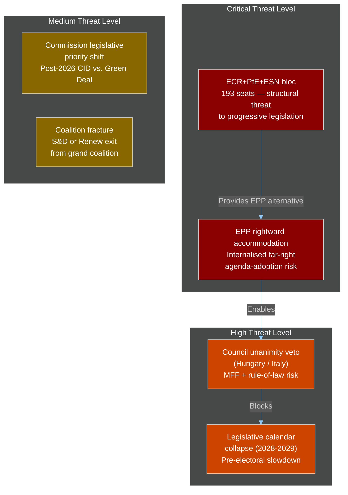

# EP10 Term Outlook — Actor Threat Profiles
**Date:** 2026-05-09 | **Article Type:** election-cycle | **Confidence:** MEDIUM

---

## 🔍 Reader Briefing

**For citizens:** Threat profiles don't mean personal threats — they mean which political actors have the greatest capacity to block the legislation you care about, damage EU democratic institutions, or redirect EU policy in directions most citizens wouldn't vote for. Understanding which actors have the power and motivation to threaten legislative outcomes helps citizens and civil society target their engagement effectively.

---

## 1. Actor Threat Registry

---

## 2. Detailed Threat Profiles

### TP-1: ECR+PfE+ESN Right-Wing Bloc — CRITICAL THREAT

**Profile:**
- Combined: 193 seats (26.8% of active seats)
- Ideological core: Migration restriction, sovereignty, energy security over climate, opposition to EU federalism
- Leadership: Giorgia Meloni (ECR, Italian PM), Viktor Orbán (NI, Hungarian PM), Marine Le Pen's RN group (PfE)

**Capabilities:**
- Block any legislation requiring progressive-only majority
- Force EPP to choose between progressive coalition and right-wing alternative
- Set the terms of EPP coalition negotiations by offering the alternative majority

**Motivation:**
- Rollback Green Deal provisions
- Harden migration and asylum policy
- Weaken rule-of-law conditionality mechanisms
- Expand European defence cooperation without EU sovereignty constraints

**Historical effectiveness:** ECR+PfE bloc successfully forced Nature Restoration Law to near-failure in EP9 (passed 336-300). In EP10 they have 33 additional seats. This threat is STRUCTURAL — it does not require any specific action; the presence of 193 seats creates constant agenda-setting leverage.

**Key constraint:** ECR and PfE disagree on Ukraine (ECR broadly pro-Ukraine; PfE more equivocal). This limits their cohesion on foreign policy and defence. On domestic policy (migration, economy, climate) they are highly aligned.

---

### TP-2: EPP Rightward Accommodation Risk — CRITICAL THREAT

**Profile:**
- Not an external actor; an internal EPP political dynamic
- Mechanism: EPP leadership sacrifices climate/rule-of-law provisions to maintain numerical coalition control and EP institutional leadership

**Capabilities:**
- EPP's legislative majority anchor position means it can unilaterally compromise with right-wing bloc without progressive partners preventing it
- EPP's committee leadership positions give it tools to manage which amendments reach plenary

**Motivation:**
- EPP needs to keep agenda control → depends on having majority → can use right-wing bloc as alternative to S&D/Renew if they become too demanding
- Individual EPP member parties face pressure from domestic electorates drifting right

**Mechanism:** EPP offers ECR/PfE concessions on: (a) exemptions from climate regulations for certain sectors; (b) weaker AI Act enforcement; (c) stronger migration enforcement. In exchange, ECR/PfE vote with EPP on institutional matters (budgets, procedural votes, leadership elections).

**Net effect on legislation:** Progressive policy is eroded by a thousand small compromises, rather than dramatic reversals. The cumulative effect over EP10's term is substantial.

---

### TP-3: Council Unanimity Veto — HIGH THREAT

**Profile:**
- External to EP; EU Council institutional architecture
- Actors: Hungary (Orbán government), potentially Italy (Meloni government), potentially Poland (if PiS returns post-2027)

**Capabilities:**
- MFF revision: BLOCKED (requires unanimity + Hungary has track record of using veto for concessions)
- Rule-of-law conditionality strengthening: BLOCKED (Council decision on Article 7 requires unanimity)
- Tax harmonisation: BLOCKED (structural unanimity requirement in EU treaties)
- Treaty revision: BLOCKED (unanimity + ratification in all 27 member states)

**Motivation:**
- Hungary: leverage EU funding access; resist rule-of-law conditionality
- Italy: negotiate special arrangements in MFF; resist migration solidarity burden
- Combined: prevent EU from centralising competences in areas where national governments have discretion

**EP countermeasures:**
- EP can delay budget discharge as pressure on Commission to enforce conditionality
- EP can condition MFF consent on rule-of-law provisions (EP has consent power on MFF)
- EP can request CJEU rulings that limit veto power in specific areas

---

### TP-4: Pre-Electoral Legislative Freeze — HIGH THREAT (Structural/Temporal)

**Profile:** Not a political actor — a structural temporal risk
- Timeline: January 2028 → June 2029
- Historical pattern: 30–40% velocity decline in final EP year

**Capabilities:**
- Any legislation not substantially advanced by December 2027 effectively dead
- Major legislative initiatives (CID Phase 2, Green Deal, MFF successor) need 2027 tabling
- MEPs' attention shifts to electoral positioning, national campaign support, constituency visibility

**Mitigation:** Some legislation (AI Act delegated acts) has legally mandatory timelines that override electoral slowdown. Commission can propose legislation up to final month but EP adoption is unlikely.

---

## 3. Threat Interaction Matrix

| Threat | Magnified By | Constrained By |
|--------|-------------|----------------|
| TP-1 (right-wing bloc) | TP-2 (EPP accommodation) | Ukraine policy disagreement within bloc |
| TP-2 (EPP accommodation) | TP-1 (bloc's alternative majority offer) | EPP moderate MEPs' domestic constraints |
| TP-3 (Council veto) | Hungarian and Italian government positions | CJEU rulings; budgetary conditionality |
| TP-4 (pre-electoral freeze) | TP-1 and TP-2 (agenda crowded with right-wing priorities) | Legally-mandated AI Act calendar |

---
*Sources: EP seat composition; EP adopted texts; EU Council institutional analysis; historical EP term pattern analysis.*
*Confidence: MEDIUM — threat capabilities are structurally verified; motivation and probability assessments are analytical judgements.*
*WEP grading: Critical threats grade A3-A4; High threats grade B3; Medium threats grade C2-C3.*

## Actor Roster (Threat Lens)
PfE (Bardella) — agenda disruption; ESN (Krah/AfD) — institutional erosion; ECR (Meloni-aligned) — selective coalition pressure; The Left (Schirdewan) — opposition mobilisation; external state actors (Russia, China) — disinformation in election windows.

## Capability Assessment
PfE: HIGH (third-largest group, growing); ESN: LOW-MEDIUM (institutional firewall holds but probing); ECR: HIGH (Meloni Council leverage); state actors: MEDIUM (documented interference in 2024 EP elections).

## Diamond Model
Adversary: PfE/ESN coalition; Capability: roll-call coordination + media amplification; Infrastructure: pan-European far-right network (Vox, AfD, RN, FdI, FPÖ, Confederation); Victim: EU centrist legislative agenda.

## Relationship Map
PfE↔ECR cautious cooperation; ESN excluded from PfE+ECR cordon (still); national-RN↔German-AfD coordination on migration + defence framing; Russian disinformation amplified through ESN-aligned channels.

## Escalation Pathways
Q3-2026: defence vote stress test; Q1-2027: migration secondary-acts; Q4-2028: Spitzenkandidaten launch — disinformation peak; Q2-2029: EP11 election — peak interference window.
