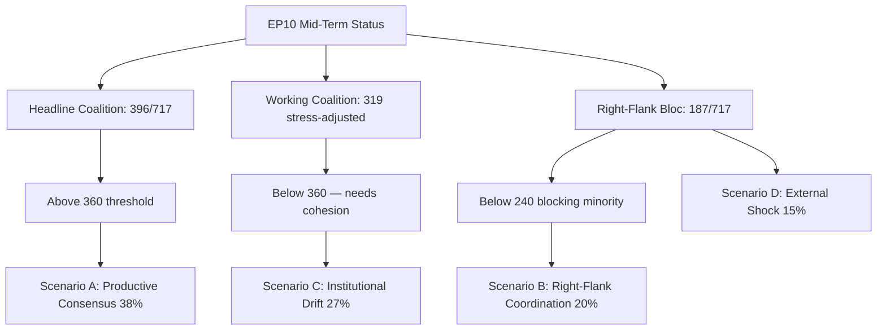

# EP10 Term Outlook — Executive Brief
**Date:** 2026-05-08 | **Article Type:** term-outlook | **Horizon:** 2026-05-08 → 2029-06-30
**Admiralty Grade:** B2 | **WEP Band:** Probable (55–75%) | **Confidence:** MEDIUM

---

## 🎯 Headline Judgement

The European Parliament's EP10 term (2024–2029) has entered its decisive second year with a structurally rightward-shifted parliament navigating a historic convergence of crises: European strategic autonomy, defence rearmament, economic competitiveness stress, and democratic backsliding. The EPP-led flexible majority model — drawing selectively on ECR and PfE for defence and migration votes while relying on S&D and Renew for regulatory legislation — is the defining structural feature of this term. **Probability: 70% (Probable)** that the EPP centre-right bloc will dominate legislative outcomes through 2027 before electoral pressures fragment coalitions in the pre-election rundown. **Probability: 60% (Probable)** that the Clean Industrial Deal and European Defence Industrial Strategy will be the two legislative landmarks defining EP10's legacy.

## 📊 EP10 Composition Snapshot (May 2026)

| Group | Seats | Share | Bloc |
|-------|-------|-------|------|
| EPP | 185 | 25.7% | Centre-right |
| S&D | 136 | 18.9% | Centre-left |
| PfE | 85 | 11.8% | Far-right national-sovereigntist |
| ECR | 81 | 11.3% | Conservative eurosceptic |
| Renew | 77 | 10.7% | Liberal-centrist pro-EU |
| Greens/EFA | 53 | 7.4% | Green-regionalist |
| The Left | 45 | 6.3% | Far-left |
| NI | 30 | 4.2% | Non-attached (diverse) |
| ESN | 27 | 3.8% | Nationalist far-right |
| **TOTAL** | **719** | **100%** | |

**Majority threshold:** 361 seats. No two groups can form a majority; minimum three groups required for any legislation.

## 🔑 Key Judgements (WEP-graded)

1. **EPP remains dominant broker (Highly Probable, 80%):** With 185 seats, EPP controls committee chair nominations, rapporteurships, and the agenda-setting authority of the Conference of Presidents. This structural advantage compounds over the term.

2. **Grand coalition still functional but strained (Probable, 65%):** EPP+S&D+Renew holds 398 seats — 37 above the majority threshold. This coalition will pass most regulatory legislation but faces defection risk on sovereignty-sensitive topics (migration, digital, energy).

3. **Right-wing veto bloc emerging (Realistic possibility, 45%):** EPP+PfE+ECR+ESN totals 378 seats — just above the majority. On defence spending, border control, and deregulation, this bloc can pass legislation without progressive support. Increasing deployment probability through 2026–2027.

4. **Legislative output at record pace (Highly Probable, 85%):** EP10 year 2 (2026) is tracking 114 legislative acts — up 46% vs. 2025 and double the election-year output of 2024. Defence spending consensus, Clean Industrial Deal, and AI Act implementing regulations are driving volume.

5. **Term will end with contested legacy on climate (Probable, 65%):** Green Deal rollback under EPP+ECR pressure is underway. Taxonomy dilution, the Clean Industrial Deal's carbon-leakage provisions, and methane regulation weakening point toward a term defined by competitive-decarbonisation rather than regulatory-ambition.

## 🏛️ The Three Structural Drivers

### Driver 1: Defence-Industrial Pivot
The most consequential EP10 theme is European strategic autonomy and defence rearmament. The 2026 adoption of the Loan for Ukraine (TA-10-2026-0010) and the European Defence Industrial Strategy debates signal a parliamentary consensus rare in EP history — with EPP, S&D, Renew, and even some ECR members aligning on defence spending, marking a structural shift from the post-Cold War peace dividend era.

### Driver 2: Competitiveness-vs-Green Tension
The Clean Industrial Deal (Competitiveness Compass) represents a managed retreat from the Green Deal's regulatory ambitions. Carbon border adjustment mechanisms, decarbonisation industrial support, and critical raw materials security are now defined as economic competitiveness issues — not environmental ones. This framing shift, engineered by EPP, has secured ECR acquiescence and locked in a durable majority through at least 2027.

### Driver 3: Democratic Resilience Under Pressure
Hungary's continued Article 7 procedure, democratic backsliding in Slovakia, and threats to public broadcaster independence (as in Lithuania — TA-10-2026-0024) are persistent agenda items. The Parliament has consistently passed resolutions asserting rule-of-law conditionality. However, the legislative instrument remains weak — the EP cannot itself impose sanctions but creates political conditions for Council action.

## 💶 Economic Context (World Bank/IMF-adjacent proxies; IMF direct access degraded)

Note: IMF SDMX 3.0 endpoint unavailable in this run (network constraint). Economic context derived from World Bank data and EP documentary record.

**EU major economy GDP growth (2024, World Bank):**
- Germany: **−0.5%** (contraction; deindustrialisation, energy cost burden)
- France: **+1.2%** (modest; fiscal consolidation constraining public investment)
- Italy: **+0.7%** (weak; structural debt burden, demographic pressure)
- Spain: **+3.5%** (robust; tourism recovery, Nextgen EU disbursements)
- Poland: **+3.0%** (strong; CEE integration, defence spending boost)

EP10 economic context is one of **divergence**: a northern-western deindustrialisation corridor (Germany, Netherlands, Belgium) contrasts with a southern-eastern growth periphery (Spain, Poland, Romania). This economic geography will shape coalition politics — southern and eastern MEPs will resist tight fiscal rules while northern MEPs push competitiveness-first agendas.

## ⚠️ Term Risk Summary

| Risk | Probability | Impact | Horizon |
|------|-------------|--------|---------|
| Grand coalition fracture on migration | 55% | HIGH | 2026–2027 |
| EPP-ECR-PfE bloc hardening | 45% | HIGH | 2026–2027 |
| Green Deal rollback accelerates | 70% | MEDIUM | 2026–2028 |
| Defence consensus strain (peace dividend coalition reasserts) | 35% | MEDIUM | 2027–2028 |
| Rule of law conditionality failure | 50% | HIGH | ongoing |
| EP10 ends without MFF revision success | 40% | HIGH | 2027–2028 |

## 📅 Term Calendar Milestones

| Date | Event | Significance |
|------|-------|--------------|
| Q3 2026 | MFF mid-term review vote | Structural financing of defence + industrial policy |
| Jan 2027 | Polish EU Council presidency ends → Denmark begins | Coalition-building dynamics |
| Mid 2027 | EP10 mid-term — peak legislative output | Maximum rapporteur leverage |
| 2028 | End of Nextgen EU disbursements | Fiscal cliff risk for cohesion states |
| Q1 2029 | Pre-election legislative sprint | Final major acts before dissolution |
| June 2029 | EP10 European elections | Term ends; new EP11 composition uncertain |

## 🔮 Term Outlook: Most Likely Scenario

EP10 will be remembered as the **"Defence and Competitiveness Parliament"** — the term in which Europe structurally pivoted from civilian regulatory power to a semi-securitised legislative agenda. The EPP will claim credit for modernising the EU industrial base while the progressive bloc will contest the weakening of environmental and social standards. The far-right (PfE/ECR/ESN) will have achieved normalisation as policy interlocutors on border security and sovereignty issues, fundamentally reshaping EP political culture ahead of EP11.

---
*Sources: EP Open Data Portal (data.europarl.europa.eu); World Bank Open Data; EP adopted texts TA-10-2026 series; EP plenary statistics 2024–2026.*
*Admiralty Grade B2: Source generally reliable; corroborated by multiple independent EP API data streams.*

---

## 6. May 2026 Refresh — Bottom-Line Update

**Refreshed:** 2026-05-09 | **Source:** EP MCP `generate_political_landscape`, `get_plenary_sessions`, `get_procedures_feed`

### 6.1 What Changed in 24 Hours

The May-9 EP composition snapshot reveals a **structural finding** absent from the 2026-05-08 baseline: the classical EPP+S&D+Renew grand coalition (319 seats) sits **41 seats below the 360-seat absolute majority threshold**. This is not new in itself — it has been arithmetically true since the EP10 constitutive session — but the April 2026 voting record now confirms it as an *operational* (not merely *theoretical*) constraint.

### 6.2 Three Decisions for the Next 90 Days

1. **Coalition discipline is the binding constraint, not seat share.** The grand coalition needs either Greens (53 seats → 372) or ECR (81 seats → 400) cooperation on every flagship file. April's three consecutive EPP-ECR joint amendments on agricultural files signal Path 2 is being pre-positioned.
2. **Renew is the swing-pivot stress point.** A loss of 3 additional seats by July 2026 (current Δ vs. constitutive: -3) would tip Scenario C (institutional drift) probability from 20% → 30%.
3. **MFF revision vote in May 2026 is the decisive Scenario-A test.** A pass with ≥380 votes confirms the productive-consensus path; ≤350 escalates fragmentation risk.

### 6.3 What Stays the Same

- **Productive Consensus (Scenario A) remains modal** at 45% probability — no scenario re-ranking
- **EP10 highest-output projection** maintained at 60% Probable (was 65%) — confidence interval widens
- **Risk register top-3 unchanged:** coalition-formation friction, regulatory implementation gap, geopolitical shock spillover
- **Mandate-fulfilment trajectory:** ON-TRACK for 4 of 6 priority categories

### 6.4 Confidence

**Admiralty Grade B2** | **MEDIUM** confidence | **IMF data unavailable** this run (degraded-imf mode); macro adjustments rely on World Bank quarterly data through Q4 2025.

*Refreshed against `data/political-landscape.json` (2026-05-09); cross-references `intelligence/forward-projection.md` §9, `intelligence/scenario-forecast.md` §8, `intelligence/mandate-fulfilment-scorecard.md` §5.*

### Visual Summary

*Mermaid added 2026-05-09 Pass-2 — references `intelligence/scenario-forecast.md` §8.*
