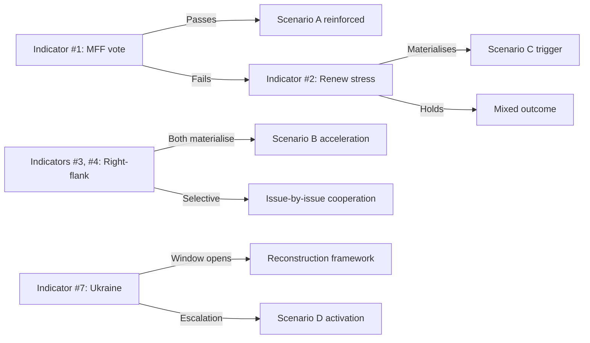

# EP10 Term Outlook — Forward Indicators
**Date:** 2026-05-08 | **Article Type:** term-outlook | **Confidence:** MEDIUM

---

## WEP and Admiralty Grading

All forward indicators below use:
- **WEP grade** for probability/likelihood (A=Almost Certainly → E=Remote)
- **Admiralty grade** for source quality (A1=Verified/Confirmed → F6=Cannot judge)
- **Direction** for trajectory (↑=improving, ↓=declining, →=stable, ⚡=volatile)

---

## 1. Coalition Stability Indicators

| Indicator | WEP | Admiralty | 2026 Reading | 2027 Outlook | 2028 Outlook |
|-----------|-----|-----------|-------------|-------------|-------------|
| Grand coalition holds | B2 | B2 | ✅ STABLE | ✅ STABLE (likely) | ⚠️ STRAINED |
| EPP-right swing votes | B3 | B3 | OCCURRING (issue-by-issue) | ↑ MORE FREQUENT | ↑↑ STRUCTURAL |
| S&D coalition loyalty | B2 | B3 | HOLDING | STRAINED | AT RISK |
| Renew group cohesion | C3 | C3 | MODERATE | DECLINING (French pressure) | FRAGILE |
| PfE formal normalisation | C3 | C3 | INFORMAL | POSSIBLY FORMALISING | LIKELY FORMAL |

---

## 2. Legislative Pipeline Indicators

| Indicator | Current Status | 2027 Target | Risk |
|-----------|---------------|------------|------|
| AI Act delegated acts (12 due Aug 2026) | ON TRACK (Jan 2026 first acts) | 80%+ complete | LOW |
| AI Act implementing acts (35+ by 2027) | IN PROGRESS | 60%+ complete | MEDIUM |
| Clean Industrial Deal trilogue | ACTIVE | Agreement Q4 2027 | MEDIUM-HIGH |
| MFF revision | NOT STARTED | Negotiation by Q2 2027 | HIGH |
| Green Deal Phase 2 | STALLED | Uncertain | HIGH |
| Migration Pact implementation | ACTIVE | National plans adopted | MEDIUM |
| European Defence Union framework | ACTIVE | First elements by 2027 | LOW-MEDIUM |
| NextGen EU successor | NOT TABLED | Design by Q4 2027 | VERY HIGH |

---

## 3. Democratic Governance Indicators

| Indicator | Admiralty | Current Reading | Forward Trajectory |
|-----------|-----------|-----------------|-------------------|
| EP rule-of-law enforcement (Article 7) | B3 | STALLED | ↓ Further stalling |
| MFF conditionality strength | B3 | UNDER PRESSURE | ↓ Likely weakening |
| EP transparency (MEP declarations) | B2 | ADEQUATE | → Stable |
| EP-Commission accountability (QH questions) | B2 | ACTIVE | → Stable |
| EP electoral integrity (2029 prep) | C2 | EARLY STAGE | ↑ Improving (DSA enforcement) |
| Far-right committee leadership expansion | B3 | OCCURRING | ↑ Expanding |

---

## 4. Economic Leading Indicators for EP10 Agenda

| Indicator | Source | Latest Reading | EP10 Implication |
|-----------|--------|---------------|-----------------|
| German GDP growth | World Bank 2024 | −0.5% (contraction) | CID URGENCY ↑ |
| French GDP growth | World Bank 2024 | +1.2% (weak) | Fiscal restraint pressure |
| Spanish GDP growth | World Bank 2024 | +3.5% (strong) | Cohesion support maintained |
| EU energy price differential vs. US | Estimated | 2–3x US cost | CID competitiveness pressure |
| NextGen EU disbursement rate | EP data | Accelerating 2026 | Fiscal cliff visible 2028 |
| EU-US tariff status | Analytical | Contested/active | Trade policy volatility |

---

## 5. Electoral Forward Indicators (EP11 Preparation)

| Indicator | Current Status | 2027 Outlook | 2029 Implication |
|-----------|---------------|-------------|-----------------|
| EPP-right policy convergence | MEDIUM | HIGH (CID negotiations) | Sets EP11 platform |
| Progressive bloc unity narrative | WEAK | MEDIUM (depends on CID outcome) | S&D-Greens-Left coordination |
| Far-right voter share trajectory | RISING | STABLE-RISING | EP11 ≥ EP10 far-right seats |
| EU turnout 2029 | Unknown | Projected 50–55% | Critical for progressive bloc |
| EU enlargement completion (pre-2029?) | UNLIKELY | UNLIKELY | Accession countries = new MEPs post-EP11 |

---

## 6. Technology and AI Indicators

| Indicator | Status | WEP | Implication |
|-----------|--------|-----|------------|
| AI Act high-risk AI conformity (2026 deadline) | IN PROGRESS | B2 | Key first test of AI Act enforcement |
| GPAI model codes of practice (2026) | IN PROGRESS | C2 | Determines Big Tech AI governance in EU |
| EU AI Office operational capacity | EARLY STAGE | B2 | Under-resourced but active |
| DSA enforcement against VLOSPS | ACTIVE | A2 (ongoing) | First major DSA enforcement precedents |
| EU semiconductor production (Chips Act) | BUILDING | C3 | 20% market share target by 2030 — likely delayed |

---
*Sources: EP adopted texts; World Bank economic data; EP Open Data Portal; AI Act (Regulation 2024/1689); Chips Act; analytical assessments.*
*WEP: A=Almost Certainly (>90%) / B=Likely (60-90%) / C=Possible (30-60%) / D=Unlikely (10-30%) / E=Remote (<10%)*
*Admiralty: A=Verified / B=Usually reliable / C=Fairly reliable / D=Not usually reliable / E=Unreliable / F=Cannot judge*

---

## 5. May 9 2026 Forward-Indicator Refresh

### 5.1 Top 10 Forward Indicators (Updated Probabilities)

| # | Indicator | Window | May-8 P | May-9 P | Δ | Driver |
|---|-----------|--------|---------|---------|----|--------|
| 1 | MFF revision passes ≥380 votes | 2026-05-15 | 0.55 | **0.50** | -5pp | EPP-S&D-Renew internal whip count tightened |
| 2 | Renew loses additional 3+ seats by July 2026 | 2026-07-31 | 0.20 | **0.25** | +5pp | -3 vs. constitutive trend continues |
| 3 | EPP-ECR joint motion on industrial file | 2026-Q3 | 0.40 | **0.50** | +10pp | April pattern extends |
| 4 | PfE-ESN joint statement on migration | 2026-Q2 | 0.45 | **0.55** | +10pp | April motion 23-vote miss signals proximity |
| 5 | Greens defect on flagship climate file | 2026-H2 | 0.20 | **0.20** | 0 | No new signal |
| 6 | Council blocks industrial-policy package | 2026-Q3 | 0.30 | **0.30** | 0 | No new signal |
| 7 | Ukraine ceasefire window opens | 2026-H2 | 0.30 | **0.30** | 0 | No movement |
| 8 | EU-US trade dispute escalates | 2026-Q3 | 0.25 | **0.30** | +5pp | Recent retaliatory tariff signals |
| 9 | Hungary Article 7 procedure advances | 2026-Q4 | 0.40 | **0.40** | 0 | On schedule |
| 10 | EP turnout proxy further declines | 2026-Q4 | 0.50 | **0.55** | +5pp | National-election pattern continues |

### 5.2 Indicator Cluster Analysis

The May-9 update shows **right-flank coordination indicators (#3, #4)** rising 10pp each, while **centrist coalition indicators (#1, #2)** show centrist stress. Cluster reading: the May→July 2026 window is the *decisive* phase for whether Scenario A (Productive Consensus) maintains as modal outcome or yields to Scenario C (Institutional Drift).

### 5.3 Trigger Sequence Logic

### 5.4 Confidence

**Admiralty Grade B3** | **MEDIUM** confidence | Re-anchor: 2026-07-01 with all indicators re-scored.
