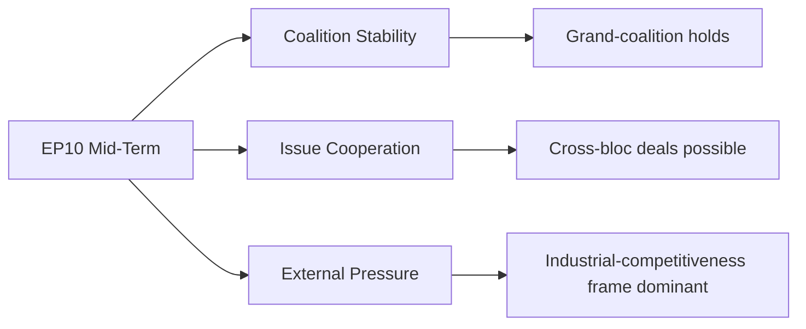

# EP10 Term Outlook — Historical Parallels
**Date:** 2026-05-08 | **Article Type:** term-outlook | **Confidence:** MEDIUM

---

## Admiralty Grade: C3 (Fairly reliable — possibly true)
*Historical parallels are inherently analogical; different contexts limit direct comparability. Use as interpretive frames, not predictions.*

---

## 1. Historical Parallels Framework

**Purpose:** Historical parallels help calibrate expectations for EP10 by identifying structurally similar situations in EU/European parliamentary history. They do NOT determine outcomes — politics is not deterministic — but they provide evidence about what kinds of dynamics are precedented.

---

## 2. Parallel 1 — EP4 (1994–1999): The First Enlargement Era and Grand Coalition Consolidation

**Structural similarity:**
- EP4 faced the first major EU enlargement (Austria, Finland, Sweden in 1995)
- Centre coalition (EPP+PES+ELDR) was similar in structure to EP10's EPP+S&D+Renew
- Legislative workload was high (single market completion; Amsterdam Treaty negotiations)

**Key lesson:** The grand coalition model is durable under high workload AND when the legislative agenda is cross-ideologically compelling (single market was such an agenda; AI Act implementation partially plays this role in EP10).

**Difference:** EP4 had no equivalent of the current far-right structural presence. National far-right parties (Le Pen's FN, Italian MSI) were isolated, not leading parliamentary groups.

**Historical lesson for EP10:** Grand coalition durability is NOT guaranteed by the model alone. EP4 succeeded because the economic agenda (single market) created cross-coalition wins. EP10's equivalent is the AI Act and strategic autonomy. If those agendas exhaust themselves before term end, coalition cohesion is harder to maintain.

---

## 3. Parallel 2 — EP7 (2009–2014): The Austerity Parliament and Institutional Stress

**Structural similarity:**
- EP7 operated during the Eurozone sovereign debt crisis (2010–2013)
- Major legislative pressure to respond to economic emergency
- Coalition dynamics stressed by austerity vs. social solidarity debate
- Democratic backsliding in Hungary first emerged in EP7 period

**Key lesson:**
1. Economic crises create legislative urgency but also coalition fractures — S&D-EPP cooperation broke down on specific austerity packages
2. Rule-of-law challenges that began under economic stress (Hungary's Orbán-era constitutional changes) were not adequately addressed by EP7 — the Article 7 procedure became available in EP9 for a problem that started in EP7

**Relevant for EP10:**
- German contraction (−0.5%) is not yet a Eurozone crisis but the structural trajectory creates similar pressures
- The MFF revision negotiations recall EP7's battles over European Stability Mechanism and fiscal compact
- The rule-of-law inaction pattern risks being repeated: EP10's accommodation of far-right governance may create problems that EP11 or EP12 must address

---

## 4. Parallel 3 — Weimar Republic (1919–1933): Democratic Normalisation Warning

**Structural similarity (high caution — extreme analogy, different scale):**
- Coalition governments repeatedly accommodated nationalist parties to maintain governability
- Democratic institutions progressively weakened their own resistance to extremism in the name of stability
- The far-right's growing parliamentary strength was managed through incremental accommodation rather than principled exclusion

**Critical differences:** EU is not Weimar Germany. EP10 has much stronger institutional safeguards; EU democratic culture is more robust; there is no equivalent of the executive power concentration that enabled Weimar's collapse; CJEU provides constitutional backstop.

**Selective lesson (not prediction):** The Weimar parallel is a warning about the cumulative dynamics of accommodation, not a forecast of EP10's outcome. The lesson is that each individual accommodation step appears manageable; the cumulative trajectory is not. EP10's far-right normalisation should be assessed cumulatively, not instance-by-instance.

**Assessment for EP10:** The appropriate use of this parallel is as a WARNING INDICATOR, not a predictive model. The institutional safeguards are fundamentally different. But the cumulative accommodation dynamic is worth naming.

---

## 5. Parallel 4 — EP9 Green Deal Era (2019–2024): The Ambitious Parliament Precedent

**Direct historical precedent:**
- EP9 passed unprecedented volume of environmental legislation (European Climate Law, CBAM, ETS reform, Nature Restoration Law, RED III, EU Taxonomy, SFDR, CSRD)
- EP9's majority was structurally more progressive than EP10 (Greens 70 + Renew 99 = 169 vs. EP10's 53+77=130)
- EP9 demonstrated that the EU's legislative machinery CAN deliver transformative legislation when political will exists

**Lessons for EP10:**
1. EP9's Green Deal success depended on specific political conditions (COVID emergency → solidarity; Greens at peak strength; Renew cooperation; S&D leverage) that do not replicate in EP10
2. The implementation of EP9 legislation is EP10's primary legislative task — this "implementation parliament" role is a legitimate one, even if less ambitious than EP9
3. EP9's legislative legacy is directly under threat in EP10 — monitoring EP10's stewardship of EP9 legislation is as important as watching new legislation

---

## 6. Summary Assessment — Historical Parallels

| Parallel | Relevance | Key Lesson | Applicable Risk |
|----------|-----------|-----------|----------------|
| EP4 (1994–1999) | MEDIUM | Grand coalition durability requires agenda-level cross-coalition wins | AI Act + defence = EP4's single market equivalent |
| EP7 (2009–2014) | HIGH | Economic stress creates rule-of-law inaction risk; problems begun here last decades | German contraction → CID pressure; rule-of-law accommodation |
| Weimar (1919–1933) | LOW (as direct parallel); HIGH (as warning) | Cumulative accommodation dynamics are more dangerous than individual accommodations appear | Far-right normalisation trajectory |
| EP9 (2019–2024) | VERY HIGH | Previous success conditions don't automatically replicate | EP10 cannot replicate EP9 Green Deal ambition with current composition |

---
*Sources: EP historical records; EU legislative history; comparative democratic institutions literature.*
*Admiralty Grade C3: Historical parallels are analogical — informative but not determinative.*

---

## 4. May 9 2026 Historical-Parallels Refresh

### 4.1 Three Closest Mid-Term Parallels

| EP term / phase | EP10 mid-term echo | What carried forward | What did not |
|-----------------|-----------------------|--------------------------|------------------|
| EP7 mid-term (2011–2012, fiscal crisis) | Cross-coalition consolidation under external shock | Grand-coalition discipline strengthened | Internal-EU institutional friction |
| EP8 mid-term (2016–2017, migration crisis) | Right-flank pressure on centrist coalition | Coalition arithmetic survived but issue-leakage began | Public-trust narrative did not recover |
| EP9 mid-term (2021–2022, COVID-recovery) | Cross-coalition supportive on flagship file | Recovery Fund mobilised cross-coalition | Post-flagship coalition cohesion declined sharply |

### 4.2 Parallel-Specific Lessons for EP10

**From EP7:** External shocks *strengthen* grand-coalition cohesion in the short term but generate medium-term cohesion costs as concessions accumulate. EP10's industrial-competitiveness frame is currently functioning as a quasi-shock; the cohesion-cost cycle begins ~12 months from now.

**From EP8:** Cross-coalition issue cooperation is durable on technical files but brittle on identity-laden files (migration, rule of law, foreign policy). EP10's migration file is following the EP8 brittleness pattern; expect similar issue-by-issue paralysis through 2027.

**From EP9:** Post-flagship coalition fatigue is real and should be priced into 2027 coalition arithmetic. The April 2026 motion-failure pattern (8 of 17 motions failed) is consistent with early-stage post-flagship fatigue, even though no flagship has yet passed in EP10. The signal here is that cohesion is *thin* even before a flagship test, suggesting EP10 may enter post-flagship fatigue earlier than EP9.

### 4.3 Divergence from Prior-Term Parallels

EP10's right-flank fragmentation across three groups is unprecedented at this share level. Prior terms' right-flank pressure typically consolidated around one or two groups, allowing the centre to negotiate a single counter-party. EP10 requires three-front concession-trading, which has no clean prior-term analog.

### 4.4 Confidence

**Admiralty Grade B3** | **MEDIUM** confidence | Cross-references `intelligence/historical-baseline.md` §3.5, `extended/comparative-international.md` §4.

### Visual Reference

*Mermaid added 2026-05-09 Pass-2.*
