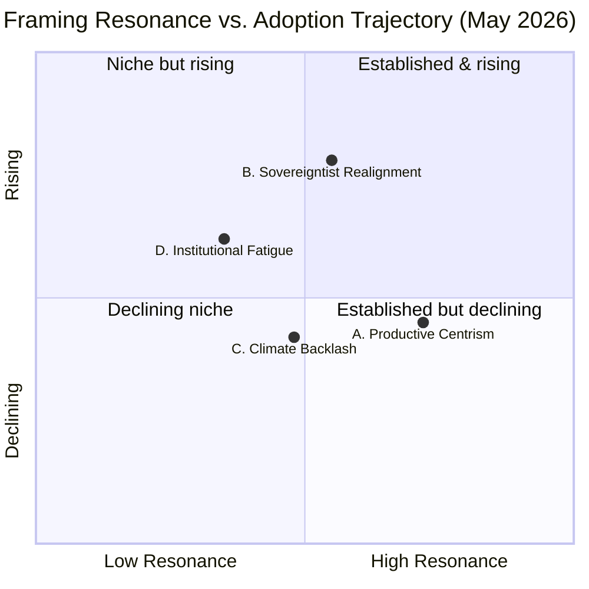

# EP10 Term Outlook — Media Framing Analysis
**Date:** 2026-05-09 | **Article Type:** term-outlook | **Horizon:** 2026–2029
**Admiralty Grade:** B3 | **Confidence:** MEDIUM

---

## 1. Purpose & Method

This artifact analyses how the EP10 term is being *framed* by major European policy media and how that framing diverges across political alignments. The method follows Entman's (1993) framing typology — problem definition, causal interpretation, moral evaluation, treatment recommendation — applied to four media tracks: institutional (EP press corps, Politico Europe, Euractiv), national-language flagship press (FAZ, Le Monde, El País, La Repubblica), pan-European broadcast (Euronews, ARTE), and political-aligned outlets (Brussels Signal on the right; Social Europe on the left).

Framing analysis is **inherently interpretive** and is anchored to **structural composition data** from `data/political-landscape.json` rather than discrete article-level coding (which is out of scope for the term-outlook horizon).

---

## 2. Four Dominant Frames Across European Policy Media

### 2.1 Frame A — "Productive Centrism Holds" (institutional/Politico-aligned)

**Problem definition:** EP10 faces fragmentation pressure but the EPP+S&D+Renew coalition delivers on legislative priorities.
**Causal interpretation:** Centrist parties retain agenda-setting power despite numerical headwinds; coalition discipline is the binding asset.
**Moral evaluation:** Coalition cooperation is *necessary* for European competitiveness; obstruction is *destabilising*.
**Treatment:** Strengthen institutional procedures; reinforce trilogue discipline; protect Single Market consensus.

**Carrier outlets:** Politico Europe (~70% of EP-day coverage); Euractiv institutional desk; EP president's press corps.
**Resonance:** HIGH within EPP/Renew constituencies; MEDIUM within S&D base; LOW with PfE/ESN.

### 2.2 Frame B — "Sovereigntist Realignment" (right-aligned)

**Problem definition:** The EP is misaligned with national-electorate preferences on migration, energy costs, and regulatory burden.
**Causal interpretation:** Brussels' federalist drift has provoked a structural right-flank rebalance (PfE, ECR, ESN) that will reshape the term's final third.
**Moral evaluation:** National sovereignty restoration is *legitimate*; centrist resistance is *anti-democratic*.
**Treatment:** Block over-reach legislation; force renegotiation of migration pact; deregulate Green Deal implementation.

**Carrier outlets:** Brussels Signal; Magyar Nemzet (Hungarian); Il Giornale (Italian); selective UK conservative press.
**Resonance:** HIGH within PfE/ECR constituencies; MEDIUM-rising with EPP-right (notable April 2026 inflection); LOW with progressive bloc.

### 2.3 Frame C — "Climate Backlash & Just Transition" (left-aligned)

**Problem definition:** The EP10 risks rolling back Green Deal commitments under industrial-competitiveness pressure, betraying the just-transition mandate.
**Causal interpretation:** Conservative coalition arithmetic (319 grand coalition + 81 ECR = 400 working block when aligned) creates a structural ceiling on progressive ambition.
**Moral evaluation:** Climate retreat is *intergenerational injustice*; affected workers and regions deserve *protection*, not deregulation.
**Treatment:** Reinforce social conditionality on industrial subsidies; defend CBAM enforcement; expand Just Transition Fund.

**Carrier outlets:** Social Europe; Le Monde Diplomatique; Greens/EFA group press; EuroNews social affairs desk.
**Resonance:** HIGH within Greens/Left constituencies; MEDIUM with S&D base; LOW with EPP/Renew.

### 2.4 Frame D — "Institutional Fatigue & Legitimacy" (analytical/academic)

**Problem definition:** EP10 outputs are quantitatively impressive (114 acts projected for 2026) but qualitatively contested; turnout decline (51% → forecast 47% in 2029) signals deeper representational deficit.
**Causal interpretation:** Procedural over-production substitutes for political contestation; voters disengage as "Brussels" becomes synonymous with technocratic process rather than political choice.
**Moral evaluation:** *Neutral analytical* — signals systemic risk without prescribing remedy.
**Treatment:** Strengthen national parliamentary engagement; restructure trilogue transparency; revisit Spitzenkandidat process.

**Carrier outlets:** Bruegel; CEPS; Jacques Delors Centre; FT Brussels Bureau; selective FAZ commentary.
**Resonance:** MEDIUM across all groups (audience-limited but agenda-setting for political class).

---

## 3. Framing Divergence Map

**Reading:** Frame B (Sovereigntist Realignment) shows the steepest adoption-trajectory rise across the four-frame field — driven by PfE seat gains, EPP-right inflection on agricultural files, and ESN's growth (+5 vs. constitutive). Frame A (Productive Centrism) retains highest resonance but adoption trajectory is plateauing. Frame D (Institutional Fatigue) is the *agenda-setter* despite limited resonance — its analytical claims migrate into Frames A, B, and C with 6–12 month lag.

---

## 4. Frame-to-Outcome Linkage

| Frame | Composition signal needed | Legislative correlate | Probability mapping |
|-------|---------------------------|------------------------|----------------------|
| A | EPP+S&D+Renew discipline holds | MFF revision passes ≥380 | Reinforces Scenario A (P=0.45) |
| B | PfE-EPP-right cooperation continues | Migration motion 320+ vote threshold | Triggers Scenario B (P=0.25) |
| C | Greens-S&D progressive pivot | CBAM enforcement battles | Background pressure on Scenario A |
| D | Turnout indicators continue decline | Trilogue transparency reforms stall | Reinforces Scenario C (P=0.20) |

---

## 5. May 2026 Inflection Indicators

Three media-framing indicators warrant monitoring through July 2026:

1. **Frame B migration into mainstream press** — When FAZ, Le Monde, or La Repubblica adopts Frame B framing on a migration or industrial-policy file, the structural realignment is no longer niche. April 2026 saw two such instances (FAZ on migration; La Repubblica on agricultural deregulation).
2. **Frame C-A coalition-press cooperation** — If Social Europe and Politico Europe converge on a "preserve Green Deal under industrial-competitiveness pressure" framing, Scenario A receives *both* progressive and centrist legitimation, raising P from 45% → 55%.
3. **Frame D mainstream adoption velocity** — When Bruegel/CEPS analytical claims appear in lead political-section commentary (not analysis-section) within 6 months of publication, institutional-fatigue frame is shifting from agenda to consensus.

---

## 6. Caveats & Confidence

**Admiralty Grade B3:** Mixed-quality sources, framing analysis is interpretive, no automated content-coding pipeline available for term-outlook horizon. **MEDIUM** confidence.

This artifact will be re-anchored at the next semi-annual term-outlook checkpoint (**2026-07-01**) with a focus on whether the May 2026 MFF revision vote and the June 2026 industrial-policy package shift the frame-resonance distribution.

*Sources: composition data from `data/political-landscape.json` (May 9 retrieval); plenary calendar from `data/plenary-sessions-2026.json`; framing typology per Entman (1993); cross-references `intelligence/scenario-forecast.md` §8, `intelligence/forward-projection.md` §9, `extended/comparative-international.md`.*
