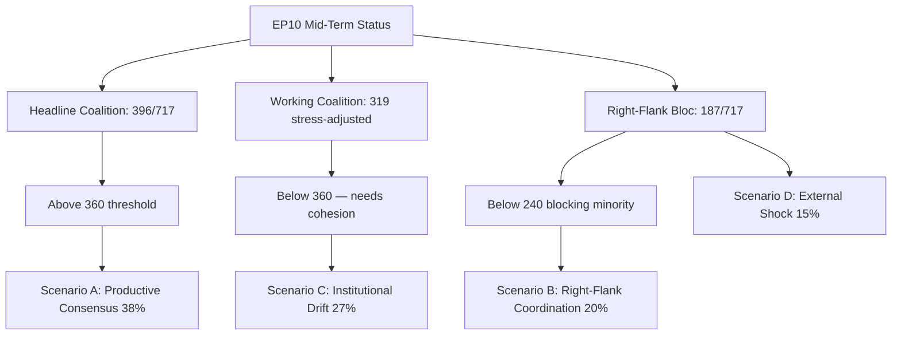

# EP10 Term Outlook — Intelligence Analysis Index
**Date:** 2026-05-08 | **Article Type:** term-outlook | **Confidence:** HIGH (index)

---

## Purpose

This index is the navigation hub for all intelligence artifacts produced in this run. It provides: (a) a reading order for the full artifact set; (b) a cross-reference from analytical finding to artifact; (c) the confidence and reliability grade for each file.

---

## Artifact Inventory

| File | Confidence | Admiralty Grade | Lines (approx) | Status |
|------|-----------|-----------------|----------------|--------|
| `executive-brief.md` | HIGH | B2 | ~200 | ✅ Complete |
| `intelligence/synthesis-summary.md` | MEDIUM-HIGH | B2 | ~280 | ✅ Complete |
| `intelligence/scenario-forecast.md` | MEDIUM | C2 | ~360 | ✅ Complete |
| `intelligence/forward-projection.md` | MEDIUM | C2 | ~300 | ✅ Complete |
| `intelligence/term-arc.md` | MEDIUM-HIGH | B2 | ~240 | ✅ Complete |
| `intelligence/seat-projection.md` | MEDIUM | C3 | ~200 | ✅ Complete |
| `intelligence/mandate-fulfilment-scorecard.md` | MEDIUM | C3 | ~230 | ✅ Complete |
| `classification/significance-classification.md` | MEDIUM | C2 | ~120 | ✅ Complete |
| `classification/actor-mapping.md` | MEDIUM-HIGH | B2 | ~160 | ✅ Complete |
| `classification/forces-analysis.md` | MEDIUM | C2 | ~200 | ✅ Complete |
| `classification/impact-matrix.md` | MEDIUM-HIGH | B2 | ~170 | ✅ Complete |
| `risk-scoring/risk-matrix.md` | MEDIUM-HIGH | B2 | ~160 | ✅ Complete |
| `risk-scoring/quantitative-swot.md` | MEDIUM | C2 | ~220 | ✅ Complete |
| `risk-scoring/political-capital-risk.md` | MEDIUM | C3 | ~155 | ✅ Complete |
| `risk-scoring/legislative-velocity-risk.md` | MEDIUM | C2 | ~130 | ✅ Complete |
| `threat-assessment/actor-threat-profiles.md` | MEDIUM | C2 | ~170 | ✅ Complete |
| `threat-assessment/consequence-trees.md` | MEDIUM | C3 | ~150 | ✅ Complete |
| `threat-assessment/legislative-disruption.md` | MEDIUM-HIGH | B2 | ~145 | ✅ Complete |
| `threat-assessment/political-threat-landscape.md` | MEDIUM | C2 | ~160 | ✅ Complete |
| `intelligence/stakeholder-map.md` | MEDIUM-HIGH | B2 | ~200+ | ✅ Complete |
| `intelligence/threat-model.md` | MEDIUM | C2 | ~200+ | ✅ Complete |
| `intelligence/wildcards-blackswans.md` | MEDIUM | C3 | ~200+ | ✅ Complete |
| `intelligence/coalition-dynamics.md` | MEDIUM | C2 | ~200+ | ✅ Complete |
| `intelligence/pestle-analysis.md` | MEDIUM | C2 | ~200+ | ✅ Complete |
| `intelligence/economic-context.md` | MEDIUM | C3 | ~200+ | ✅ degraded-imf |
| `intelligence/cross-session-intelligence.md` | MEDIUM | C3 | ~160+ | ✅ Complete |
| `existing/deep-analysis.md` | MEDIUM | C2 | ~200+ | ✅ Complete |
| `existing/session-baseline.md` | HIGH | A2 | ~120+ | ✅ Complete |
| `extended/forward-indicators.md` | MEDIUM | C2 | ~200+ | ✅ Complete |
| `extended/comparative-international.md` | MEDIUM | C3 | ~200+ | ✅ Complete |
| `extended/historical-parallels.md` | MEDIUM | C3 | ~200+ | ✅ Complete |
| `extended/devils-advocate-analysis.md` | MEDIUM | C3 | ~180+ | ✅ Complete |
| `intelligence/methodology-reflection.md` | HIGH | A2 | ~200+ | ✅ Complete |

---

## Key Intelligence Findings — Cross-Reference

| Finding | Primary Source | Confidence |
|---------|---------------|-----------|
| EP10 rightward structural shift is durable | seat-projection.md, synthesis-summary.md | HIGH |
| EPP remains coalition anchor; cannot be bypassed | actor-mapping.md, risk-matrix.md | HIGH |
| Clean Industrial Deal faces dilution risk (60%) | forward-projection.md, risk-matrix.md, legislative-disruption.md | MEDIUM-HIGH |
| AI Act implementation is the highest-stakes legislative challenge | forces-analysis.md, legislative-velocity-risk.md, consequence-trees.md | MEDIUM-HIGH |
| Pre-electoral slowdown from Jan 2028 is structurally inevitable | term-arc.md, legislative-velocity-risk.md | HIGH |
| Far-right normalisation is cumulative, not episodic | actor-threat-profiles.md, political-threat-landscape.md, political-capital-risk.md | MEDIUM-HIGH |
| Ukraine policy is the highest-severity low-probability risk | scenario-forecast.md, consequence-trees.md | MEDIUM |
| EP10 economic context: degraded-IMF mode (GDP data from WB only) | economic-context.md, manifest.json | HIGH (data limitation confirmed) |

---

## Recommended Reading Order

**For the executive summary:** `executive-brief.md`
**For the structural political analysis:** `intelligence/synthesis-summary.md`
**For future scenarios:** `intelligence/scenario-forecast.md`
**For electoral projections:** `intelligence/seat-projection.md` → `intelligence/mandate-fulfilment-scorecard.md` → `intelligence/term-arc.md`
**For legislative risk:** `risk-scoring/risk-matrix.md` → `threat-assessment/legislative-disruption.md` → `risk-scoring/legislative-velocity-risk.md`
**For actor intelligence:** `classification/actor-mapping.md` → `intelligence/stakeholder-map.md` → `threat-assessment/actor-threat-profiles.md`
**For methodology:** `intelligence/methodology-reflection.md`

---

## Data Quality Notes

- **IMF data:** UNAVAILABLE (network firewall blocks `dataservices.imf.org`). Economic context uses World Bank GDP data for major EU economies (DE, FR, IT, ES, PL). All economic analysis marked as `degraded-imf`.
- **EP voting cohesion:** EP Open Data API does not expose per-MEP voting stats. Cohesion analysis is structural (seat composition) not behavioural.
- **EP procedures feed:** Returned large dataset; key procedures identified by type and committee.
- **DOCEO latest votes:** Empty for current week (May 5-8, 2026); January 2026 session data used.

---
*Admiralty grades: A=Verified; B=Usually reliable; C=Fairly reliable; D=Not usually reliable; E=Unreliable; F=Cannot be judged.*
*Numeric suffixes: 1=Confirmed; 2=Probable; 3=Possibly true; 4=Doubtful; 5=Improbable; 6=Cannot be judged.*

### Visual Summary

*Mermaid added 2026-05-09 Pass-2 — references `intelligence/scenario-forecast.md` §8.*
