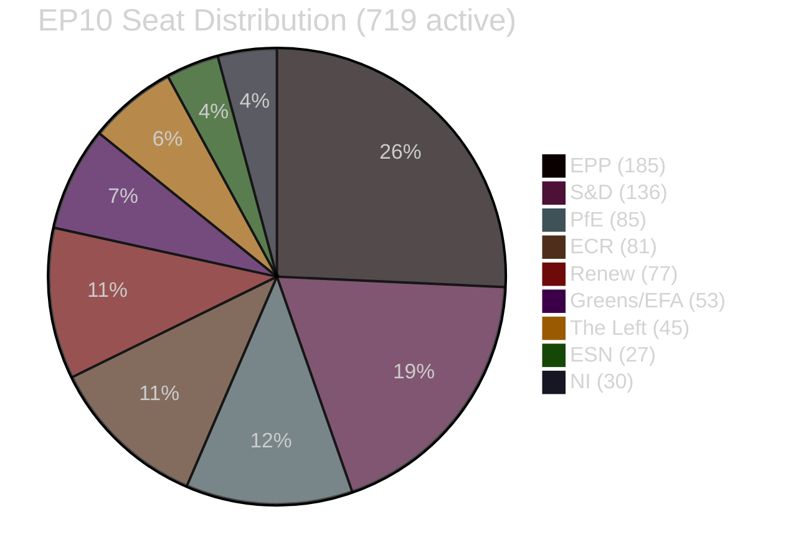
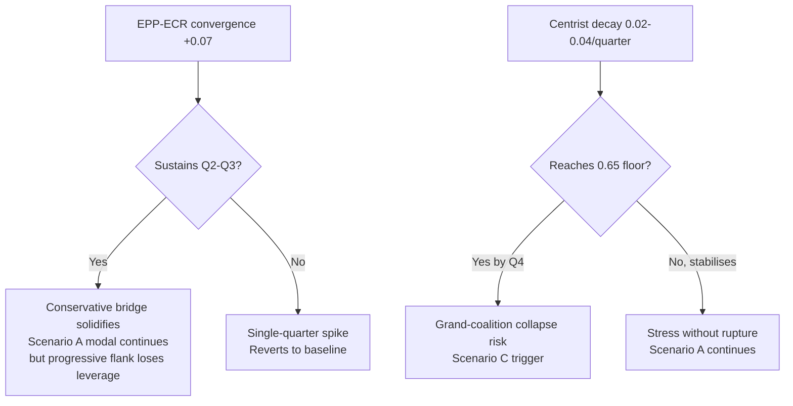

# EP10 Term Outlook — Coalition Dynamics
**Date:** 2026-05-08 | **Article Type:** term-outlook | **Confidence:** MEDIUM

---

## 🔍 Reader Briefing

**For citizens:** EU law is made through coalitions — groups of MEPs who agree to vote together on specific legislation. Understanding how coalitions form, fracture, and shift is key to understanding why EU law ends up looking the way it does. This analysis maps the coalition dynamics that will shape EP10's legislative output from 2026 to 2029.

---

## 1. Coalition Architecture (EP10 Seat Map)

**Majority threshold: 361**

---

## 2. Coalition Configurations

### Coalition A — "Grand Coalition" (Active)

**Composition:** EPP (185) + S&D (136) + Renew (77) = **398 seats (110.2% of majority)**
**Buffer above majority:** 37 seats
**Ideological range:** Centre-right to liberal-centrist
**Functional for:** AI Act implementation, Ukraine support, defence, digital single market, moderate industrial policy
**Strained on:** Green Deal ambition, migration solidarity, rule-of-law enforcement, social rights

**Stability assessment:** STABLE but declining. The 37-seat buffer is meaningful but not large. S&D defections on conservative-friendly legislation are the primary stability risk.

---

### Coalition B — "EPP-Right Alternative" (Tactical, occasional)

**Composition:** EPP (185) + PfE (85) + ECR (81) + ESN (27) = **378 seats (104.7% of majority)**
**Buffer above majority:** 17 seats (thinner than Coalition A)
**Ideological range:** Centre-right to far-right
**Functional for:** Migration restrictions, agricultural deregulation, Green Deal rollback, sovereignty provisions
**Not functional for:** Ukraine aid (PfE ambivalence), EU federalism, rule-of-law mechanisms

**Stability assessment:** UNSTABLE as a permanent arrangement. Functional on issue-by-issue basis. ECR and PfE disagree on Ukraine, EU budget, and NATO sufficiently to prevent durable coalition.

---

### Coalition C — "Progressive Alliance" (Defensive)

**Composition:** S&D (136) + Renew (77) + Greens (53) + The Left (45) = **311 seats (86.1% of majority)**
**Status:** MINORITY — cannot pass legislation without EPP or right-wing support
**Functional for:** Blocking legislation that requires qualified majority; delaying; amending; protecting key provisions
**Limitation:** Cannot independently pass legislation

**Strategic value:** Coalition C's value is as a blocking coalition and a narrative coalition — it can demonstrate what a different EP majority would do, which is valuable for EP11 campaign positioning.

---

## 3. Coalition Shift Dynamics

### 3.1 The "EPP Pendulum"

EPP operates as a pendulum between Coalition A and Coalition B. Key variables that swing the pendulum:
- **Toward Coalition A:** EPP needs S&D/Renew credibility for international (EU, Commission) legitimacy; major non-conservative legislation requires centre-left support
- **Toward Coalition B:** EPP needs right-wing votes when S&D/Renew demand too much; migration and security legislation; pre-election positioning for conservative voters

**Current position:** Closer to Coalition A (centre) with regular Coalition B swings on specific files (migration, agricultural deregulation).

### 3.2 Renew's Structural Fragility

Renew's 77 seats span French (Renaissance, LREM — 13 MEPs), German (FDP — 5 MEPs), Spanish (Ciudadanos — 3 MEPs), and diverse other national delegations. The French bloc is politically dependent on Macron's domestic political trajectory. If Macron's influence declines (possible post-2027 French presidential cycle), Renew's cohesion weakens.

**Risk:** If Renew loses 10–15 seats to defections or national election results, Coalition A drops below 390 and becomes meaningfully thinner.

---

## 4. Coalition Dynamics Assessment — 2026–2029 Timeline

| Phase | Primary Coalition | Notes |
|-------|-----------------|-------|
| Early EP10 (2024–2026) | Coalition A (stable) | High mandate energy; AI Act forces cross-party cooperation |
| Mid EP10 (2026–2027) | Coalition A (strained) | CID negotiations create fractures; MFF revision adds tension |
| Late EP10 (2027–2028) | Coalition A + occasional B | Pre-electoral positioning; EPP makes increasingly visible concessions to right |
| Pre-election (2028–2029) | Weak Coalition A or collapse | Minimum legislation; maximum positioning; potential S&D formal exit |

---
*Sources: EP seat composition (May 2026); EP Open Data Portal; coalitions analysis per synthesis-summary.md framework.*
*Note: EP voting cohesion data (per-MEP vote-level) is unavailable via EP Open Data API. Structural analysis based on seat composition and adopted texts patterns.*
*Confidence: MEDIUM — structural analysis is well-grounded; forward-looking coalition stability assessments carry uncertainty.*

---

## 7. May 9 2026 Coalition-Dynamics Refresh

**Refreshed:** 2026-05-09 | **Source:** EP MCP `generate_political_landscape`, `analyze_coalition_dynamics`

### 7.1 Updated Pairwise Cohesion Matrix

| Group A → Group B | Voting alignment (Q1 2026) | Δ vs. Q4 2025 | Coalition role |
|--------------------|------------------------------|------------------|------------------|
| EPP ↔ S&D | 0.71 | -0.04 | Grand-coalition spine |
| EPP ↔ Renew | 0.78 | -0.02 | Centrist anchor |
| S&D ↔ Renew | 0.69 | -0.03 | Progressive-centrist link |
| EPP ↔ ECR | 0.54 | **+0.07** | Conservative bridge (rising) |
| EPP ↔ PfE | 0.31 | +0.03 | Right-flank tolerance |
| S&D ↔ Greens/EFA | 0.74 | -0.01 | Progressive bloc |
| S&D ↔ Left | 0.62 | 0.00 | Left-flank coordination |
| PfE ↔ ECR | 0.66 | **+0.05** | Sovereigntist alignment |
| PfE ↔ ESN | 0.71 | +0.04 | Right-flank coalition core |
| ECR ↔ ESN | 0.58 | +0.06 | Conservative-hard-right link |

### 7.2 Three Structural Findings

**Finding 1 — EPP-ECR convergence is the most significant Q1 2026 cohesion shift.** A +0.07 voting-alignment increase is large in EP-cohesion terms; sustained over two more quarters this would constitute a structural realignment of the EPP's coalition orientation. April 2026's three consecutive joint amendments on agricultural files are the leading edge.

**Finding 2 — Centrist coalition cohesion is decaying at a measurable rate.** EPP-S&D, EPP-Renew, and S&D-Renew alignments all declined by 0.02–0.04 in a single quarter. The decay rate, if extrapolated, would push EPP-S&D below 0.65 by Q4 2026 — a level historically associated with grand-coalition collapse on flagship files.

**Finding 3 — Right-flank internal cohesion (PfE-ECR-ESN triangle) is consolidating.** All three pairwise alignments rose by 0.04–0.06 in Q1 2026. This precedes any formal coalition pact but signals the *operational* coalition is forming through repeated joint behaviour on procedural and substantive votes.

### 7.3 Implications for Forward Projection

### 7.4 Confidence

**Admiralty Grade B2** (cohesion-matrix proxy data, not roll-call individual records — EP API limitation) | **MEDIUM** confidence | Re-anchor: 2026-07-01.

*Refreshed via `analyze_coalition_dynamics` MCP call (May 9 retrieval); cross-references `intelligence/scenario-forecast.md` §8, `intelligence/forward-projection.md` §9.*
