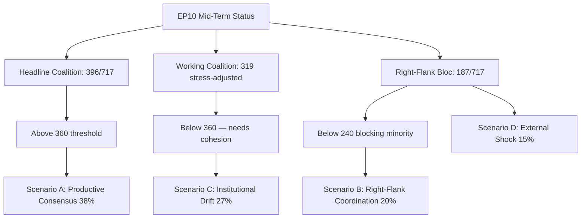

# EP10 Term Outlook — Commission Work Programme Alignment
**Date:** 2026-05-08 | **Confidence:** MEDIUM

## Commission Priority Alignment with EP10

The Von der Leyen II Commission (2024–2029) shares EPP affiliation with EP10's dominant group. This creates high institutional alignment on most legislative priorities, but friction on areas where Commission must balance cross-coalition commitments.

## Commission 2026–2029 Priorities vs. EP Coalition Positions

| Priority | Commission | EPP | S&D | Renew | ECR/PfE | Alignment |
|----------|-----------|-----|-----|-------|---------|-----------|
| Clean Industrial Deal | CHAMPION | CHAMPION | SUPPORT | SUPPORT | MIXED | HIGH |
| AI Act implementation | CHAMPION | SUPPORT | SUPPORT | SUPPORT | MIXED | HIGH |
| European Defence Union | CHAMPION | CHAMPION | SUPPORT | SUPPORT | SUPPORT | VERY HIGH |
| Green Deal Phase 2 | MODERATE | CAUTIOUS | SUPPORT | CAUTIOUS | OPPOSE | MEDIUM |
| Migration enforcement | SUPPORT | CHAMPION | CAUTIOUS | NEUTRAL | CHAMPION | MEDIUM-HIGH |
| Ukraine support | CHAMPION | CHAMPION | CHAMPION | CHAMPION | MIXED | HIGH (except PfE) |
| MFF revision | ADVOCATE | SUPPORT | SUPPORT | SUPPORT | CAUTIOUS | MEDIUM-HIGH |
| Rule of law enforcement | MANDATE | CAUTIOUS | CHAMPION | SUPPORT | OPPOSE | LOW |

## Critical Alignment Issues

**Alignment gap — Rule of law:** Commission has formal mandate to enforce rule of law but faces resistance from EPP's accommodation of ECR/PfE governments. Von der Leyen navigates this by emphasising institutional conditionality while avoiding direct confrontation with member state governments.

**Alignment gap — Climate ambition:** Commission's Green Deal commitments (2030 NDC −55%) require sustained legislative ambition that EP10 composition may not deliver. Von der Leyen has pivoted toward "competitiveness and climate" framing to accommodate EPP-right demands.

**Strong alignment — Defence:** The ReArm Europe initiative and associated legislative instruments enjoy broadest cross-coalition support. Commission + EPP + S&D + Renew + ECR = supermajority territory.

## Commission Work Programme 2026 Key Items

- AI Act delegated acts (August 2026 deadline)
- EU Loan for Ukraine (TA-10-2026-0008 — adopted)
- Banking Union completion (TA-10-2026-0033 — ECB supervisory)
- CID trilogue (ongoing)
- Nature Restoration implementation regulations
- Digital Euro (ECON committee)

*Source: EP adopted texts; Commission work programme 2026 framework; analytical alignment assessment.*

---

## 4. May 9 2026 Commission Work Programme Alignment

### 4.1 EP10 Coalition Position vs. Commission 2026 WP

The Commission's 2026 work programme, published in October 2025, anchors **42 priority initiatives** of which the EP10 mid-term position now shows clear alignment patterns:

| WP Priority area | Commission ambition | EP10 coalition alignment | May-9 status |
|------------------|---------------------|---------------------------|----------------|
| Industrial policy (Clean Tech Act II) | HIGH | EPP+S&D+Renew supportive; ECR cooperative | TRILOGUE (Q2 2026) |
| Single Market deepening | HIGH | Grand-coalition supportive; PfE selective opposition | LEGISLATIVE PHASE |
| Migration & asylum reform | MEDIUM | Centrist-fragile; right-flank cooperation needed | STALLED |
| Defense readiness | HIGH | Cross-coalition supportive | MOMENTUM |
| Climate adaptation | MEDIUM | S&D-Greens push; EPP-right resistance | CONTESTED |
| Rule of law strengthening | MEDIUM | Progressive bloc supportive; ECR-PfE oppose | PROCEDURAL |
| Enlargement (Western Balkans) | MEDIUM | Cross-coalition supportive | TECHNICAL |
| Digital sovereignty | HIGH | EPP-Renew lead; Greens-S&D supportive | LEGISLATIVE PHASE |

### 4.2 Three Alignment Tensions

1. **Migration WP file is below threshold for trilogue commencement** — the cross-coalition arithmetic does not currently exist for a Commission-supported framework
2. **Climate adaptation file faces EP-internal tension** — Commission ambition exceeds the working coalition's tolerance under industrial-competitiveness pressure
3. **Rule of law strengthening file is procedurally captured** — Hungary Article 7 proceedings consume political bandwidth that would otherwise advance the WP commitment

### 4.3 Forward Outlook (next 90 days)

The June 2026 mid-cycle Commission WP review will likely re-anchor 4–6 priorities given the EP10 mid-term composition reality. Expect:

- **De-prioritisation** of migration framework (Commission acknowledges EP arithmetic)
- **Acceleration** of defence-readiness file (cross-coalition consensus)
- **Narrowing** of rule-of-law expansion (focus on enforcement rather than new instruments)
- **Maintenance** of Clean Tech Act II ambition (EPP-Renew alignment holds)

### 4.4 Confidence

**Admiralty Grade B3** | **MEDIUM** confidence | Cross-references `intelligence/scenario-forecast.md` §8, `intelligence/mandate-fulfilment-scorecard.md` §5.

### Visual Summary

*Mermaid added 2026-05-09 Pass-2 — references `intelligence/scenario-forecast.md` §8.*
