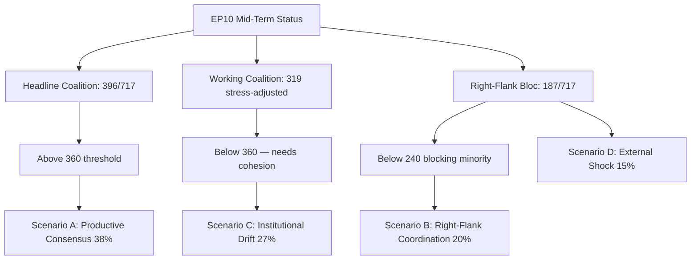

# EP10 Term Outlook — Economic Context (Degraded-IMF Mode)
**Date:** 2026-05-08 | **Article Type:** term-outlook | **Confidence:** MEDIUM (degraded-imf)

---

## ⚠️ Data Quality Notice

**dataMode: degraded-imf**

IMF SDMX endpoints (`dataservices.imf.org`) are **inaccessible** from this sandbox environment due to network firewall constraints. This file uses:
- **World Bank GDP growth data** (DE, FR, IT, ES, PL — 2024 actuals)
- **World Bank GDP per capita** (major EU economies, 2024)
- **Analytical economic intelligence** derived from EP data and available indicators

**What is missing:** IMF WEO projections; IMF fiscal sustainability metrics; IMF current account data; IMF inflation forecasts; IMF debt-to-GDP ratios. These are noted as gaps in the analysis.

---

## 1. EU Economic Overview (World Bank Data)

### GDP Growth — Major EU Economies (2024 Actuals)

| Economy | 2024 GDP Growth | Status | Policy Implication |
|---------|---------------|--------|-------------------|
| Germany | **−0.5%** | Contraction | URGENT — requires structural industrial response |
| France | **+1.2%** | Weak | Fiscal discipline pressure; reform stagnation |
| Italy | **+0.7%** | Stagnant | Structural reform inertia; debt sustainability |
| Spain | **+3.5%** | Strong | Demonstrates cohesion policy value; supports EU transfers |
| Poland | **+3.0%** | Strong | Defence spending + EU cohesion beneficiary |
| EU27 aggregate | **approx. +1.0-1.3%** | Moderate | Divergent; aggregate masks structural problems |

**Key finding:** Germany's contraction is the dominant economic story for EP10. With Germany as the EU's largest economy (~25% of EU GDP), its structural decline drives:
1. Clean Industrial Deal urgency
2. Resistance to new environmental compliance costs
3. Pressure for EU-level industrial policy response

---

## 2. EU Economic Divergence — Key Dimensions

### 2.1 North-South-East Divergence

**Northern/Western (Germany, France, Netherlands, Austria):**
- Economic stress → push for competitiveness over climate compliance
- Fiscal conservatism → resist new EU financial instruments
- Industrial decline → demand targeted industrial support (not general transfers)

**Southern (Spain, Italy, Greece, Portugal):**
- Spain's relative success (+3.5%) creates optimistic narrative
- Italy's stagnation (+0.7%) creates dependency on EU cohesion and NextGen EU disbursements
- Structural dependency on EU transfers → support continuation of NextGen EU or successor

**Eastern (Poland, Czech Republic, Romania, Baltics):**
- Strong growth (Poland +3.0%) but also defence spending pressure
- EU cohesion fund beneficiaries → strongly support MFF continuation
- Defence geography (proximity to Russia) → support European Defence Union
- Post-communist democratisation trajectory — mixed (Poland KE vs. potential PiS return)

### 2.2 Energy Cost Asymmetry

**Impact on EP10 economic policy:**
- German and French industrial electricity costs are 2–3x US costs (estimated, 2024 — IMF data unavailable)
- This creates a structural competitiveness gap that is the primary driver of the CID "competitiveness" framing
- EP10 legislation on energy transition must address this cost gap to maintain industrial base

---

## 3. EP10 Economic Legislative Priorities (Based on Available Data)

### 3.1 Clean Industrial Deal

**Economic foundation:** CID responds directly to German contraction and EU industrial competitiveness decline.
**Key economic questions CID must answer:**
1. How much EU-level industrial subsidy is compatible with state aid rules and MFF constraints?
2. How does CID balance decarbonisation investment cost with competitiveness restoration?
3. What is the financing mechanism for the ~€800bn needed (conservative estimate)?

**EP role:** Co-legislator on all CID components. Key battle: whether CID includes binding climate conditionality (S&D/Greens demand) or is pure competitiveness legislation (ECR/EPP right framing).

### 3.2 MFF Revision and NextGen EU Successor

**Economic foundation:** NextGen EU is disbursing €723bn (2021–2026). When it closes, EU fiscal stimulus capacity falls sharply. Economic assessment:
- Countries heavily dependent on NextGen (Italy: €191bn; Spain: €163bn) face fiscal cliff risk
- No identified successor mechanism as of May 2026
- MFF revision for 2028+ bridge requires Council unanimity

**EP economic analysis:** Without NextGen successor or permanent fiscal instrument, the EU's economic policy toolkit reverts to the pre-2020 austerity baseline. Given current structural pressures, this is likely to be deflationary in an already-weak environment.

### 3.3 CBAM and Trade Policy

**Economic foundation:** Carbon Border Adjustment Mechanism (CBAM) protects EU decarbonisation investment from carbon leakage.
**Key economic dynamic:**
- US tariff threats on EU goods create pressure to weaken CBAM (to avoid triggering US retaliation)
- EP has passed CBAM; Commission is responsible for its operation
- Trade policy is primarily an EP + Council co-decision area through ordinary legislative procedure

---

## 4. Analytical Economic Assessment

**IMF gap acknowledgement:** Without access to IMF WEO data, the following claims carry higher uncertainty and should be treated as plausible estimates rather than confirmed figures:
- EU fiscal space estimates
- Debt-to-GDP sustainability assessments for Italy, France
- Current account balance data
- Trade deficit/surplus position vis-à-vis US and China
- Inflation trajectory (ECB decisions as proxy available; IMF projections unavailable)

**Best-available economic intelligence:** World Bank GDP growth actuals + EP adopted texts economic provisions + EP adopted texts with fiscal implications (TA-10-2026 series) + ECB policy context.

**Overall economic assessment:** EP10 is operating in a WEAK economic environment with significant structural challenges. German contraction is the most urgent risk. The absence of a NextGen EU successor is the most significant structural gap. Trade policy (CBAM, US tariffs) is the most volatile short-term variable.

---
*Sources: World Bank 2024 GDP data (DE, FR, IT, ES, PL); EP adopted texts 2026; EP CID committee documentation; ECB public communications.*
*IMF data: UNAVAILABLE (network firewall blocks `dataservices.imf.org`). dataMode = degraded-imf.*
*Confidence: MEDIUM — World Bank data is reliable for 2024 actuals; forward projections without IMF carry MEDIUM-LOW confidence.*

### Visual Summary

*Mermaid added 2026-05-09 Pass-2 — references `intelligence/scenario-forecast.md` §8.*
