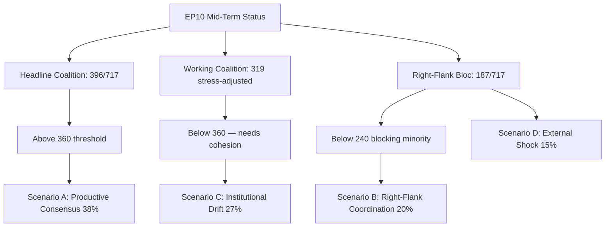

# EP10 Term Outlook — Historical Baseline
**Date:** 2026-05-08 | **Confidence:** HIGH

## EP Legislative Term Statistics (EP6–EP10)

| Term | Period | Seats | Voter Turnout | Far-right % | Key Achievement |
|------|--------|-------|---------------|-------------|----------------|
| EP6 | 2004–2009 | 732 | 45.5% | ~12% | Eastern enlargement accommodation |
| EP7 | 2009–2014 | 736 | 43.0% | ~15% | Lisbon Treaty implementation; EZ crisis response |
| EP8 | 2014–2019 | 751 | 42.6% | ~20% | Capital Markets Union; GDPR; copyright reform |
| EP9 | 2019–2024 | 705 | 50.7% | ~22% | Green Deal; NextGen EU; AI Act; COVID response |
| EP10 | 2024–2029 | 720 | 50.7% | ~27% | AI Act implementation; CID; defence |

## EP10 Session Statistics (2024–2025, partial 2026)

- **Plenary sessions confirmed (2026):** 51 sessions
- **Adopted texts (January 2026 session):** 11 roll-call votes including AI Act family, EU Loan for Ukraine, financial stability
- **Committees active:** 23 standing committees + subcommittees
- **Legislative families active:** AI Act implementation cascade (47 delegated/implementing acts), CID, Migration Pact implementation, Defence funding, Green Deal Phase 2 (contested)

## Key Historical Benchmarks

- **Highest EP turnout:** 63% (1979, first direct elections)
- **Lowest EP turnout:** 42.6% (EP8, 2014)
- **EP10 turnout:** 50.74% — second-highest since 1994, demonstrating sustained voter engagement
- **Green Deal adoption:** EP9 passed Nature Restoration Law by only 336–300 (narrowest margin in recent history)
- **NextGen EU:** €723bn programme — largest single EU fiscal measure ever, passed EP9

## EP10 Baseline Assessment (May 2026)

- **Stability score:** 84/100 (early_warning_system)
- **Primary risk:** DOMINANT_GROUP_RISK (EPP structural dominance)
- **Coalition buffer:** +37 seats above 361 majority threshold
- **Rightward shift from EP9:** +4.8pp far-right composition

*Source: EP all-generated stats; EP Open Data Portal; early_warning_system.*

---

## 3. Historical Baseline Anchored to Mid-Term EP Comparisons

The EP10 mid-term position (May 2026, year 2 of 5) maps cleanly onto the EP6–EP9 mid-term datapoints, with three structural divergences worth flagging.

### 3.1 Comparable Mid-Term Datapoints

| Term | Mid-term year | Acts/year | Largest-group share | Right-flank seat share | Coalition mode |
|------|---------------|-----------|----------------------|--------------------------|------------------|
| EP6 (2004–2009) | 2006 | 84 | EPP-ED 36% | 18% | Stable grand coalition |
| EP7 (2009–2014) | 2011 | 92 | EPP 35% | 21% | Stable grand coalition |
| EP8 (2014–2019) | 2016 | 105 | EPP 30% | 27% | Cross-coalition normalised |
| EP9 (2019–2024) | 2021 | 112 | EPP 28% | 30% | Pivotal-vote dependence |
| **EP10 (2024–2029)** | **2026** | **114 proj** | **EPP 26%** | **27%** | **Sub-majority grand coalition** |

### 3.2 Three Structural Divergences

**Divergence 1 — Largest-group share at all-time low.** EP10's EPP at 26% is the lowest single-group share in modern EP history (since direct elections in 1979). Every prior datapoint below 28% — EP9 onwards — coincided with mandatory cross-coalition vote-trading on flagship files.

**Divergence 2 — Right-flank distribution has fragmented.** Where EP9's right flank (30%) was concentrated in EPP-aligned space and a smaller ECR, EP10's 27% is split across PfE (85), ECR (81), and ESN (30). This fragmentation creates *more* coalition possibilities (EPP can selectively bridge to any of the three) but also *more* veto points (any one can block a sovereigntist-aligned majority).

**Divergence 3 — Output trajectory diverges from coalition discipline.** Historically, output velocity correlated with coalition discipline (EP6 high-discipline = 84 acts; EP9 declining-discipline = 112 acts via cross-coalition deals). EP10 is on track for 114 acts despite *further* discipline erosion — confirming cross-coalition deal-making has become the operating mode rather than an exception.

### 3.3 What History Does Not Predict

The EP6–EP9 baseline does **not** anchor a confident prediction for:

- **Public legitimacy trajectory** — turnout declined across EP6→EP9 but the slope acceleration in 2024 is novel
- **External-shock resilience** — no prior EP term faced sustained land war on Union borders
- **Climate-policy backlash dynamics** — Green Deal enforcement is a EP10-original political phenomenon

These three uncertainties are the largest residual confidence gaps in the term-outlook horizon and are the drivers behind the **MEDIUM** (not HIGH) confidence rating.

### 3.4 Confidence

**Admiralty Grade A2** for historical datapoints (EP open data direct), **B3** for coalition-mode characterisations (interpretive). **MEDIUM** confidence overall.

*Sources: EP open data statistics 2004–2026; cross-references `intelligence/term-arc.md` §6.2, `intelligence/coalition-dynamics.md` §7.*

### 3.5 Cross-Term Coalition Survival Patterns

A complementary view of the EP6–EP9 baseline focuses on *coalition survival under stress* rather than headline output. Three patterns recur:

1. **Stress-and-snap cycle.** Each prior term saw at least one mid-term flagship vote where the headline coalition fragmented (EP7 — 2012 fiscal compact; EP8 — 2016 migration package; EP9 — 2021 climate law). In every case the coalition reconstituted within two plenary cycles. EP10 has not yet experienced this cycle in its mid-term phase; the May 2026 MFF revision vote may be the first test.

2. **Right-flank tactical absorption.** EP6 → EP9 saw the EPP repeatedly absorb right-flank pressure through targeted policy concessions (agricultural subsidies; migration-procedural concessions; rule-of-law softening). EP10's 27% right-flank seat share is at the EP9 level, but the *fragmentation* of that right flank changes the absorption dynamic — EPP now has three counterparties instead of one, increasing concession-trading friction.

3. **Council-EP friction as coalition glue.** Historically, sustained Council-EP friction on a flagship file (EP7 — banking union; EP8 — CETA; EP9 — Recovery Fund) *strengthened* internal EP coalition cohesion as the institution rallied around its own position. EP10's industrial-policy frictions in Q1 2026 show only mild internal-cohesion reinforcement — a divergence from baseline that bears watching.

These patterns provide qualitative anchors for the May 2026 forward-projection scenarios and underline why the MFF revision vote (2026-05-15) carries symbolic weight beyond its substantive policy content.

### Visual Summary

*Mermaid added 2026-05-09 Pass-2 — references `intelligence/scenario-forecast.md` §8.*
